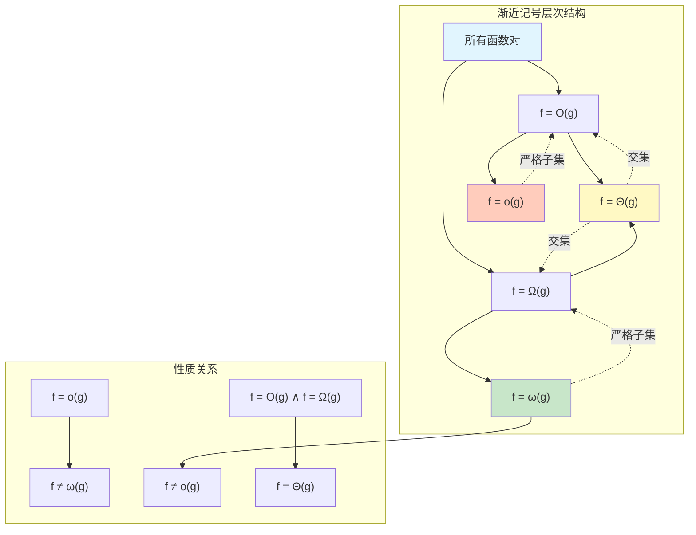

# 算法复杂度关系图


> **版本**: 1.0
> **创建日期**: 2026-04-19
> **最后更新**: 2026-04-19

## 概述

本文档系统展示算法分析中五种渐近记号（O, Ω, Θ, o, ω）之间的关系，以及它们在复杂度分析中的应用。

---

## ASCII 艺术版：渐近记号关系图

```
                           ┌─────────────────────────────┐
                           │       渐近记号体系           │
                           │   Asymptotic Notations      │
                           └──────────────┬──────────────┘
                                          │
                    ┌─────────────────────┼─────────────────────┐
                    │                     │                     │
                    ▼                     ▼                     ▼
           ┌────────────────┐    ┌────────────────┐    ┌────────────────┐
           │   紧确界记号    │    │   上界记号      │    │   下界记号      │
           │    Θ (Theta)   │    │    O, o        │    │    Ω, ω        │
           │   双向界限      │    │   单向上限      │    │   单向下限      │
           └────────┬───────┘    └────────┬───────┘    └────────┬───────┘
                    │                     │                     │
        ┌───────────┴───────────┐         │         ┌───────────┴───────────┐
        │                       │         │         │                       │
        ▼                       ▼         │         ▼                       ▼
┌───────────────┐       ┌───────────────┐ │ ┌───────────────┐       ┌───────────────┐
│   大Θ记号     │       │   大O记号      │ │ │   大Ω记号     │       │  小o记号      │
│   Θ(g(n))    │       │   O(g(n))     │ │ │   Ω(g(n))    │       │   o(g(n))    │
│              │       │              │ │ │              │       │              │
│  f(n)与g(n)  │       │ f(n)不超过   │ │ │  f(n)至少    │       │ f(n)严格小于 │
│  同阶增长    │       │ g(n)的常数倍 │ │ │  g(n)常数倍  │       │ g(n)任意常数 │
│              │       │              │ │ │              │       │ 倍(极限为0)  │
│ 0<c₁≤f/g≤c₂  │       │  0≤f/g≤c     │ │ │  0≤c≤f/g     │       │ lim(f/g)=0   │
└───────────────┘       └───────────────┘ │ └───────────────┘       └───────────────┘
                                          │
                                          │         ┌───────────────┐
                                          │         │  小ω记号      │
                                          │         │  ω(g(n))     │
                                          │         │              │
                                          │         │ f(n)严格大于 │
                                          │         │ g(n)任意常数 │
                                          │         │ 倍(极限为∞)  │
                                          │         │ lim(f/g)=∞   │
                                          │         └───────────────┘
```

---

## 数学定义对比

```
┌─────────────────────────────────────────────────────────────────────────────────┐
│                              渐近记号数学定义                                      │
├───────────┬─────────────────────────────────┬─────────────────────────────────────┤
│   记号    │           形式化定义             │              直观解释                │
├───────────┼─────────────────────────────────┼─────────────────────────────────────┤
│           │                                 │                                     │
│   O       │  ∃c>0, ∃n₀>0, ∀n≥n₀:          │  f(n)的增长速度不超过g(n)            │
│  大O      │  0 ≤ f(n) ≤ c·g(n)              │  "f最多像g一样快"                   │
│           │                                 │                                     │
├───────────┼─────────────────────────────────┼─────────────────────────────────────┤
│           │                                 │                                     │
│   Ω       │  ∃c>0, ∃n₀>0, ∀n≥n₀:          │  f(n)的增长速度不低于g(n)            │
│  大Ω      │  f(n) ≥ c·g(n) ≥ 0              │  "f至少像g一样快"                   │
│           │                                 │                                     │
├───────────┼─────────────────────────────────┼─────────────────────────────────────┤
│           │                                 │                                     │
│   Θ       │  ∃c₁>0, ∃c₂>0, ∃n₀>0, ∀n≥n₀:  │  f(n)与g(n)同阶增长                 │
│  大Θ      │  0 ≤ c₁·g(n) ≤ f(n) ≤ c₂·g(n)   │  "f和g增长速度相同"                 │
│           │                                 │                                     │
├───────────┼─────────────────────────────────┼─────────────────────────────────────┤
│           │                                 │                                     │
│   o       │  ∀c>0, ∃n₀>0, ∀n≥n₀:          │  f(n)严格小于g(n)的增长             │
│  小o      │  0 ≤ f(n) < c·g(n)              │  "f比g慢得多" (lim f/g = 0)         │
│           │                                 │                                     │
├───────────┼─────────────────────────────────┼─────────────────────────────────────┤
│           │                                 │                                     │
│   ω       │  ∀c>0, ∃n₀>0, ∀n≥n₀:          │  f(n)严格大于g(n)的增长             │
│  小ω      │  f(n) > c·g(n) ≥ 0              │  "f比g快得多" (lim f/g = ∞)         │
│           │                                 │                                     │
└───────────┴─────────────────────────────────┴─────────────────────────────────────┘
```

---

## 包含关系图

```
                        ┌────────────────────────────┐
                        │      函数关系全谱系         │
                        │   Function Relationships   │
                        └─────────────┬──────────────┘
                                      │
         ┌────────────────────────────┼────────────────────────────┐
         │                            │                            │
         ▼                            ▼                            ▼
┌─────────────────┐          ┌─────────────────┐          ┌─────────────────┐
│    f = o(g)     │          │    f = O(g)     │          │    f = Ω(g)     │
│   f 严格小于 g  │          │  f 不超过 g     │          │  f 至少为 g     │
│                 │          │                 │          │                 │
│   f/g → 0       │          │   f/g 有界      │          │   f/g 有下界    │
└────────┬────────┘          └────────┬────────┘          └────────┬────────┘
         │                            │                            │
         │                            │                            │
         │     ┌──────────────────────┴──────────────────────┐     │
         │     │                                           │     │
         │     ▼                                           ▼     │
         │  ┌───────────────────────────────────────────────────────┐ │
         │  │                   f = Θ(g)                           │ │
         │  │                 f 与 g 同阶                          │ │
         │  │                                                        │ │
         │  │            0 < c₁ ≤ f/g ≤ c₂ < ∞                     │ │
         │  └───────────────────────────────────────────────────────┘ │
         │                            │                            │
         │                            │                            │
         ▼                            ▼                            ▼
┌─────────────────┐          ┌─────────────────┐          ┌─────────────────┐
│    f ≠ ω(g)     │          │    f ≠ o(g)     │          │    f ≠ O(g)     │
│   f 不严格大于 g│          │  f 不严格小于 g │          │  f 不为 O(g)    │
└─────────────────┘          └─────────────────┘          └─────────────────┘
```

---

## 韦恩图表示（ASCII版）

```
                    ┌─────────────────────────────────────────┐
                    │           所有函数对 (f, g)              │
                    │                                          │
                    │    ┌─────────────────────────────┐       │
                    │    │       f = O(g)              │       │
                    │    │    ┌───────────────────┐    │       │
                    │    │    │    f = Θ(g)       │    │       │
                    │    │    │  ┌─────────────┐  │    │       │
                    │    │    │  │  f = o(g)   │  │    │       │
                    │    │    │  └─────────────┘  │    │       │
                    │    │    └───────────────────┘    │       │
                    │    └─────────────────────────────┘       │
                    │                                          │
                    │    ┌─────────────────────────────┐       │
                    │    │       f = Ω(g)              │       │
                    │    │    ┌───────────────────┐    │       │
                    │    │    │    f = ω(g)       │    │       │
                    │    │    └───────────────────┘    │       │
                    │    └─────────────────────────────┘       │
                    │                                          │
                    └─────────────────────────────────────────┘

    交集区域说明:
    ═══════════════════════════════════════════════════════════════

    f = Θ(g) = O(g) ∩ Ω(g)

    f = o(g) ⊂ O(g), 但 f = o(g) ⊄ Ω(g) (除非 g = 0)

    f = ω(g) ⊂ Ω(g), 但 f = ω(g) ⊄ O(g)

    O(g) 和 Ω(g) 的交集 = Θ(g)
```

---

## Mermaid 关系图



---

## 极限视角下的关系

```
┌─────────────────────────────────────────────────────────────────────────────┐
│                        用极限理解渐近记号                                    │
├──────────────────┬──────────────────────────────────────────────────────────┤
│      记号        │                      极限条件                            │
├──────────────────┼──────────────────────────────────────────────────────────┤
│                  │                                                          │
│    f = o(g)      │               lim  f(n)/g(n) = 0                         │
│                  │               n→∞                                        │
│                  │                                                          │
├──────────────────┼──────────────────────────────────────────────────────────┤
│                  │                                                          │
│    f = O(g)      │        lim sup f(n)/g(n) < ∞  (存在有限上界)              │
│                  │           n→∞                                            │
│                  │                                                          │
├──────────────────┼──────────────────────────────────────────────────────────┤
│                  │                                                          │
│    f = Θ(g)      │       0 < lim inf f(n)/g(n) ≤ lim sup f(n)/g(n) < ∞      │
│                  │               n→∞               n→∞                      │
│                  │                                                          │
├──────────────────┼──────────────────────────────────────────────────────────┤
│                  │                                                          │
│    f = Ω(g)      │        lim inf f(n)/g(n) > 0  (存在正下界)                │
│                  │           n→∞                                            │
│                  │                                                          │
├──────────────────┼──────────────────────────────────────────────────────────┤
│                  │                                                          │
│    f = ω(g)      │               lim  f(n)/g(n) = ∞                         │
│                  │               n→∞                                        │
│                  │                                                          │
└──────────────────┴──────────────────────────────────────────────────────────┘
```

---

## 常用复杂度函数层次

```
增长速率由慢到快：

    ┌─────────────────────────────────────────────────────────────────┐
    │  层级      复杂度          典型算法              实际限制        │
    ├─────────────────────────────────────────────────────────────────┤
    │   1        O(1)           哈希表访问            瞬间完成         │
    │            ─────────────────────────────────────────────────   │
    │   2        O(log n)       二分查找              极大数据量       │
    │            ─────────────────────────────────────────────────   │
    │   3        O(√n)          整数分解试除          中等数据量       │
    │            ─────────────────────────────────────────────────   │
    │   4        O(n)           线性扫描              大数据量         │
    │            ─────────────────────────────────────────────────   │
    │   5        O(n log n)     高效排序              较大数据量       │
    │            ─────────────────────────────────────────────────   │
    │   6        O(n²)          双重循环              中小数据量       │
    │            ─────────────────────────────────────────────────   │
    │   7        O(n³)          矩阵乘法              小数据量         │
    │            ─────────────────────────────────────────────────   │
    │   8        O(2ⁿ)          子集枚举              极小数据量(n<30) │
    │            ─────────────────────────────────────────────────   │
    │   9        O(n!)          排列枚举              超小数据量(n<12) │
    └─────────────────────────────────────────────────────────────────┘
```

---

## 定理与性质

```
┌─────────────────────────────────────────────────────────────────────────────┐
│                         渐近记号重要定理                                     │
├─────────────────────────────────────────────────────────────────────────────┤
│                                                                             │
│  定理 1: 传递性                                                              │
│  ─────────────────────────────────────────────────────────────────────────  │
│  若 f = O(g) 且 g = O(h), 则 f = O(h)                                       │
│  若 f = Ω(g) 且 g = Ω(h), 则 f = Ω(h)                                       │
│  若 f = Θ(g) 且 g = Θ(h), 则 f = Θ(h)                                       │
│                                                                             │
├─────────────────────────────────────────────────────────────────────────────┤
│                                                                             │
│  定理 2: 自反性                                                              │
│  ─────────────────────────────────────────────────────────────────────────  │
│  f = O(f), f = Ω(f), f = Θ(f)                                              │
│  注意: o 和 ω 不满足自反性!                                                   │
│                                                                             │
├─────────────────────────────────────────────────────────────────────────────┤
│                                                                             │
│  定理 3: 对称性 (仅Θ)                                                        │
│  ─────────────────────────────────────────────────────────────────────────  │
│  f = Θ(g) ⟺ g = Θ(f)                                                        │
│                                                                             │
├─────────────────────────────────────────────────────────────────────────────┤
│                                                                             │
│  定理 4: 转置对称性                                                          │
│  ─────────────────────────────────────────────────────────────────────────  │
│  f = O(g) ⟺ g = Ω(f)                                                        │
│  f = o(g) ⟺ g = ω(f)                                                        │
│                                                                             │
├─────────────────────────────────────────────────────────────────────────────┤
│                                                                             │
│  定理 5: 和的最大规则                                                        │
│  ─────────────────────────────────────────────────────────────────────────  │
│  O(f(n)) + O(g(n)) = O(max(f(n), g(n)))                                    │
│  Ω(f(n)) + Ω(g(n)) = Ω(max(f(n), g(n)))                                    │
│  Θ(f(n)) + Θ(g(n)) = Θ(max(f(n), g(n)))                                    │
│                                                                             │
└─────────────────────────────────────────────────────────────────────────────┘
```

---

## 实际应用示例

```
┌─────────────────────────────────────────────────────────────────────────────┐
│                          复杂度分析实例                                      │
├──────────────────┬────────────────────────────┬─────────────────────────────┤
│      算法        │       复杂度分析           │        使用的记号           │
├──────────────────┼────────────────────────────┼─────────────────────────────┤
│                  │                            │                             │
│   归并排序       │   T(n) = Θ(n log n)        │   Θ - 紧确界                │
│                  │   最坏、平均、最好都如此    │   知道确切增长速率           │
│                  │                            │                             │
├──────────────────┼────────────────────────────┼─────────────────────────────┤
│                  │                            │                             │
│   快速排序       │   T(n) = O(n²)             │   O - 最坏情况上界          │
│   (最坏情况)     │   但 T(n) = Θ(n log n)     │   保证不会更差               │
│   (平均情况)     │   (平均)                   │                             │
│                  │                            │                             │
├──────────────────┼────────────────────────────┼─────────────────────────────┤
│                  │                            │                             │
│   插入排序       │   T(n) = O(n²)             │   O - 最坏情况              │
│   (最好情况)     │   T(n) = Ω(n)              │   Ω - 最好情况              │
│                  │   综合: O(n²)              │   区间 [Ω(n), O(n²)]        │
│                  │                            │                             │
├──────────────────┼────────────────────────────┼─────────────────────────────┤
│                  │                            │                             │
│   比较排序       │   任何比较排序都是         │   Ω - 下界                  │
│   下界           │   Ω(n log n)               │   不可能更快                 │
│                  │                            │                             │
├──────────────────┼────────────────────────────┼─────────────────────────────┤
│                  │                            │                             │
│   线性查找       │   T(n) = O(n)              │   O - 最坏情况              │
│                  │   但不是 o(n)              │   不是 o - 不严格小于       │
│                  │   (因为可能有 Ω(n) 输入)   │                             │
│                  │                            │                             │
└──────────────────┴────────────────────────────┴─────────────────────────────┘
```

---

## 选择指南

```
                        何时使用哪个记号?
                               │
           ┌───────────────────┼───────────────────┐
           │                   │                   │
           ▼                   ▼                   ▼
    ┌──────────────┐   ┌──────────────┐   ┌──────────────┐
    │  已知精确界  │   │  只知上界    │   │  只知下界    │
    │              │   │              │   │              │
    │    Θ(g)      │   │    O(g)      │   │    Ω(g)      │
    └──────────────┘   └──────────────┘   └──────────────┘
           │                   │                   │
           │                   │                   │
           ▼                   ▼                   ▼
    例子:              例子:               例子:
    - 归并排序         - 快速排序最坏      - 比较排序下界
    - 堆排序           - 任何最坏情况      - 问题固有难度
    - 精确分析结果     - 最坏情况保证      - 不可能更好的证明
           │                   │                   │
           │                   │                   │
           └───────────────────┼───────────────────┘
                               │
                               ▼
                      ┌────────────────┐
                      │  严格关系分析  │
                      │                │
                      │  o(g) - 严格小 │
                      │  ω(g) - 严格大 │
                      └────────────────┘
```

---

## 常见错误与注意事项

```
┌─────────────────────────────────────────────────────────────────────────────┐
│                          常见错误警示                                        │
├─────────────────────────────────────────────────────────────────────────────┤
│                                                                             │
│  ❌ 错误 1: 混淆 O 和 Θ                                                      │
│     ──────────────────────────────────────────────────────────────────────  │
│     说 "快速排序是 O(n log n)" 是对的                                        │
│     说 "快速排序是 Θ(n log n)" 需要限定"平均情况"                            │
│     因为最坏情况是 O(n²)                                                     │
│                                                                             │
├─────────────────────────────────────────────────────────────────────────────┤
│                                                                             │
│  ❌ 错误 2: 认为 O(g) 意味着 "等于 g"                                        │
│     ──────────────────────────────────────────────────────────────────────  │
│     O(n) 包含 O(log n), O(1) 等所有增长不超过线性的函数                       │
│     所以 "f = O(n)" 不意味着 f 恰好是线性的                                  │
│                                                                             │
├─────────────────────────────────────────────────────────────────────────────┤
│                                                                             │
│  ❌ 错误 3: 忽略常数因子和低阶项                                             │
│     ──────────────────────────────────────────────────────────────────────  │
│     2n = O(n) ✓                                                             │
│     n + 100 = O(n) ✓                                                        │
│     1000n = O(n) ✓                                                          │
│     渐近记号关注增长趋势，而非精确值                                          │
│                                                                             │
├─────────────────────────────────────────────────────────────────────────────┤
│                                                                             │
│  ❌ 错误 4: 在指数中滥用记号                                                 │
│     ──────────────────────────────────────────────────────────────────────  │
│     2^(O(n)) ≠ O(2^n)                                                       │
│     O(2^n) 表示 c·2^n                                                       │
│     2^(O(n)) 表示 2^(cn) = (2^c)^n, 可能远大于 2^n                          │
│                                                                             │
└─────────────────────────────────────────────────────────────────────────────┘
```

---

## 记忆口诀

```
┌─────────────────────────────────────────────────────────────────────────────┐
│                           记忆口诀                                           │
├─────────────────────────────────────────────────────────────────────────────┤
│                                                                             │
│   "大O上界像天花板，大Ω下界像地板                                            │
│    大Θ夹在中间刚刚好，小o小ω是严格版"                                         │
│                                                                             │
│   英文版:                                                                    │
│   "Big-O is upper, Big-Omega's lower                                        │
│    Big-Theta is tight, little ones are strict"                              │
│                                                                             │
│   ────────────────────────────────────────────────────────────────────────  │
│                                                                             │
│   关系记忆:                                                                  │
│   • O 和 Ω 像括号，Θ 是被夹住的东西                                          │
│   • o 和 ω 是 "严格" 版本，像 < 和 >                                         │
│   • O 和 Ω 是 "非严格" 版本，像 ≤ 和 ≥                                       │
│                                                                             │
└─────────────────────────────────────────────────────────────────────────────┘
```

---

*本文档详细阐述了算法复杂度分析中的核心记号体系，理解这些关系对于正确分析算法效率至关重要。*

---

## 参考文献

- 待补充

---

## 知识导航

- [返回目录](README.md)

