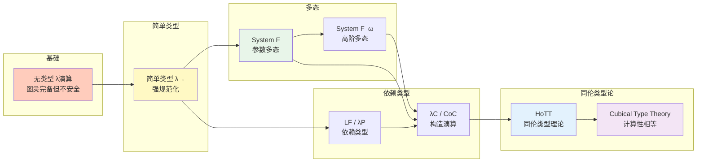

# 类型系统层级图


> **版本**: 1.0
> **创建日期**: 2026-04-19
> **最后更新**: 2026-04-19

## 概述

本文档展示类型系统从简单类型到高阶类型理论的演化层级，揭示类型系统表达能力与复杂度之间的权衡关系。

---

## ASCII 艺术版：类型系统层级全景

```
                         ┌─────────────────────────────────┐
                         │      类型系统表达能力谱系        │
                         │   Type System Expressiveness    │
                         └───────────────┬─────────────────┘
                                         │
           ┌─────────────────────────────┼─────────────────────────────┐
           │                             │                             │
           ▼                             ▼                             ▼
  ┌──────────────────┐        ┌──────────────────┐        ┌──────────────────┐
  │   简单类型系统    │        │   多态类型系统    │        │   依赖类型系统    │
  │  Simply Typed    │        │  Polymorphic     │        │  Dependent Type  │
  │  Lambda Calculus │        │  Lambda Calculus │        │  Theory          │
  │  (λ→)            │        │  (λ2 / System F) │        │  (λP / λC)       │
  └────────┬─────────┘        └────────┬─────────┘        └────────┬─────────┘
           │                           │                           │
           │         ┌─────────────────┴─────────────────┐         │
           │         │                                   │         │
           │         ▼                                   ▼         │
           │  ┌──────────────────┐              ┌──────────────────┐│
           │  │   参数多态        │              │   子类型多态      ││
           │  │  Parametric      │              │  Subtyping       ││
           │  │  Polymorphism    │              │  (继承/接口)      ││
           │  └────────┬─────────┘              └────────┬─────────┘│
           │           │                                 │          │
           │           ▼                                 ▼          │
           │  ┌──────────────────┐              ┌──────────────────┐
           │  │   泛型编程        │              │   面向对象       │
           │  │  Generics        │              │  OOP             │
           │  │  (Java/C#泛型)   │               │  (Java/C++)      │
           │  └──────────────────┘              └──────────────────┘
           │
           ▼
  ┌──────────────────────────────────────────────────────────────────────────┐
  │                           同伦类型理论 (HoTT)                             │
  │                    Homotopy Type Theory                                   │
  │                                                                           │
  │   • 统一了类型论与拓扑学                                                   │
  │   • 支持高阶归纳类型 (HIT)                                                 │
  │   • 类型即空间，项即点                                                     │
  │   • 相等类型有丰富的结构 (路径空间)                                         │
  │                                                                           │
  └──────────────────────────────────────────────────────────────────────────┘

                              ═══════════════════
                               表达能力递增 →
                              ═══════════════════
```

---

## Lambda立方体 (Barendregt's Lambda Cube)

```
                                  ┌─────────────────┐
                                  │    λC (Calculus │
                                  │    of           │
                                  │    Constructions)│
                                  │                 │
                                  │  依赖类型 +     │
                                  │  多态 +         │
                                  │  类型构造子     │
                                  └────────┬────────┘
                                           │
                          ┌────────────────┼────────────────┐
                          │                │                │
                          │         ┌──────┴──────┐         │
                          │         │             │         │
                          ▼         ▼             ▼         ▼
                 ┌────────────────┐     ┌────────────────┐
                 │   λP (LF)      │     │    λω (System │
                 │                │     │    F_ω)        │
                 │  依赖类型       │     │                │
                 │  + 简单类型     │     │  多态 +        │
                 │                │     │  类型构造子    │
                 └────────┬───────┘     └────────┬───────┘
                          │                      │
                          │     ┌────────┐       │
                          │     │        │       │
                          ▼     ▼        ▼       ▼
                 ┌────────────────┐     ┌────────────────┐
                 │   λ→ (简单     │     │   λ2 (System  │
                 │   类型lambda)  │     │   F)           │
                 │                │     │                │
                 │  值依赖值      │     │  类型依赖类型  │
                 │  无抽象        │     │  (参数多态)    │
                 └────────────────┘     └────────────────┘
                          │                      │
                          └──────────┬───────────┘
                                     │
                                     ▼
                          ┌────────────────────┐
                          │      λ_ (无类型)    │
                          │  Untyped Lambda     │
                          │  Calculus          │
                          │                    │
                          │  可计算但不安全    │
                          └────────────────────┘

三个维度:
═══════════════
→ (依赖):  项能否依赖于类型 (依赖类型)
2 (多态):  类型能否依赖于类型 (类型抽象)
ω (构造子): 类型能否依赖于项 (高阶类型)
```

---

## 类型系统对比矩阵

```
┌─────────────────────────────────────────────────────────────────────────────┐
│                       类型系统特性对比                                       │
├──────────────────┬────────┬────────┬────────┬────────┬────────────────────┤
│     特性         │ 无类型 │ 简单类型│ System │ 依赖类型│     HoTT           │
│                  │        │ λ→     │   F    │        │                    │
├──────────────────┼────────┼────────┼────────┼────────┼────────────────────┤
│                  │        │        │        │        │                    │
│  类型检查        │ 无     │ 可判定 │ 可判定 │ 可判定 │ 可判定 (部分)      │
│                  │        │        │        │        │                    │
├──────────────────┼────────┼────────┼────────┼────────┼────────────────────┤
│                  │        │        │        │        │                    │
│  停机问题        │ 不可判 │ 可判定 │ 可判定 │ 可判定 │ 需要特定构造       │
│                  │        │        │        │        │                    │
├──────────────────┼────────┼────────┼────────┼────────┼────────────────────┤
│                  │        │        │        │        │                    │
│  参数多态        │ 无     │ 无     │ 有     │ 有     │ 有                 │
│                  │        │        │        │        │                    │
├──────────────────┼────────┼────────┼────────┼────────┼────────────────────┤
│                  │        │        │        │        │                    │
│  依赖类型        │ 无     │ 无     │ 无     │ 有     │ 有                 │
│                  │        │        │        │        │                    │
├──────────────────┼────────┼────────┼────────┼────────┼────────────────────┤
│                  │        │        │        │        │                    │
│  高阶类型        │ 无     │ 无     │ 有     │ 有     │ 有                 │
│                  │        │        │        │        │                    │
├──────────────────┼────────┼────────┼────────┼────────┼────────────────────┤
│                  │        │        │        │        │                    │
│  表达能力        │ 图灵完 │ 弱     │ 强     │ 极强   │ 极高               │
│                  │ 全     │        │        │        │                    │
├──────────────────┼────────┼────────┼────────┼────────┼────────────────────┤
│                  │        │        │        │        │                    │
│  实际应用        │ 理论   │ Pascal │ Haskell│ Coq/   │ 定理证明           │
│                  │        │ C(早期)│ Java   │ Agda   │ 形式化数学         │
│                  │        │        │ 泛型   │        │                    │
│                  │        │        │        │        │                    │
└──────────────────┴────────┴────────┴────────┴────────┴────────────────────┘
```

---

## 简单类型系统 (Simply Typed Lambda Calculus)

```
┌─────────────────────────────────────────────────────────────────────────────┐
│                      简单类型系统 (λ→)                                       │
├─────────────────────────────────────────────────────────────────────────────┤
│                                                                             │
│  语法:                                                                      │
│  ════════════════════════════════════════════════════════════════════════   │
│                                                                             │
│  类型 τ ::= Bool | Int | τ → τ | τ × τ | ...                               │
│                                                                             │
│  项   e ::= x | λx:τ.e | e e | true | false | if e then e else e | ...      │
│                                                                             │
├─────────────────────────────────────────────────────────────────────────────┤
│                                                                             │
│  类型推导规则:                                                               │
│  ════════════════════════════════════════════════════════════════════════   │
│                                                                             │
│  ─────────── (变量)         Γ, x:τ ⊢ e:σ                   Γ ⊢ e₁:τ→σ  Γ ⊢ e₂:τ
│  Γ, x:τ ⊢ x:τ               ───────────────── (抽象)      ──────────────────── (应用)
│                             Γ ⊢ λx:τ.e:τ→σ                    Γ ⊢ e₁ e₂:σ
│                                                                             │
├─────────────────────────────────────────────────────────────────────────────┤
│                                                                             │
│  特性:                                                                      │
│  ════════════════════════════════════════════════════════════════════════   │
│                                                                             │
│  ✅ 强规范化: 所有良类型的项都会停机                                          │
│  ✅ 类型安全: 无类型错误                                                      │
│  ❌ 无递归: 不能直接表达递归函数                                              │
│  ❌ 表达能力弱: 不是图灵完备的                                               │
│                                                                             │
│  解决方法: 添加不动点组合子 fix 或显式递归构造                                │
│                                                                             │
└─────────────────────────────────────────────────────────────────────────────┘
```

---

## 多态类型系统 (System F / λ2)

```
┌─────────────────────────────────────────────────────────────────────────────┐
│                      System F (多态Lambda演算)                               │
├─────────────────────────────────────────────────────────────────────────────┤
│                                                                             │
│  新增语法 (相比 λ→):                                                         │
│  ════════════════════════════════════════════════════════════════════════   │
│                                                                             │
│  类型 τ ::= ... | ∀α.τ | α                                                   │
│                                                                             │
│  项   e ::= ... | Λα.e | e[τ]                                                │
│                                                                             │
│  其中:                                                                       │
│  • ∀α.τ 是类型抽象 (多态类型)                                               │
│  • Λα.e 是类型lambda抽象                                                    │
│  • e[τ] 是类型应用                                                          │
│                                                                             │
├─────────────────────────────────────────────────────────────────────────────┤
│                                                                             │
│  新增类型规则:                                                               │
│  ════════════════════════════════════════════════════════════════════════   │
│                                                                             │
│  Γ ⊢ e:τ        α ∉ FV(Γ)           Γ ⊢ e:∀α.τ
│  ─────────────── (类型抽象)          ─────────── (类型应用)
│  Γ ⊢ Λα.e:∀α.τ                       Γ ⊢ e[σ]:τ[σ/α]
│                                                                             │
├─────────────────────────────────────────────────────────────────────────────┤
│                                                                             │
│  示例: 多态恒等函数                                                          │
│  ════════════════════════════════════════════════════════════════════════   │
│                                                                             │
│  id = Λα.λx:α.x                                                              │
│  类型: ∀α.α → α                                                              │
│                                                                             │
│  应用:                                                                       │
│  • id[Int] 5     : Int                                                       │
│  • id[Bool] true : Bool                                                      │
│  • id[Int→Int] (λx.x) : Int → Int                                            │
│                                                                             │
├─────────────────────────────────────────────────────────────────────────────┤
│                                                                             │
│  表达能力:                                                                   │
│  ════════════════════════════════════════════════════════════════════════   │
│                                                                             │
│  ✅ 可表达自然数编码 (Church numerals)                                        │
│  ✅ 可表达列表、树等数据结构                                                   │
│  ✅ 具有参数多态 (类似Java泛型、Haskell多态)                                  │
│  ⚠️  类型推断是不可判定的 (需要显式类型标注)                                   │
│                                                                             │
└─────────────────────────────────────────────────────────────────────────────┘
```

---

## 依赖类型系统

```
┌─────────────────────────────────────────────────────────────────────────────┐
│                      依赖类型系统 (λP / λC)                                  │
├─────────────────────────────────────────────────────────────────────────────┤
│                                                                             │
│  核心思想: 类型可以依赖于项的值                                              │
│  ════════════════════════════════════════════════════════════════════════   │
│                                                                             │
│  示例对比:                                                                   │
│  ────────────────────────────────────────────────────────────────────────   │
│                                                                             │
│  简单类型:  List a          -- 类型a的列表                                    │
│  依赖类型:  Vec a n         -- 长度为n的a的向量                               │
│                                                                             │
│  简单类型:  head : List a → a    (可能运行时错误!)                          │
│  依赖类型:  head : Vec a (n+1) → a  (类型保证非空!)                         │
│                                                                             │
├─────────────────────────────────────────────────────────────────────────────┤
│                                                                             │
│  依赖函数类型 (Π类型):                                                       │
│  ════════════════════════════════════════════════════════════════════════   │
│                                                                             │
│  (x:A) → B(x)   或   Π(x:A).B(x)                                            │
│                                                                             │
│  含义: 对于每个 x:A，返回类型为 B(x) 的值                                    │
│  对比:                                                           │
│  • A → B        = Π(_:A).B      (简单函数类型)                              │
│  • ∀x:A.B(x)    = Π(x:A).B(x)  (依赖函数/全称量词)                          │
│                                                                             │
├─────────────────────────────────────────────────────────────────────────────┤
│                                                                             │
│  依赖对类型 (Σ类型):                                                         │
│  ════════════════════════════════════════════════════════════════════════   │
│                                                                             │
│  Σ(x:A).B(x)                                                                 │
│                                                                             │
│  含义: 对 (x, y) 其中 x:A, y:B(x)                                            │
│  对比:                                                                       │
│  • A × B        = Σ(_:A).B      (简单积类型)                                 │
│  • ∃x:A.B(x)    = Σ(x:A).B(x)  (存在量词)                                   │
│                                                                             │
│  示例:                                                                       │
│  Σ(n:Nat).Vec Int n  =  存在某个自然数n，和长度为n的Int向量                   │
│                                                                             │
├─────────────────────────────────────────────────────────────────────────────┤
│                                                                             │
│  实际应用 (Coq/Agda风格):                                                    │
│  ════════════════════════════════════════════════════════════════════════   │
│                                                                             │
│  -- 向量类型                                                                 │
│  data Vec (A : Set) : Nat → Set where                                        │
│    nil  : Vec A 0                                                            │
│    cons : ∀{n} → A → Vec A n → Vec A (n + 1)                                 │
│                                                                             │
│  -- 安全的head函数                                                           │
│  head : ∀{A n} → Vec A (n + 1) → A                                           │
│  head (cons x xs) = x                                                        │
│                                                                             │
│  -- 编译器保证: 不可能对空向量调用head!                                       │
│                                                                             │
└─────────────────────────────────────────────────────────────────────────────┘
```

---

## 同伦类型理论 (HoTT)

```
┌─────────────────────────────────────────────────────────────────────────────┐
│                      同伦类型理论 (HoTT)                                     │
├─────────────────────────────────────────────────────────────────────────────┤
│                                                                             │
│  核心洞见: 类型 = 拓扑空间                                                    │
│  ════════════════════════════════════════════════════════════════════════   │
│                                                                             │
│  对应关系:                                                                   │
│  ────────────────────────────────────────────────────────────────────────   │
│                                                                             │
│  类型论          │           拓扑学                                          │
│  ────────────────┼───────────────────────────────────────────────────────   │
│  类型 A          │   空间 |A|                                               │
│  项 a : A        │   点 a ∈ |A|                                             │
│  相等类型 a = b  │   从a到b的路径空间                                       │
│  证明 p : a = b  │   路径 p : a ↝ b                                         │
│  p = q           │   路径间的同伦 (路径的路径)                                │
│                                                                             │
├─────────────────────────────────────────────────────────────────────────────┤
│                                                                             │
│  相等类型的层次结构:                                                          │
│  ════════════════════════════════════════════════════════════════════════   │
│                                                                             │
│  a, b : A                                                                    │
│  p, q : a =_A b                                                              │
│  α, β : p =_{a=b} q                                                          │
│  ...                                                                         │
│                                                                             │
│  每个相等类型本身又有相等类型，形成∞-群胚结构                                  │
│                                                                             │
├─────────────────────────────────────────────────────────────────────────────┤
│                                                                             │
│  核心公理: 单值性公理 (Univalence Axiom)                                      │
│  ════════════════════════════════════════════════════════════════════════   │
│                                                                             │
│  (A =_U B) ≃ (A ≃ B)                                                         │
│                                                                             │
│  含义: 相等即等价                                                             │
│  • 类型的相等等价于它们之间的等价关系                                         │
│  • 同构的类型可以互换使用                                                     │
│  • 结构不变性: 只关心结构，不关心具体表示                                      │
│                                                                             │
├─────────────────────────────────────────────────────────────────────────────┤
│                                                                             │
│  高阶归纳类型 (HIT):                                                         │
│  ════════════════════════════════════════════════════════════════════════   │
│                                                                             │
│  可以在定义类型时指定相等的构造子                                              │
│                                                                             │
│  示例: 圆 S¹                                                                 │
│  data S¹ : Type where                                                        │
│    base : S¹                                                                 │
│    loop : base = base                                                        │
│                                                                             │
│  这定义了一个圆:                                                              │
│  • 点 base                                                                   │
│  • 路径 loop 从base回到base (绕圆一周)                                        │
│                                                                             │
│  应用: 可以定义商类型、像、推出等拓扑构造                                      │
│                                                                             │
└─────────────────────────────────────────────────────────────────────────────┘
```

---

## Mermaid 演化图



---

## 各语言中的类型系统实现

```
┌─────────────────────────────────────────────────────────────────────────────┐
│                  编程语言的类型系统分类                                       │
├─────────────────────────────────────────────────────────────────────────────┤
│                                                                             │
│  简单类型 + 子类型:                                                           │
│  ════════════════════════════════════════════════════════════════════════   │
│                                                                             │
│  ┌─────────────────────────────────────────────────────────────────────┐    │
│  │  Java, C++, C#, Kotlin, Scala, Swift                                 │    │
│  │                                                                      │    │
│  │  特性:                                                               │    │
│  │  • 类/接口作为类型                                                   │    │
│  │  • 继承实现子类型多态                                                │    │
│  │  • 泛型提供参数多态 (擦除或保留)                                      │    │
│  │  • 类型检查在编译期                                                   │    │
│  └─────────────────────────────────────────────────────────────────────┘    │
│                                                                             │
├─────────────────────────────────────────────────────────────────────────────┤
│                                                                             │
│  参数多态 + 类型推断:                                                         │
│  ════════════════════════════════════════════════════════════════════════   │
│                                                                             │
│  ┌─────────────────────────────────────────────────────────────────────┐    │
│  │  Haskell, ML (OCaml, SML), F#, Rust                                  │    │
│  │                                                                      │    │
│  │  特性:                                                               │    │
│  │  • Hindley-Milner 类型推断                                           │    │
│  │  • 代数数据类型 (ADT)                                                │    │
│  │  • 类型类/特征 (Type Classes/Traits)                                 │    │
│  │  • 高阶类型 (Haskell)                                                │    │
│  └─────────────────────────────────────────────────────────────────────┘    │
│                                                                             │
├─────────────────────────────────────────────────────────────────────────────┤
│                                                                             │
│  依赖类型 (定理证明器):                                                       │
│  ════════════════════════════════════════════════════════════════════════   │
│                                                                             │
│  ┌─────────────────────────────────────────────────────────────────────┐    │
│  │  Coq, Agda, Idris, Lean, F*                                          │    │
│  │                                                                      │    │
│  │  特性:                                                               │    │
│  │  • 类型即规范，程序即证明                                             │    │
│  │  • 可以表达复杂的程序不变式                                           │    │
│  │  •  Curry-Howard 对应                                                 │    │
│  │  • 用于形式化验证                                                     │    │
│  └─────────────────────────────────────────────────────────────────────┘    │
│                                                                             │
├─────────────────────────────────────────────────────────────────────────────┤
│                                                                             │
│  动态类型:                                                                   │
│  ════════════════════════════════════════════════════════════════════════   │
│                                                                             │
│  ┌─────────────────────────────────────────────────────────────────────┐    │
│  │  Python, JavaScript, Ruby, Lisp                                      │    │
│  │                                                                      │    │
│  │  特性:                                                               │    │
│  │  • 运行时类型检查                                                     │    │
│  │  • 鸭子类型                                                           │    │
│  │  • 可选的类型提示 (Python 3+, TypeScript)                             │    │
│  └─────────────────────────────────────────────────────────────────────┘    │
│                                                                             │
└─────────────────────────────────────────────────────────────────────────────┘
```

---

## 类型系统选择指南

```
                    如何选择合适的类型系统?
                                │
              ┌─────────────────┼─────────────────┐
              │                 │                 │
              ▼                 ▼                 ▼
    需要定理证明?        需要高性能?          需要快速开发?
              │                 │                 │
      ┌───────┴───────┐       │       ┌─────────┴─────────┐
      │               │       │       │                   │
     是              否       │      是                  否
      │               │       │       │                   │
      ▼               │       ▼       ▼                   ▼
┌───────────────┐     │ ┌───────────────────┐   ┌───────────────────┐
│ Coq/Agda/Lean │     │ │ Rust/C++/         │   │ Python/JavaScript │
│               │     │ │ 系统语言          │   │                   │
│ • 形式化验证   │     │ │                   │   │ • 动态类型        │
│ • 依赖类型     │     │ │ • 零成本抽象      │   │ • 快速迭代        │
│ • 证明即程序   │     │ │ • 类型安全        │   │ • 灵活性强        │
└───────────────┘     │ │ • 无GC或精确GC   │   │ • 运行时检查      │
                      │ └───────────────────┘   └───────────────────┘
                      │
                      ▼
            ┌───────────────────┐
            │  需要类型推断?     │
            │                   │
      ┌─────┴─────┐             │
      │           │             │
     是          否             │
      │           │             │
      ▼           │             │
┌───────────────┐ │             ▼
│ Haskell/ML    │ │     ┌───────────────────┐
│               │ │     │ Java/C#           │
│ • 自动推断    │ │     │                   │
│ • 简洁代码    │ │     │ • 显式类型声明    │
│ • 强类型      │ │     │ • IDE友好         │
└───────────────┘ │     │ • 企业级生态      │
                  │     └───────────────────┘
                  │
                  ▼
        ┌───────────────────┐
        │ 需要同伦类型论?    │
        │                   │
        │ 是 → HoTT/Cubical │
        │                   │
        │ 否 → 回到主流语言 │
        └───────────────────┘
```

---

## Curry-Howard 对应

```
┌─────────────────────────────────────────────────────────────────────────────┐
│                      Curry-Howard 对应                                       │
├─────────────────────────────────────────────────────────────────────────────┤
│                                                                             │
│  命题与类型的对应:                                                            │
│  ════════════════════════════════════════════════════════════════════════   │
│                                                                             │
│  逻辑          │   类型论           │   编程                                  │
│  ─────────────┼───────────────────┼──────────────────────────────────────   │
│  真命题        │   单位类型 ()      │   void/Unit                             │
│  假命题        │   空类型 ⊥        │   Never/Nothing                         │
│  合取 A ∧ B    │   积类型 A × B    │   元组 (A, B)                           │
│  析取 A ∨ B    │   和类型 A + B    │   枚举/Tagged Union                     │
│  蕴含 A → B    │   函数类型 A → B  │   函数 A -> B                           │
│  全称 ∀x.P(x)  │   依赖积 Πx:A.B(x)│   泛型/依赖函数                         │
│  存在 ∃x.P(x)  │   依赖和 Σx:A.B(x)│   存在类型/模块                         │
│  否定 ¬A       │   A → ⊥          │   A -> Never                            │
│                                                                             │
├─────────────────────────────────────────────────────────────────────────────┤
│                                                                             │
│  证明与程序的对应:                                                            │
│  ════════════════════════════════════════════════════════════════════════   │
│                                                                             │
│  证明          │   程序                                                      │
│  ─────────────┼──────────────────────────────────────────────────────────   │
│  公理          │   变量/基本项                                               │
│  推理规则      │   类型构造子/函数                                           │
│  证明过程      │   程序计算                                                  │
│  证明检查      │   类型检查                                                  │
│  规范化        │   程序求值                                                  │
│                                                                             │
│  核心洞见: 证明即程序，命题即类型                                              │
│                                                                             │
└─────────────────────────────────────────────────────────────────────────────┘
```

---

*本文档系统阐述了类型理论从简单到复杂的演化路径，理解这些层级对于掌握现代编程语言的设计原理和形式化验证技术至关重要。*

---

## 参考文献

- 待补充

---

## 知识导航

- [返回目录](README.md)
