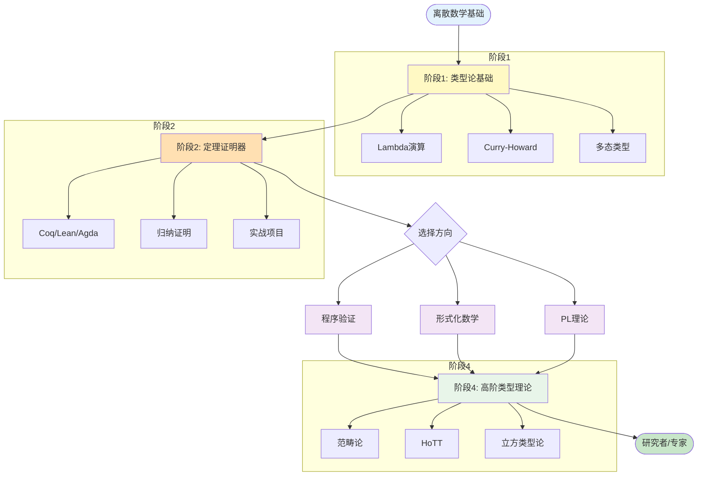

# 形式化方法进阶路径

## 概述

本文档为希望深入学习形式化方法的进阶学习者提供一条系统路径，从数理逻辑基础到高阶同伦类型理论(HoTT)。

---

## 学习路径全景图

```
                            ┌─────────────────────┐
                            │      开始          │
                            │  (离散数学基础)    │
                            └──────────┬──────────┘
                                       │
                    ┌──────────────────┼──────────────────┐
                    │                  │                  │
                    ▼                  ▼                  ▼
         ┌─────────────────┐ ┌─────────────────┐ ┌─────────────────┐
         │   路径 A        │ │   路径 B        │ │   路径 C        │
         │  定理证明实践   │ │  程序验证       │ │  类型理论研究   │
         │                 │ │                 │ │                 │
         │ Coq/Lean/Isabelle│ │ Dafny/Why3     │ │ Agda/Idris      │
         └────────┬────────┘ └────────┬────────┘ └────────┬────────┘
                  │                   │                   │
                  └───────────────────┼───────────────────┘
                                      │
                                      ▼
                         ┌─────────────────────┐
                         │    高级主题         │
                         │ • 高阶类型理论      │
                         │ • 范畴论与类型论    │
                         │ • 高阶同伦类型论    │
                         │ • 立方类型论        │
                         └─────────────────────┘
```

---

## 阶段详解

```
┌─────────────────────────────────────────────────────────────────────────────┐
│ 阶段 0: 前置基础 (4-6 周)                                                   │
│════════════════════════════════════════════════════════════════════════════│
│                                                                             │
│  必须掌握的数学基础:                                                         │
│  ════════════════════════════════════════════════════════════════════════   │
│                                                                             │
│  1. 数理逻辑                                                                 │
│     ────────────────────────────────────────────────────────────────────    │
│     • 命题逻辑: 合取、析取、蕴含、否定                                        │
│     • 谓词逻辑: 全称量词 ∀, 存在量词 ∃                                       │
│     • 自然演绎系统                                                          │
│     • 经典逻辑 vs 直觉主义逻辑                                               │
│                                                                             │
│  推荐资源: 《数理逻辑》(汪芳庭) / Logic in Computer Science (Huth & Ryan)   │
│                                                                             │
│  2. 集合论基础                                                               │
│     ────────────────────────────────────────────────────────────────────    │
│     • 集合运算: 并、交、补、幂集                                             │
│     • 关系与函数                                                            │
│     • 等价关系与序关系                                                       │
│     • 可数与不可数集合                                                       │
│                                                                             │
│  3. 离散数学                                                                 │
│     ────────────────────────────────────────────────────────────────────    │
│     • 归纳法与递归                                                           │
│     • 图论基础                                                              │
│     • 组合数学                                                              │
│     • 代数结构初步: 群、环、域的概念                                         │
│                                                                             │
└─────────────────────────────────────────────────────────────────────────────┘
                                           │
                                           ▼
┌─────────────────────────────────────────────────────────────────────────────┐
│ 阶段 1: 类型论基础 (6-8 周)                                                 │
│════════════════════════════════════════════════════════════════════════════│
│                                                                             │
│  1. Lambda演算                                                               │
│  ════════════════════════════════════════════════════════════════════════   │
│                                                                             │
│     ┌───────────────────────────────────────────────────────────────────┐   │
│     │ 无类型Lambda演算                                                  │   │
│     │ • 语法: e ::= x | λx.e | e e                                     │   │
│     │ • 归约: α-转换, β-归约, η-转换                                   │   │
│     │ • Church编码: 自然数、布尔值、列表                                │   │
│     │ • 不动点组合子 Y = λf.(λx.f(x x))(λx.f(x x))                     │   │
│     └───────────────────────────────────────────────────────────────────┘   │
│                              │                                              │
│                              ▼                                              │
│     ┌───────────────────────────────────────────────────────────────────┐   │
│     │ 简单类型Lambda演算 (λ→)                                           │   │
│     │ • 类型: τ ::= α | τ → τ                                          │   │
│     │ • 类型推导规则                                                    │   │
│     │ • 强规范化定理                                                    │   │
│     │ • Curry-Howard对应初步                                           │   │
│     └───────────────────────────────────────────────────────────────────┘   │
│                                                                             │
│  推荐资源: Types and Programming Languages (Pierce) - TAPL                 │
│                                                                             │
├─────────────────────────────────────────────────────────────────────────────┤
│                                                                             │
│  2. Curry-Howard 对应                                                        │
│  ════════════════════════════════════════════════════════════════════════   │
│                                                                             │
│     命题          ~    类型                                                  │
│     证明          ~    程序                                                  │
│     证明化简      ~    程序求值                                              │
│                                                                             │
│     ┌─────────────────────────────────────────────────────────────────┐     │
│     │ 逻辑            │    类型                                       │     │
│     │ ────────────────┼───────────────────────────────────────────────│     │
│     │ A → B (蕴含)    │    A → B (函数类型)                           │     │
│     │ A ∧ B (合取)    │    A × B (积类型/元组)                        │     │
│     │ A ∨ B (析取)    │    A + B (和类型/枚举)                        │     │
│     │ ∀x:A.P(x)       │    Π(x:A).P(x) (依赖积)                       │     │
│     │ ∃x:A.P(x)       │    Σ(x:A).P(x) (依赖和)                       │     │
│     └─────────────────────────────────────────────────────────────────┘     │
│                                                                             │
│  3. 多态类型系统                                                             │
│  ════════════════════════════════════════════════════════════════════════   │
│     • System F (λ2): 参数多态                                               │
│     • 类型推断                                                                │
│     • 高阶类型 (System F_ω)                                                  │
│                                                                             │
└─────────────────────────────────────────────────────────────────────────────┘
                                           │
                                           ▼
┌─────────────────────────────────────────────────────────────────────────────┐
│ 阶段 2: 定理证明器入门 (8-12 周)                                            │
│════════════════════════════════════════════════════════════════════════════│
│                                                                             │
│  选择一种定理证明器深入学习:                                                  │
│                                                                             │
│  ┌─────────────────────────────────────────────────────────────────────┐    │
│  │ 选项 A: Coq (推荐初学者)                                             │    │
│  │ ─────────────────────────────────────────────────────────────────── │    │
│  │ • 基于归纳构造演算 (Calculus of Inductive Constructions)            │    │
│  │ • 丰富的数学库 (MathComp)                                           │    │
│  │ • 强大的自动化                                                      │    │
│  │ • 工业应用: CompCert (验证的C编译器)                                 │    │
│  │                                                                     │    │
│  │ 学习路径:                                                           │    │
│  │ 1. Software Foundations (Volume 1: Logical Foundations)            │    │
│  │    - 函数式编程 in Coq                                              │    │
│  │    - 归纳证明                                                       │    │
│  │    - 列表与高阶函数                                                 │    │
│  │    - 多态与高阶类型                                                 │    │
│  │                                                                     │    │
│  │ 2. Software Foundations (Volume 2: Programming Language Foundations)│    │
│  │    - 小步语义                                                        │    │
│  │    - 类型系统                                                        │    │
│  │    - 程序等价                                                        │    │
│  │                                                                     │    │
│  │ 3. 实战项目                                                         │    │
│  │    - 证明一些经典算法正确性                                          │    │
│  └─────────────────────────────────────────────────────────────────────┘    │
│                                                                             │
│  ┌─────────────────────────────────────────────────────────────────────┐    │
│  │ 选项 B: Lean (现代选择)                                              │    │
│  │ ─────────────────────────────────────────────────────────────────── │    │
│  │ • 依赖类型 + 公理化                                                   │    │
│  │ • 优秀的元编程能力                                                    │    │
│  │ • 活跃的研究社区                                                      │    │
│  │ • 数学项目: Lean 4 形式化数学                                         │    │
│  │                                                                     │    │
│  │ 学习路径:                                                           │    │
│  │ 1. Theorem Proving in Lean 4                                        │    │
│  │ 2. Mathematics in Lean                                              │    │
│  │ 3. Functional Programming in Lean                                   │    │
│  │                                                                     │    │
│  │ 优势: 类似函数式编程语言，对程序员更友好                                │    │
│  └─────────────────────────────────────────────────────────────────────┘    │
│                                                                             │
│  ┌─────────────────────────────────────────────────────────────────────┐    │
│  │ 选项 C: Agda (依赖类型深度)                                          │    │
│  │ ─────────────────────────────────────────────────────────────────── │    │
│  │ • 纯依赖类型，无公理                                                  │    │
│  │ • 优秀的类型系统表达能力                                              │    │
│  │ • 支持HoTT                                                           │    │
│  │                                                                     │    │
│  │ 适合: 想深入理解依赖类型的学习者                                        │    │
│  │ 推荐: Programming Language Foundations in Agda                       │    │
│  └─────────────────────────────────────────────────────────────────────┘    │
│                                                                             │
└─────────────────────────────────────────────────────────────────────────────┘
                                           │
                                           ▼
┌─────────────────────────────────────────────────────────────────────────────┐
│ 阶段 3: 专项深化 (选择方向)                                                 │
│════════════════════════════════════════════════════════════════════════════│
│                                                                             │
│  方向 A: 程序验证                                                            │
│  ════════════════════════════════════════════════════════════════════════   │
│                                                                             │
│  • Hoare逻辑                                                                │
│    ┌─────────────────────────────────────────────────────────────────┐     │
│    │ Hoare三元组: {P} C {Q}                                          │     │
│    │                                                                 │     │
│    │ P: 前置条件    C: 命令    Q: 后置条件                          │     │
│    │                                                                 │     │
│    │ 规则示例:                                                       │     │
│    │ ────────────────────────────────────────────────────────────── │     │
│    │ {P[x↦E]} x:=E {P}        (赋值规则)                            │     │
│    │                                                                │     │
│    │ {P} C₁ {R}   {R} C₂ {Q}                                       │     │
│    │ ─────────────────────────  (顺序组合)                          │     │
│    │ {P} C₁;C₂ {Q}                                                 │     │
│    └─────────────────────────────────────────────────────────────────┘     │
│                                                                             │
│  • 分离逻辑 (Separation Logic)                                               │
│  • 最弱前置条件计算 (Weakest Precondition)                                   │
│  • 工具: Dafny, Why3, VST (Verified Software Toolchain)                     │
│                                                                             │
│  推荐资源:                                                                   │
│  • The Science of Programming (Gries)                                       │
│  • Concrete Semantics with Isabelle/HOL                                     │
│                                                                             │
├─────────────────────────────────────────────────────────────────────────────┤
│                                                                             │
│  方向 B: 形式化数学                                                          │
│  ════════════════════════════════════════════════════════════════════════   │
│                                                                             │
│  • 使用定理证明器形式化数学定理                                              │
│  • MathComp (Coq) / Mathlib (Lean)                                          │
│                                                                             │
│  示例项目:                                                                   │
│  • 形式化基本数论: 素数、同余、欧几里得算法                                   │
│  • 形式化图论: 连通性、最短路径、生成树                                       │
│  • 形式化线性代数                                                            │
│                                                                             │
├─────────────────────────────────────────────────────────────────────────────┤
│                                                                             │
│  方向 C: 编程语言理论                                                        │
│  ════════════════════════════════════════════════════════════════════════   │
│                                                                             │
│  • 操作语义 (Operational Semantics)                                          │
│    - 大步语义 (Big-step)                                                     │
│    - 小步语义 (Small-step)                                                   │
│                                                                             │
│  • 类型系统设计与证明                                                         │
│    - 类型安全 (Type Safety = Progress + Preservation)                        │
│    - 类型推导算法 (Hindley-Milner)                                           │
│                                                                             │
│  • 形式化编译器验证                                                           │
│    - CompCert项目研究                                                        │
│                                                                             │
│  推荐资源: TAPL (Types and Programming Languages)                            │
│           Practical Foundations for Programming Languages (Harper)           │
│                                                                             │
└─────────────────────────────────────────────────────────────────────────────┘
                                           │
                                           ▼
┌─────────────────────────────────────────────────────────────────────────────┐
│ 阶段 4: 高阶类型理论 (持续学习)                                             │
│════════════════════════════════════════════════════════════════════════════│
│                                                                             │
│  1. 范畴论基础 (Category Theory)                                             │
│  ════════════════════════════════════════════════════════════════════════   │
│                                                                             │
│  • 范畴、函子、自然变换                                                       │
│  • 积与余积、极限与余极限                                                     │
│  • 伴随函子 (Adjunctions)                                                    │
│  • 幺半范畴与对称幺半范畴                                                     │
│                                                                             │
│  与类型论的连接:                                                              │
│  • CCC (Cartesian Closed Categories) ↔ 简单类型Lambda演算                    │
│                                                                             │
│  推荐资源: Category Theory for Programmers (Bartosz Milewski)               │
│                                                                             │
├─────────────────────────────────────────────────────────────────────────────┤
│                                                                             │
│  2. 同伦类型理论 (Homotopy Type Theory - HoTT)                               │
│  ════════════════════════════════════════════════════════════════════════   │
│                                                                             │
│  核心概念:                                                                   │
│  • 类型 = 空间                                                                │
│  • 相等类型作为路径空间                                                        │
│  • 单值性公理 (Univalence Axiom)                                             │
│  • 高阶归纳类型 (Higher Inductive Types)                                     │
│                                                                             │
│  推荐资源: The HoTT Book (免费在线)                                          │
│                                                                             │
├─────────────────────────────────────────────────────────────────────────────┤
│                                                                             │
│  3. 立方类型论 (Cubical Type Theory)                                         │
│  ════════════════════════════════════════════════════════════════════════   │
│                                                                             │
│  • 提供计算性的相等                                                           │
│  • 在Agda和Cubical TT中实现                                                   │
│  • 更实用的HoTT变体                                                          │
│                                                                             │
└─────────────────────────────────────────────────────────────────────────────┘
```

---

## Mermaid 学习路径图



---

## 推荐学习资源

```
┌─────────────────────────────────────────────────────────────────────────────┐
│                         推荐教材与资源                                       │
├─────────────────────────────────────────────────────────────────────────────┤
│                                                                             │
│  核心教材 (必读):                                                            │
│  ════════════════════════════════════════════════════════════════════════   │
│                                                                             │
│  1. Types and Programming Languages (Benjamin C. Pierce)                    │
│     - 类型系统圣经，必读                                                     │
│     - 从简单类型到System F，再到递归类型和子类型                             │
│                                                                             │
│  2. Software Foundations Series (Coq)                                       │
│     - Volume 1: Logical Foundations                                         │
│     - Volume 2: Programming Language Foundations                            │
│     - 免费在线: softwarefoundations.cis.upenn.edu                           │
│                                                                             │
│  3. Theorem Proving in Lean 4 (免费)                                        │
│     -leanprover.github.io/theorem_proving_in_lean4/                         │
│                                                                             │
│  4. The HoTT Book                                                           │
│     - 同伦类型论标准教材                                                     │
│     - homotopytypetheory.org/book                                           │
│                                                                             │
├─────────────────────────────────────────────────────────────────────────────┤
│                                                                             │
│  参考资源:                                                                   │
│  ════════════════════════════════════════════════════════════════════════   │
│                                                                             │
│  • 课程:                                                                    │
│    - Stanford CS 242: Programming Languages                                 │
│    - CMU 15-312: Foundations of Programming Languages                       │
│                                                                             │
│  • 视频:                                                                    │
│    - Bartosz Milewski: Category Theory for Programmers                      │
│    - Robert Harper: Syntactic Logic (YouTube)                               │
│                                                                             │
│  • 社区:                                                                    │
│    - Proof Assistants Stack Exchange                                        │
│    - Coq/Lean Zulip chats                                                   │
│                                                                             │
└─────────────────────────────────────────────────────────────────────────────┘
```

---

## 学习建议

```
┌─────────────────────────────────────────────────────────────────────────────┐
│                         学习建议                                             │
├─────────────────────────────────────────────────────────────────────────────┤
│                                                                             │
│  ✅ 应该做的:                                                                │
│  ════════════════════════════════════════════════════════════════════════   │
│  • 动手证明: 形式化方法需要大量实践，光看理论不够                             │
│  • 从简单开始: 先证明 trivial 的东西，建立信心                                │
│  • 阅读优秀代码: 学习 MathComp / Mathlib 的代码风格                          │
│  • 参与社区: 在 Zulip/StackExchange 提问和学习                               │
│  • 做项目: 形式化一个小算法的正确性                                          │
│                                                                             │
├─────────────────────────────────────────────────────────────────────────────┤
│                                                                             │
│  ⚠️ 常见困难:                                                                │
│  ════════════════════════════════════════════════════════════════════════   │
│  • 证明卡住: 尝试使用不同的策略 (induction, case analysis)                    │
│  • 类型错误: 仔细阅读错误信息，检查上下文                                     │
│  • 自动化不足: 学会编写 Ltac (Coq) 或 tactics (Lean)                         │
│  • 抽象困难: 画图辅助理解，特别是类型论概念                                   │
│                                                                             │
│  记住: 形式化证明初期会很慢，这是正常的！                                      │
│                                                                             │
└─────────────────────────────────────────────────────────────────────────────┘
```

---

*形式化方法是一条充满挑战但极具价值的道路。它不仅能让你写出绝对正确的代码，更能深刻理解数学和计算的本质。保持耐心，享受证明的过程！*
