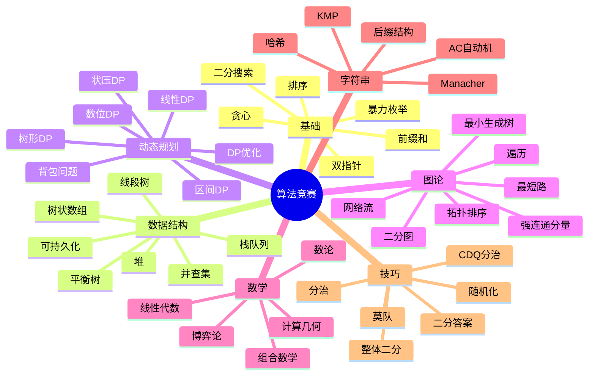

# 竞赛算法学习路径


> **版本**: 1.0
> **创建日期**: 2026-04-19
> **最后更新**: 2026-04-19

## 概述

本文档为算法竞赛爱好者提供一条系统的训练路径，从入门到参加高水平竞赛（ICPC、IOI、Codeforces等）。

---

## 竞赛路线图

```
                              ┌─────────────────────┐
                              │        开始        │
                              │    (编程基础)      │
                              └──────────┬──────────┘
                                         │
                    ┌────────────────────┴────────────────────┐
                    │                                         │
                    ▼                                         ▼
         ┌─────────────────────┐                   ┌─────────────────────┐
         │    入门阶段          │                   │     语法基础         │
         │  (青铜-白银)         │                   │   (2-4 周)          │
         │                     │                   │                     │
         │ • 基础算法           │                   │ • 数组、循环、函数   │
         │ • 简单数据结构       │                   │ • STL/容器基础       │
         │ • 暴力+优化          │                   │ • 文件I/O           │
         └──────────┬──────────┘                   └─────────────────────┘
                    │
                    ▼
         ┌─────────────────────┐
         │    提高阶段          │
         │  (黄金-铂金)         │
         │                     │
         │ • 核心算法          │
         │ • 高级数据结构      │
         │ • 动态规划          │
         └──────────┬──────────┘
                    │
                    ▼
         ┌─────────────────────┐
         │    进阶阶段          │
         │  (钻石-大师)         │
         │                     │
         │ • 高级算法          │
         │ • 数学算法          │
         │ • 字符串算法        │
         └──────────┬──────────┘
                    │
                    ▼
         ┌─────────────────────┐
         │    大师阶段          │
         │  (专家-传奇)         │
         │                     │
         │ • 高级技巧          │
         │ • 复杂综合题        │
         │ • 创新算法          │
         └─────────────────────┘
```

---

## 阶段详解

```
┌─────────────────────────────────────────────────────────────────────────────┐
│ 阶段 1: 入门青铜 → 白银 (3-6 个月)                                          │
│════════════════════════════════════════════════════════════════════════════│
│                                                                             │
│  必备技能:                                                                   │
│  ════════════════════════════════════════════════════════════════════════   │
│                                                                             │
│  ┌─────────────────────────────────────────────────────────────────────┐    │
│  │ 1. 基础算法                                                          │    │
│  │ ─────────────────────────────────────────────────────────────────── │    │
│  │ • 暴力枚举 (Brute Force)                                            │    │
│  │ • 模拟算法 (Simulation)                                             │    │
│  │ • 贪心算法基础 (Greedy) - 排序贪心、选择贪心                         │    │
│  │ • 二分搜索 (Binary Search) - 整数二分、实数二分                      │    │
│  │ • 双指针 (Two Pointers) - 滑动窗口、快慢指针                         │    │
│  │ • 前缀和与差分 (Prefix Sum & Difference)                            │    │
│  └─────────────────────────────────────────────────────────────────────┘    │
│                                                                             │
│  ┌─────────────────────────────────────────────────────────────────────┐    │
│  │ 2. 基础数据结构                                                      │    │
│  │ ─────────────────────────────────────────────────────────────────── │    │
│  │ • 数组与字符串操作                                                   │    │
│  │ • 栈 (Stack) - 表达式求值、括号匹配                                  │    │
│  │ • 队列 (Queue) - BFS基础                                             │    │
│  │ • 优先队列/堆 (Priority Queue/Heap) - Top K问题                      │    │
│  │ • 并查集 (Union-Find) - 基础路径压缩                                 │    │
│  │ • 哈希表 (Hash Map/Set) - 快速查找                                  │    │
│  └─────────────────────────────────────────────────────────────────────┘    │
│                                                                             │
│  ┌─────────────────────────────────────────────────────────────────────┐    │
│  │ 3. 基础数学                                                          │    │
│  │ ─────────────────────────────────────────────────────────────────── │    │
│  │ • 数论基础: GCD, LCM, 素数判断                                       │    │
│  │ • 快速幂 (Fast Power)                                               │    │
│  │ • 排列组合基础                                                       │    │
│  │ • 简单概率                                                           │    │
│  └─────────────────────────────────────────────────────────────────────┘    │
│                                                                             │
│  推荐刷题量: 200-300 题 (USACO Bronze/Silver, 洛谷普及)                     │
│                                                                             │
└─────────────────────────────────────────────────────────────────────────────┘
                                           │
                                           ▼
┌─────────────────────────────────────────────────────────────────────────────┐
│ 阶段 2: 提高黄金 → 铂金 (6-12 个月)                                         │
│════════════════════════════════════════════════════════════════════════════│
│                                                                             │
│  核心算法 - 动态规划:                                                         │
│  ════════════════════════════════════════════════════════════════════════   │
│                                                                             │
│  ┌─────────────────────────────────────────────────────────────────────┐    │
│  │ DP类型                                                               │    │
│  │ ─────────────────────────────────────────────────────────────────── │    │
│  │ • 线性DP: 最长递增子序列 (LIS), 最长公共子序列 (LCS)                 │    │
│  │ • 背包问题: 01背包、完全背包、多重背包、分组背包                     │    │
│  │ • 区间DP: 石子合并、矩阵链乘                                         │    │
│  │ • 树形DP: 树的最大独立集、树的重心                                  │    │
│  │ • 状态压缩DP: TSP, 子集DP                                           │    │
│  │ • 数位DP: 统计满足条件的数字个数                                     │    │
│  │ • 概率DP / 期望DP                                                    │    │
│  │ • 优化: 单调队列优化、斜率优化、四边形不等式优化                     │    │
│  └─────────────────────────────────────────────────────────────────────┘    │
│                                                                             │
│  核心算法 - 图论:                                                             │
│  ════════════════════════════════════════════════════════════════════════   │
│                                                                             │
│  ┌─────────────────────────────────────────────────────────────────────┐    │
│  │ 图论算法                                                             │    │
│  │ ─────────────────────────────────────────────────────────────────── │    │
│  │ • 图的存储: 邻接矩阵、邻接表                                         │    │
│  │ • 遍历: DFS, BFS                                                    │    │
│  │ • 最短路:                                                            │    │
│  │   - Dijkstra (堆优化 O((V+E)logV))                                  │    │
│  │   - Bellman-Ford / SPFA                                             │    │
│  │   - Floyd-Warshall (O(V³), 全源最短路)                              │    │
│  │ • 最小生成树: Prim, Kruskal                                         │    │
│  │ • 拓扑排序                                                           │    │
│  │ • 强连通分量: Tarjan / Kosaraju                                     │    │
│  │ • 二分图匹配: 匈牙利算法                                            │    │
│  │ • 网络流初步: 最大流 (Dinic, Edmonds-Karp)                          │    │
│  └─────────────────────────────────────────────────────────────────────┘    │
│                                                                             │
│  核心算法 - 数据结构:                                                         │
│  ════════════════════════════════════════════════════════════════════════   │
│                                                                             │
│  ┌─────────────────────────────────────────────────────────────────────┐    │
│  │ 高级数据结构                                                         │    │
│  │ ─────────────────────────────────────────────────────────────────── │    │
│  │ • 二叉搜索树 / 平衡树 (Treap, Splay)                                 │    │
│  │ • 线段树 (Segment Tree) - 单点修改、区间查询                         │    │
│  │   - 懒标记 (Lazy Propagation)                                       │    │
│  │   - 动态开点                                                         │    │
│  │ • 树状数组 (Fenwick Tree / BIT)                                     │    │
│  │ • ST表 (Sparse Table) - RMQ问题                                     │    │
│  │ • 可持久化数据结构初步                                                │    │
│  │ • LCA ( Lowest Common Ancestor ) - 倍增、Tarjan                     │    │
│  └─────────────────────────────────────────────────────────────────────┘    │
│                                                                             │
│  推荐刷题量: 再刷 300-500 题 (USACO Gold, Codeforces Div2 C-D)              │
│                                                                             │
└─────────────────────────────────────────────────────────────────────────────┘
                                           │
                                           ▼
┌─────────────────────────────────────────────────────────────────────────────┐
│ 阶段 3: 进阶钻石 → 大师 (12-24 个月)                                        │
│════════════════════════════════════════════════════════════════════════════│
│                                                                             │
│  高级算法 - 数学:                                                             │
│  ════════════════════════════════════════════════════════════════════════   │
│                                                                             │
│  ┌─────────────────────────────────────────────────────────────────────┐    │
│  │ 数论                                                                 │    │
│  │ ─────────────────────────────────────────────────────────────────── │    │
│  │ • 扩展欧几里得算法 (ExGCD)                                          │    │
│  │ • 线性同余方程 / 中国剩余定理                                        │    │
│  │ • 乘法逆元                                                           │    │
│  │ • 欧拉函数 (Euler's Totient)                                        │    │
│  │ • 莫比乌斯反演                                                       │    │
│  │ • 素数筛: 埃氏筛、线性筛                                            │    │
│  │ • Miller-Rabin素性测试 / Pollard Rho因数分解                        │    │
│  └─────────────────────────────────────────────────────────────────────┘    │
│                                                                             │
│  ┌─────────────────────────────────────────────────────────────────────┐    │
│  │ 组合数学                                                             │    │
│  │ ─────────────────────────────────────────────────────────────────── │    │
│  │ • Lucas定理                                                          │    │
│  │ • 卡特兰数 (Catalan Numbers)                                        │    │
│  │ • 容斥原理                                                           │    │
│  │ • 生成函数                                                           │    │
│  │ • Polya计数                                                          │    │
│  └─────────────────────────────────────────────────────────────────────┘    │
│                                                                             │
│  ┌─────────────────────────────────────────────────────────────────────┐    │
│  │ 计算几何                                                             │    │
│  │ ─────────────────────────────────────────────────────────────────── │    │
│  │ • 向量运算、叉积、点积                                                │    │
│  │ • 凸包算法 (Graham Scan, Andrew)                                    │    │
│  │ • 半平面交、旋转卡壳                                                 │    │
│  │ • 最近点对、最远点对                                                 │    │
│  │ • 面积计算、点在多边形内                                             │    │
│  └─────────────────────────────────────────────────────────────────────┘    │
│                                                                             │
│  高级算法 - 字符串:                                                           │
│  ════════════════════════════════════════════════════════════════════════   │
│                                                                             │
│  ┌─────────────────────────────────────────────────────────────────────┐    │
│  │ 字符串算法                                                           │    │
│  │ ─────────────────────────────────────────────────────────────────── │    │
│  │ • KMP算法 (Knuth-Morris-Pratt)                                      │    │
│  │ • Z函数 / 扩展KMP                                                    │    │
│  │ • Manacher算法 (回文串)                                             │    │
│  │ • Trie树                                                             │    │
│  │ • AC自动机                                                           │    │
│  │ • 后缀数组 (Suffix Array)                                           │    │
│  │ • 后缀自动机 (Suffix Automaton)                                     │    │
│  │ • 后缀树                                                             │    │
│  │ • 字符串哈希 / 双哈希                                                │    │
│  └─────────────────────────────────────────────────────────────────────┘    │
│                                                                             │
│  高级算法 - 数据结构:                                                         │
│  ════════════════════════════════════════════════════════════════════════   │
│                                                                             │
│  ┌─────────────────────────────────────────────────────────────────────┐    │
│  │ 复杂数据结构                                                         │    │
│  │ ─────────────────────────────────────────────────────────────────── │    │
│  │ • 树链剖分 (Heavy-Light Decomposition)                              │    │
│  │ • 动态树 (Link-Cut Tree)                                            │    │
│  │ • 可持久化线段树 / 主席树                                            │    │
│  │ • 可持久化Trie                                                       │    │
│  │ • CDQ分治、整体二分                                                  │    │
│  │ • 莫队算法 (Mo's Algorithm)                                         │    │
│  │ • Splay树 / Treap进阶                                               │    │
│  └─────────────────────────────────────────────────────────────────────┘    │
│                                                                             │
│  高级算法 - 图论:                                                             │
│  ════════════════════════════════════════════════════════════════════════   │
│                                                                             │
│  ┌─────────────────────────────────────────────────────────────────────┐    │
│  │ 高级图论                                                             │    │
│  │ ─────────────────────────────────────────────────────────────────── │    │
│  │ • 网络流: 最小割、费用流                                              │    │
│  │ • 2-SAT                                                              │    │
│  │ • 虚树                                                               │    │
│  │ • 点分治、边分治                                                     │    │
│  │ • 网络流建模技巧                                                     │    │
│  └─────────────────────────────────────────────────────────────────────┘    │
│                                                                             │
│  推荐刷题量: 再刷 500+ 题 (Codeforces Div1, AtCoder ARC/AGC)                │
│                                                                             │
└─────────────────────────────────────────────────────────────────────────────┘
```

---

## Mermaid 知识图谱



---

## 训练计划模板

```
┌─────────────────────────────────────────────────────────────────────────────┐
│                      每周训练计划 (建议)                                     │
├─────────────────────────────────────────────────────────────────────────────┤
│                                                                             │
│  日常训练 (每天 2-4 小时):                                                   │
│  ════════════════════════════════════════════════════════════════════════   │
│                                                                             │
│  ┌─────────────────────────────────────────────────────────────────────┐    │
│  │ 阶段 1-2: (青铜-铂金)                                               │    │
│  │ ─────────────────────────────────────────────────────────────────── │    │
│  │ 周一: 学习新算法 + 模板题 × 3                                       │    │
│  │ 周二: 巩固练习 × 3                                                  │    │
│  │ 周三: 学习新算法 + 模板题 × 3                                       │    │
│  │ 周四: 巩固练习 × 3                                                  │    │
│  │ 周五: 模拟赛 / Codeforces 比赛                                      │    │
│  │ 周六: 补题 + 学习题解                                               │    │
│  │ 周日: 周赛 (CF/AtCoder) + 复习                                      │    │
│  └─────────────────────────────────────────────────────────────────────┘    │
│                                                                             │
│  ┌─────────────────────────────────────────────────────────────────────┐    │
│  │ 阶段 3+: (钻石+)                                                    │    │
│  │ ─────────────────────────────────────────────────────────────────── │    │
│  │ 每天: 至少 1 场训练赛 或 3-5 道难题                                  │    │
│  │ 重点: 学习高级算法，研究经典题目                                     │    │
│  │ 额外: 团队配合训练 (如准备ICPC)                                      │    │
│  └─────────────────────────────────────────────────────────────────────┘    │
│                                                                             │
└─────────────────────────────────────────────────────────────────────────────┘

┌─────────────────────────────────────────────────────────────────────────────┐
│                      比赛策略                                                │
├─────────────────────────────────────────────────────────────────────────────┤
│                                                                             │
│  读题顺序:                                                                   │
│  ════════════════════════════════════════════════════════════════════════   │
│  • 先通读所有题目，标记难度                                                  │
│  • 按 简单→中等→困难 顺序解决                                               │
│  • 不要死磕一道题超过30分钟                                                  │
│                                                                             │
│  时间分配 (以5小时比赛为例):                                                  │
│  ════════════════════════════════════════════════════════════════════════   │
│  • 0:00-0:30: 读题 + 选题                                                    │
│  • 0:30-1:30: 解决最简单的2-3题                                             │
│  • 1:30-3:30: 攻克中等难度题目                                               │
│  • 3:30-4:30: 尝试难题或检查已解题                                          │
│  • 4:30-5:00: 最后检查 + 提交                                               │
│                                                                             │
│  调试技巧:                                                                   │
│  • 先用小数据手算验证                                                        │
│  • 使用assert检查中间结果                                                    │
│  • 对拍: 写暴力程序对比                                                      │
│  • 检查边界条件 (n=0, n=1, 最大值)                                          │
│                                                                             │
└─────────────────────────────────────────────────────────────────────────────┘
```

---

## 推荐资源

```
┌─────────────────────────────────────────────────────────────────────────────┐
│                         推荐学习资源                                         │
├─────────────────────────────────────────────────────────────────────────────┤
│                                                                             │
│  在线判题系统 (OJ):                                                          │
│  ════════════════════════════════════════════════════════════════════════   │
│                                                                             │
│  ┌─────────────────────────────────────────────────────────────────────┐    │
│  │ 主流平台                                                             │    │
│  │ ─────────────────────────────────────────────────────────────────── │    │
│  │ • Codeforces (cf): 比赛质量高，难度分级明确                          │    │
│  │   - Div4: 入门     - Div3: 普及      - Div2: 提高                   │    │
│  │   - Div1: 省选+    - 特殊比赛 (Global, Educational)                 │    │
│  │                                                                     │    │
│  │ • AtCoder (ac): 题目简洁，适合专项训练                               │    │
│  │   - ABC: 入门      - ARC: 提高       - AGC: 进阶                    │    │
│  │                                                                     │    │
│  │ • 洛谷 (luogu): 中文OJ，适合国内选手                                 │    │
│  │   - 有题单系统，适合按专题训练                                        │    │
│  │                                                                     │    │
│  │ • LeetCode: 偏向面试，但也有竞赛模式                                  │    │
│  │                                                                     │    │
│  │ • USACO: 美国信息学竞赛官方，有训练系统                               │    │
│  └─────────────────────────────────────────────────────────────────────┘    │
│                                                                             │
├─────────────────────────────────────────────────────────────────────────────┤
│                                                                             │
│  学习资料:                                                                   │
│  ════════════════════════════════════════════════════════════════════════   │
│                                                                             │
│  书籍:                                                                       │
│  • 《算法竞赛入门经典》(刘汝佳) - 国内最经典入门书                          │
│  • 《挑战程序设计竞赛》(日) - 翻译版，分类详细                              │
│  • 《算法竞赛进阶指南》(李煜东) - 进阶必备                                  │
│  • Competitive Programmer's Handbook (CSES) - 免费在线                      │
│  • cp-algorithms.com - 算法百科全书                                         │
│                                                                             │
│  视频/课程:                                                                  │
│  • 翁凯/邓俊辉 等国内高校算法课程                                            │
│  • USACO Guide (usaco.guide) - 免费系统学习                                 │
│  • Errichto (YouTube) - 国际顶尖选手讲解                                    │
│  • 很多OI选手的B站频道                                                       │
│                                                                             │
│  工具:                                                                       │
│  • OI-Wiki: oi-wiki.org - 中文算法百科                                      │
│  • VisuAlgo: 算法可视化                                                     │
│  • Desmos: 函数绘图，验证几何题                                              │
│                                                                             │
└─────────────────────────────────────────────────────────────────────────────┘
```

---

## 常见问题与建议

```
┌─────────────────────────────────────────────────────────────────────────────┐
│                         常见问题                                             │
├─────────────────────────────────────────────────────────────────────────────┤
│                                                                             │
│  Q1: 刷了很多题但感觉没有进步?                                               │
│  ════════════════════════════════════════════════════════════════════════   │
│  • 确保理解每道题的解法，不只是AC                                             │
│  • 总结同类题目的套路和模板                                                  │
│  • 定期复习，重做错题                                                        │
│  • 尝试用自己的话讲清楚解法                                                  │
│                                                                             │
├─────────────────────────────────────────────────────────────────────────────┤
│                                                                             │
│  Q2: 比赛时总是紧张发挥不好?                                                 │
│  ════════════════════════════════════════════════════════════════════════   │
│  • 多参加模拟赛，熟悉比赛节奏                                                │
│  • 建立固定的比赛流程和检查清单                                              │
│  • 先易后难，保证简单题得分                                                  │
│  • 平时训练时也要有时间压力                                                  │
│                                                                             │
├─────────────────────────────────────────────────────────────────────────────┤
│                                                                             │
│  Q3: 遇到完全没思路的题怎么办?                                               │
│  ════════════════════════════════════════════════════════════════════════   │
│  • 从特殊情况入手，找规律                                                    │
│  • 尝试暴力解法，然后优化                                                    │
│  • 看题解，学习新的思路和方法                                                │
│  • 加入算法交流群讨论                                                        │
│                                                                             │
├─────────────────────────────────────────────────────────────────────────────┤
│                                                                             │
│  Q4: 如何平衡学业和竞赛?                                                     │
│  ════════════════════════════════════════════════════════════════════════   │
│  • 制定合理的学习计划                                                        │
│  • 利用碎片时间思考题目                                                      │
│  • 假期集中训练                                                              │
│  • 记住: 学业是根基，竞赛是加分项                                             │
│                                                                             │
└─────────────────────────────────────────────────────────────────────────────┘
```

---

## 目标赛事

```
┌─────────────────────────────────────────────────────────────────────────────┐
│                         主要算法竞赛                                         │
├─────────────────────────────────────────────────────────────────────────────┤
│                                                                             │
│  中学级别:                                                                   │
│  ════════════════════════════════════════════════════════════════════════   │
│  • NOI (全国青少年信息学奥林匹克竞赛) - 国内最高级别                         │
│  • IOI (国际信息学奥林匹克) - 国际最高级别                                   │
│  • CSP-S / NOIP - 入门级官方赛事                                             │
│                                                                             │
│  大学级别:                                                                   │
│  ════════════════════════════════════════════════════════════════════════   │
│  • ICPC (国际大学生程序设计竞赛)                                             │
│    - Regional (区域赛) → EC-Final (亚洲区决赛) → WF (全球总决赛)            │
│  • CCPC (中国大学生程序设计竞赛)                                             │
│  • 蓝桥杯 - 国内普及型竞赛                                                   │
│                                                                             │
│  在线比赛:                                                                   │
│  ════════════════════════════════════════════════════════════════════════   │
│  • Google Code Jam (已停办，但题可练)                                        │
│  • Facebook Hacker Cup (已停办)                                              │
│  • Meta Hacker Cup                                                           │
│  • Google Kick Start (已并入其他项目)                                        │
│                                                                             │
└─────────────────────────────────────────────────────────────────────────────┘
```

---

*算法竞赛是一条漫长而充满挑战的道路，但也是最能锻炼编程能力和算法思维的方式。保持热情，坚持训练，享受解决问题的乐趣！*

---

## 参考文献

- 待补充

---

## 知识导航

- [返回目录](README.md)
