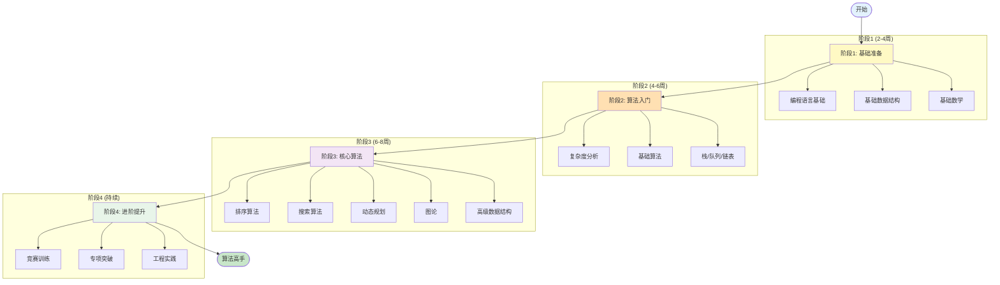

# 算法初学者学习路径


> **版本**: 1.0
> **创建日期**: 2026-04-19
> **最后更新**: 2026-04-19

## 概述

本文档为算法初学者提供一条循序渐进的学习路径，从编程基础到掌握核心算法思想，适合零基础或刚接触编程的学习者。

---

## 学习路径全景图

```
                                ┌─────────────────────┐
                                │     开始           │
                                │  (编程基础)        │
                                └──────────┬──────────┘
                                           │
                                           ▼
┌─────────────────────────────────────────────────────────────────────────────┐
│ 阶段 1: 基础准备 (2-4 周)                                                   │
│════════════════════════════════════════════════════════════════════════════│
│                                                                             │
│  ┌─────────────────────────────────────────────────────────────────────┐    │
│  │ 编程语言基础                                                         │    │
│  │ ─────────────────────────────────────────────────────────────────── │    │
│  │ • 选择一门语言: Python/Java/C++/JavaScript                          │    │
│  │ • 基本语法: 变量、数据类型、运算符                                   │    │
│  │ • 控制流: if/else, switch, for, while                               │    │
│  │ • 函数/方法定义与调用                                                │    │
│  │ • 基础I/O操作                                                        │    │
│  └─────────────────────────────────────────────────────────────────────┘    │
│                              │                                              │
│                              ▼                                              │
│  ┌─────────────────────────────────────────────────────────────────────┐    │
│  │ 基础数据结构                                                         │    │
│  │ ─────────────────────────────────────────────────────────────────── │    │
│  │ • 数组/列表 (Array/List)                                            │    │
│  │ • 字符串 (String) 操作                                               │    │
│  │ • 字典/哈希表 (Dictionary/HashMap) 初步                              │    │
│  └─────────────────────────────────────────────────────────────────────┘    │
│                              │                                              │
│                              ▼                                              │
│  ┌─────────────────────────────────────────────────────────────────────┐    │
│  │ 基础数学知识                                                         │    │
│  │ ─────────────────────────────────────────────────────────────────── │    │
│  │ • 对数运算: log₂n, log₁₀n                                           │    │
│  │ • 等差/等比数列求和                                                  │    │
│  │ • 基础组合数学: 排列、组合                                           │    │
│  │ • 数学归纳法概念                                                     │    │
│  └─────────────────────────────────────────────────────────────────────┘    │
└─────────────────────────────────────────────────────────────────────────────┘
                                           │
                                           ▼
┌─────────────────────────────────────────────────────────────────────────────┐
│ 阶段 2: 算法入门 (4-6 周)                                                   │
│════════════════════════════════════════════════════════════════════════════│
│                                                                             │
│  ┌─────────────────────────────────────────────────────────────────────┐    │
│  │ 复杂度分析基础                                                       │    │
│  │ ─────────────────────────────────────────────────────────────────── │    │
│  │ • 时间复杂度概念                                                     │    │
│  │ • 大O记号: O(1), O(n), O(n²), O(log n)                              │    │
│  │ • 空间复杂度                                                         │    │
│  │ • 最好/平均/最坏情况分析                                             │    │
│  └─────────────────────────────────────────────────────────────────────┘    │
│                              │                                              │
│                              ▼                                              │
│  ┌─────────────────────────────────────────────────────────────────────┐    │
│  │ 基础算法                                                             │    │
│  │ ─────────────────────────────────────────────────────────────────── │    │
│  │ • 线性搜索 (Linear Search)                                          │    │
│  │ • 二分搜索 (Binary Search) ← 重点!                                  │    │
│  │ • 冒泡排序、选择排序、插入排序                                       │    │
│  │ • 递归基础: 阶乘、斐波那契                                          │    │
│  └─────────────────────────────────────────────────────────────────────┘    │
│                              │                                              │
│                              ▼                                              │
│  ┌─────────────────────────────────────────────────────────────────────┐    │
│  │ 基础数据结构深入                                                     │    │
│  │ ─────────────────────────────────────────────────────────────────── │    │
│  │ • 栈 (Stack) 和队列 (Queue)                                         │    │
│  │ • 链表 (Linked List)                                                │    │
│  │ • 哈希表 (Hash Table) 详细理解                                       │    │
│  └─────────────────────────────────────────────────────────────────────┘    │
└─────────────────────────────────────────────────────────────────────────────┘
                                           │
                                           ▼
┌─────────────────────────────────────────────────────────────────────────────┐
│ 阶段 3: 核心算法 (6-8 周)                                                   │
│════════════════════════════════════════════════════════════════════════════│
│                                                                             │
│  ┌───────────────┐  ┌───────────────┐  ┌───────────────┐  ┌──────────────┐ │
│  │   排序算法    │  │   搜索算法    │  │   分治思想    │  │   贪心算法   │ │
│  │ ───────────── │  │ ───────────── │  │ ───────────── │  │ ──────────── │ │
│  │ • 快速排序    │  │ • DFS        │  │ • 归并排序    │  │ • 活动选择   │ │
│  │ • 归并排序    │  │ • BFS        │  │ • 二分搜索    │  │ • 霍夫曼编码 │ │
│  │ • 堆排序      │  │ • 回溯       │  │ • 快速排序    │  │ • 分数背包   │ │
│  │ • 计数排序    │  │ • 剪枝       │  │ • 最近点对    │  │ • 区间调度   │ │
│  └───────────────┘  └───────────────┘  └───────────────┘  └──────────────┘ │
│                                                                             │
│  ┌───────────────┐  ┌───────────────┐  ┌───────────────┐                   │
│  │   动态规划    │  │   图论基础    │  │   高级数据结构│                   │
│  │ ───────────── │  │ ───────────── │  │ ───────────── │                   │
│  │ • 背包问题    │  │ • 图的表示    │  │ • 二叉搜索树  │                   │
│  │ • 最长子序列  │  │ • DFS/BFS遍历 │  │ • 堆/优先队列 │                   │
│  │ • 矩阵链乘    │  │ • 最短路径    │  │ • 并查集      │                   │
│  │ • 状态压缩DP  │  │ • 最小生成树  │  │ • 线段树初步  │                   │
│  └───────────────┘  └───────────────┘  └───────────────┘                   │
└─────────────────────────────────────────────────────────────────────────────┘
                                           │
                                           ▼
┌─────────────────────────────────────────────────────────────────────────────┐
│ 阶段 4: 进阶提升 (持续)                                                     │
│════════════════════════════════════════════════════════════════════════════│
│                                                                             │
│  ┌──────────────────┐  ┌──────────────────┐  ┌──────────────────┐          │
│  │   高级算法主题   │  │   专项训练       │  │   工程实践       │          │
│  │ ──────────────── │  │ ──────────────── │  │ ──────────────── │          │
│  │ • 字符串算法     │  │ • 力扣/LeetCode  │  │ • 开源项目贡献   │          │
│  │ • 计算几何     │  │ • Codeforces     │  │ • 算法可视化     │          │
│  │ • 网络流       │  │ • AtCoder        │  │ • 技术博客       │          │
│  │ • 数论算法     │  │ • 模拟面试       │  │ • 代码审查       │          │
│  └──────────────────┘  └──────────────────┘  └──────────────────┘          │
└─────────────────────────────────────────────────────────────────────────────┘
```

---

## Mermaid 学习路径图



---

## 详细学习计划

### 阶段 1: 基础准备 (2-4 周)

```
┌─────────────────────────────────────────────────────────────────────────────┐
│                         第一周: 编程语言基础                                 │
├─────────────────────────────────────────────────────────────────────────────┤
│                                                                             │
│  每日学习 (2-3小时):                                                         │
│  ════════════════════════════════════════════════════════════════════════   │
│                                                                             │
│  Day 1-2: 环境搭建与基础语法                                                │
│  ────────────────────────────────────────────────────────────────────────   │
│  • 安装开发环境 (IDE, 编译器/解释器)                                         │
│  • Hello World 程序                                                         │
│  • 变量、常量、基本数据类型                                                  │
│  • 运算符: 算术、比较、逻辑                                                  │
│  • 练习题: 计算器、温度转换                                                  │
│                                                                             │
│  Day 3-4: 控制流                                                            │
│  ────────────────────────────────────────────────────────────────────────   │
│  • 条件语句: if/else if/else, switch                                        │
│  • 循环: for, while, do-while                                               │
│  • 循环控制: break, continue                                                │
│  • 练习题: 打印九九乘法表、判断素数                                          │
│                                                                             │
│  Day 5-7: 函数与方法                                                        │
│  ────────────────────────────────────────────────────────────────────────   │
│  • 函数定义与调用                                                            │
│  • 参数传递 (值传递 vs 引用传递)                                             │
│  • 返回值                                                                    │
│  • 作用域与生命周期                                                          │
│  • 练习题: 实现常用数学函数 (gcd, lcm, power)                                │
│                                                                             │
└─────────────────────────────────────────────────────────────────────────────┘

┌─────────────────────────────────────────────────────────────────────────────┐
│                         第二周: 基础数据结构                                 │
├─────────────────────────────────────────────────────────────────────────────┤
│                                                                             │
│  Day 8-10: 数组与字符串                                                     │
│  ────────────────────────────────────────────────────────────────────────   │
│  • 数组定义、初始化、访问                                                    │
│  • 多维数组                                                                  │
│  • 字符串操作 (遍历、拼接、切片)                                             │
│  • 练习题: 数组反转、找最大值、字符串回文判断                                │
│                                                                             │
│  Day 11-12: 基础集合类型                                                    │
│  ────────────────────────────────────────────────────────────────────────   │
│  • 列表/动态数组                                                             │
│  • 集合 (Set) 基本操作                                                       │
│  • 字典/哈希表 (Dictionary/Map)                                              │
│  • 练习题: 统计词频、去重                                                    │
│                                                                             │
│  Day 13-14: 基础数学知识                                                    │
│  ────────────────────────────────────────────────────────────────────────   │
│  • 对数: log₂n 的含义                                                        │
│  • 等差数列求和公式                                                          │
│  • 排列组合基础                                                              │
│  • 练习题: 数学公式编程实现                                                  │
│                                                                             │
└─────────────────────────────────────────────────────────────────────────────┘

┌─────────────────────────────────────────────────────────────────────────────┐
│                    第三周: 复习与练习                                        │
├─────────────────────────────────────────────────────────────────────────────┤
│                                                                             │
│  推荐练习平台:                                                               │
│  • LeetCode 简单题 (1-50 题号)                                              │
│  • HackerRank 基础题                                                        │
│  • 洛谷 入门题目                                                            │
│                                                                             │
│  目标: 完成 20-30 道基础编程题                                               │
│                                                                             │
└─────────────────────────────────────────────────────────────────────────────┘
```

### 阶段 2: 算法入门 (4-6 周)

```
┌─────────────────────────────────────────────────────────────────────────────┐
│                         第四周: 复杂度分析                                   │
├─────────────────────────────────────────────────────────────────────────────┤
│                                                                             │
│  学习内容:                                                                   │
│  ════════════════════════════════════════════════════════════════════════   │
│                                                                             │
│  • 为什么需要复杂度分析?                                                      │
│    - 比较算法优劣                                                            │
│    - 预测程序运行时间                                                        │
│    - 选择合适的数据结构                                                      │
│                                                                             │
│  • 大O记号详解:                                                              │
│    ┌──────────┬───────────────┬─────────────────────────────────────────┐   │
│    │  复杂度  │    名称       │              示例                       │   │
│    ├──────────┼───────────────┼─────────────────────────────────────────┤   │
│    │   O(1)   │   常数时间    │  数组随机访问                            │   │
│    │   O(log n)│  对数时间    │  二分搜索                                │   │
│    │   O(n)   │   线性时间    │  线性搜索                                │   │
│    │   O(n log n)│ 线性对数   │  快速排序平均情况                        │   │
│    │   O(n²)  │   平方时间    │  冒泡排序                                │   │
│    │   O(2ⁿ)  │   指数时间    │  递归枚举子集                            │   │
│    └──────────┴───────────────┴─────────────────────────────────────────┘   │
│                                                                             │
│  • 分析技巧:                                                                 │
│    - 只保留最高阶项                                                          │
│    - 忽略常数系数                                                            │
│    - 关注最坏情况                                                            │
│                                                                             │
└─────────────────────────────────────────────────────────────────────────────┘

┌─────────────────────────────────────────────────────────────────────────────┐
│                         第五周: 基础算法                                     │
├─────────────────────────────────────────────────────────────────────────────┤
│                                                                             │
│  搜索算法:                                                                   │
│  ════════════════════════════════════════════════════════════════════════   │
│                                                                             │
│  1. 线性搜索 (Linear Search)                                                │
│     代码框架:                                                                │
│     for i from 0 to n-1:                                                    │
│         if arr[i] == target: return i                                       │
│     return -1                                                               │
│     复杂度: O(n)                                                            │
│                                                                             │
│  2. 二分搜索 (Binary Search) ★ 重点掌握                                     │
│     前提: 数组已排序                                                         │
│     代码框架:                                                                │
│     left, right = 0, n-1                                                    │
│     while left <= right:                                                    │
│         mid = left + (right-left)//2                                        │
│         if arr[mid] == target: return mid                                   │
│         elif arr[mid] < target: left = mid+1                                │
│         else: right = mid-1                                                 │
│     return -1                                                               │
│     复杂度: O(log n)                                                        │
│                                                                             │
├─────────────────────────────────────────────────────────────────────────────┤
│                                                                             │
│  排序算法 (基础版):                                                           │
│  ════════════════════════════════════════════════════════════════════════   │
│                                                                             │
│  ┌────────────┬───────────┬───────────┬───────────┬─────────────────────┐   │
│  │   算法     │  最好     │  平均     │  最坏     │      特点           │   │
│  ├────────────┼───────────┼───────────┼───────────┼─────────────────────┤   │
│  │ 冒泡排序   │   O(n)    │  O(n²)    │  O(n²)    │ 简单，教学用        │   │
│  │ 选择排序   │  O(n²)    │  O(n²)    │  O(n²)    │ 交换次数少          │   │
│  │ 插入排序   │   O(n)    │  O(n²)    │  O(n²)    │ 对小数据好          │   │
│  └────────────┴───────────┴───────────┴───────────┴─────────────────────┘   │
│                                                                             │
└─────────────────────────────────────────────────────────────────────────────┘

┌─────────────────────────────────────────────────────────────────────────────┐
│                         第六周: 递归基础                                     │
├─────────────────────────────────────────────────────────────────────────────┤
│                                                                             │
│  递归三要素:                                                                 │
│  ════════════════════════════════════════════════════════════════════════   │
│                                                                             │
│  1. 终止条件 (Base Case)                                                    │
│  2. 递归调用 (Recursive Case)                                               │
│  3. 问题规模缩小                                                            │
│                                                                             │
│  经典例子:                                                                   │
│  ════════════════════════════════════════════════════════════════════════   │
│                                                                             │
│  阶乘:                                                                       │
│  fact(n) = 1                 if n == 0                                      │
│  fact(n) = n * fact(n-1)     if n > 0                                       │
│                                                                             │
│  斐波那契:                                                                   │
│  fib(n) = 0                  if n == 0                                      │
│  fib(n) = 1                  if n == 1                                      │
│  fib(n) = fib(n-1)+fib(n-2)  if n > 1                                       │
│                                                                             │
│  ⚠️ 注意: 递归斐波那契效率低，后续学习动态规划优化                             │
│                                                                             │
└─────────────────────────────────────────────────────────────────────────────┘
```

### 阶段 3: 核心算法 (6-8 周)

```
┌─────────────────────────────────────────────────────────────────────────────┐
│                    第七-八周: 高级排序与分治                                  │
├─────────────────────────────────────────────────────────────────────────────┤
│                                                                             │
│  高级排序算法:                                                               │
│  ════════════════════════════════════════════════════════════════════════   │
│                                                                             │
│  ┌────────────┬───────────┬───────────┬───────────┬─────────────────────┐   │
│  │   算法     │  最好     │  平均     │  最坏     │      特点           │   │
│  ├────────────┼───────────┼───────────┼───────────┼─────────────────────┤   │
│  │ 快速排序   │ O(n log n)│ O(n log n)│  O(n²)    │ 平均最快，通用      │   │
│  │ 归并排序   │ O(n log n)│ O(n log n)│ O(n log n)│ 稳定，链表友好      │   │
│  │ 堆排序     │ O(n log n)│ O(n log n)│ O(n log n)│ 空间O(1)，不递归   │   │
│  │ 计数排序   │  O(n+k)   │  O(n+k)   │  O(n+k)   │ 整数专用，线性     │   │
│  └────────────┴───────────┴───────────┴───────────┴─────────────────────┘   │
│                                                                             │
│  分治思想:                                                                   │
│  ════════════════════════════════════════════════════════════════════════   │
│                                                                             │
│  Divide and Conquer:                                                        │
│  1. Divide: 将问题分解为子问题                                               │
│  2. Conquer: 递归解决子问题                                                  │
│  3. Combine: 合并子问题的解                                                  │
│                                                                             │
│  应用: 归并排序、快速排序、二分搜索、最近点对                                 │
│                                                                             │
└─────────────────────────────────────────────────────────────────────────────┘

┌─────────────────────────────────────────────────────────────────────────────┐
│                    第九-十周: 动态规划入门                                    │
├─────────────────────────────────────────────────────────────────────────────┤
│                                                                             │
│  动态规划核心思想:                                                           │
│  ════════════════════════════════════════════════════════════════════════   │
│                                                                             │
│  1. 最优子结构: 问题的最优解包含子问题的最优解                                  │
│  2. 重叠子问题: 子问题被重复计算，可以记忆化                                   │
│  3. 状态转移方程: 定义如何从子问题构造当前解                                   │
│                                                                             │
│  经典问题入门:                                                               │
│  ════════════════════════════════════════════════════════════════════════   │
│                                                                             │
│  斐波那契数列 (记忆化):                                                       │
│  dp[0] = 0, dp[1] = 1                                                       │
│  dp[i] = dp[i-1] + dp[i-2]                                                  │
│                                                                             │
│  爬楼梯问题:                                                                 │
│  dp[i] = dp[i-1] + dp[i-2]  // 最后一步跨1或2级                              │
│                                                                             │
│  最大子数组和 (Kadane算法):                                                   │
│  dp[i] = max(arr[i], dp[i-1] + arr[i])                                      │
│                                                                             │
│  0/1 背包问题:                                                               │
│  dp[i][w] = max(dp[i-1][w], dp[i-1][w-weight[i]] + value[i])                │
│                                                                             │
└─────────────────────────────────────────────────────────────────────────────┘

┌─────────────────────────────────────────────────────────────────────────────┐
│                    第十一-十二周: 图论基础                                    │
├─────────────────────────────────────────────────────────────────────────────┤
│                                                                             │
│  图的基本概念:                                                               │
│  ════════════════════════════════════════════════════════════════════════   │
│                                                                             │
│  • 有向图 vs 无向图                                                          │
│  • 邻接矩阵 vs 邻接表                                                        │
│  • 度、路径、环、连通分量                                                    │
│                                                                             │
│  图遍历算法:                                                                 │
│  ════════════════════════════════════════════════════════════════════════   │
│                                                                             │
│  DFS (深度优先搜索):                                                         │
│  - 使用栈 (递归或显式)                                                       │
│  - 用于: 连通性、拓扑排序、环检测                                            │
│                                                                             │
│  BFS (广度优先搜索):                                                         │
│  - 使用队列                                                                  │
│  - 用于: 最短路径(无权图)、层次遍历                                          │
│                                                                             │
│  最短路径:                                                                   │
│  • Dijkstra: 非负权图单源最短路径                                            │
│  • Bellman-Ford: 可处理负权边                                                │
│                                                                             │
│  最小生成树:                                                                 │
│  • Prim算法                                                                  │
│  • Kruskal算法                                                               │
│                                                                             │
└─────────────────────────────────────────────────────────────────────────────┘
```

---

## 学习资源推荐

```
┌─────────────────────────────────────────────────────────────────────────────┐
│                         推荐学习资源                                         │
├─────────────────────────────────────────────────────────────────────────────┤
│                                                                             │
│  在线课程:                                                                   │
│  ════════════════════════════════════════════════════════════════════════   │
│  •  Coursera: Algorithms (Princeton) - Robert Sedgewick                    │
│  •  MIT 6.006: Introduction to Algorithms                                   │
│  •  中国大学MOOC: 数据结构 (浙江大学)                                        │
│  •  极客时间: 数据结构与算法之美                                             │
│                                                                             │
├─────────────────────────────────────────────────────────────────────────────┤
│                                                                             │
│  经典书籍:                                                                   │
│  ════════════════════════════════════════════════════════════════════════   │
│  入门:                                                                       │
│  • 《算法图解》(Grokking Algorithms) - 图文并茂，适合入门                    │
│  • 《啊哈！算法》 - 趣味算法入门                                             │
│                                                                             │
│  进阶:                                                                       │
│  • 《算法》(第4版) - Sedgewick, Wayne (Java实现)                            │
│  • 《数据结构与算法分析》 - Weiss (C/Java/Python版本)                        │
│  • 《算法导论》(CLRS) - 算法圣经，较深入                                     │
│                                                                             │
├─────────────────────────────────────────────────────────────────────────────┤
│                                                                             │
│  刷题平台:                                                                   │
│  ════════════════════════════════════════════════════════════════════════   │
│  •  LeetCode (中文站: 力扣) - 最主流，题目质量高                             │
│  •  HackerRank - 分专题练习，适合入门                                        │
│  •  洛谷 - 中文OJ，适合竞赛入门                                              │
│  •  Codeforces/AtCoder - 竞赛风格                                           │
│                                                                             │
└─────────────────────────────────────────────────────────────────────────────┘
```

---

## 学习建议与误区

```
┌─────────────────────────────────────────────────────────────────────────────┐
│                         学习建议                                             │
├─────────────────────────────────────────────────────────────────────────────┤
│                                                                             │
│  ✅ 应该做的:                                                                │
│  ════════════════════════════════════════════════════════════════════════   │
│  • 理解后再实现: 不要死记代码，理解算法的核心思想                             │
│  • 手写代码: 初期在白板/纸上手写，加深理解                                    │
│  • 多次复习: 算法需要反复练习才能真正掌握                                     │
│  • 分析复杂度: 每次实现后分析时间/空间复杂度                                  │
│  • 对比学习: 对比相似算法的异同                                              │
│  • 实际应用: 尝试在项目中使用学到的算法                                       │
│                                                                             │
├─────────────────────────────────────────────────────────────────────────────┤
│                                                                             │
│  ❌ 避免的误区:                                                              │
│  ════════════════════════════════════════════════════════════════════════   │
│  • 只看不练: 看懂了不等于会写，必须动手实现                                   │
│  • 追求数量: 刷100道题不如深入理解10道                                        │
│  • 跳过基础: 不要急于学高级算法，打好基础更重要                               │
│  • 不看题解: 思考30分钟后可以看题解，但要先思考                               │
│  • 忽视边界: 注意数组越界、空输入等边界情况                                   │
│  • 不复习: 学过的算法如果不复习会遗忘                                         │
│                                                                             │
└─────────────────────────────────────────────────────────────────────────────┘
```

---

*本文档提供了一条系统的算法学习路径，建议学习者按照自己的节奏循序渐进，注重理解而非死记硬背。算法学习是一个长期积累的过程，保持耐心和持续练习是关键。*

---

## 参考文献

- 待补充

---

## 知识导航

- [返回目录](README.md)

