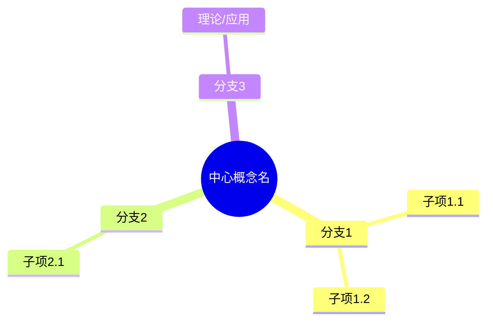
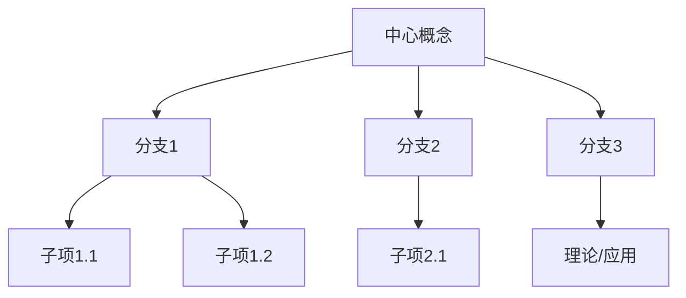
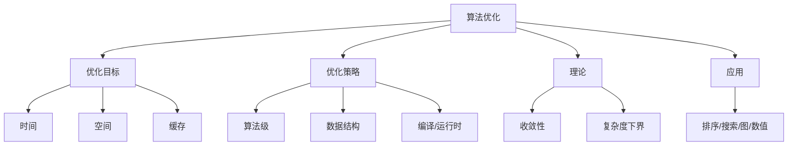
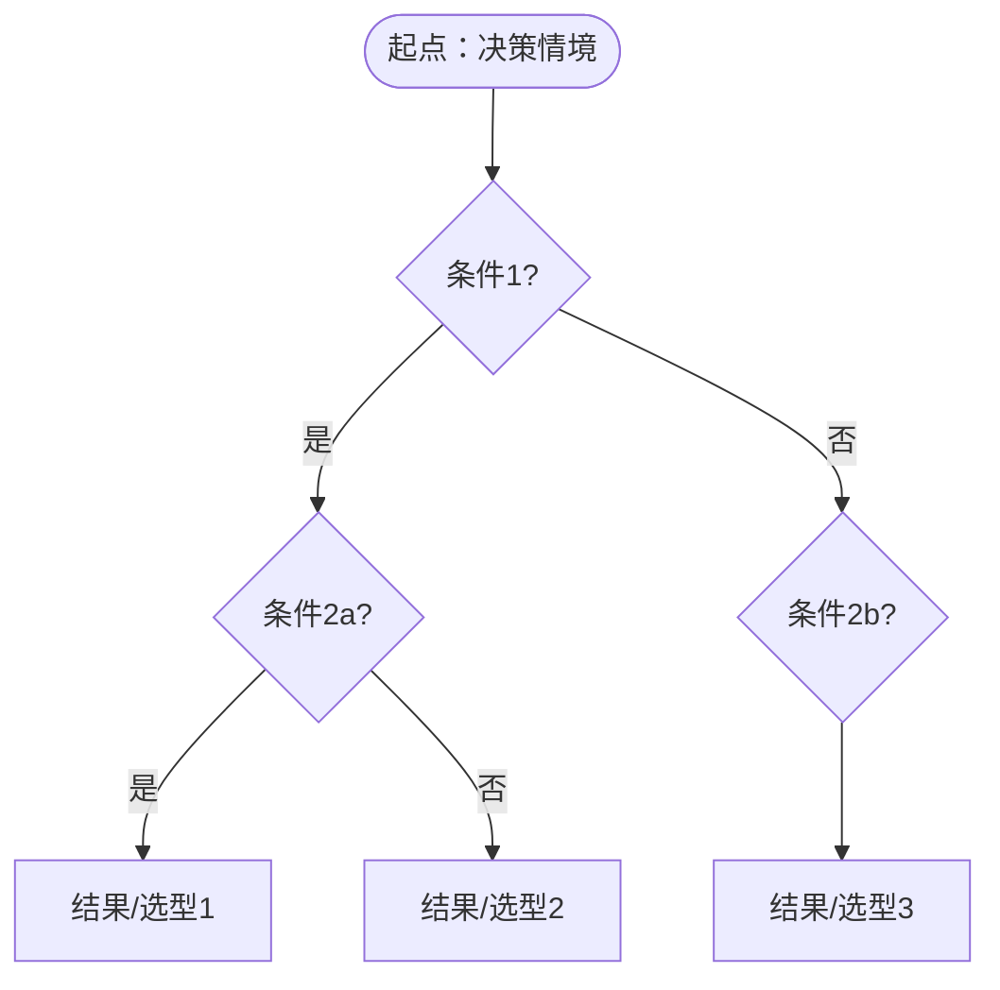
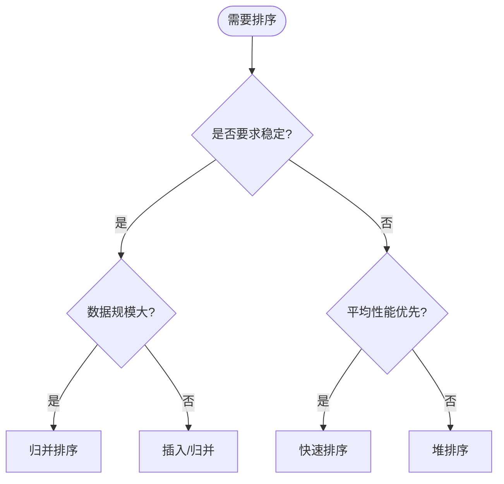
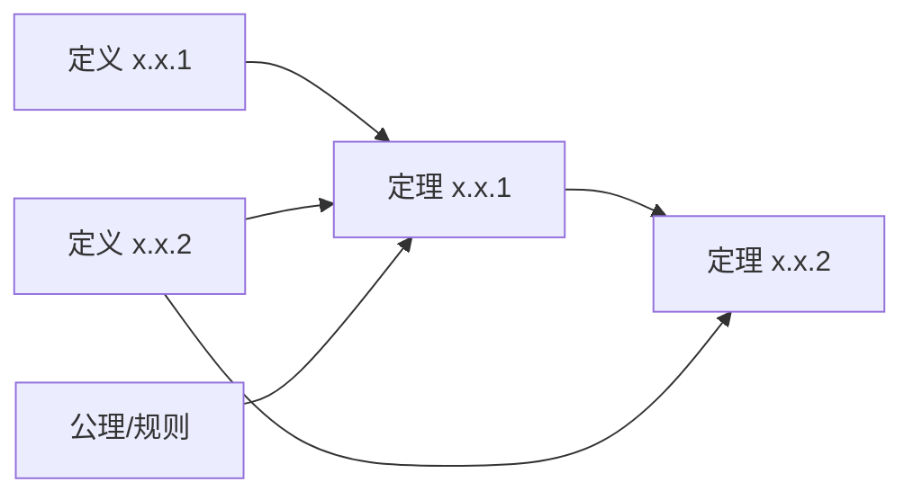
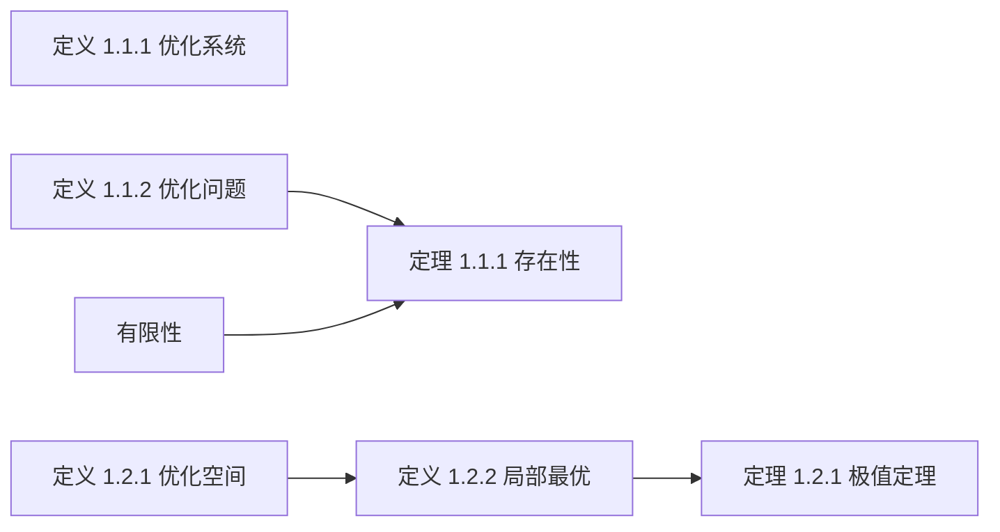
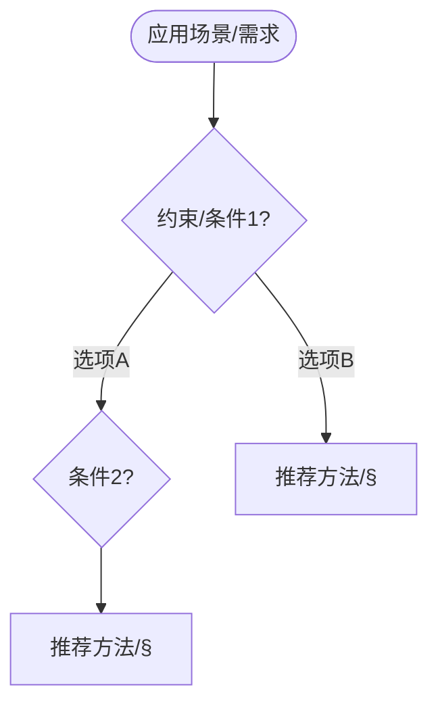
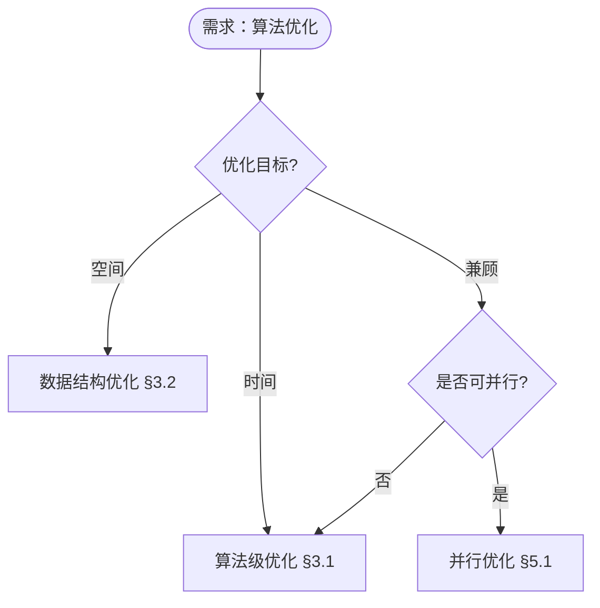

# 思维表征模板集

> **创建日期**: 2025-02-02
> **依据**: [内容补充与思维表征全面计划方案.md](内容补充与思维表征全面计划方案.md)
> **原则**: 五类表征与正文、代码并存；统一使用 **Mermaid** 以便在 Markdown 中渲染。若环境不支持某语法（如 `mindmap`），可用 `graph`/`flowchart` 等价表示。

---

## 一、思维导图 (Mind Map)

**用途**: 表现某一主题下概念的层次与分支（从中心概念到子概念、属性、应用）。
**放置**: 章首「本章概念结构」或节首「本节概念导图」。

### 模板 A：mindmap（若环境支持）



### 模板 B：graph TD 分层（通用替代）



### 示例：算法优化



---

## 二、多维矩阵概念对比 (Multi-Dimensional Concept Comparison Matrix)

**用途**: 在多维度上对比多个概念（算法、证明策略等），便于选择与辨析。
**放置**: 「基本概念」或「方法对比」小节；可与「应用决策树图」配合。

### 模板（Markdown 表格）

```markdown
| 概念/算法 | 维度1 | 维度2 | 维度3 | 维度4 | 备注 |
|-----------|-------|-------|-------|-------|------|
| 概念A     | …     | …     | …     | …     | …    |
| 概念B     | …     | …     | …     | …     | …    |
```

### 示例：排序算法对比

| 概念/算法 | 时间复杂度 | 空间复杂度 | 稳定性 | 适用场景 | 形式化证明难度 |
|-----------|------------|------------|--------|----------|----------------|
| 归并排序  | $\Theta(n\log n)$ | $\Theta(n)$ | 稳定 | 通用、外部排序 | 中（归纳） |
| 快速排序  | $O(n^2)$ 期望 $\Theta(n\log n)$ | $\Theta(\log n)$ | 不稳定 | 内排序、平均最快 | 中（不变式） |
| 堆排序    | $\Theta(n\log n)$ | $O(1)$ | 不稳定 | 优先队列、内排序 | 中（堆性质） |
| 插入排序  | $\Theta(n^2)$ | $O(1)$ | 稳定 | 小规模/近似有序 | 低（循环不变式） |

---

## 三、决策树图 (Decision Tree)

**用途**: 描述「在何种条件下选择何种算法/策略/结构」的分支过程。
**放置**: 「算法/策略选择」「应用场景」或「实现选型」小节。

### 模板（Mermaid flowchart）



### 示例：排序算法选择



---

## 四、公理定理推理证明决策树图 (Axiom–Theorem–Proof Decision Tree)

**用途**: 表现从公理/定义到定理的推理依赖与分支（先证什么、再证什么）。
**放置**: 「定理依赖结构」或「证明结构图」小节，通常在「形式证明」或章末。

### 模板（Mermaid graph）



### 示例：优化系统推理链



---

## 五、应用决策建模树图 (Application Decision Modeling Tree)

**用途**: 从应用场景/需求出发，经条件判断，到具体技术选型、证明策略或实现方式。
**放置**: 「应用指南」「选型建议」或「从需求到实现」小节。

### 模板（Mermaid flowchart）



### 示例：算法优化选型



---

## 六、单篇文档最低验收（表征维度）

| 类型 | 最低要求 |
|------|----------|
| 思维导图 | 至少 1 个本章/本节概念思维导图（Mermaid） |
| 多维矩阵 | 至少 1 张多维概念对比表（多概念 × 多维度） |
| 决策树 | 至少 1 个决策树图（算法/策略选择或应用选型） |
| 公理定理证明树 | 理论文档至少 1 个公理—定理—推理依赖图（Mermaid） |
| 应用决策建模树 | 应用/实现相关文档至少 1 个从场景到选型的决策树（Mermaid） |

---

## 七、与内容补充标准的配合

- 概念定义、属性、关系 → 可用**思维导图**与**概念依赖图**（关系小节中的 Mermaid）呈现。
- 论证与形式证明 → 可用**公理定理推理证明决策树图**呈现推理链。
- 应用与选型 → 用**多维矩阵**+**决策树图**+**应用决策建模树图**配合「解释与直观」「应用指南」小节。

详见 [内容补充标准-概念定义属性关系解释论证形式证明.md](内容补充标准-概念定义属性关系解释论证形式证明.md)。

---

**文档版本**: v1.0
**最后更新**: 2025-02-02
**维护**: 项目改进工作组
