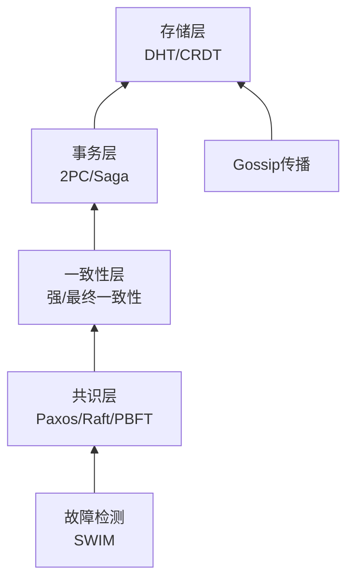
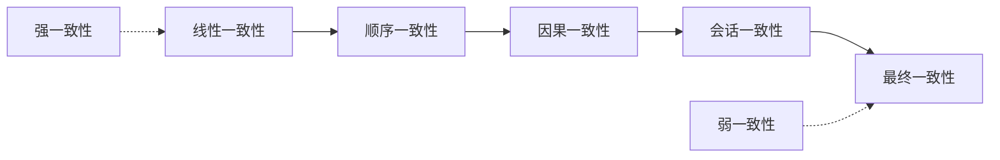
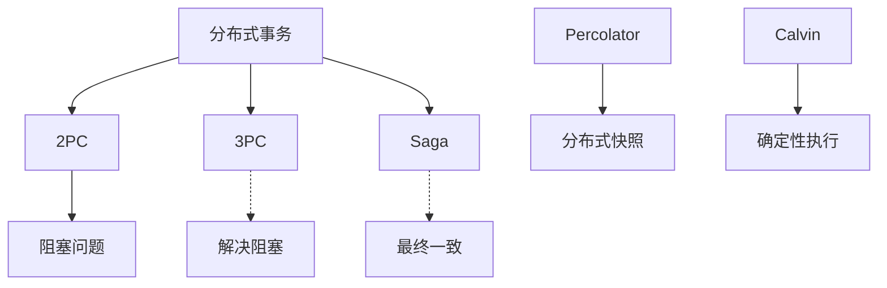

# 分布式系统概念图谱

> **版本**: 1.0
> **创建日期**: 2026-04-19
> **最后更新**: 2026-04-19

> 分布式系统理论与实践 - 详细概念定义
> 概念数量: 119个
> 最后更新: 2026-04-09

---

## 目录

- [分布式系统概念图谱](#分布式系统概念图谱)
  - [目录](#目录)
  - [一、一致性与共识](#一一致性与共识)
    - [CAP定理](#cap定理)
      - [1. 形式化定义](#1-形式化定义)
      - [2. 属性特征](#2-属性特征)
      - [3. 应用场景](#3-应用场景)
    - [共识算法](#共识算法)
      - [1. 形式化定义](#1-形式化定义-1)
      - [2. 属性特征](#2-属性特征-1)
    - [Paxos算法](#paxos算法)
      - [1. 形式化定义](#1-形式化定义-2)
      - [2. 属性特征](#2-属性特征-2)
      - [3. 应用场景](#3-应用场景-1)
    - [Raft算法](#raft算法)
      - [1. 形式化定义](#1-形式化定义-3)
      - [2. 属性特征](#2-属性特征-3)
      - [3. 应用场景](#3-应用场景-2)
    - [一致性模型](#一致性模型)
      - [1. 形式化定义](#1-形式化定义-4)
      - [2. 属性特征](#2-属性特征-4)
  - [二、分布式事务](#二分布式事务)
    - [分布式事务](#分布式事务)
      - [1. 形式化定义](#1-形式化定义-5)
      - [2. 属性特征](#2-属性特征-5)
    - [两阶段提交](#两阶段提交)
      - [1. 形式化定义](#1-形式化定义-6)
      - [2. 属性特征](#2-属性特征-6)
    - [Saga模式](#saga模式)
      - [1. 形式化定义](#1-形式化定义-7)
      - [2. 属性特征](#2-属性特征-7)
      - [3. 应用场景](#3-应用场景-3)
    - [Spanner协议](#spanner协议)
      - [1. 形式化定义](#1-形式化定义-8)
      - [2. 属性特征](#2-属性特征-8)
  - [三、CRDT与无冲突复制](#三crdt与无冲突复制)
    - [CRDT](#crdt)
      - [1. 形式化定义](#1-形式化定义-9)
      - [2. 属性特征](#2-属性特征-9)
    - [常用CRDT类型](#常用crdt类型)
      - [1. 计数器](#1-计数器)
      - [2. 集合](#2-集合)
      - [3. 寄存器](#3-寄存器)
  - [四、Gossip协议与传播](#四gossip协议与传播)
    - [Gossip协议](#gossip协议)
      - [1. 形式化定义](#1-形式化定义-10)
      - [2. 属性特征](#2-属性特征-10)
    - [SWIM协议](#swim协议)
      - [1. 形式化定义](#1-形式化定义-11)
      - [2. 属性特征](#2-属性特征-11)
  - [五、拜占庭容错](#五拜占庭容错)
    - [BFT](#bft)
      - [1. 形式化定义](#1-形式化定义-12)
      - [2. 属性特征](#2-属性特征-12)
    - [PBFT](#pbft)
      - [1. 形式化定义](#1-形式化定义-13)
      - [2. 属性特征](#2-属性特征-13)
    - [HotStuff](#hotstuff)
      - [1. 形式化定义](#1-形式化定义-14)
      - [2. 属性特征](#2-属性特征-14)
      - [3. 应用场景](#3-应用场景-4)
  - [六、分布式存储与协调](#六分布式存储与协调)
    - [分布式哈希表](#分布式哈希表)
      - [1. 形式化定义](#1-形式化定义-15)
      - [2. 属性特征](#2-属性特征-15)
    - [ZooKeeper](#zookeeper)
      - [1. 形式化定义](#1-形式化定义-16)
      - [2. 属性特征](#2-属性特征-16)
  - [七、概念关系图谱](#七概念关系图谱)
    - [分布式系统层次](#分布式系统层次)
    - [一致性强度](#一致性强度)
    - [事务协议关系](#事务协议关系)
  - [八、学习路径](#八学习路径)
    - [P0 核心概念（5个）](#p0-核心概念5个)
    - [P1 重要概念（35个）](#p1-重要概念35个)
    - [P2 扩展概念（80个）](#p2-扩展概念80个)
  - [附录](#附录)
    - [参考资料](#参考资料)
  - [参考文献](#参考文献)
  - [知识导航](#知识导航)

---

## 一、一致性与共识

### CAP定理

**优先级**: P0
**编码**: CONCEPT-DST-001

#### 1. 形式化定义

**定理**: 分布式数据存储系统最多同时满足以下三项中的两项：

- **一致性 (Consistency)**: 所有节点看到相同的数据
- **可用性 (Availability)**: 每个请求都能收到非错误响应
- **分区容错性 (Partition Tolerance)**: 系统在网络分区时仍能运行

**形式化**: 在异步网络模型中，满足以下两个条件之一的系统必违反另一个：

1. 所有节点对写操作达成一致的值
2. 每个节点在有限时间内响应

#### 2. 属性特征

**实际含义**: 网络分区不可避免（P必须满足），因此在C和A之间权衡

**系统设计**:

- CP系统: ZooKeeper、etcd
- AP系统: Cassandra、Dynamo

#### 3. 应用场景

- 系统架构设计
- 数据库选型
- 一致性级别选择

---

### 共识算法

**优先级**: P0
**编码**: CONCEPT-DST-003

#### 1. 形式化定义

**共识问题**: $n$ 个进程就某个值达成一致

**安全属性**:

- **一致性**: 所有正确进程决定相同的值
- **有效性**: 决定的值必须由某个进程提出

**活性属性**:

- **终止性**: 所有正确进程最终做出决定

#### 2. 属性特征

**FLP不可能结果**: 在异步系统中，即使只有一个故障进程，也不存在确定性的共识算法

**实际解决**: 使用随机化、故障检测器或部分同步假设

---

### Paxos算法

**优先级**: P1
**编码**: CONCEPT-DST-008

#### 1. 形式化定义

**角色**:

- Proposer: 提出提案
- Acceptor: 接受或拒绝提案
- Learner: 学习已决定的值

**两个阶段**:

1. **准备阶段**: Proposer获取承诺
2. **接受阶段**: Proposer请求接受提案

**提案格式**: $(n, v)$，$n$ 为提案号，$v$ 为提议值

#### 2. 属性特征

**安全性**: 即使有多个Proposer并发，也不会选择冲突的值

**活性**: 需要选举唯一的Leader才能保证进展

#### 3. 应用场景

- Google Chubby
- ZooKeeper (ZAB协议)
- 分布式配置管理

---

### Raft算法

**优先级**: P1
**编码**: CONCEPT-DST-009

#### 1. 形式化定义

**角色**:

- Leader: 处理所有客户端请求
- Follower: 被动复制日志
- Candidate: Leader选举期间的临时状态

**核心机制**:

- **Leader选举**: 基于超时和投票
- **日志复制**: Leader向Follower发送AppendEntries
- **安全性**: 确保所有节点以相同顺序提交相同条目

#### 2. 属性特征

**Leader选举**:

- 超时随机化避免活锁
- 获得多数票成为Leader

**日志匹配**: 若两个日志条目有相同索引和任期，则之前所有条目相同

#### 3. 应用场景

- etcd
- Consul
- TiKV

---

### 一致性模型

**优先级**: P1
**编码**: CONCEPT-DST-002

#### 1. 形式化定义

**线性一致性**:
$$\forall \text{操作} o_1, o_2: \text{若} o_1 \text{完成在} o_2 \text{开始前，则} o_1 \prec o_2$$

**顺序一致性**: 所有进程看到相同的操作顺序，但不一定与物理时间一致

**因果一致性**: 因果相关的操作全局有序，并发操作可以不同序

**最终一致性**: 若无新更新，最终所有副本收敛到相同值

#### 2. 属性特征

**强度排序**:
线性一致性 > 顺序一致性 > 因果一致性 > 最终一致性

---

## 二、分布式事务

### 分布式事务

**优先级**: P0
**编码**: CONCEPT-DST-026

#### 1. 形式化定义

**定义**: 涉及多个节点的事务，满足ACID属性

**协调者-参与者模型**:

- 协调者: 决定事务提交或中止
- 参与者: 执行本地事务操作

#### 2. 属性特征

**挑战**:

- 原子性: 所有节点都提交或都中止
- 隔离性: 并发事务互不干扰
- 性能: 网络通信开销

---

### 两阶段提交

**优先级**: P0
**编码**: CONCEPT-DST-027

#### 1. 形式化定义

**阶段1 - 准备**:

1. 协调者向所有参与者发送Prepare请求
2. 参与者执行本地事务，写redo/undo日志
3. 参与者回复Yes（可提交）或No（需中止）

**阶段2 - 提交/中止**:

1. 若所有参与者回复Yes，协调者发送Commit
2. 若有任何No，发送Abort
3. 参与者执行提交或回滚

#### 2. 属性特征

**阻塞问题**: 若协调者故障，参与者可能无限等待

**性能**: 2次网络往返延迟

---

### Saga模式

**优先级**: P1
**编码**: CONCEPT-DST-029

#### 1. 形式化定义

**定义**: 将长事务拆分为一系列本地事务，每个本地事务有对应的补偿操作

**执行流程**:
$$T_1 \rightarrow T_2 \rightarrow ... \rightarrow T_n$$

若 $T_k$ 失败：
$$C_{k-1} \rightarrow C_{k-2} \rightarrow ... \rightarrow C_1$$

#### 2. 属性特征

**补偿**: 语义上的"撤销"，不一定是物理回滚

**隔离性**: Saga不提供ACID隔离，需要业务层处理

#### 3. 应用场景

- 微服务架构
- 长事务业务（旅游预订、金融交易）
- 事件驱动架构

---

### Spanner协议

**优先级**: P2
**编码**: CONCEPT-DST-035

#### 1. 形式化定义

**TrueTime API**:
$$TTinterval = [earliest, latest]$$

**外部一致性**:
$$\text{若} T_1 \text{提交在} T_2 \text{开始前，则} commit(T_1) < commit(T_2)$$

**快照读取**: 指定时间戳读取一致快照

#### 2. 属性特征

**全球分布**: 数据跨数据中心复制

**时钟同步**: 依赖原子钟和GPS实现时间同步

---

## 三、CRDT与无冲突复制

### CRDT

**优先级**: P1
**编码**: CONCEPT-DST-046

#### 1. 形式化定义

**定义**: 无冲突复制数据类型，满足以下性质：

**强最终一致性**:

- 因果交付: 若操作 $o_1$ 发生在 $o_2$ 之前，则所有节点先看到 $o_1$
- 收敛性: 所有收到相同操作集的节点处于相同状态

**类型**:

- **状态型 (CvRDT)**: 基于状态合并，要求合并操作满足交换律、结合律、幂等律
- **操作型 (CmRDT)**: 基于操作传播，要求操作满足交换律

#### 2. 属性特征

**优势**:

- 无需协调即可更新
- 高可用性和低延迟
- 天然支持离线操作

---

### 常用CRDT类型

**优先级**: P2
**编码**: CONCEPT-DST-051至CONCEPT-DST-060

#### 1. 计数器

**G-Counter** (只增):
$$\text{merge}(A, B)[i] = \max(A[i], B[i])$$

**PN-Counter** (可增可减):

- 两个G-Counter：一个记增量，一个记减量

#### 2. 集合

**G-Set**: 只添加，不删除

**2P-Set**: 添加集合 + 删除集合（墓碑）

**OR-Set**: 带唯一标签的添加删除，解决并发冲突

#### 3. 寄存器

**LWW-Register**: 最后写入获胜（基于时间戳）

**MV-Register**: 保留并发写入的多个值

---

## 四、Gossip协议与传播

### Gossip协议

**优先级**: P1
**编码**: CONCEPT-DST-066

#### 1. 形式化定义

**定义**: 基于流行病传播模型的信息分发协议

**反熵 (Anti-Entropy)**:

- 两个节点交换数据差异
- 使用Merkle树高效比较
- 收敛到一致状态

**谣言传播 (Rumor Mongering)**:

- 节点随机选择邻居传播新信息
- 信息像病毒一样传播
- 最终感染所有节点

#### 2. 属性特征

**传播效率**:

- 轮数: $O(\log n)$
- 消息数: $O(n \log n)$

**容错性**: 即使部分节点故障，信息仍能传播

---

### SWIM协议

**优先级**: P2
**编码**: CONCEPT-DST-070

#### 1. 形式化定义

**可扩展弱一致性感染式成员协议**

**故障检测**:

1. 节点A随机选择节点B发送ping
2. 若B未回复，A通过其他节点间接探测
3. 根据响应判断B是否存活

**成员传播**: 通过Gossip传播成员变化

#### 2. 属性特征

**优势**:

- 常量级网络负载
- 故障检测时间可预测
- 无中心化组件

---

## 五、拜占庭容错

### BFT

**优先级**: P1
**编码**: CONCEPT-DST-082

#### 1. 形式化定义

**拜占庭故障**: 节点可能任意行为，包括发送矛盾消息

**容错阈值**: 系统有 $n$ 个节点，最多容忍 $f$ 个拜占庭节点
$$n \geq 3f + 1$$

**安全性与活性**:

- 正确节点达成一致
- 正确节点最终做出决定

#### 2. 属性特征

**同步假设**: BFT协议通常需要同步或部分同步网络

**签名认证**: 使用数字签名防止消息伪造

---

### PBFT

**优先级**: P1
**编码**: CONCEPT-DST-083

#### 1. 形式化定义

**实用拜占庭容错**: 首个实用的BFT算法

**三阶段协议**:

1. **预准备**: 主节点广播请求
2. **准备**: 节点验证并广播准备消息
3. **提交**: 收到足够的准备消息后广播提交

**视图变更**: 主节点故障时选举新主节点

#### 2. 属性特征

**复杂度**: $O(n^2)$ 消息复杂度

**优化**: 批量处理、投机执行

---

### HotStuff

**优先级**: P2
**编码**: CONCEPT-DST-087

#### 1. 形式化定义

**线性BFT**: 消息复杂度 $O(n)$

**三阶段**: 准备、预提交、提交

**乐观响应**: 正常路径只需一轮通信

#### 2. 属性特征

**链式结构**: 类似区块链的链式提交

**视图同步**: 高效的视图变更

#### 3. 应用场景

- 区块链共识（Diem/Libra）
- 企业级BFT系统

---

## 六、分布式存储与协调

### 分布式哈希表

**优先级**: P1
**编码**: CONCEPT-DST-102

#### 1. 形式化定义

**接口**:

- $\text{put}(key, value)$: 存储键值对
- $\text{get}(key) \rightarrow value$: 检索值
- $\text{remove}(key)$: 删除

**Chord协议**:

- 标识符空间: $[0, 2^m - 1]$ 环
- 后继指针: $successor(n)$ 是环上顺时针第一个节点
- 路由表: finger table，第 $i$ 项指向 $n + 2^{i-1}$
- 查找复杂度: $O(\log n)$ 跳

#### 2. 属性特征

**负载均衡**: 虚拟节点技术

**容错**: 维护后继列表

---

### ZooKeeper

**优先级**: P1
**编码**: CONCEPT-DST-105

#### 1. 形式化定义

**ZAB协议**: ZooKeeper原子广播

**模式**:

- 恢复模式: Leader选举和同步
- 广播模式: Leader向Follower广播事务

**数据模型**: 层次化的ZNode树

#### 2. 属性特征

**顺序一致性**: 来自同一客户端的操作按发送顺序执行

**原子性**: 更新要么成功要么失败

**应用场景**: 配置管理、命名服务、分布式锁

---

## 七、概念关系图谱

### 分布式系统层次

### 一致性强度

### 事务协议关系

---

## 八、学习路径

### P0 核心概念（5个）

1. **CAP定理** - 分布式系统基础权衡
2. **一致性模型** - 数据一致性级别
3. **共识算法** - 分布式达成一致
4. **分布式事务** - 跨节点事务处理
5. **两阶段提交** - 分布式原子提交

### P1 重要概念（35个）

**一致性**: 线性一致性、顺序一致性、因果一致性、最终一致性

**共识**: Paxos、Raft、复制状态机、Leader选举

**事务**: Saga、TCC、补偿事务、分布式快照隔离

**复制**: CRDT、向量时钟、版本向量

**传播**: Gossip、反熵、SWIM

**BFT**: PBFT、拜占庭将军问题、容错阈值

### P2 扩展概念（80个）

深入学习：

- 高级共识变体（EPaxos、Flexible Paxos）
- 区块链共识（HotStuff、Tendermint）
- 高级CRDT（序列CRDT、文档协作）
- 分布式存储细节（一致性哈希、虚拟节点）
- 现代分布式数据库（Spanner、CockroachDB）

---

## 附录

### 参考资料

1. Lamport, L. "Paxos Made Simple"
2. Ongaro, D., and Ousterhout, J. "In Search of an Understandable Consensus Algorithm" (Raft)
3. Shapiro, M., et al. "Conflict-Free Replicated Data Types"
4. Kleppmann, M. "Designing Data-Intensive Applications"
5. Van Steen, M., and Tanenbaum, A. "Distributed Systems"

---

*本概念图谱由FormalAlgorithm项目维护*

---

## 参考文献

- 待补充

---

## 知识导航

- [返回目录](README.md)
