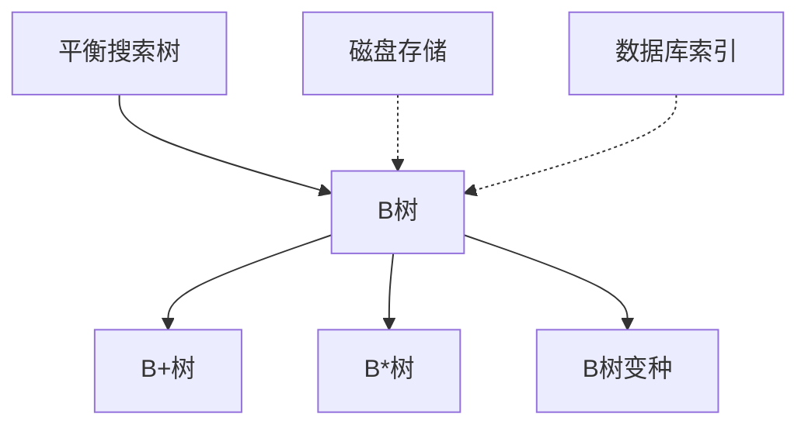
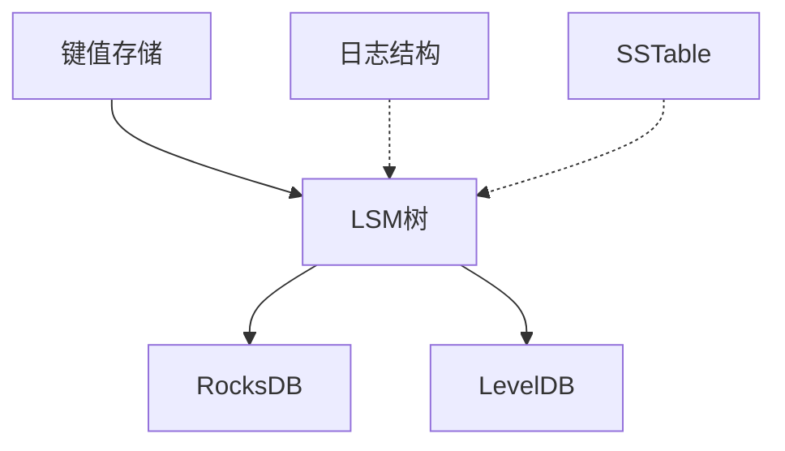
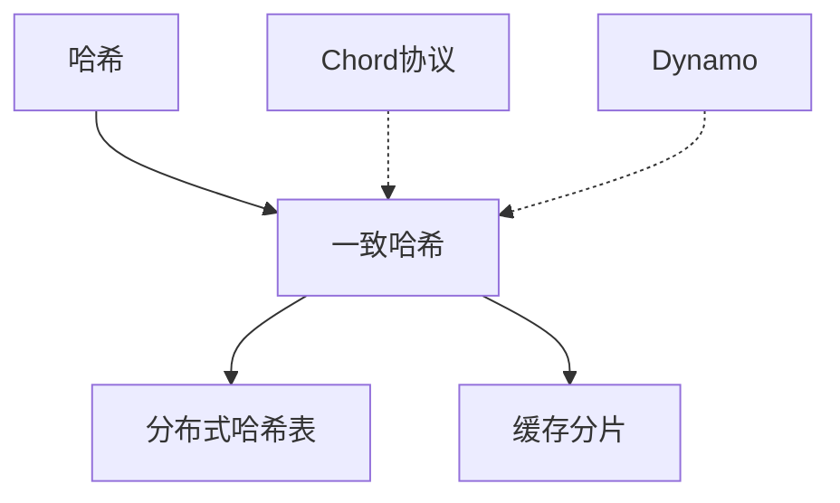
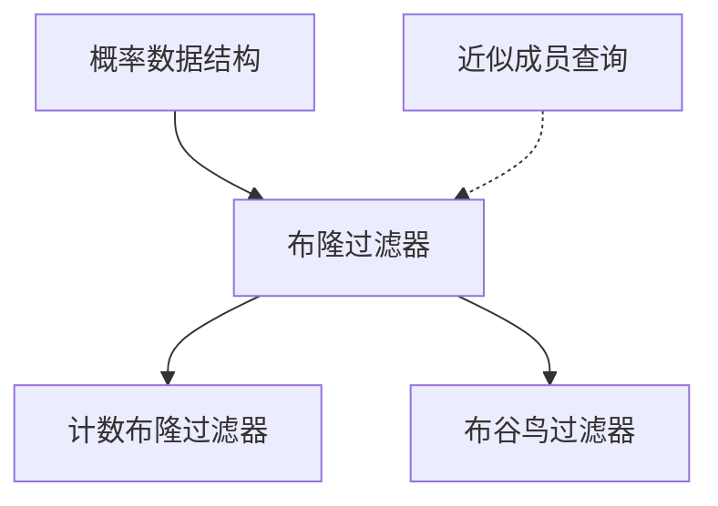
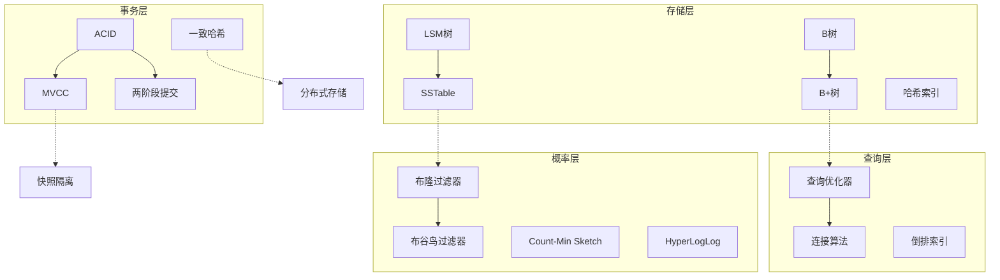
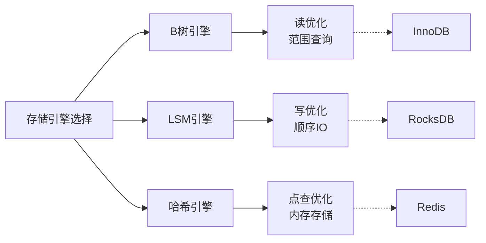

# 数据库与存储概念图谱

> **版本**: 1.0
> **创建日期**: 2026-04-19
> **最后更新**: 2026-04-19

> 数据库系统与存储技术 - 详细概念定义
> 概念数量: 125个
> 最后更新: 2026-04-09

---

## 目录

1. [存储结构与索引](#一存储结构与索引)
2. [事务与并发](#二事务与并发)
3. [查询处理与优化](#三查询处理与优化)
4. [概率数据结构](#四概率数据结构)
5. [分布式存储](#五分布式存储)
6. [概念关系图谱](#六概念关系图谱)
7. [学习路径](#七学习路径)

---

## 一、存储结构与索引

### B树

**优先级**: P0
**编码**: CONCEPT-DBS-001

#### 1. 形式化定义

**定义**: B树是一种自平衡的多路搜索树，满足以下性质：

- 每个节点包含 $n$ 个关键字，满足 $t-1 \leq n \leq 2t-1$（$t$ 为最小度数）
- 所有叶子节点位于同一层
- 节点内关键字有序排列
- 子树关键字范围由父节点关键字划分

**阶为 $m$ 的B树性质**:

- 根节点至少有2个子节点（除非它是叶子）
- 每个非根内部节点至少有 $\lceil m/2 \rceil$ 个子节点
- 每个节点至多有 $m$ 个子节点

#### 2. 属性特征

**必要属性**:

- 平衡性: 所有叶子节点深度相同
- 有序性: 中序遍历得到有序序列
- 多路分支: 每个节点多个子节点，降低树高

**充分属性**:

- 分裂/合并操作保持平衡
- 磁盘I/O优化（节点大小匹配磁盘页）

#### 3. 关系网络

**父概念**: 平衡搜索树、多路树

**子概念**: B+树、B*树、分形树

**相关概念**: 数据库索引、外部存储、页缓存

#### 4. 直观解释

**B树即"宽矮"的树**: 相比二叉搜索树，B树每个节点有多个子节点，树高更低，减少磁盘访问。

**B树即"分层目录"**: 类似图书馆的目录系统，每一层都有多个分支，快速定位到目标。

#### 5. 形式证明

**定理**: B树的高度 $h \leq \log_t \frac{n+1}{2}$

**证明**: 最小度数 $t$ 的B树，根至少有1个关键字，其他节点至少 $t-1$ 个关键字。

**定理**: B树插入、删除、查找的时间复杂度均为 $O(\log_t n)$

#### 6. 应用场景

- 文件系统: NTFS、HFS+使用B树
- 数据库索引: MySQL InnoDB使用B+树
- 内存数据库: 需要有序访问的场景

---

### LSM树

**优先级**: P0
**编码**: CONCEPT-DBS-002

#### 1. 形式化定义

**定义**: LSM树（Log-Structured Merge Tree）是一种分层、有序的键值存储结构：

$$LSM = (C_0, C_1, C_2, ..., C_k)$$

其中：

- $C_0$: 内存中的有序结构（MemTable）
- $C_1, \cdots, C_k$: 磁盘上的不可变文件（SSTable），大小呈指数增长

#### 2. 属性特征

**核心特性**:

- **写优化**: 顺序写入磁盘，利用写缓冲区
- **分层合并**: 定期将上层数据合并到下层
- **不可变文件**: SSTable一旦写入不修改

**合并策略**:

- Leveling: 每层只有一个文件，合并频繁
- Tiering: 每层多个文件，合并延迟

#### 3. 关系网络

**对偶概念**: B树（读优化 vs 写优化）

#### 4. 直观解释

**LSM树即"批量处理"**: 先收集一批数据，再统一整理归档。

**LSM树即"垃圾回收"**: 定期整理碎片，合并过期数据。

#### 5. 形式证明

**定理**: LSM树写放大为 $O(T \cdot L)$，其中 $T$ 为每层文件数，$L$ 为层数

**定理**: 读放大为 $O(L)$，需要逐层查找

#### 6. 应用场景

- RocksDB、LevelDB、Cassandra
- 写密集型工作负载
- 时序数据库

---

### 一致哈希

**优先级**: P0
**编码**: CONCEPT-DBS-027

#### 1. 形式化定义

**定义**: 一致哈希将数据键和节点映射到同一哈希环：

$$h: \text{Key} \cup \text{Node} \rightarrow [0, 2^{32}-1]$$

**数据分配规则**: 键 $k$ 存储在哈希环上顺时针第一个节点：
$$\text{node}(k) = \min\{n \in N : h(n) \geq h(k)\}$$

**虚拟节点**: 每个物理节点映射到多个虚拟节点，改善负载均衡。

#### 2. 属性特征

**必要属性**:

- **单调性**: 添加节点时，仅重新分配部分数据
- **平衡性**: 数据均匀分布（使用虚拟节点）
- **低迁移成本**: 节点增减时数据迁移量 $O(1/n)$

#### 3. 关系网络

#### 4. 直观解释

**一致哈希即"环形停车场"**: 车辆停在最接近的空位，新增车位只影响附近车辆。

#### 5. 应用场景

- 分布式缓存: Memcached、Redis Cluster
- 负载均衡
- Dynamo、Cassandra的分区

---

### 布隆过滤器

**优先级**: P1
**编码**: CONCEPT-DBS-077

#### 1. 形式化定义

**定义**: 布隆过滤器是由 $m$ 位数组和 $k$ 个哈希函数组成的概率数据结构：

$$BF = (B[0..m-1], h_1, h_2, ..., h_k)$$

**插入**: 对于元素 $x$，设置 $B[h_i(x)] = 1$ 对所有 $i \in [1,k]$

**查询**: 若所有 $B[h_i(x)] = 1$ 则返回"可能在集合中"，否则"肯定不在"

**假阳性率**:
$$\epsilon \approx (1 - e^{-kn/m})^k$$

#### 2. 属性特征

**特性**:

- 空间高效: 每个元素约10位即可达到1%假阳性率
- 无假阴性: 从不错过存在的元素
- 不可删除: 标准布隆过滤器不支持删除

**最优哈希函数数**: $k = \frac{m}{n} \ln 2$

#### 3. 关系网络

#### 4. 应用场景

- 数据库: LevelDB、Cassandra的SSTable过滤
- 网络: Squid缓存、比特币SPV节点
- 拼写检查器

---

### 倒排索引

**优先级**: P1
**编码**: CONCEPT-DBS-004

#### 1. 形式化定义

**定义**: 倒排索引是从词项到文档列表的映射：

$$I: \text{Term} \rightarrow 2^{\text{DocID} \times \text{Freq}}$$

**结构**:

- 词项词典: 所有不同词项的有序列表
- 倒排列表: 每个词项对应的文档ID列表（可能包含位置、频率信息）

#### 2. 属性特征

**查询处理**:

- 单词查询: 直接查找倒排列表
- 布尔查询: 列表的交/并/差操作
- 短语查询: 位置信息验证

**压缩**: 使用变长编码（如Gamma编码、Delta编码）压缩文档ID

#### 3. 应用场景

- 搜索引擎: Elasticsearch、Lucene
- 文档数据库
- 推荐系统

---

## 二、事务与并发

### ACID

**优先级**: P0
**编码**: CONCEPT-DBS-026

#### 1. 形式化定义

**ACID属性**:

**原子性 (Atomicity)**:
$$T \text{ 执行结果}: \text{全部完成} \lor \text{全部回滚}$$

**一致性 (Consistency)**:
$$\text{若DB在事务前一致，则事务后仍一致}$$

**隔离性 (Isolation)**:
$$\text{并发执行等价于某个串行执行}$$

**持久性 (Durability)**:
$$\text{已提交事务的修改永久保存}$$

#### 2. 属性特征

**原子性实现**: 写前日志（WAL）、影子分页

**隔离性级别**: 读未提交、读已提交、可重复读、串行化

#### 3. 应用场景

- 关系数据库核心保证
- 金融交易系统
- 分布式事务

---

### MVCC

**优先级**: P1
**编码**: CONCEPT-DBS-030

#### 1. 形式化定义

**定义**: 多版本并发控制通过保存数据的多个版本来实现非阻塞读：

$$\text{Version} = (\text{Value}, \text{CreateTS}, \text{ExpireTS}, \text{TXID})$$

**可见性规则**: 事务 $T$ 在时间戳 $TS$ 可见的版本满足：
$$\text{CreateTS} \leq TS < \text{ExpireTS}$$

#### 2. 属性特征

**实现方式**:

- 乐观: 事务提交时检查冲突
- 悲观: 获取锁保护版本

**垃圾回收**: 定期清理不可见的旧版本

#### 3. 应用场景

- PostgreSQL、MySQL InnoDB
- 高并发读场景
- 快照隔离实现

---

## 三、查询处理与优化

### 查询优化器

**优先级**: P0
**编码**: CONCEPT-DBS-051

#### 1. 形式化定义

**定义**: 查询优化器将逻辑查询计划转换为物理执行计划：

$$\text{Optimizer}: \text{LogicalPlan} \rightarrow \text{PhysicalPlan}$$

**目标**: 最小化执行代价（通常是I/O + CPU + 内存）

$$\text{Plan}^* = \arg\min_{p \in \text{Plans}} \text{Cost}(p)$$

#### 2. 属性特征

**优化技术**:

- 基于代价的优化（CBO）
- 基于规则的优化（RBO）
- 启发式优化

**统计信息**: 表大小、直方图、索引选择性

#### 3. 应用场景

- 关系数据库核心组件
- SQL到执行计划的转换
- 自适应查询处理

---

### 连接算法

**优先级**: P1
**编码**: CONCEPT-DBS-057

#### 1. 形式化定义

**嵌套循环连接**:
$$\text{Cost} = |R| + \frac{|R| \cdot |S|}{M}$$

**哈希连接**:

- 构建阶段: 对小表建立哈希表
- 探测阶段: 扫描大表，探测哈希表
- 代价: $O(|R| + |S|)$

**归并连接**:

- 要求输入有序
- 代价: $O(|R| \log |R| + |S| \log |S|)$（包含排序）

#### 2. 应用场景

- 根据表大小和索引选择连接算法
- 哈希连接适合大表，索引嵌套循环适合小表

---

## 四、概率数据结构

### Count-Min Sketch

**优先级**: P1
**编码**: CONCEPT-DBS-079

#### 1. 形式化定义

**定义**: Count-Min Sketch是一个 $w \times d$ 的计数器数组：

$$CM[1..d][1..w]$$

**更新** ($x$ 增加 $c$):
$$CM[i][h_i(x)] \mathrel{+}= c, \quad \forall i \in [1,d]$$

**估计**:
$$\hat{f}(x) = \min_{i} CM[i][h_i(x)]$$

**误差界**: $\hat{f}(x) \leq f(x) + \epsilon \|f\|_1$，概率 $1-\delta$

#### 2. 属性特征

- 空间: $O(\frac{1}{\epsilon} \log \frac{1}{\delta})$
- 只高估，不低估
- 支持点查询和范围查询

#### 3. 应用场景

- 流量统计
- 频繁项检测
- 数据库近似查询

---

### HyperLogLog

**优先级**: P1
**编码**: CONCEPT-DBS-080

#### 1. 形式化定义

**定义**: 使用随机平均来估计基数：

$$\text{观察}: \text{最长前导零} \approx \log_2(\text{不同值数量})$$

**估计公式**:
$$E = \alpha_m \cdot m^2 \cdot \left(\sum_{j=1}^{m} 2^{-M[j]}\right)^{-1}$$

**标准误差**: $1.04/\sqrt{m}$

#### 2. 属性特征

- 空间: $O(\log \log N)$，仅几KB即可估计十亿级基数
- 可合并: 支持分布式计算

#### 3. 应用场景

- 网站UV统计
- 数据库Distinct近似
- Redis HyperLogLog

---

## 五、分布式存储

### 分布式哈希表

**优先级**: P1
**编码**: CONCEPT-DST-102

#### 1. 形式化定义

**定义**: DHT是一个分布式系统，提供以下接口：

- $\text{put}(key, value)$: 存储键值对
- $\text{get}(key) \rightarrow value$: 检索值
- $\text{remove}(key)$: 删除

**路由**: $O(\log n)$ 跳查找，$n$ 为节点数

#### 2. 属性特征

**Chord协议**:

- 每个节点维护 $O(\log n)$ 个路由表项
- 第 $i$ 个表项指向 $n + 2^i$ 的 successor

**Kademlia协议**:

- XOR度量距离
- $k$-桶路由表

#### 3. 应用场景

- BitTorrent DHT
- IPFS
- Cassandra

---

### 法定人数

**优先级**: P2
**编码**: CONCEPT-DBS-121

#### 1. 形式化定义

**读写法定人数**:

- 读法定人数: $R$
- 写法定人数: $W$
- 副本数: $N$

**一致性保证**:
$$R + W > N \Rightarrow \text{强一致性}$$
$$R + W \leq N \Rightarrow \text{最终一致性}$$

#### 2. 属性特征

**读写调整**:

- 写多读少: $W=1, R=N$
- 读多写少: $W=N, R=1$
- 平衡: $W=R=\lceil N/2 \rceil + 1$

#### 3. 应用场景

- Amazon Dynamo
- Cassandra可调一致性
- 分布式存储系统

---

## 六、概念关系图谱

### 全局关系图

### 存储引擎对比

---

## 七、学习路径

### P0 核心概念（5个）

1. **B树** - 数据库索引基础
2. **LSM树** - 写优化存储
3. **一致哈希** - 分布式数据分布
4. **ACID** - 事务基础
5. **查询优化器** - 查询执行基础

### P1 重要概念（35个）

**存储方向**: B+树、倒排索引、哈希索引、存储引擎、页缓存

**事务方向**: MVCC、快照隔离、两阶段提交、三阶段提交、并发控制

**查询方向**: 查询优化、连接算法、代价模型、基数估计

**概率方向**: 布隆过滤器、Count-Min Sketch、HyperLogLog、布谷鸟过滤器

**分布式方向**: 分布式哈希表、复制、法定人数、一致性模型

### P2 扩展概念（80个）

深入研究：

- 高级索引结构（R树、GiST、ART）
- 分布式事务协议（Percolator、Calvin）
- 概率数据结构变体
- 存储引擎实现细节

---

## 附录

### 参考资料

1. Garcia-Molina, H., et al. "Database Systems: The Complete Book"
2. O'Neil, P., et al. "The Log-Structured Merge-Tree"
3. Karger, D., et al. "Consistent Hashing and Random Trees"
4. Bloom, B. "Space/Time Trade-offs in Hash Coding"

---

*本概念图谱由FormalAlgorithm项目维护*

---

## 参考文献

- 待补充

---

## 知识导航

- [返回目录](README.md)
