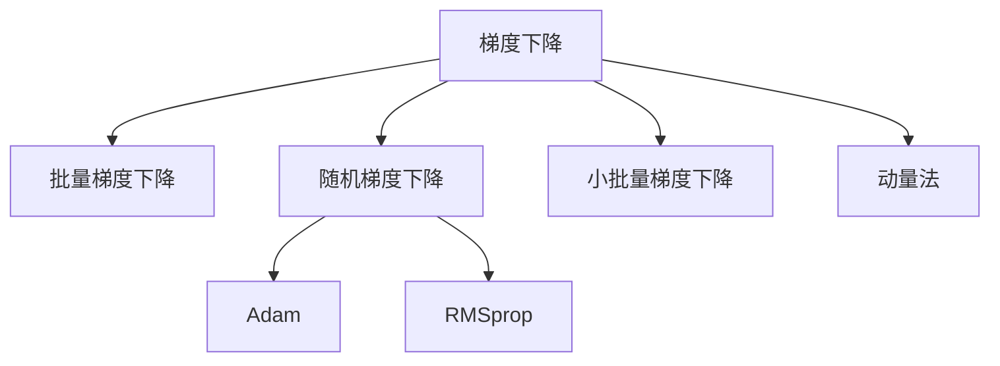
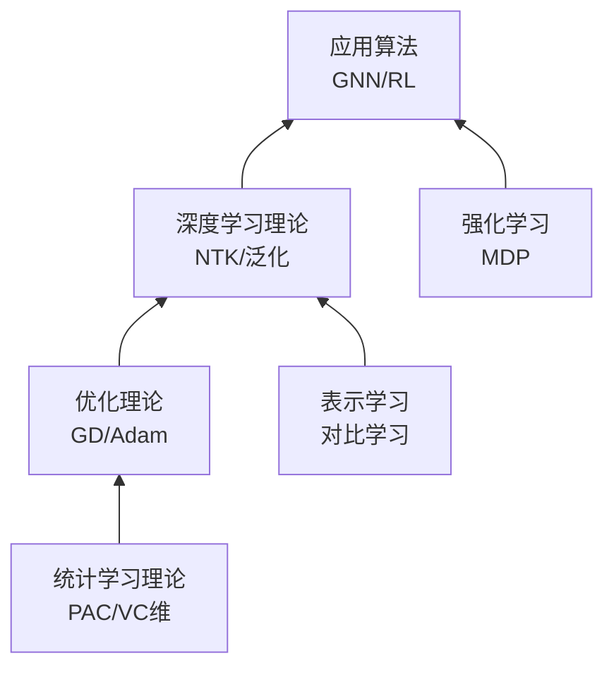
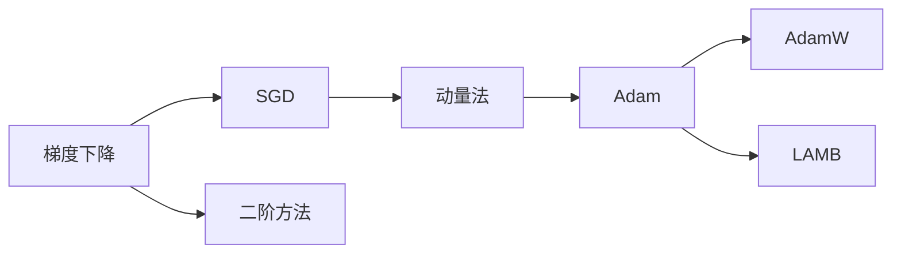
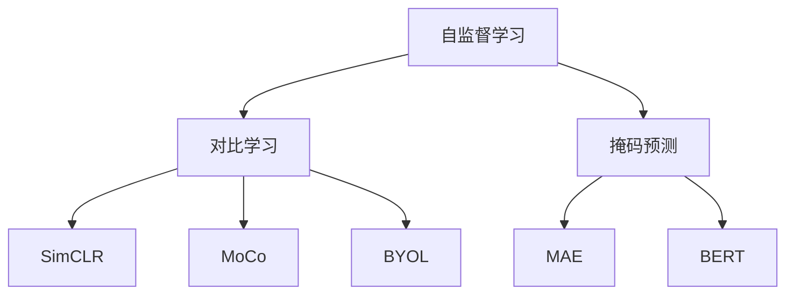

# 机器学习理论概念图谱

> **版本**: 1.0
> **创建日期**: 2026-04-19
> **最后更新**: 2026-04-19

> 机器学习理论与优化 - 详细概念定义
> 概念数量: 109个
> 最后更新: 2026-04-09

---

## 目录

- [机器学习理论概念图谱](#机器学习理论概念图谱)
  - [目录](#目录)
  - [一、优化理论](#一优化理论)
    - [梯度下降](#梯度下降)
      - [1. 形式化定义](#1-形式化定义)
      - [2. 属性特征](#2-属性特征)
      - [3. 关系网络](#3-关系网络)
    - [随机梯度下降](#随机梯度下降)
      - [1. 形式化定义](#1-形式化定义-1)
      - [2. 属性特征](#2-属性特征-1)
    - [Adam优化器](#adam优化器)
      - [1. 形式化定义](#1-形式化定义-2)
      - [2. 属性特征](#2-属性特征-2)
    - [凸优化](#凸优化)
      - [1. 形式化定义](#1-形式化定义-3)
      - [2. 属性特征](#2-属性特征-3)
  - [二、统计学习理论](#二统计学习理论)
    - [PAC学习](#pac学习)
      - [1. 形式化定义](#1-形式化定义-4)
      - [2. 属性特征](#2-属性特征-4)
      - [3. 应用场景](#3-应用场景)
    - [VC维](#vc维)
      - [1. 形式化定义](#1-形式化定义-5)
      - [2. 属性特征](#2-属性特征-5)
    - [偏差-方差分解](#偏差-方差分解)
      - [1. 形式化定义](#1-形式化定义-6)
      - [2. 属性特征](#2-属性特征-6)
  - [三、强化学习](#三强化学习)
    - [马尔可夫决策过程](#马尔可夫决策过程)
      - [1. 形式化定义](#1-形式化定义-7)
      - [2. 属性特征](#2-属性特征-7)
      - [3. 应用场景](#3-应用场景-1)
    - [Q学习](#q学习)
      - [1. 形式化定义](#1-形式化定义-8)
      - [2. 属性特征](#2-属性特征-8)
    - [策略梯度](#策略梯度)
      - [1. 形式化定义](#1-形式化定义-9)
      - [2. 属性特征](#2-属性特征-9)
    - [Actor-Critic](#actor-critic)
      - [1. 形式化定义](#1-形式化定义-10)
      - [2. 属性特征](#2-属性特征-10)
  - [四、图神经网络](#四图神经网络)
    - [GNN](#gnn)
      - [1. 形式化定义](#1-形式化定义-11)
      - [2. 属性特征](#2-属性特征-11)
    - [GCN](#gcn)
      - [1. 形式化定义](#1-形式化定义-12)
      - [2. 属性特征](#2-属性特征-12)
    - [GAT](#gat)
      - [1. 形式化定义](#1-形式化定义-13)
      - [2. 属性特征](#2-属性特征-13)
  - [五、自监督学习与表示学习](#五自监督学习与表示学习)
    - [自监督学习](#自监督学习)
      - [1. 形式化定义](#1-形式化定义-14)
      - [2. 属性特征](#2-属性特征-14)
    - [对比学习](#对比学习)
      - [1. 形式化定义](#1-形式化定义-15)
      - [2. 属性特征](#2-属性特征-15)
    - [SimCLR](#simclr)
      - [1. 形式化定义](#1-形式化定义-16)
      - [2. 属性特征](#2-属性特征-16)
  - [六、神经正切核与深度学习理论](#六神经正切核与深度学习理论)
    - [NTK](#ntk)
      - [1. 形式化定义](#1-形式化定义-17)
      - [2. 属性特征](#2-属性特征-17)
    - [泛化理论](#泛化理论)
      - [1. 形式化定义](#1-形式化定义-18)
      - [2. 属性特征](#2-属性特征-18)
    - [双下降现象](#双下降现象)
      - [1. 形式化定义](#1-形式化定义-19)
      - [2. 属性特征](#2-属性特征-19)
  - [七、概念关系图谱](#七概念关系图谱)
    - [机器学习理论层次](#机器学习理论层次)
    - [优化方法演进](#优化方法演进)
    - [表示学习谱系](#表示学习谱系)
  - [八、学习路径](#八学习路径)
    - [P0 核心概念（3个）](#p0-核心概念3个)
    - [P1 重要概念（32个）](#p1-重要概念32个)
    - [P2 扩展概念（75个）](#p2-扩展概念75个)
  - [附录](#附录)
    - [参考资料](#参考资料)
  - [参考文献](#参考文献)
  - [知识导航](#知识导航)

---

## 一、优化理论

### 梯度下降

**优先级**: P0
**编码**: CONCEPT-MLT-001

#### 1. 形式化定义

**目标**: 最小化损失函数 $f: \mathbb{R}^d \rightarrow \mathbb{R}$

**更新规则**:
$$x_{t+1} = x_t - \eta \nabla f(x_t)$$

其中 $\eta$ 为学习率（步长）

**收敛条件**: 对于凸函数，收敛到全局最优；对于非凸函数，收敛到局部最优或鞍点

#### 2. 属性特征

**收敛率** (凸函数、Lipschitz梯度):
$$f(x_T) - f(x^*) = O(1/T)$$

**强凸函数收敛率**:
$$f(x_T) - f(x^*) = O((1 - \mu/L)^T)$$

其中 $\mu$ 为强凸系数，$L$ 为Lipschitz常数

#### 3. 关系网络

---

### 随机梯度下降

**优先级**: P1
**编码**: CONCEPT-MLT-002

#### 1. 形式化定义

**随机梯度**: 使用单个样本估计梯度
$$\tilde{g}_t = \nabla f_i(x_t)$$

**更新规则**:
$$x_{t+1} = x_t - \eta_t \tilde{g}_t$$

**无偏性**: $\mathbb{E}[\tilde{g}_t] = \nabla f(x_t)$

#### 2. 属性特征

**收敛率** (凸函数):
$$\mathbb{E}[f(\bar{x}_T)] - f(x^*) = O(1/\sqrt{T})$$

**优点**: 计算成本低，可逃离局部极小值

**缺点**: 梯度方差大，收敛震荡

---

### Adam优化器

**优先级**: P1
**编码**: CONCEPT-MLT-006

#### 1. 形式化定义

**自适应矩估计**:

- 一阶矩估计: $m_t = \beta_1 m_{t-1} + (1-\beta_1) g_t$
- 二阶矩估计: $v_t = \beta_2 v_{t-1} + (1-\beta_2) g_t^2$
- 偏差修正: $\hat{m}_t = m_t / (1-\beta_1^t)$, $\hat{v}_t = v_t / (1-\beta_2^t)$
- 更新: $x_{t+1} = x_t - \eta \cdot \hat{m}_t / (\sqrt{\hat{v}_t} + \epsilon)$

**默认参数**: $\beta_1 = 0.9$, $\beta_2 = 0.999$, $\epsilon = 10^{-8}$

#### 2. 属性特征

**优势**:

- 自适应学习率
- 适合稀疏梯度
- 适合大规模数据

**局限**: 可能不收敛到最优（可用修正版本AdamW）

---

### 凸优化

**优先级**: P1
**编码**: CONCEPT-MLT-007

#### 1. 形式化定义

**凸函数**: $f(\lambda x + (1-\lambda)y) \leq \lambda f(x) + (1-\lambda)f(y)$

**凸集**: $x, y \in C \Rightarrow \lambda x + (1-\lambda)y \in C$

**凸优化问题**:
$$\min_{x \in C} f(x)$$
其中 $f$ 为凸函数，$C$ 为凸集

#### 2. 属性特征

**全局最优**: 凸优化问题的局部最优即全局最优

**拉格朗日对偶**: 原问题与对偶问题有强对偶性（Slater条件满足时）

---

## 二、统计学习理论

### PAC学习

**优先级**: P0
**编码**: CONCEPT-MLT-025

#### 1. 形式化定义

**定义**: 概念类 $C$ 是PAC可学习的，如果存在算法 $A$，对任意 $c \in C$、任意分布 $D$、任意 $\epsilon, \delta > 0$，给定样本数 $m \geq m_C(\epsilon, \delta)$ 时，$A$ 输出的假设 $h$ 满足：

$$P[\text{error}_D(h) \leq \epsilon] \geq 1 - \delta$$

**样本复杂度**: $m_C(\epsilon, \delta) = \text{poly}(1/\epsilon, 1/\delta, \text{size}(c))$

#### 2. 属性特征

**泛化**: 从训练样本学到的模型能推广到未见数据

**可实现性**: 目标概念在假设空间中存在

#### 3. 应用场景

- 学习算法理论分析
- 样本复杂度估计
- 模型选择

---

### VC维

**优先级**: P1
**编码**: CONCEPT-MLT-026

#### 1. 形式化定义

**打散 (Shattering)**: 假设类 $H$ 打散集合 $S$，如果 $H$ 能实现 $S$ 上所有可能的标记

**VC维**: 能被 $H$ 打散的最大集合的大小
$$\text{VC}(H) = \max\{|S| : H \text{ shatters } S\}$$

#### 2. 属性特征

**泛化界**: 以至少 $1-\delta$ 概率，对所有 $h \in H$：
$$R(h) \leq \hat{R}(h) + O\left(\sqrt{\frac{\text{VC}(H) + \log(1/\delta)}{m}}\right)$$

**意义**: VC维越大，模型复杂度越高，需要更多样本泛化

---

### 偏差-方差分解

**优先级**: P1
**编码**: CONCEPT-MLT-031

#### 1. 形式化定义

**期望预测误差分解**:
$$\mathbb{E}[(y - \hat{f}(x))^2] = \underbrace{\text{Bias}^2[\hat{f}(x)]}_{\text{偏差}} + \underbrace{\text{Var}[\hat{f}(x)]}_{\text{方差}} + \underbrace{\sigma^2}_{\text{噪声}}$$

**偏差**: 模型期望预测与真实值的差异

**方差**: 模型对训练数据变化的敏感度

#### 2. 属性特征

**偏差-方差权衡**:

- 高偏差: 欠拟合
- 高方差: 过拟合
- 最优: 平衡点

---

## 三、强化学习

### 马尔可夫决策过程

**优先级**: P0
**编码**: CONCEPT-MLT-044

#### 1. 形式化定义

**MDP定义**: $M = (S, A, P, R, \gamma)$

- $S$: 状态空间
- $A$: 动作空间
- $P(s'|s,a)$: 状态转移概率
- $R(s,a,s')$: 奖励函数
- $\gamma \in [0,1]$: 折扣因子

**策略**: $\pi(a|s)$，在状态 $s$ 选择动作 $a$ 的概率

**价值函数**:

- 状态价值: $V^\pi(s) = \mathbb{E}[\sum_{t=0}^{\infty} \gamma^t r_t | s_0 = s]$
- 动作价值: $Q^\pi(s,a) = \mathbb{E}[\sum_{t=0}^{\infty} \gamma^t r_t | s_0=s, a_0=a]$

#### 2. 属性特征

**贝尔曼方程**:
$$V^\pi(s) = \sum_a \pi(a|s) \sum_{s'} P(s'|s,a)[R(s,a,s') + \gamma V^\pi(s')]$$

#### 3. 应用场景

- 游戏AI
- 机器人控制
- 资源调度

---

### Q学习

**优先级**: P1
**编码**: CONCEPT-MLT-045

#### 1. 形式化定义

**Q学习更新**:
$$Q(s,a) \leftarrow Q(s,a) + \alpha[r + \gamma \max_{a'} Q(s',a') - Q(s,a)]$$

**目标**: 学习最优动作价值函数 $Q^*$

**策略**: 使用 $\epsilon$-greedy 策略探索

#### 2. 属性特征

**收敛性**: 在适当条件下，Q值收敛到 $Q^*$

**离策略**: 可以学习最优策略同时执行探索策略

---

### 策略梯度

**优先级**: P1
**编码**: CONCEPT-MLT-046

#### 1. 形式化定义

**目标**: 最大化期望累积奖励
$$J(\theta) = \mathbb{E}_{\pi_\theta}[\sum_t r_t]$$

**梯度** (策略梯度定理):
$$\nabla_\theta J(\theta) = \mathbb{E}_{\pi_\theta}[\nabla_\theta \log \pi_\theta(a|s) \cdot Q^\pi(s,a)]$$

#### 2. 属性特征

**REINFORCE算法**: 使用蒙特卡洛回报估计 $Q$

**Actor-Critic**: 结合价值函数估计和策略梯度

---

### Actor-Critic

**优先级**: P1
**编码**: CONCEPT-MLT-047

#### 1. 形式化定义

**架构**:

- Actor: 策略网络 $\pi_\theta(a|s)$
- Critic: 价值网络 $V_\phi(s)$ 或 $Q_\phi(s,a)$

**更新**:

- Critic: 最小化TD误差
- Actor: 沿Critic建议的方向更新策略

#### 2. 属性特征

**优势**: 结合价值方法的低方差和策略方法的稳定性

**现代变体**: A3C、PPO、SAC

---

## 四、图神经网络

### GNN

**优先级**: P1
**编码**: CONCEPT-MLT-063

#### 1. 形式化定义

**消息传递框架**:
$$h_i^{(l+1)} = \text{UPDATE}^{(l)}\left(h_i^{(l)}, \text{AGGREGATE}^{(l)}(\{h_j^{(l)}: j \in \mathcal{N}(i)\})\right)$$

**图卷积** (谱域):
$$H^{(l+1)} = \sigma(\tilde{D}^{-1/2}\tilde{A}\tilde{D}^{-1/2}H^{(l)}W^{(l)})$$

#### 2. 属性特征

**表达能力**: 受限于Weisfeiler-Lehman测试

**不变性**: 节点置换不变

---

### GCN

**优先级**: P1
**编码**: CONCEPT-MLT-064

#### 1. 形式化定义

**层传播规则**:
$$H^{(l+1)} = \sigma(\tilde{A}H^{(l)}W^{(l)})$$

其中 $\tilde{A} = D^{-1/2}AD^{-1/2}$ 为归一化邻接矩阵

#### 2. 属性特征

**半监督学习**: 少量标签即可训练

**局限性**: 过度平滑问题（深层网络节点表示趋同）

---

### GAT

**优先级**: P1
**编码**: CONCEPT-MLT-066

#### 1. 形式化定义

**注意力机制**:
$$\alpha_{ij} = \frac{\exp(\text{LeakyReLU}(a^T[Wh_i \| Wh_j]))}{\sum_{k \in \mathcal{N}(i)} \exp(\text{LeakyReLU}(a^T[Wh_i \| Wh_k]))}$$

**输出**:
$$h_i' = \sigma\left(\sum_{j \in \mathcal{N}(i)} \alpha_{ij} Wh_j\right)$$

#### 2. 属性特征

**优势**: 为不同邻居分配不同权重，提高表达能力

**多头注意力**: 并行多个注意力机制，增强稳定性

---

## 五、自监督学习与表示学习

### 自监督学习

**优先级**: P1
**编码**: CONCEPT-MLT-078

#### 1. 形式化定义

**定义**: 从数据本身构造监督信号进行学习

**前置任务示例**:

- 图像: 旋转预测、拼图、颜色化
- 文本: 掩码语言建模、下一句预测
- 图: 链接预测、属性掩码

**下游任务**: 使用预训练表示进行微调

#### 2. 属性特征

**优势**: 利用大量无标签数据学习通用表示

**与无监督区别**: 有明确的"伪标签"

---

### 对比学习

**优先级**: P1
**编码**: CONCEPT-MLT-079

#### 1. 形式化定义

**核心思想**: 拉近正样本，推远负样本

**InfoNCE损失**:
$$\mathcal{L} = -\log \frac{\exp(\text{sim}(z_i, z_j^+)/\tau)}{\sum_{k} \exp(\text{sim}(z_i, z_k)/\tau)}$$

**数据增强**: 对同一样本生成不同视图作为正样本

#### 2. 属性特征

**关键要素**:

- 数据增强策略
- 负样本数量
- 温度系数 $\tau$

**代表方法**: SimCLR、MoCo、BYOL

---

### SimCLR

**优先级**: P2
**编码**: CONCEPT-MLT-080

#### 1. 形式化定义

**流程**:

1. 对每幅图像生成两个增强视图
2. 通过编码器提取表示
3. 使用投影头映射到对比空间
4. 最小化NT-Xent损失

**NT-Xent损失** (归一化温度缩放交叉熵):
$$\ell_{i,j} = -\log \frac{\exp(\text{sim}(z_i, z_j)/\tau)}{\sum_{k=1}^{2N} \mathbb{1}_{k \neq i} \exp(\text{sim}(z_i, z_k)/\tau)}$$

#### 2. 属性特征

**关键发现**: 大型批次、强数据增强、投影头至关重要

---

## 六、神经正切核与深度学习理论

### NTK

**优先级**: P1
**编码**: CONCEPT-MLT-094

#### 1. 形式化定义

**神经正切核**: 在无限宽极限下，神经网络训练动态的核函数

$$\Theta(x, x') = \mathbb{E}_{\theta} \left[\left\langle \frac{\partial f_\theta(x)}{\partial \theta}, \frac{\partial f_\theta(x')}{\partial \theta} \right\rangle\right]$$

**函数空间演化**: 在梯度下降下，网络函数按核回归演化

$$\frac{df_t(x)}{dt} = -\Theta(x, X)(f_t(X) - Y)$$

#### 2. 属性特征

**无限宽极限**: 神经网络等价于核方法

**训练动态**: 解析可解的常微分方程

---

### 泛化理论

**优先级**: P1
**编码**: CONCEPT-MLT-096

#### 1. 形式化定义

**泛化差距**: $R(h) - \hat{R}(h)$，期望风险与经验风险之差

**泛化界**: 以高概率，$R(h) \leq \hat{R}(h) + \text{Complexity}(H)$

**复杂度度量**:

- Rademacher复杂度
- 覆盖数
- PAC-Bayes界

#### 2. 属性特征

**过参数化**: 神经网络参数远多于样本，但仍能泛化

**隐式正则化**: 优化算法偏好低复杂度解

---

### 双下降现象

**优先级**: P2
**编码**: CONCEPT-MLT-107

#### 1. 形式化定义

**经典U型曲线**: 模型复杂度增加 → 测试误差先降后升（过拟合）

**双下降**: 超过插值阈值后，测试误差再次下降

$$\text{Test Error} \sim \begin{cases} \text{下降} & \text{欠参数化} \\ \text{峰值} & \text{插值阈值} \\ \text{下降} & \text{过参数化} \end{cases}$$

#### 2. 属性特征

**解释**: 过参数化模型有隐式正则化，找到"良性"插值

---

## 七、概念关系图谱

### 机器学习理论层次

### 优化方法演进

### 表示学习谱系

---

## 八、学习路径

### P0 核心概念（3个）

1. **梯度下降** - 优化基础
2. **PAC学习** - 学习理论基础
3. **马尔可夫决策过程** - 强化学习框架

### P1 重要概念（32个）

**优化**: SGD、Adam、动量法、凸优化、学习率调度

**统计学习**: VC维、Rademacher复杂度、泛化误差、偏差-方差分解

**强化学习**: Q学习、策略梯度、Actor-Critic、贝尔曼方程

**GNN**: GCN、GAT、消息传递、图注意力

**自监督学习**: 对比学习、SimCLR、表示学习

**深度学习理论**: NTK、泛化理论、隐式正则化

### P2 扩展概念（75个）

深入学习：

- 高级优化器（二阶方法、自然梯度）
- 高级强化学习（MCTS、MuZero）
- 高级GNN（图变换器、几何深度学习）
- 高级自监督（DINO、数据2vec）
- 过参数化理论

---

## 附录

### 参考资料

1. Mohri, M., et al. "Foundations of Machine Learning"
2. Shalev-Shwartz, S., and Ben-David, S. "Understanding Machine Learning"
3. Sutton, R.S., and Barto, A.G. "Reinforcement Learning: An Introduction"
4. Hamilton, W.L. "Graph Representation Learning"
5. Jacot, A., et al. "Neural Tangent Kernel: Convergence and Generalization in Neural Networks"

---

*本概念图谱由FormalAlgorithm项目维护*

---

## 参考文献

- 待补充

---

## 知识导航

- [返回目录](README.md)
