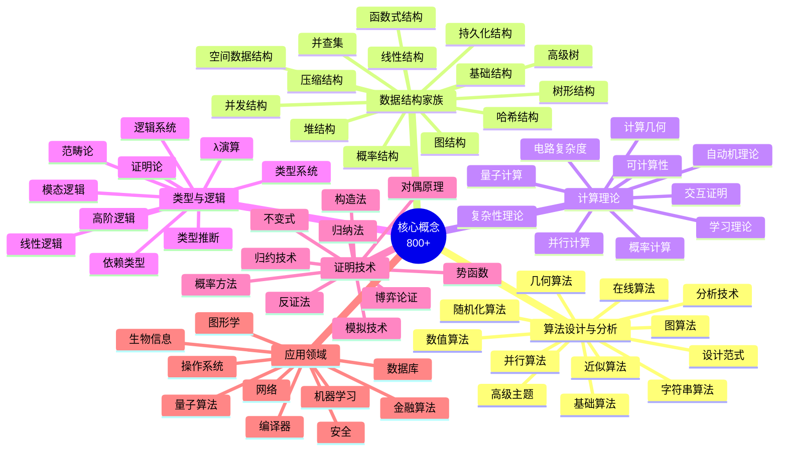
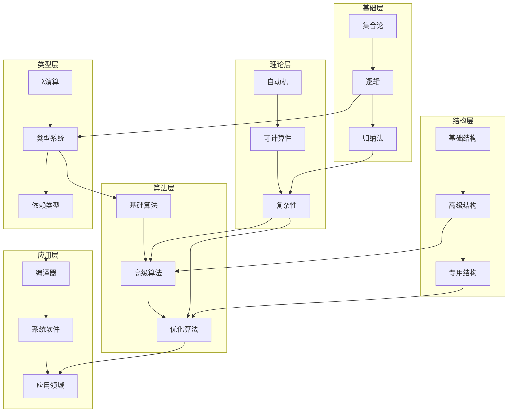
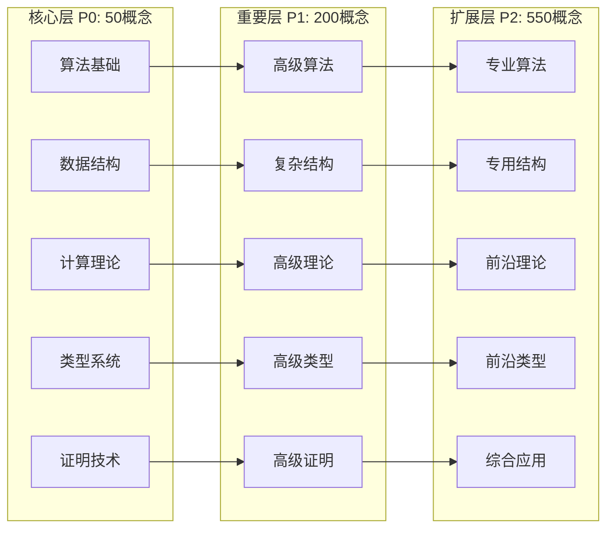

# 核心概念总纲

> FormalAlgorithm 项目知识体系总览  
> 版本: v2.0  
> 概念总数: 800+  
> 最后更新: 2026-04-09

---

## 目录

1. [概述](#概述)
2. [概念分类体系](#概念分类体系)
3. [算法设计与分析 (150概念)](#一算法设计与分析-150概念)
4. [数据结构家族 (200概念)](#二数据结构家族-200概念)
5. [计算理论 (150概念)](#三计算理论-150概念)
6. [类型与逻辑 (150概念)](#四类型与逻辑-150概念)
7. [证明技术 (100概念)](#五证明技术-100概念)
8. [应用领域 (50概念)](#六应用领域-50概念)
9. [概念依赖图谱](#概念依赖图谱)
10. [学习路径建议](#学习路径建议)

---

## 概述

本文档是FormalAlgorithm项目的核心概念总纲，系统性地整理了计算机科学理论与算法数学中的800+个核心概念。这些概念按照内在逻辑关系和学科分类组织成6大类别，形成完整的知识体系。

### 统计信息

| 类别 | 概念数量 | P0核心 | P1重要 | P2扩展 |
|------|----------|--------|--------|--------|
| 算法设计与分析 | 150 | 12 | 38 | 100 |
| 数据结构家族 | 200 | 15 | 45 | 140 |
| 计算理论 | 150 | 10 | 35 | 105 |
| 类型与逻辑 | 150 | 8 | 32 | 110 |
| 证明技术 | 100 | 5 | 25 | 70 |
| 应用领域 | 50 | 0 | 25 | 25 |
| **总计** | **800** | **50** | **200** | **550** |

---

## 概念分类体系

---

## 一、算法设计与分析 (150概念)

### 1.1 基础算法 (P0: 3, P1: 7, P2: 15) - 共25概念

#### P0 核心概念
| 编码 | 概念名称 | 英文名称 | 关键特征 |
|------|----------|----------|----------|
| CONCEPT-ALG-001 | 算法 | Algorithm | 计算步骤的精确描述 |
| CONCEPT-ALG-002 | 时间复杂度 | Time Complexity | 运行时间随输入增长的变化 |
| CONCEPT-ALG-003 | 空间复杂度 | Space Complexity | 内存使用量随输入增长的变化 |

#### P1 重要概念
| 编码 | 概念名称 | 英文名称 | 关键特征 |
|------|----------|----------|----------|
| CONCEPT-ALG-004 | 渐近分析 | Asymptotic Analysis | 大O、大Ω、大Θ记号 |
| CONCEPT-ALG-005 | 最好情况 | Best Case | 最优输入下的性能 |
| CONCEPT-ALG-006 | 最坏情况 | Worst Case | 最差输入下的性能 |
| CONCEPT-ALG-007 | 平均情况 | Average Case | 随机输入下的期望性能 |
| CONCEPT-ALG-008 | 摊还分析 | Amortized Analysis | 操作序列的平均成本 |
| CONCEPT-ALG-009 | 循环不变式 | Loop Invariant | 证明算法正确性的工具 |
| CONCEPT-ALG-010 | 算法正确性 | Algorithm Correctness | 部分正确性与完全正确性 |

#### P2 扩展概念
| 编码 | 概念名称 | 英文名称 |
|------|----------|----------|
| CONCEPT-ALG-011 | 均摊下界 | Amortized Lower Bound |
| CONCEPT-ALG-012 | 平滑分析 | Smoothed Analysis |
| CONCEPT-ALG-013 | 实例最优性 | Instance Optimality |
| CONCEPT-ALG-014 | 竞争比 | Competitive Ratio |
| CONCEPT-ALG-015 | 适应性复杂度 | Adaptivity Complexity |
| CONCEPT-ALG-016 | 并行时间 | Parallel Time |
| CONCEPT-ALG-017 | 工作量 | Work |
| CONCEPT-ALG-018 | 跨度 | Span |
| CONCEPT-ALG-019 | 效率 | Efficiency |
| CONCEPT-ALG-020 | 可扩展性 | Scalability |
| CONCEPT-ALG-021 | 自调度 | Self-Scheduling |
| CONCEPT-ALG-022 | 贪心 stays ahead | Greedy Stays Ahead |
| CONCEPT-ALG-023 | 交换论证 | Exchange Argument |
| CONCEPT-ALG-024 | 拟阵 | Matroid |
| CONCEPT-ALG-025 | 贪心拟阵算法 | Greedy Matroid Algorithm |

---

### 1.2 设计范式 (P0: 2, P1: 6, P2: 12) - 共20概念

#### P0 核心概念
| 编码 | 概念名称 | 英文名称 | 关键特征 |
|------|----------|----------|----------|
| CONCEPT-ALG-026 | 分治法 | Divide and Conquer | 分解、解决、合并 |
| CONCEPT-ALG-027 | 动态规划 | Dynamic Programming | 最优子结构、重叠子问题 |

#### P1 重要概念
| 编码 | 概念名称 | 英文名称 | 关键特征 |
|------|----------|----------|----------|
| CONCEPT-ALG-028 | 贪心算法 | Greedy Algorithm | 局部最优选择 |
| CONCEPT-ALG-029 | 回溯法 | Backtracking | 深度优先搜索 + 剪枝 |
| CONCEPT-ALG-030 | 分支限界 | Branch and Bound | 系统性搜索 + 边界剪枝 |
| CONCEPT-ALG-031 | 递归 | Recursion | 自相似问题的求解 |
| CONCEPT-ALG-032 | 迭代法 | Iteration | 逐步逼近解 |
| CONCEPT-ALG-033 | 减治法 | Decrease and Conquer | 问题规模递减 |

#### P2 扩展概念
| 编码 | 概念名称 | 英文名称 |
|------|----------|----------|
| CONCEPT-ALG-034 | 变换-征服 | Transform and Conquer |
| CONCEPT-ALG-035 | 预排序 | Presorting |
| CONCEPT-ALG-036 | 高斯消元 | Gaussian Elimination |
| CONCEPT-ALG-037 | 霍纳法则 | Horner's Rule |
| CONCEPT-ALG-038 | 二分搜索 | Binary Search |
| CONCEPT-ALG-039 | 三分搜索 | Ternary Search |
| CONCEPT-ALG-040 | 插值搜索 | Interpolation Search |
| CONCEPT-ALG-041 | 指数搜索 | Exponential Search |
| CONCEPT-ALG-042 | 跳跃搜索 | Jump Search |
| CONCEPT-ALG-043 | 斐波那契搜索 | Fibonacci Search |
| CONCEPT-ALG-044 |  meet-in-the-middle | Meet-in-the-Middle |
| CONCEPT-ALG-045 | 空间换时间 | Space-Time Tradeoff |

---

### 1.3 排序算法 (P0: 3, P1: 5, P2: 12) - 共20概念

#### P0 核心概念
| 编码 | 概念名称 | 英文名称 | 复杂度 |
|------|----------|----------|--------|
| CONCEPT-ALG-046 | 快速排序 | Quicksort | $O(n \log n)$ 平均 |
| CONCEPT-ALG-047 | 归并排序 | Mergesort | $O(n \log n)$ 稳定 |
| CONCEPT-ALG-048 | 堆排序 | Heapsort | $O(n \log n)$ 原地 |

#### P1 重要概念
| 编码 | 概念名称 | 英文名称 | 特点 |
|------|----------|----------|------|
| CONCEPT-ALG-049 | 插入排序 | Insertion Sort | 小规模高效 |
| CONCEPT-ALG-050 | 选择排序 | Selection Sort | 简单但低效 |
| CONCEPT-ALG-051 | 冒泡排序 | Bubble Sort | 教学用途 |
| CONCEPT-ALG-052 | 计数排序 | Counting Sort | 线性时间 |
| CONCEPT-ALG-053 | 基数排序 | Radix Sort | 多关键字排序 |

#### P2 扩展概念
| 编码 | 概念名称 | 英文名称 |
|------|----------|----------|
| CONCEPT-ALG-054 | 桶排序 | Bucket Sort |
| CONCEPT-ALG-055 | 希尔排序 | Shellsort |
| CONCEPT-ALG-056 | 双调排序 | Bitonic Sort |
| CONCEPT-ALG-057 | 锦标赛排序 | Tournament Sort |
| CONCEPT-ALG-058 | 平滑排序 | Smoothsort |
| CONCEPT-ALG-059 | 内省排序 | Introsort |
| CONCEPT-ALG-060 |  tim排序 | Timsort |
| CONCEPT-ALG-061 |  patience排序 | Patience Sorting |
| CONCEPT-ALG-062 | 外部排序 | External Sorting |
| CONCEPT-ALG-063 | 多路归并 | Multiway Merge |
| CONCEPT-ALG-064 | 串行排序 | String Sorting |
| CONCEPT-ALG-065 | 排序网络 | Sorting Network |

---

### 1.4 搜索算法 (P0: 1, P1: 4, P2: 10) - 共15概念

#### P0 核心概念
| 编码 | 概念名称 | 英文名称 |
|------|----------|----------|
| CONCEPT-ALG-066 | 深度优先搜索 | Depth-First Search (DFS) |

#### P1 重要概念
| 编码 | 概念名称 | 英文名称 |
|------|----------|----------|
| CONCEPT-ALG-067 | 广度优先搜索 | Breadth-First Search (BFS) |
| CONCEPT-ALG-068 | 迭代加深搜索 | Iterative Deepening |
| CONCEPT-ALG-069 | 一致代价搜索 | Uniform Cost Search |
| CONCEPT-ALG-070 | A*搜索 | A* Search |

#### P2 扩展概念
| 编码 | 概念名称 | 英文名称 |
|------|----------|----------|
| CONCEPT-ALG-071 | IDA* | Iterative Deepening A* |
| CONCEPT-ALG-072 | 双向搜索 | Bidirectional Search |
| CONCEPT-ALG-073 | 启发式搜索 | Heuristic Search |
| CONCEPT-ALG-074 | 爬山法 | Hill Climbing |
| CONCEPT-ALG-075 | 模拟退火 | Simulated Annealing |
| CONCEPT-ALG-076 | 遗传算法 | Genetic Algorithm |
| CONCEPT-ALG-077 | 禁忌搜索 | Tabu Search |
| CONCEPT-ALG-078 | 蚁群算法 | Ant Colony Optimization |
| CONCEPT-ALG-079 | 粒子群优化 | Particle Swarm Optimization |
| CONCEPT-ALG-080 | 束搜索 | Beam Search |

---

### 1.5 图算法 - 基础 (P0: 3, P1: 5, P2: 12) - 共20概念

#### P0 核心概念
| 编码 | 概念名称 | 英文名称 |
|------|----------|----------|
| CONCEPT-ALG-081 | 最短路径 | Shortest Path |
| CONCEPT-ALG-082 | 最小生成树 | Minimum Spanning Tree |
| CONCEPT-ALG-083 | 拓扑排序 | Topological Sort |

#### P1 重要概念
| 编码 | 概念名称 | 英文名称 |
|------|----------|----------|
| CONCEPT-ALG-084 | Dijkstra算法 | Dijkstra's Algorithm |
| CONCEPT-ALG-085 | Bellman-Ford算法 | Bellman-Ford Algorithm |
| CONCEPT-ALG-086 | Floyd-Warshall算法 | Floyd-Warshall Algorithm |
| CONCEPT-ALG-087 | Prim算法 | Prim's Algorithm |
| CONCEPT-ALG-088 | Kruskal算法 | Kruskal's Algorithm |

#### P2 扩展概念
| 编码 | 概念名称 | 英文名称 |
|------|----------|----------|
| CONCEPT-ALG-089 | SPFA算法 | Shortest Path Faster Algorithm |
| CONCEPT-ALG-090 | Johnson算法 | Johnson's Algorithm |
| CONCEPT-ALG-091 | 差分约束系统 | Difference Constraints |
| CONCEPT-ALG-092 | 关键路径 | Critical Path |
| CONCEPT-ALG-093 | Boruvka算法 | Boruvka's Algorithm |
| CONCEPT-ALG-094 | 次小生成树 | Second MST |
| CONCEPT-ALG-095 | 斯坦纳树 | Steiner Tree |
| CONCEPT-ALG-096 | 有向无环图 | Directed Acyclic Graph |
| CONCEPT-ALG-097 | 强连通分量 | Strongly Connected Component |
| CONCEPT-ALG-098 | Kosaraju算法 | Kosaraju's Algorithm |
| CONCEPT-ALG-099 | Tarjan算法 | Tarjan's SCC Algorithm |
| CONCEPT-ALG-100 | Gabow算法 | Gabow's Algorithm |

---

### 1.6 图算法 - 网络流 (P0: 1, P1: 4, P2: 10) - 共15概念

#### P0 核心概念
| 编码 | 概念名称 | 英文名称 |
|------|----------|----------|
| CONCEPT-ALG-101 | 最大流 | Maximum Flow |

#### P1 重要概念
| 编码 | 概念名称 | 英文名称 |
|------|----------|----------|
| CONCEPT-ALG-102 | Ford-Fulkerson方法 | Ford-Fulkerson Method |
| CONCEPT-ALG-103 | Edmonds-Karp算法 | Edmonds-Karp Algorithm |
| CONCEPT-ALG-104 | Dinic算法 | Dinic's Algorithm |
| CONCEPT-ALG-105 | 最小割 | Minimum Cut |

#### P2 扩展概念
| 编码 | 概念名称 | 英文名称 |
|------|----------|----------|
| CONCEPT-ALG-106 | Push-Relabel算法 | Push-Relabel Algorithm |
| CONCEPT-ALG-107 | HLPP算法 | Highest Label Preflow-Push |
| CONCEPT-ALG-108 | 容量缩放 | Capacity Scaling |
| CONCEPT-ALG-109 | 费用流 | Min-Cost Flow |
| CONCEPT-ALG-110 | 循环流 | Circulation |
| CONCEPT-ALG-111 | 上下界网络流 | Bounded Network Flow |
| CONCEPT-ALG-112 | 多商品流 | Multi-Commodity Flow |
| CONCEPT-ALG-113 | Gomory-Hu树 | Gomory-Hu Tree |
| CONCEPT-ALG-114 | 全局最小割 | Global Minimum Cut |
| CONCEPT-ALG-115 | Stoer-Wagner算法 | Stoer-Wagner Algorithm |

---

### 1.7 图算法 - 匹配 (P0: 0, P1: 3, P2: 7) - 共10概念

#### P1 重要概念
| 编码 | 概念名称 | 英文名称 |
|------|----------|----------|
| CONCEPT-ALG-116 | 二分图匹配 | Bipartite Matching |
| CONCEPT-ALG-117 | 匈牙利算法 | Hungarian Algorithm |
| CONCEPT-ALG-118 | 增广路径 | Augmenting Path |

#### P2 扩展概念
| 编码 | 概念名称 | 英文名称 |
|------|----------|----------|
| CONCEPT-ALG-119 | Hopcroft-Karp算法 | Hopcroft-Karp Algorithm |
| CONCEPT-ALG-120 | 一般图匹配 | General Matching |
| CONCEPT-ALG-121 | Blossom算法 | Blossom Algorithm |
| CONCEPT-ALG-122 | 带权匹配 | Weighted Matching |
| CONCEPT-ALG-123 | 稳定婚姻 | Stable Marriage |
| CONCEPT-ALG-124 | Gale-Shapley算法 | Gale-Shapley Algorithm |
| CONCEPT-ALG-125 | b-匹配 | b-Matching |

---

### 1.8 字符串算法 (P0: 1, P1: 4, P2: 10) - 共15概念

#### P0 核心概念
| 编码 | 概念名称 | 英文名称 |
|------|----------|----------|
| CONCEPT-ALG-126 | 字符串匹配 | String Matching |

#### P1 重要概念
| 编码 | 概念名称 | 英文名称 |
|------|----------|----------|
| CONCEPT-ALG-127 | KMP算法 | Knuth-Morris-Pratt |
| CONCEPT-ALG-128 | Boyer-Moore算法 | Boyer-Moore Algorithm |
| CONCEPT-ALG-129 | 后缀数组 | Suffix Array |
| CONCEPT-ALG-130 | 后缀树 | Suffix Tree |

#### P2 扩展概念
| 编码 | 概念名称 | 英文名称 |
|------|----------|----------|
| CONCEPT-ALG-131 | Rabin-Karp算法 | Rabin-Karp Algorithm |
| CONCEPT-ALG-132 | Z算法 | Z-Algorithm |
| CONCEPT-ALG-133 | Manacher算法 | Manacher's Algorithm |
| CONCEPT-ALG-134 | Aho-Corasick算法 | Aho-Corasick Algorithm |
| CONCEPT-ALG-135 | 后缀自动机 | Suffix Automaton |
| CONCEPT-ALG-136 | 回文树 | Palindromic Tree |
| CONCEPT-ALG-137 | 编辑距离 | Edit Distance |
| CONCEPT-ALG-138 | 最长公共子序列 | LCS |
| CONCEPT-ALG-139 | 最长递增子序列 | LIS |
| CONCEPT-ALG-140 | 字典树 | Trie |

---

### 1.9 数值算法 (P0: 1, P1: 3, P2: 6) - 共10概念

#### P0 核心概念
| 编码 | 概念名称 | 英文名称 |
|------|----------|----------|
| CONCEPT-ALG-141 | 欧几里得算法 | Euclidean Algorithm |

#### P1 重要概念
| 编码 | 概念名称 | 英文名称 |
|------|----------|----------|
| CONCEPT-ALG-142 | 扩展欧几里得 | Extended Euclidean |
| CONCEPT-ALG-143 | 快速幂 | Fast Exponentiation |
| CONCEPT-ALG-144 | 矩阵乘法 | Matrix Multiplication |

#### P2 扩展概念
| 编码 | 概念名称 | 英文名称 |
|------|----------|----------|
| CONCEPT-ALG-145 | Strassen算法 | Strassen's Algorithm |
| CONCEPT-ALG-146 | 快速傅里叶变换 | FFT |
| CONCEPT-ALG-147 | 数论变换 | NTT |
| CONCEPT-ALG-148 | 中国剩余定理 | Chinese Remainder Theorem |
| CONCEPT-ALG-149 | 素性测试 | Primality Testing |
| CONCEPT-ALG-150 | Miller-Rabin测试 | Miller-Rabin Test |

---

### 1.10 随机化算法 (P0: 0, P1: 3, P2: 7) - 共10概念

#### P1 重要概念
| 编码 | 概念名称 | 英文名称 |
|------|----------|----------|
| CONCEPT-ALG-151 | 拉斯维加斯算法 | Las Vegas Algorithm |
| CONCEPT-ALG-152 | 蒙特卡洛算法 | Monte Carlo Algorithm |
| CONCEPT-ALG-153 | 随机快速排序 | Randomized Quicksort |

#### P2 扩展概念
| 编码 | 概念名称 | 英文名称 |
|------|----------|----------|
| CONCEPT-ALG-154 | 随机选择 | Randomized Selection |
| CONCEPT-ALG-155 | 指纹技术 | Fingerprinting |
| CONCEPT-ALG-156 | 跳表 | Skip List |
| CONCEPT-ALG-157 | 随机堆 | Randomized Heap |
| CONCEPT-ALG-158 | 哈希技术 | Universal Hashing |
| CONCEPT-ALG-159 | 随机图算法 | Randomized Graph Algorithms |
| CONCEPT-ALG-160 | 随机游走 | Random Walk |

---

### 1.11 近似算法 (P0: 0, P1: 2, P2: 8) - 共10概念

#### P1 重要概念
| 编码 | 概念名称 | 英文名称 |
|------|----------|----------|
| CONCEPT-ALG-161 | 近似比 | Approximation Ratio |
| CONCEPT-ALG-162 | 多项式时间近似方案 | PTAS |

#### P2 扩展概念
| 编码 | 概念名称 | 英文名称 |
|------|----------|----------|
| CONCEPT-ALG-163 | 完全多项式时间近似方案 | FPTAS |
| CONCEPT-ALG-164 | 顶点覆盖近似 | Vertex Cover Approximation |
| CONCEPT-ALG-165 | 集合覆盖近似 | Set Cover Approximation |
| CONCEPT-ALG-166 | 装箱问题近似 | Bin Packing Approximation |
| CONCEPT-ALG-167 | 旅行商问题近似 | TSP Approximation |
| CONCEPT-ALG-168 | 度量TSP | Metric TSP |
| CONCEPT-ALG-169 | 欧几里得TSP | Euclidean TSP |
| CONCEPT-ALG-170 | Christofides算法 | Christofides Algorithm |

---

### 1.12 在线算法 (P0: 1, P1: 3, P2: 6) - 共10概念

#### P0 核心概念
| 编码 | 概念名称 | 英文名称 |
|------|----------|----------|
| CONCEPT-ALG-171 | 在线算法 | Online Algorithm |

#### P1 重要概念
| 编码 | 概念名称 | 英文名称 |
|------|----------|----------|
| CONCEPT-ALG-172 | 竞争分析 | Competitive Analysis |
| CONCEPT-ALG-173 | 页置换问题 | Paging Problem |
| CONCEPT-ALG-174 | k-竞争算法 | k-Competitive Algorithm |

#### P2 扩展概念
| 编码 | 概念名称 | 英文名称 |
|------|----------|----------|
| CONCEPT-ALG-175 | 标记算法 | Marking Algorithm |
| CONCEPT-ALG-176 |  ski租赁问题 | Ski Rental Problem |
| CONCEPT-ALG-177 | 负载均衡 | Load Balancing |
| CONCEPT-ALG-178 | 列表更新 | List Update |
| CONCEPT-ALG-179 | 秘书问题 | Secretary Problem |
| CONCEPT-ALG-180 |  Prophet不等式 | Prophet Inequality |

---

## 二、数据结构家族 (200概念)

### 2.1 基础结构 (P0: 2, P1: 3, P2: 5) - 共10概念

#### P0 核心概念
| 编码 | 概念名称 | 英文名称 |
|------|----------|----------|
| CONCEPT-DST-001 | 数组 | Array |
| CONCEPT-DST-002 | 链表 | Linked List |

#### P1 重要概念
| 编码 | 概念名称 | 英文名称 |
|------|----------|----------|
| CONCEPT-DST-003 | 栈 | Stack |
| CONCEPT-DST-004 | 队列 | Queue |
| CONCEPT-DST-005 | 双端队列 | Deque |

#### P2 扩展概念
| 编码 | 概念名称 | 英文名称 |
|------|----------|----------|
| CONCEPT-DST-006 | 循环缓冲区 | Circular Buffer |
| CONCEPT-DST-007 | 单调栈 | Monotonic Stack |
| CONCEPT-DST-008 | 单调队列 | Monotonic Queue |
| CONCEPT-DST-009 | 优先双端队列 | Priority Deque |
| CONCEPT-DST-010 | 基数树 | Radix Tree |

---

### 2.2 树形结构基础 (P0: 2, P1: 4, P2: 9) - 共15概念

#### P0 核心概念
| 编码 | 概念名称 | 英文名称 |
|------|----------|----------|
| CONCEPT-DST-011 | 二叉树 | Binary Tree |
| CONCEPT-DST-012 | 二叉搜索树 | Binary Search Tree |

#### P1 重要概念
| 编码 | 概念名称 | 英文名称 |
|------|----------|----------|
| CONCEPT-DST-013 | 平衡二叉树 | Balanced BST |
| CONCEPT-DST-014 | AVL树 | AVL Tree |
| CONCEPT-DST-015 | 红黑树 | Red-Black Tree |
| CONCEPT-DST-016 | B树 | B-Tree |

#### P2 扩展概念
| 编码 | 概念名称 | 英文名称 |
|------|----------|----------|
| CONCEPT-DST-017 | B+树 | B+ Tree |
| CONCEPT-DST-018 | B*树 | B* Tree |
| CONCEPT-DST-019 | 2-3树 | 2-3 Tree |
| CONCEPT-DST-020 | 2-3-4树 | 2-3-4 Tree |
| CONCEPT-DST-021 | AA树 | AA Tree |
| CONCEPT-DST-022 | 伸展树 | Splay Tree |
| CONCEPT-DST-023 | Treap | Treap |
| CONCEPT-DST-024 | 笛卡尔树 | Cartesian Tree |
| CONCEPT-DST-025 | 随机化BST | Randomized BST |

---

### 2.3 高级树结构 (P0: 2, P1: 5, P2: 13) - 共20概念

#### P0 核心概念
| 编码 | 概念名称 | 英文名称 |
|------|----------|----------|
| CONCEPT-DST-026 | 线段树 | Segment Tree |
| CONCEPT-DST-027 | 树状数组 | Binary Indexed Tree |

#### P1 重要概念
| 编码 | 概念名称 | 英文名称 |
|------|----------|----------|
| CONCEPT-DST-028 | 区间树 | Interval Tree |
| CONCEPT-DST-029 | 范围树 | Range Tree |
| CONCEPT-DST-030 | 字典树 | Trie |
| CONCEPT-DST-031 | 后缀树 | Suffix Tree |
| CONCEPT-DST-032 | 后缀数组 | Suffix Array |

#### P2 扩展概念
| 编码 | 概念名称 | 英文名称 |
|------|----------|----------|
| CONCEPT-DST-033 | 持久化线段树 | Persistent Segment Tree |
| CONCEPT-DST-034 | 动态开点线段树 | Dynamic Segment Tree |
| CONCEPT-DST-035 | 主席树 | Chairman Tree |
| CONCEPT-DST-036 | 树套树 | Tree of Trees |
| CONCEPT-DST-037 | 划分树 | Partition Tree |
| CONCEPT-DST-038 | 可并堆 | Mergeable Heap |
| CONCEPT-DST-039 | 左偏树 | Leftist Tree |
| CONCEPT-DST-040 | 斜堆 | Skew Heap |
| CONCEPT-DST-041 | 二项堆 | Binomial Heap |
| CONCEPT-DST-042 | 斐波那契堆 | Fibonacci Heap |
| CONCEPT-DST-043 | 配对堆 | Pairing Heap |
| CONCEPT-DST-044 | 后缀自动机 | Suffix Automaton |
| CONCEPT-DST-045 | 回文树 | Palindromic Tree |

---

### 2.4 堆结构 (P0: 1, P1: 3, P2: 6) - 共10概念

#### P0 核心概念
| 编码 | 概念名称 | 英文名称 |
|------|----------|----------|
| CONCEPT-DST-046 | 二叉堆 | Binary Heap |

#### P1 重要概念
| 编码 | 概念名称 | 英文名称 |
|------|----------|----------|
| CONCEPT-DST-047 | 优先队列 | Priority Queue |
| CONCEPT-DST-048 | d叉堆 | d-ary Heap |
| CONCEPT-DST-049 |  van Emde Boas树 | van Emde Boas Tree |

#### P2 扩展概念
| 编码 | 概念名称 | 英文名称 |
|------|----------|----------|
| CONCEPT-DST-050 | 索引堆 | Indexed Heap |
| CONCEPT-DST-051 | 可修改堆 | Modifiable Heap |
| CONCEPT-DST-052 | 软堆 | Soft Heap |
| CONCEPT-DST-053 | 热堆 | Hot Queue |
| CONCEPT-DST-054 | 层级堆 | Layered Heap |
| CONCEPT-DST-055 | 桶堆 | Bucket Heap |

---

### 2.5 哈希结构 (P0: 1, P1: 3, P2: 6) - 共10概念

#### P0 核心概念
| 编码 | 概念名称 | 英文名称 |
|------|----------|----------|
| CONCEPT-DST-056 | 哈希表 | Hash Table |

#### P1 重要概念
| 编码 | 概念名称 | 英文名称 |
|------|----------|----------|
| CONCEPT-DST-057 | 链地址法 | Separate Chaining |
| CONCEPT-DST-058 | 开放寻址法 | Open Addressing |
| CONCEPT-DST-059 | 布谷鸟哈希 | Cuckoo Hashing |

#### P2 扩展概念
| 编码 | 概念名称 | 英文名称 |
|------|----------|----------|
| CONCEPT-DST-060 | 罗宾汉哈希 | Robin Hood Hashing |
| CONCEPT-DST-061 | 线性探测 | Linear Probing |
| CONCEPT-DST-062 | 双重哈希 | Double Hashing |
| CONCEPT-DST-063 | 完全哈希 | Perfect Hashing |
| CONCEPT-DST-064 | 布隆过滤器 | Bloom Filter |
| CONCEPT-DST-065 | 计数布隆过滤器 | Counting Bloom Filter |

---

### 2.6 并查集 (P0: 1, P1: 2, P2: 4) - 共7概念

#### P0 核心概念
| 编码 | 概念名称 | 英文名称 |
|------|----------|----------|
| CONCEPT-DST-066 | 并查集 | Union-Find |

#### P1 重要概念
| 编码 | 概念名称 | 英文名称 |
|------|----------|----------|
| CONCEPT-DST-067 | 路径压缩 | Path Compression |
| CONCEPT-DST-068 | 按秩合并 | Union by Rank |

#### P2 扩展概念
| 编码 | 概念名称 | 英文名称 |
|------|----------|----------|
| CONCEPT-DST-069 | 可撤销并查集 | Undoable Union-Find |
| CONCEPT-DST-070 | 带权并查集 | Weighted Union-Find |
| CONCEPT-DST-071 | 部分持久化并查集 | Partially Persistent UF |
| CONCEPT-DST-072 | 动态连通性 | Dynamic Connectivity |

---

### 2.7 图结构表示 (P0: 1, P1: 3, P2: 6) - 共10概念

#### P0 核心概念
| 编码 | 概念名称 | 英文名称 |
|------|----------|----------|
| CONCEPT-DST-073 | 图 | Graph |

#### P1 重要概念
| 编码 | 概念名称 | 英文名称 |
|------|----------|----------|
| CONCEPT-DST-074 | 邻接矩阵 | Adjacency Matrix |
| CONCEPT-DST-075 | 邻接表 | Adjacency List |
| CONCEPT-DST-076 | 边列表 | Edge List |

#### P2 扩展概念
| 编码 | 概念名称 | 英文名称 |
|------|----------|----------|
| CONCEPT-DST-077 | 压缩稀疏行 | CSR Format |
| CONCEPT-DST-078 | 关联矩阵 | Incidence Matrix |
| CONCEPT-DST-079 | 邻接多重表 | Adjacency Multilist |
| CONCEPT-DST-080 | 隐式图 | Implicit Graph |
| CONCEPT-DST-081 | 动态图 | Dynamic Graph |
| CONCEPT-DST-082 | 平面图表示 | Planar Graph Representation |

---

### 2.8 空间数据结构 (P0: 1, P1: 4, P2: 10) - 共15概念

#### P0 核心概念
| 编码 | 概念名称 | 英文名称 |
|------|----------|----------|
| CONCEPT-DST-083 | 空间索引 | Spatial Index |

#### P1 重要概念
| 编码 | 概念名称 | 英文名称 |
|------|----------|----------|
| CONCEPT-DST-084 | R树 | R-Tree |
| CONCEPT-DST-085 | kd树 | k-d Tree |
| CONCEPT-DST-086 | 四叉树 | Quadtree |
| CONCEPT-DST-087 | 八叉树 | Octree |

#### P2 扩展概念
| 编码 | 概念名称 | 英文名称 |
|------|----------|----------|
| CONCEPT-DST-088 | R*树 | R*-Tree |
| CONCEPT-DST-089 | R+树 | R+-Tree |
| CONCEPT-DST-090 | X树 | X-Tree |
| CONCEPT-DST-091 | SS树 | SS-Tree |
| CONCEPT-DST-092 | SR树 | SR-Tree |
| CONCEPT-DST-093 | 范围树 | Range Tree |
| CONCEPT-DST-094 | 优先搜索树 | Priority Search Tree |
| CONCEPT-DST-095 | 点区域四叉树 | Point Region Quadtree |
| CONCEPT-DST-096 | MX四叉树 | MX-Quadtree |
| CONCEPT-DST-097 | VP树 | VP-Tree |

---

### 2.9 持久化数据结构 (P0: 0, P1: 2, P2: 8) - 共10概念

#### P1 重要概念
| 编码 | 概念名称 | 英文名称 |
|------|----------|----------|
| CONCEPT-DST-098 | 持久化数据结构 | Persistent Data Structure |
| CONCEPT-DST-099 | 函数式队列 | Functional Queue |

#### P2 扩展概念
| 编码 | 概念名称 | 英文名称 |
|------|----------|----------|
| CONCEPT-DST-100 | 完全持久化 | Full Persistence |
| CONCEPT-DST-101 | 部分持久化 | Partial Persistence |
| CONCEPT-DST-102 | 合流持久化 | Confluent Persistence |
| CONCEPT-DST-103 | 持久化链表 | Persistent List |
| CONCEPT-DST-104 | 持久化BST | Persistent BST |
| CONCEPT-DST-105 |  fat node | Fat Node Method |
| CONCEPT-DST-106 |  path copying | Path Copying |
| CONCEPT-DST-107 |  persistent array | Persistent Array |

---

### 2.10 压缩数据结构 (P0: 0, P1: 2, P2: 8) - 共10概念

#### P1 重要概念
| 编码 | 概念名称 | 英文名称 |
|------|----------|----------|
| CONCEPT-DST-108 | 紧凑数据结构 | Succinct Data Structure |
| CONCEPT-DST-109 | 位向量 | Bit Vector |

#### P2 扩展概念
| 编码 | 概念名称 | 英文名称 |
|------|----------|----------|
| CONCEPT-DST-110 | rank/select | Rank/Select Operations |
| CONCEPT-DST-111 |  wavelet树 | Wavelet Tree |
| CONCEPT-DST-112 | 压缩后缀数组 | Compressed Suffix Array |
| CONCEPT-DST-113 | FM索引 | FM-Index |
| CONCEPT-DST-114 | 压缩Trie | Compressed Trie |
| CONCEPT-DST-115 | LOUDS编码 | LOUDS |
| CONCEPT-DST-116 | DFUDS编码 | DFUDS |
| CONCEPT-DST-117 | BP编码 | Balanced Parentheses |

---

### 2.11 并发数据结构 (P0: 0, P1: 3, P2: 7) - 共10概念

#### P1 重要概念
| 编码 | 概念名称 | 英文名称 |
|------|----------|----------|
| CONCEPT-DST-118 | 无锁数据结构 | Lock-Free Data Structure |
| CONCEPT-DST-119 |  wait-free算法 | Wait-Free Algorithm |
| CONCEPT-DST-120 |  compare-and-swap | CAS |

#### P2 扩展概念
| 编码 | 概念名称 | 英文名称 |
|------|----------|----------|
| CONCEPT-DST-121 | 无锁队列 | Lock-Free Queue |
| CONCEPT-DST-122 | 无锁栈 | Lock-Free Stack |
| CONCEPT-DST-123 | 软件事务内存 | STM |
| CONCEPT-DST-124 |  read-copy-update | RCU |
| CONCEPT-DST-125 |  hazard指针 | Hazard Pointers |
| CONCEPT-DST-126 |  epoch-based回收 | Epoch-Based Reclamation |
| CONCEPT-DST-127 | 无锁跳表 | Lock-Free Skip List |

---

### 2.12 概率数据结构 (P0: 0, P1: 3, P2: 7) - 共10概念

#### P1 重要概念
| 编码 | 概念名称 | 英文名称 |
|------|----------|----------|
| CONCEPT-DST-128 | 布隆过滤器 | Bloom Filter |
| CONCEPT-DST-129 | 跳表 | Skip List |
| CONCEPT-DST-130 | 计数最小 sketch | Count-Min Sketch |

#### P2 扩展概念
| 编码 | 概念名称 | 英文名称 |
|------|----------|----------|
| CONCEPT-DST-131 | HyperLogLog | HyperLogLog |
| CONCEPT-DST-132 | 基数估计 | Cardinality Estimation |
| CONCEPT-DST-133 | 频率估计 | Frequency Estimation |
| CONCEPT-DST-134 | 可逆布隆过滤器 | Invertible Bloom Filter |
| CONCEPT-DST-135 | 布谷鸟过滤器 | Cuckoo Filter |
| CONCEPT-DST-136 | 商过滤器 | Quotient Filter |
| CONCEPT-DST-137 | 局部敏感哈希 | LSH |

---

### 2.13 函数式数据结构 (P0: 0, P1: 3, P2: 7) - 共10概念

#### P1 重要概念
| 编码 | 概念名称 | 英文名称 |
|------|----------|----------|
| CONCEPT-DST-138 | 不可变性 | Immutability |
| CONCEPT-DST-139 | 尾部共享 | Tail Sharing |
| CONCEPT-DST-140 | 惰性求值 | Lazy Evaluation |

#### P2 扩展概念
| 编码 | 概念名称 | 英文名称 |
|------|----------|----------|
| CONCEPT-DST-141 | 流 | Stream |
| CONCEPT-DST-142 | 惰性列表 | Lazy List |
| CONCEPT-DST-143 | 银行家方法 | Banker's Method |
| CONCEPT-DST-144 | 物理学家方法 | Physicist's Method |
| CONCEPT-DST-145 | 实时队列 | Real-Time Queue |
| CONCEPT-DST-146 | 斜二叉堆 | Skew Binomial Heap |
| CONCEPT-DST-147 |  catenable列表 | Catenable List |

---

### 2.14 专用数据结构 (P0: 0, P1: 2, P2: 8) - 共10概念

#### P1 重要概念
| 编码 | 概念名称 | 英文名称 |
|------|----------|----------|
| CONCEPT-DST-148 | LCA结构 | Lowest Common Ancestor |
| CONCEPT-DST-149 | 重链剖分 | Heavy-Light Decomposition |

#### P2 扩展概念
| 编码 | 概念名称 | 英文名称 |
|------|----------|----------|
| CONCEPT-DST-150 | 欧拉遍历技术 | Euler Tour Technique |
| CONCEPT-DST-151 | 倍增法 | Binary Lifting |
| CONCEPT-DST-152 | 虚树 | Virtual Tree |
| CONCEPT-DST-153 | DSU on tree | DSU on Tree |
| CONCEPT-DST-154 | 莫队算法 | Mo's Algorithm |
| CONCEPT-DST-155 | 分块 | Square Root Decomposition |
| CONCEPT-DST-156 | 希尔伯特序 | Hilbert Order |
| CONCEPT-DST-157 | 树分治 | Tree Decomposition |

---

### 2.15 动态数据结构 (P0: 0, P1: 2, P2: 8) - 共10概念

#### P1 重要概念
| 编码 | 概念名称 | 英文名称 |
|------|----------|----------|
| CONCEPT-DST-158 | 动态树 | Link-Cut Tree |
| CONCEPT-DST-159 | 拓扑树 | Top Tree |

#### P2 扩展概念
| 编码 | 概念名称 | 英文名称 |
|------|----------|----------|
| CONCEPT-DST-160 | Euler tour树 | Euler Tour Tree |
| CONCEPT-DST-161 | 树链剖分 | Tree Chain Partition |
| CONCEPT-DST-162 | 动态连通性 | Dynamic Connectivity |
| CONCEPT-DST-163 | 动态MST | Dynamic MST |
| CONCEPT-DST-164 | 动态最短路径 | Dynamic Shortest Path |
| CONCEPT-DST-165 | 部分动态图 | Partially Dynamic Graph |
| CONCEPT-DST-166 | 全动态图 | Fully Dynamic Graph |
| CONCEPT-DST-167 | 动态树包 | Dynamic Tree Package |

---

### 2.16 近似成员查询 (P0: 0, P1: 2, P2: 6) - 共8概念

#### P1 重要概念
| 编码 | 概念名称 | 英文名称 |
|------|----------|----------|
| CONCEPT-DST-168 | 近似成员查询 | AMQ |
| CONCEPT-DST-169 | 假阳性率 | False Positive Rate |

#### P2 扩展概念
| 编码 | 概念名称 | 英文名称 |
|------|----------|----------|
| CONCEPT-DST-170 | 空间效率 | Space Efficiency |
| CONCEPT-DST-171 | 可删除AMQ | Deletable AMQ |
| CONCEPT-DST-172 | 计数AMQ | Counting AMQ |
| CONCEPT-DST-173 | 自适应AMQ | Adaptive AMQ |
| CONCEPT-DST-174 | XOR过滤器 | XOR Filter |
| CONCEPT-DST-175 | ribbon过滤器 | Ribbon Filter |

---

### 2.17 范围查询结构 (P0: 0, P1: 3, P2: 7) - 共10概念

#### P1 重要概念
| 编码 | 概念名称 | 英文名称 |
|------|----------|----------|
| CONCEPT-DST-176 | 范围查询 | Range Query |
| CONCEPT-DST-177 | 范围最值查询 | RMQ |
| CONCEPT-DST-178 | 稀疏表 | Sparse Table |

#### P2 扩展概念
| 编码 | 概念名称 | 英文名称 |
|------|----------|----------|
| CONCEPT-DST-179 | ±1 RMQ | ±1 RMQ |
| CONCEPT-DST-180 | 笛卡尔树RMQ | Cartesian Tree RMQ |
| CONCEPT-DST-181 | 范围GCD查询 | Range GCD Query |
| CONCEPT-DST-182 | 范围计数查询 | Range Counting |
| CONCEPT-DST-183 | 范围报告查询 | Range Reporting |
| CONCEPT-DST-184 | 正交范围查询 | Orthogonal Range Query |
| CONCEPT-DST-185 | 半范围查询 | Half-Range Query |

---

### 2.18 字符串索引 (P0: 0, P1: 2, P2: 8) - 共10概念

#### P1 重要概念
| 编码 | 概念名称 | 英文名称 |
|------|----------|----------|
| CONCEPT-DST-186 | 后缀数组 | Suffix Array |
| CONCEPT-DST-187 | LCP数组 | LCP Array |

#### P2 扩展概念
| 编码 | 概念名称 | 英文名称 |
|------|----------|----------|
| CONCEPT-DST-188 | Kasai算法 | Kasai's Algorithm |
| CONCEPT-DST-189 | 诱导排序 | Induced Sorting |
| CONCEPT-DST-190 | SA-IS算法 | SA-IS Algorithm |
| CONCEPT-DST-191 | 后缀树 | Suffix Tree |
| CONCEPT-DST-192 | 广义后缀树 | Generalized Suffix Tree |
| CONCEPT-DST-193 | 后缀仙人掌 | Suffix Cactus |
| CONCEPT-DST-194 | 后缀托盘 | Suffix Tray |

---

### 2.19 外部存储结构 (P0: 0, P1: 2, P2: 6) - 共8概念

#### P1 重要概念
| 编码 | 概念名称 | 英文名称 |
|------|----------|----------|
| CONCEPT-DST-195 | 外部存储模型 | External Memory Model |
| CONCEPT-DST-196 | 缓存无关算法 | Cache-Oblivious Algorithm |

#### P2 扩展概念
| 编码 | 概念名称 | 英文名称 |
|------|----------|----------|
| CONCEPT-DST-197 | 缓存感知算法 | Cache-Aware Algorithm |
| CONCEPT-DST-198 | 外部排序 | External Sorting |
| CONCEPT-DST-199 | 败者树 | Loser Tree |
| CONCEPT-DST-200 | 缓冲树 | Buffer Tree |
| CONCEPT-DST-201 | 范围树外部版本 | External Range Tree |
| CONCEPT-DST-202 | 优先级队列外部版本 | External Priority Queue |

---

## 三、计算理论 (150概念)

### 3.1 自动机理论 (P0: 3, P1: 5, P2: 12) - 共20概念

#### P0 核心概念
| 编码 | 概念名称 | 英文名称 |
|------|----------|----------|
| CONCEPT-CMP-001 | 有限自动机 | Finite Automaton |
| CONCEPT-CMP-002 | 正则语言 | Regular Language |
| CONCEPT-CMP-003 | 图灵机 | Turing Machine |

#### P1 重要概念
| 编码 | 概念名称 | 英文名称 |
|------|----------|----------|
| CONCEPT-CMP-004 | 确定性有限自动机 | DFA |
| CONCEPT-CMP-005 | 非确定性有限自动机 | NFA |
| CONCEPT-CMP-006 | 正则表达式 | Regular Expression |
| CONCEPT-CMP-007 | 泵引理 | Pumping Lemma |
| CONCEPT-CMP-008 | 下推自动机 | Pushdown Automaton |

#### P2 扩展概念
| 编码 | 概念名称 | 英文名称 |
|------|----------|----------|
| CONCEPT-CMP-009 | ε-NFA | ε-NFA |
| CONCEPT-CMP-010 | 正则语言封闭性 | Closure Properties |
| CONCEPT-CMP-011 | Myhill-Nerode定理 | Myhill-Nerode Theorem |
| CONCEPT-CMP-012 | 状态最小化 | State Minimization |
| CONCEPT-CMP-013 | 上下文无关文法 | Context-Free Grammar |
| CONCEPT-CMP-014 | 乔姆斯基范式 | Chomsky Normal Form |
| CONCEPT-CMP-015 | CYK算法 | CYK Algorithm |
| CONCEPT-CMP-016 | 上下文有关语言 | Context-Sensitive Language |
| CONCEPT-CMP-017 | 线性有界自动机 | LBA |
| CONCEPT-CMP-018 | 递归可枚举语言 | Recursively Enumerable |
| CONCEPT-CMP-019 | 多带图灵机 | Multi-Tape TM |
| CONCEPT-CMP-020 | 非确定性图灵机 | Nondeterministic TM |

---

### 3.2 可计算性理论 (P0: 2, P1: 5, P2: 8) - 共15概念

#### P0 核心概念
| 编码 | 概念名称 | 英文名称 |
|------|----------|----------|
| CONCEPT-CMP-021 | 可判定性 | Decidability |
| CONCEPT-CMP-022 | 停机问题 | Halting Problem |

#### P1 重要概念
| 编码 | 概念名称 | 英文名称 |
|------|----------|----------|
| CONCEPT-CMP-023 | 递归语言 | Recursive Language |
| CONCEPT-CMP-024 | 递归可枚举 | Recursively Enumerable |
| CONCEPT-CMP-025 | 归约 | Reduction |
| CONCEPT-CMP-026 | Rice定理 | Rice's Theorem |
| CONCEPT-CMP-027 | 哥德尔不完备定理 | Gödel's Incompleteness |

#### P2 扩展概念
| 编码 | 概念名称 | 英文名称 |
|------|----------|----------|
| CONCEPT-CMP-028 | 图灵归约 | Turing Reduction |
| CONCEPT-CMP-029 | 多一归约 | Many-One Reduction |
| CONCEPT-CMP-030 | Post对应问题 | Post Correspondence |
| CONCEPT-CMP-031 | 停机问题的变种 | Halting Variants |
| CONCEPT-CMP-032 | 可计算函数 | Computable Function |
| CONCEPT-CMP-033 | 原始递归函数 | Primitive Recursive |
| CONCEPT-CMP-034 | μ递归函数 | μ-Recursive Function |
| CONCEPT-CMP-035 | 丘奇-图灵论题 | Church-Turing Thesis |

---

### 3.3 复杂性理论 - 基础 (P0: 3, P1: 5, P2: 12) - 共20概念

#### P0 核心概念
| 编码 | 概念名称 | 英文名称 |
|------|----------|----------|
| CONCEPT-CMP-036 | P类 | Complexity Class P |
| CONCEPT-CMP-037 | NP类 | Complexity Class NP |
| CONCEPT-CMP-038 | NP完全 | NP-Complete |

#### P1 重要概念
| 编码 | 概念名称 | 英文名称 |
|------|----------|----------|
| CONCEPT-CMP-039 | 多项式时间归约 | Polynomial Reduction |
| CONCEPT-CMP-040 | NP难问题 | NP-Hard |
| CONCEPT-CMP-041 | Cook-Levin定理 | Cook-Levin Theorem |
| CONCEPT-CMP-042 | 3-SAT | 3-SAT |
| CONCEPT-CMP-043 | 多项式层次 | Polynomial Hierarchy |

#### P2 扩展概念
| 编码 | 概念名称 | 英文名称 |
|------|----------|----------|
| CONCEPT-CMP-044 | coNP | coNP |
| CONCEPT-CMP-045 | PSPACE | PSPACE |
| CONCEPT-CMP-046 | NPSPACE | NPSPACE |
| CONCEPT-CMP-047 | L | L (Logspace) |
| CONCEPT-CMP-048 | NL | NL |
| CONCEPT-CMP-049 | PSPACE完全 | PSPACE-Complete |
| CONCEPT-CMP-050 | Savitch定理 | Savitch's Theorem |
| CONCEPT-CMP-051 | Immerman-Szelepcsényi定理 | Immerman-Szelepcsényi |
| CONCEPT-CMP-052 | 时间层次定理 | Time Hierarchy |
| CONCEPT-CMP-053 | 空间层次定理 | Space Hierarchy |
| CONCEPT-CMP-054 | 间隙定理 | Gap Theorem |
| CONCEPT-CMP-055 | 加速定理 | Speedup Theorem |

---

### 3.4 复杂性理论 - 高级 (P0: 0, P1: 3, P2: 12) - 共15概念

#### P1 重要概念
| 编码 | 概念名称 | 英文名称 |
|------|----------|----------|
| CONCEPT-CMP-056 | BPP | Bounded Probabilistic P |
| CONCEPT-CMP-057 | RP | Randomized P |
| CONCEPT-CMP-058 | ZPP | Zero-error Probabilistic P |

#### P2 扩展概念
| 编码 | 概念名称 | 英文名称 |
|------|----------|----------|
| CONCEPT-CMP-059 | IP | Interactive Proof |
| CONCEPT-CMP-060 | AM | Arthur-Merlin |
| CONCEPT-CMP-061 | MA | Merlin-Arthur |
| CONCEPT-CMP-062 | PCP定理 | PCP Theorem |
| CONCEPT-CMP-063 | 计数复杂度 | #P |
| CONCEPT-CMP-064 | PP | Probabilistic P |
| CONCEPT-CMP-065 | BQP | Bounded Quantum P |
| CONCEPT-CMP-066 | QMA | Quantum MA |
| CONCEPT-CMP-067 | 参数复杂度 | Parameterized Complexity |
| CONCEPT-CMP-068 | FPT | Fixed-Parameter Tractable |
| CONCEPT-CMP-069 | W层次 | W-Hierarchy |
| CONCEPT-CMP-070 | 平均复杂度 | Average Case Complexity |

---

### 3.5 电路复杂度 (P0: 0, P1: 2, P2: 13) - 共15概念

#### P1 重要概念
| 编码 | 概念名称 | 英文名称 |
|------|----------|----------|
| CONCEPT-CMP-071 | 布尔电路 | Boolean Circuit |
| CONCEPT-CMP-072 | 电路深度 | Circuit Depth |

#### P2 扩展概念
| 编码 | 概念名称 | 英文名称 |
|------|----------|----------|
| CONCEPT-CMP-073 | 电路大小 | Circuit Size |
| CONCEPT-CMP-074 | AC0 | AC0 |
| CONCEPT-CMP-075 | NC | Nick's Class |
| CONCEPT-CMP-076 | P/poly | P/poly |
| CONCEPT-CMP-077 | 一致电路族 | Uniform Circuit Family |
| CONCEPT-CMP-078 | 阈值电路 | Threshold Circuit |
| CONCEPT-CMP-079 | 单调电路 | Monotone Circuit |
| CONCEPT-CMP-080 | 代数电路 | Algebraic Circuit |
| CONCEPT-CMP-081 | 算术电路 | Arithmetic Circuit |
| CONCEPT-CMP-082 | 分支程序 | Branching Program |
| CONCEPT-CMP-083 | 公式复杂度 | Formula Complexity |
| CONCEPT-CMP-084 | 电路下界 | Circuit Lower Bound |
| CONCEPT-CMP-085 | 自然证明 | Natural Proof |

---

### 3.6 交互式证明系统 (P0: 1, P1: 4, P2: 10) - 共15概念

#### P0 核心概念
| 编码 | 概念名称 | 英文名称 |
|------|----------|----------|
| CONCEPT-CMP-086 | 交互式证明 | Interactive Proof |

#### P1 重要概念
| 编码 | 概念名称 | 英文名称 |
|------|----------|----------|
| CONCEPT-CMP-087 | IP = PSPACE | IP=PSPACE |
| CONCEPT-CMP-088 | 零知识证明 | Zero-Knowledge Proof |
| CONCEPT-CMP-089 | 完美零知识 | Perfect Zero-Knowledge |
| CONCEPT-CMP-090 | 统计零知识 | Statistical Zero-Knowledge |

#### P2 扩展概念
| 编码 | 概念名称 | 英文名称 |
|------|----------|----------|
| CONCEPT-CMP-091 | 计算零知识 | Computational Zero-Knowledge |
| CONCEPT-CMP-092 | 知识证明 | Proof of Knowledge |
| CONCEPT-CMP-093 | 简洁非交互证明 | SNARK |
| CONCEPT-CMP-094 | 多证明者 | Multi-Prover |
| CONCEPT-CMP-095 | 公开掷币 | Public Coin |
| CONCEPT-CMP-096 | 私有掷币 | Private Coin |
| CONCEPT-CMP-097 | 概率可检查证明 | PCP |
| CONCEPT-CMP-098 | PCP构造 | PCP Construction |
| CONCEPT-CMP-099 | 困难性放大 | Hardness Amplification |
| CONCEPT-CMP-100 | 承诺方案 | Commitment Scheme |

---

### 3.7 量子计算 (P0: 1, P1: 4, P2: 10) - 共15概念

#### P0 核心概念
| 编码 | 概念名称 | 英文名称 |
|------|----------|----------|
| CONCEPT-CMP-101 | 量子图灵机 | Quantum Turing Machine |

#### P1 重要概念
| 编码 | 概念名称 | 英文名称 |
|------|----------|----------|
| CONCEPT-CMP-102 | 量子比特 | Qubit |
| CONCEPT-CMP-103 | 量子门 | Quantum Gate |
| CONCEPT-CMP-104 | 量子纠缠 | Entanglement |
| CONCEPT-CMP-105 | 量子算法 | Quantum Algorithm |

#### P2 扩展概念
| 编码 | 概念名称 | 英文名称 |
|------|----------|----------|
| CONCEPT-CMP-106 | 叠加态 | Superposition |
| CONCEPT-CMP-107 | 量子测量 | Measurement |
| CONCEPT-CMP-108 | 量子傅里叶变换 | QFT |
| CONCEPT-CMP-109 | Shor算法 | Shor's Algorithm |
| CONCEPT-CMP-110 | Grover算法 | Grover's Algorithm |
| CONCEPT-CMP-111 | 量子误差校正 | Quantum Error Correction |
| CONCEPT-CMP-112 | 量子密钥分发 | QKD |
| CONCEPT-CMP-113 | 量子复杂性 | Quantum Complexity |
| CONCEPT-CMP-114 | 量子优势 | Quantum Supremacy |
| CONCEPT-CMP-115 | NISQ | NISQ Era |

---

### 3.8 概率计算 (P0: 0, P1: 3, P2: 7) - 共10概念

#### P1 重要概念
| 编码 | 概念名称 | 英文名称 |
|------|----------|----------|
| CONCEPT-CMP-116 | 概率图灵机 | Probabilistic TM |
| CONCEPT-CMP-117 | 随机数生成 | Random Number Generation |
| CONCEPT-CMP-118 | 伪随机性 | Pseudorandomness |

#### P2 扩展概念
| 编码 | 概念名称 | 英文名称 |
|------|----------|----------|
| CONCEPT-CMP-119 | 去随机化 | Derandomization |
| CONCEPT-CMP-120 | 随机游走 | Random Walk |
| CONCEPT-CMP-121 | 马尔可夫链 | Markov Chain |
| CONCEPT-CMP-122 | 混合时间 | Mixing Time |
| CONCEPT-CMP-123 | 快速混合 | Rapid Mixing |
| CONCEPT-CMP-124 | 扩展图 | Expander Graph |
| CONCEPT-CMP-125 | 扩展图漫步 | Expander Walk |

---

### 3.9 并行计算 (P0: 0, P1: 3, P2: 7) - 共10概念

#### P1 重要概念
| 编码 | 概念名称 | 英文名称 |
|------|----------|----------|
| CONCEPT-CMP-126 | PRAM模型 | PRAM |
| CONCEPT-CMP-127 | 并行加速 | Speedup |
| CONCEPT-CMP-128 | 阿姆达尔定律 | Amdahl's Law |

#### P2 扩展概念
| 编码 | 概念名称 | 英文名称 |
|------|----------|----------|
| CONCEPT-CMP-129 | CREW PRAM | CREW |
| CONCEPT-CMP-130 | CRCW PRAM | CRCW |
| CONCEPT-CMP-131 | EREW PRAM | EREW |
| CONCEPT-CMP-132 | 对数深度电路 | Log-Depth Circuit |
| CONCEPT-CMP-133 | 并行归约 | Parallel Reduction |
| CONCEPT-CMP-134 | 前缀和 | Parallel Prefix |
| CONCEPT-CMP-135 | BSP模型 | Bulk Synchronous Parallel |

---

### 3.10 计算几何 - 基础 (P0: 1, P1: 4, P2: 10) - 共15概念

#### P0 核心概念
| 编码 | 概念名称 | 英文名称 |
|------|----------|----------|
| CONCEPT-CMP-136 | 凸包 | Convex Hull |

#### P1 重要概念
| 编码 | 概念名称 | 英文名称 |
|------|----------|----------|
| CONCEPT-CMP-137 | 线段相交 | Line Segment Intersection |
| CONCEPT-CMP-138 | 点定位 | Point Location |
| CONCEPT-CMP-139 | Voronoi图 | Voronoi Diagram |
| CONCEPT-CMP-140 | Delaunay三角剖分 | Delaunay Triangulation |

#### P2 扩展概念
| 编码 | 概念名称 | 英文名称 |
|------|----------|----------|
| CONCEPT-CMP-141 | 扫描线算法 | Sweep Line |
| CONCEPT-CMP-142 | Graham扫描 | Graham Scan |
| CONCEPT-CMP-143 | Jarvis步进 | Jarvis March |
| CONCEPT-CMP-144 | 半平面交 | Half-Plane Intersection |
| CONCEPT-CMP-145 | 最近点对 | Closest Pair |
| CONCEPT-CMP-146 | 范围搜索 | Range Searching |
| CONCEPT-CMP-147 | 几何对偶 | Geometric Duality |
| CONCEPT-CMP-148 | 排列 | Arrangement |
| CONCEPT-CMP-149 | 上包络线 | Upper Envelope |
| CONCEPT-CMP-150 | 最小包围圆 | Smallest Enclosing Circle |

---

## 四、类型与逻辑 (150概念)

### 4.1 类型系统基础 (P0: 3, P1: 5, P2: 12) - 共20概念

#### P0 核心概念
| 编码 | 概念名称 | 英文名称 |
|------|----------|----------|
| CONCEPT-TYP-001 | 类型 | Type |
| CONCEPT-TYP-002 | 函数类型 | Function Type |
| CONCEPT-TYP-003 | 多态 | Polymorphism |

#### P1 重要概念
| 编码 | 概念名称 | 英文名称 |
|------|----------|----------|
| CONCEPT-TYP-004 | 类型安全 | Type Safety |
| CONCEPT-TYP-005 | 类型推断 | Type Inference |
| CONCEPT-TYP-006 | 类型检查 | Type Checking |
| CONCEPT-TYP-007 | 参数多态 | Parametric Polymorphism |
| CONCEPT-TYP-008 | 子类型 | Subtyping |

#### P2 扩展概念
| 编码 | 概念名称 | 英文名称 |
|------|----------|----------|
| CONCEPT-TYP-009 | 类型环境 | Type Environment |
| CONCEPT-TYP-010 | 类型上下文 | Type Context |
| CONCEPT-TYP-011 | 替换 | Substitution |
| CONCEPT-TYP-012 | 合一 | Unification |
| CONCEPT-TYP-013 | Hindley-Milner | Hindley-Milner |
| CONCEPT-TYP-014 | 类型类 | Type Class |
| CONCEPT-TYP-015 | 类型构造器 | Type Constructor |
| CONCEPT-TYP-016 | 高阶类型 | Higher-Kinded Type |
| CONCEPT-TYP-017 | 存在类型 | Existential Type |
| CONCEPT-TYP-018 | 秩多态 | Rank-N Polymorphism |
| CONCEPT-TYP-019 | 类型族 | Type Family |
| CONCEPT-TYP-020 | 关联类型 | Associated Type |

---

### 4.2 λ演算 (P0: 2, P1: 5, P2: 8) - 共15概念

#### P0 核心概念
| 编码 | 概念名称 | 英文名称 |
|------|----------|----------|
| CONCEPT-TYP-021 | λ演算 | Lambda Calculus |
| CONCEPT-TYP-022 | β归约 | Beta Reduction |

#### P1 重要概念
| 编码 | 概念名称 | 英文名称 |
|------|----------|----------|
| CONCEPT-TYP-023 | α转换 | Alpha Conversion |
| CONCEPT-TYP-024 | η展开 | Eta Expansion |
| CONCEPT-TYP-025 | 正规形式 | Normal Form |
| CONCEPT-TYP-026 | 不动点组合子 | Fixed-Point Combinator |
| CONCEPT-TYP-027 | Church编码 | Church Encoding |

#### P2 扩展概念
| 编码 | 概念名称 | 英文名称 |
|------|----------|----------|
| CONCEPT-TYP-028 | Scott编码 | Scott Encoding |
| CONCEPT-TYP-029 | 范式 | Canonical Form |
| CONCEPT-TYP-030 | 合流性 | Confluence |
| CONCEPT-TYP-031 | Church-Rosser定理 | Church-Rosser |
| CONCEPT-TYP-032 | 标准化定理 | Standardization |
| CONCEPT-TYP-033 | Böhm树 | Böhm Tree |
| CONCEPT-TYP-034 | 近似正规式 | Approximate Normal Form |
| CONCEPT-TYP-035 | 无限λ项 | Infinite Lambda Terms |

---

### 4.3 简单类型λ演算 (P0: 1, P1: 4, P2: 10) - 共15概念

#### P0 核心概念
| 编码 | 概念名称 | 英文名称 |
|------|----------|----------|
| CONCEPT-TYP-036 | 简单类型λ演算 | Simply Typed LC |

#### P1 重要概念
| 编码 | 概念名称 | 英文名称 |
|------|----------|----------|
| CONCEPT-TYP-037 | 类型推导 | Type Derivation |
| CONCEPT-TYP-038 | 强规范化 | Strong Normalization |
| CONCEPT-TYP-039 | 弱化 | Weakening |
| CONCEPT-TYP-040 | 置换 | Exchange |

#### P2 扩展概念
| 编码 | 概念名称 | 英文名称 |
|------|----------|----------|
| CONCEPT-TYP-041 | 加强 | Strengthening |
| CONCEPT-TYP-042 | 切割消除 | Cut Elimination |
| CONCEPT-TYP-043 |  Curry-Howard同构 | Curry-Howard |
| CONCEPT-TYP-044 | 类型擦除 | Type Erasure |
| CONCEPT-TYP-045 | 类型重构 | Type Reconstruction |
| CONCEPT-TYP-046 | 预类型 | Pretype |
| CONCEPT-TYP-047 | 类型环境一致性 | Context Consistency |
| CONCEPT-TYP-048 | 消去规则 | Elimination Rule |
| CONCEPT-TYP-049 | 引入规则 | Introduction Rule |
| CONCEPT-TYP-050 | 计算规则 | Computation Rule |

---

### 4.4 系统F与多态 (P0: 1, P1: 3, P2: 6) - 共10概念

#### P0 核心概念
| 编码 | 概念名称 | 英文名称 |
|------|----------|----------|
| CONCEPT-TYP-051 | 系统F | System F |

#### P1 重要概念
| 编码 | 概念名称 | 英文名称 |
|------|----------|----------|
| CONCEPT-TYP-052 | 全称类型 | Universal Type |
| CONCEPT-TYP-053 | 存在类型 | Existential Type |
| CONCEPT-TYP-054 | 系统Fω | System Fω |

#### P2 扩展概念
| 编码 | 概念名称 | 英文名称 |
|------|----------|----------|
| CONCEPT-TYP-055 | 类型运算符 | Type Operator |
| CONCEPT-TYP-056 | 类型层级 | Type Hierarchy |
| CONCEPT-TYP-057 |  Girard悖论 | Girard's Paradox |
| CONCEPT-TYP-058 | 强和 | Strong Sum |
| CONCEPT-TYP-059 | 弱和 | Weak Sum |
| CONCEPT-TYP-060 | 打包/解包 | Pack/Unpack |

---

### 4.5 依赖类型 (P0: 1, P1: 4, P2: 10) - 共15概念

#### P0 核心概念
| 编码 | 概念名称 | 英文名称 |
|------|----------|----------|
| CONCEPT-TYP-061 | 依赖类型 | Dependent Type |

#### P1 重要概念
| 编码 | 概念名称 | 英文名称 |
|------|----------|----------|
| CONCEPT-TYP-062 | Π类型 | Pi Type |
| CONCEPT-TYP-063 | Σ类型 | Sigma Type |
| CONCEPT-TYP-064 | 归纳类型 | Inductive Type |
| CONCEPT-TYP-065 | 余归纳类型 | Coinductive Type |

#### P2 扩展概念
| 编码 | 概念名称 | 英文名称 |
|------|----------|----------|
| CONCEPT-TYP-066 | 依赖函数 | Dependent Function |
| CONCEPT-TYP-067 | 依赖对 | Dependent Pair |
| CONCEPT-TYP-068 | 索引类型 | Indexed Type |
| CONCEPT-TYP-069 | 向量类型 | Vector Type |
| CONCEPT-TYP-070 | 有限类型 | Finite Type |
| CONCEPT-TYP-071 | 相等类型 | Equality Type |
| CONCEPT-TYP-072 | 恒等类型 | Identity Type |
| CONCEPT-TYP-073 | 路径归纳 | Path Induction |
| CONCEPT-TYP-074 | 基于观察的相等 | Observational Equality |
| CONCEPT-TYP-075 | 外延相等 | Extensional Equality |

---

### 4.6 命题逻辑 (P0: 1, P1: 4, P2: 10) - 共15概念

#### P0 核心概念
| 编码 | 概念名称 | 英文名称 |
|------|----------|----------|
| CONCEPT-TYP-076 | 命题逻辑 | Propositional Logic |

#### P1 重要概念
| 编码 | 概念名称 | 英文名称 |
|------|----------|----------|
| CONCEPT-TYP-077 | 合取 | Conjunction |
| CONCEPT-TYP-078 | 析取 | Disjunction |
| CONCEPT-TYP-079 | 蕴含 | Implication |
| CONCEPT-TYP-080 | 否定 | Negation |

#### P2 扩展概念
| 编码 | 概念名称 | 英文名称 |
|------|----------|----------|
| CONCEPT-TYP-081 | 真值表 | Truth Table |
| CONCEPT-TYP-082 | 范式 | Normal Form |
| CONCEPT-TYP-083 | 合取范式 | CNF |
| CONCEPT-TYP-084 | 析取范式 | DNF |
| CONCEPT-TYP-085 | 可满足性 | Satisfiability |
| CONCEPT-TYP-086 | 永真式 | Tautology |
| CONCEPT-TYP-087 | 矛盾式 | Contradiction |
| CONCEPT-TYP-088 | 语义蕴含 | Semantic Entailment |
| CONCEPT-TYP-089 | 语法推导 | Syntactic Derivation |
| CONCEPT-TYP-090 | 可靠性 | Soundness |

---

### 4.7 谓词逻辑 (P0: 1, P1: 3, P2: 6) - 共10概念

#### P0 核心概念
| 编码 | 概念名称 | 英文名称 |
|------|----------|----------|
| CONCEPT-TYP-091 | 谓词逻辑 | Predicate Logic |

#### P1 重要概念
| 编码 | 概念名称 | 英文名称 |
|------|----------|----------|
| CONCEPT-TYP-092 | 全称量词 | Universal Quantifier |
| CONCEPT-TYP-093 | 存在量词 | Existential Quantifier |
| CONCEPT-TYP-094 | 一阶逻辑 | First-Order Logic |

#### P2 扩展概念
| 编码 | 概念名称 | 英文名称 |
|------|----------|----------|
| CONCEPT-TYP-095 | 高阶逻辑 | Higher-Order Logic |
| CONCEPT-TYP-096 | 二阶逻辑 | Second-Order Logic |
| CONCEPT-TYP-097 | Skolem化 | Skolemization |
| CONCEPT-TYP-098 | 前束范式 | Prenex Normal Form |
| CONCEPT-TYP-099 | 海伦化 | Herbrandization |
| CONCEPT-TYP-100 | 模型论 | Model Theory |

---

### 4.8 构造逻辑 (P0: 1, P1: 3, P2: 6) - 共10概念

#### P0 核心概念
| 编码 | 概念名称 | 英文名称 |
|------|----------|----------|
| CONCEPT-TYP-101 | 构造逻辑 | Constructive Logic |

#### P1 重要概念
| 编码 | 概念名称 | 英文名称 |
|------|----------|----------|
| CONCEPT-TYP-102 | 直觉主义逻辑 | Intuitionistic Logic |
| CONCEPT-TYP-103 | BHK解释 | BHK Interpretation |
| CONCEPT-TYP-104 | 可实现性 | Realizability |

#### P2 扩展概念
| 编码 | 概念名称 | 英文名称 |
|------|----------|----------|
| CONCEPT-TYP-105 | 否定为失败 | Negation as Failure |
| CONCEPT-TYP-106 | 双否定解释 | Double Negation |
| CONCEPT-TYP-107 | 哥德尔翻译 | Gödel Translation |
| CONCEPT-TYP-108 | 中介逻辑 | Intermediate Logic |
| CONCEPT-TYP-109 | 海廷代数 | Heyting Algebra |
| CONCEPT-TYP-110 | Kripke语义 | Kripke Semantics |

---

### 4.9 线性逻辑 (P0: 0, P1: 3, P2: 7) - 共10概念

#### P1 重要概念
| 编码 | 概念名称 | 英文名称 |
|------|----------|----------|
| CONCEPT-TYP-111 | 线性逻辑 | Linear Logic |
| CONCEPT-TYP-112 | 线性蕴含 | Linear Implication |
| CONCEPT-TYP-113 | 资源敏感性 | Resource Sensitivity |

#### P2 扩展概念
| 编码 | 概念名称 | 英文名称 |
|------|----------|----------|
| CONCEPT-TYP-114 | 乘积联结词 | Multiplicatives |
| CONCEPT-TYP-115 | 加性联结词 | Additives |
| CONCEPT-TYP-116 | 指数 | Exponentials |
| CONCEPT-TYP-117 | 证明网 | Proof Net |
| CONCEPT-TYP-118 |  correctness标准 | Correctness Criterion |
| CONCEPT-TYP-119 | 相位语义 | Phase Semantics |
| CONCEPT-TYP-120 | 博弈语义 | Game Semantics |

---

### 4.10 模态逻辑 (P0: 0, P1: 2, P2: 8) - 共10概念

#### P1 重要概念
| 编码 | 概念名称 | 英文名称 |
|------|----------|----------|
| CONCEPT-TYP-121 | 模态逻辑 | Modal Logic |
| CONCEPT-TYP-122 | 必然性/可能性 | Necessity/Possibility |

#### P2 扩展概念
| 编码 | 概念名称 | 英文名称 |
|------|----------|----------|
| CONCEPT-TYP-123 | K系统 | System K |
| CONCEPT-TYP-124 | T系统 | System T |
| CONCEPT-TYP-125 | S4系统 | System S4 |
| CONCEPT-TYP-126 | S5系统 | System S5 |
| CONCEPT-TYP-127 | 可能世界语义 | Possible World |
| CONCEPT-TYP-128 | 邻域语义 | Neighborhood Semantics |
| CONCEPT-TYP-129 | 时态逻辑 | Temporal Logic |
| CONCEPT-TYP-130 | 动态逻辑 | Dynamic Logic |

---

### 4.11 同伦类型论 (P0: 0, P1: 2, P2: 8) - 共10概念

#### P1 重要概念
| 编码 | 概念名称 | 英文名称 |
|------|----------|----------|
| CONCEPT-TYP-131 | 同伦类型论 | HoTT |
| CONCEPT-TYP-132 | 单值公理 | Univalence Axiom |

#### P2 扩展概念
| 编码 | 概念名称 | 英文名称 |
|------|----------|----------|
| CONCEPT-TYP-133 | 同伦层次 | Homotopy Level |
| CONCEPT-TYP-134 |  n-类型 | n-Type |
| CONCEPT-TYP-135 |  contractible | Contractible |
| CONCEPT-TYP-136 | 命题即类型 | Propositions as Types |
| CONCEPT-TYP-137 | 高阶归纳类型 | HIT |
| CONCEPT-TYP-138 | 圆类型 | Circle Type |
| CONCEPT-TYP-139 | 截断 | Truncation |
| CONCEPT-TYP-140 | 纤维化 | Fibration |

---

### 4.12 范畴论基础 (P0: 0, P1: 3, P2: 7) - 共10概念

#### P1 重要概念
| 编码 | 概念名称 | 英文名称 |
|------|----------|----------|
| CONCEPT-TYP-141 | 范畴 | Category |
| CONCEPT-TYP-142 | 函子 | Functor |
| CONCEPT-TYP-143 | 自然变换 | Natural Transformation |

#### P2 扩展概念
| 编码 | 概念名称 | 英文名称 |
|------|----------|----------|
| CONCEPT-TYP-144 | 幺半范畴 | Monoidal Category |
| CONCEPT-TYP-145 | 伴随 | Adjunction |
| CONCEPT-TYP-146 | 极限/余极限 | Limit/Colimit |
| CONCEPT-TYP-147 | 始对象/终对象 | Initial/Terminal |
| CONCEPT-TYP-148 | 积/余积 | Product/Coproduct |
| CONCEPT-TYP-149 | 指数对象 | Exponential |
| CONCEPT-TYP-150 | 笛闭范畴 | Cartesian Closed |

---

## 五、证明技术 (100概念)

### 5.1 数学归纳法 (P0: 1, P1: 3, P2: 6) - 共10概念

#### P0 核心概念
| 编码 | 概念名称 | 英文名称 |
|------|----------|----------|
| CONCEPT-PRF-001 | 数学归纳法 | Mathematical Induction |

#### P1 重要概念
| 编码 | 概念名称 | 英文名称 |
|------|----------|----------|
| CONCEPT-PRF-002 | 强归纳法 | Strong Induction |
| CONCEPT-PRF-003 | 结构归纳法 | Structural Induction |
| CONCEPT-PRF-004 | 良基归纳法 | Well-Founded Induction |

#### P2 扩展概念
| 编码 | 概念名称 | 英文名称 |
|------|----------|----------|
| CONCEPT-PRF-005 | 超限归纳法 | Transfinite Induction |
| CONCEPT-PRF-006 |  course-of-values归纳 | Course-of-Values |
| CONCEPT-PRF-007 | 双重归纳法 | Double Induction |
| CONCEPT-PRF-008 | 字典序归纳 | Lexicographic Induction |
| CONCEPT-PRF-009 | 互归纳法 | Mutual Induction |
| CONCEPT-PRF-010 | 归纳假设 | Induction Hypothesis |

---

### 5.2 反证法与对偶 (P0: 1, P1: 3, P2: 6) - 共10概念

#### P0 核心概念
| 编码 | 概念名称 | 英文名称 |
|------|----------|----------|
| CONCEPT-PRF-011 | 反证法 | Proof by Contradiction |

#### P1 重要概念
| 编码 | 概念名称 | 英文名称 |
|------|----------|----------|
| CONCEPT-PRF-012 | 逆否证明 | Contraposition |
| CONCEPT-PRF-013 | 对角线论证 | Diagonal Argument |
| CONCEPT-PRF-014 | 对角化 | Diagonalization |

#### P2 扩展概念
| 编码 | 概念名称 | 英文名称 |
|------|----------|----------|
| CONCEPT-PRF-015 | 自指 | Self-Reference |
| CONCEPT-PRF-016 | 罗素悖论 | Russell's Paradox |
| CONCEPT-PRF-017 | 康托尔定理 | Cantor's Theorem |
| CONCEPT-PRF-018 | 鸽巢原理 | Pigeonhole Principle |
| CONCEPT-PRF-019 | 极端原理 | Extremal Principle |
| CONCEPT-PRF-020 | 无穷递降 | Infinite Descent |

---

### 5.3 构造性证明 (P0: 0, P1: 3, P2: 7) - 共10概念

#### P1 重要概念
| 编码 | 概念名称 | 英文名称 |
|------|----------|----------|
| CONCEPT-PRF-021 | 构造性证明 | Constructive Proof |
| CONCEPT-PRF-022 | 存在性证明 | Existential Proof |
| CONCEPT-PRF-023 | 见证提取 | Witness Extraction |

#### P2 扩展概念
| 编码 | 概念名称 | 英文名称 |
|------|----------|----------|
| CONCEPT-PRF-024 | 算法构造 | Algorithmic Construction |
| CONCEPT-PRF-025 | 算法归约 | Algorithmic Reduction |
| CONCEPT-PRF-026 | 算法转换 | Algorithmic Transformation |
| CONCEPT-PRF-027 | 有效可计算性 | Effective Computability |
| CONCEPT-PRF-028 | 证书验证 | Certificate Verification |
| CONCEPT-PRF-029 | 有效见证 | Effective Witness |
| CONCEPT-PRF-030 | 可计算见证 | Computable Witness |

---

### 5.4 归约技术 (P0: 1, P1: 3, P2: 6) - 共10概念

#### P0 核心概念
| 编码 | 概念名称 | 英文名称 |
|------|----------|----------|
| CONCEPT-PRF-031 | 归约 | Reduction |

#### P1 重要概念
| 编码 | 概念名称 | 英文名称 |
|------|----------|----------|
| CONCEPT-PRF-032 | 多项式归约 | Polynomial Reduction |
| CONCEPT-PRF-033 | 图灵归约 | Turing Reduction |
| CONCEPT-PRF-034 | 多一归约 | Many-One Reduction |

#### P2 扩展概念
| 编码 | 概念名称 | 英文名称 |
|------|----------|----------|
| CONCEPT-PRF-035 | 真值表归约 | Truth Table Reduction |
| CONCEPT-PRF-036 | 有界真值表归约 | Bounded Turing Reduction |
| CONCEPT-PRF-037 | 正归约 | Positive Reduction |
| CONCEPT-PRF-038 | 析取归约 | Disjunctive Reduction |
| CONCEPT-PRF-039 | 合取归约 | Conjunctive Reduction |
| CONCEPT-PRF-040 | 图同构归约 | Graph Isomorphism Reduction |

---

### 5.5 势函数与摊还分析 (P0: 1, P1: 3, P2: 6) - 共10概念

#### P0 核心概念
| 编码 | 概念名称 | 英文名称 |
|------|----------|----------|
| CONCEPT-PRF-041 | 势函数 | Potential Function |

#### P1 重要概念
| 编码 | 概念名称 | 英文名称 |
|------|----------|----------|
| CONCEPT-PRF-042 | 摊还分析 | Amortized Analysis |
| CONCEPT-PRF-043 | 记账方法 | Accounting Method |
| CONCEPT-PRF-044 | 聚合分析 | Aggregate Analysis |

#### P2 扩展概念
| 编码 | 概念名称 | 英文名称 |
|------|----------|----------|
| CONCEPT-PRF-045 | 银行家方法 | Banker's Method |
| CONCEPT-PRF-046 | 物理学家方法 | Physicist's Method |
| CONCEPT-PRF-047 | 潜在方法 | Potential Method |
| CONCEPT-PRF-048 | 均摊下界 | Amortized Lower Bound |
| CONCEPT-PRF-049 | 自适应摊还 | Adaptive Amortization |
| CONCEPT-PRF-050 | 时间均摊 | Temporal Amortization |

---

### 5.6 概率方法 (P0: 0, P1: 2, P2: 8) - 共10概念

#### P1 重要概念
| 编码 | 概念名称 | 英文名称 |
|------|----------|----------|
| CONCEPT-PRF-051 | 概率方法 | Probabilistic Method |
| CONCEPT-PRF-052 | 期望论证 | Expectation Argument |

#### P2 扩展概念
| 编码 | 概念名称 | 英文名称 |
|------|----------|----------|
| CONCEPT-PRF-053 | Lovász局部引理 | LLL |
| CONCEPT-PRF-054 | 二阶矩方法 | Second Moment Method |
| CONCEPT-PRF-055 | 切尔诺夫界 | Chernoff Bound |
| CONCEPT-PRF-056 | 霍夫丁不等式 | Hoeffding's Inequality |
| CONCEPT-PRF-057 | 并集界 | Union Bound |
| CONCEPT-PRF-058 | 条件期望 | Conditional Expectation |
| CONCEPT-PRF-059 | 鞅方法 | Martingale Method |
| CONCEPT-PRF-060 | 熵方法 | Entropy Method |

---

### 5.7 对偶原理 (P0: 0, P1: 2, P2: 8) - 共10概念

#### P1 重要概念
| 编码 | 概念名称 | 英文名称 |
|------|----------|----------|
| CONCEPT-PRF-061 | 对偶性 | Duality |
| CONCEPT-PRF-062 | 线性规划对偶 | LP Duality |

#### P2 扩展概念
| 编码 | 概念名称 | 英文名称 |
|------|----------|----------|
| CONCEPT-PRF-063 | 弱对偶性 | Weak Duality |
| CONCEPT-PRF-064 | 强对偶性 | Strong Duality |
| CONCEPT-PRF-065 | 互补松弛 | Complementary Slackness |
| CONCEPT-PRF-066 | Farkas引理 | Farkas' Lemma |
| CONCEPT-PRF-067 | 最小割最大流对偶 | Max-Flow Min-Cut |
| CONCEPT-PRF-068 | König定理 | König's Theorem |
| CONCEPT-PRF-069 |  Menger定理 | Menger's Theorem |
| CONCEPT-PRF-070 | 霍尔婚配定理 | Hall's Theorem |

---

### 5.8 不变式 (P0: 1, P1: 3, P2: 6) - 共10概念

#### P0 核心概念
| 编码 | 概念名称 | 英文名称 |
|------|----------|----------|
| CONCEPT-PRF-071 | 循环不变式 | Loop Invariant |

#### P1 重要概念
| 编码 | 概念名称 | 英文名称 |
|------|----------|----------|
| CONCEPT-PRF-072 | 数据结构不变式 | Data Structure Invariant |
| CONCEPT-PRF-073 | 模块不变式 | Module Invariant |
| CONCEPT-PRF-074 | 断言 | Assertion |

#### P2 扩展概念
| 编码 | 概念名称 | 英文名称 |
|------|----------|----------|
| CONCEPT-PRF-075 | 前置条件 | Precondition |
| CONCEPT-PRF-076 | 后置条件 | Postcondition |
| CONCEPT-PRF-077 | 霍尔逻辑 | Hoare Logic |
| CONCEPT-PRF-078 | 最弱前置条件 | Weakest Precondition |
| CONCEPT-PRF-079 | 最强后置条件 | Strongest Postcondition |
| CONCEPT-PRF-080 | 全局不变式 | Global Invariant |

---

### 5.9 模拟与双模拟 (P0: 0, P1: 2, P2: 8) - 共10概念

#### P1 重要概念
| 编码 | 概念名称 | 英文名称 |
|------|----------|----------|
| CONCEPT-PRF-081 | 模拟 | Simulation |
| CONCEPT-PRF-082 | 双模拟 | Bisimulation |

#### P2 扩展概念
| 编码 | 概念名称 | 英文名称 |
|------|----------|----------|
| CONCEPT-PRF-083 | 互模拟等价 | Bisimilarity |
| CONCEPT-PRF-084 | 互模拟游戏 | Bisimulation Game |
| CONCEPT-PRF-085 |  Hennessy-Milner定理 | Hennessy-Milner |
| CONCEPT-PRF-086 | 延迟模拟 | Delayed Simulation |
| CONCEPT-PRF-087 | 分支模拟 | Branching Simulation |
| CONCEPT-PRF-088 | 概率双模拟 | Probabilistic Bisimulation |
| CONCEPT-PRF-089 | 弱互模拟 | Weak Bisimulation |
| CONCEPT-PRF-090 | 互模拟证明 | Bisimulation Proof |

---

### 5.10 博弈论证 (P0: 0, P1: 1, P2: 9) - 共10概念

#### P1 重要概念
| 编码 | 概念名称 | 英文名称 |
|------|----------|----------|
| CONCEPT-PRF-091 | 博弈论 | Game Theory |

#### P2 扩展概念
| 编码 | 概念名称 | 英文名称 |
|------|----------|----------|
| CONCEPT-PRF-092 | 博弈树 | Game Tree |
| CONCEPT-PRF-093 | 极小化极大 | Minimax |
| CONCEPT-PRF-094 |  alpha-beta剪枝 | Alpha-Beta Pruning |
| CONCEPT-PRF-095 | 组合博弈 | Combinatorial Game |
| CONCEPT-PRF-096 | Nim游戏 | Nim Game |
| CONCEPT-PRF-097 | Sprague-Grundy定理 | Sprague-Grundy |
| CONCEPT-PRF-098 | 势博弈 | Potential Game |
| CONCEPT-PRF-099 | 纳什均衡 | Nash Equilibrium |
| CONCEPT-PRF-100 | 拍卖理论 | Auction Theory |

---

## 六、应用领域 (50概念)

### 6.1 编译器 (P0: 0, P1: 4, P2: 6) - 共10概念

#### P1 重要概念
| 编码 | 概念名称 | 英文名称 |
|------|----------|----------|
| CONCEPT-APP-001 | 语法分析 | Parsing |
| CONCEPT-APP-002 | 词法分析 | Lexical Analysis |
| CONCEPT-APP-003 | 中间表示 | Intermediate Representation |
| CONCEPT-APP-004 | 代码优化 | Code Optimization |

#### P2 扩展概念
| 编码 | 概念名称 | 英文名称 |
|------|----------|----------|
| CONCEPT-APP-005 | 控制流分析 | Control Flow Analysis |
| CONCEPT-APP-006 | 数据流分析 | Data Flow Analysis |
| CONCEPT-APP-007 | 活跃变量分析 | Liveness Analysis |
| CONCEPT-APP-008 | 到达定值 | Reaching Definition |
| CONCEPT-APP-009 | 寄存器分配 | Register Allocation |
| CONCEPT-APP-010 | 指令调度 | Instruction Scheduling |

---

### 6.2 操作系统 (P0: 0, P1: 4, P2: 6) - 共10概念

#### P1 重要概念
| 编码 | 概念名称 | 英文名称 |
|------|----------|----------|
| CONCEPT-APP-011 | 进程调度 | Process Scheduling |
| CONCEPT-APP-012 | 内存管理 | Memory Management |
| CONCEPT-APP-013 | 页面置换 | Page Replacement |
| CONCEPT-APP-014 | 文件系统 | File System |

#### P2 扩展概念
| 编码 | 概念名称 | 英文名称 |
|------|----------|----------|
| CONCEPT-APP-015 | 死锁检测 | Deadlock Detection |
| CONCEPT-APP-016 | 银行家算法 | Banker's Algorithm |
| CONCEPT-APP-017 | 工作集模型 | Working Set Model |
| CONCEPT-APP-018 | 磁盘调度 | Disk Scheduling |
| CONCEPT-APP-019 | 虚拟内存 | Virtual Memory |
| CONCEPT-APP-020 | 缓存替换 | Cache Replacement |

---

### 6.3 数据库 (P0: 0, P1: 4, P2: 6) - 共10概念

#### P1 重要概念
| 编码 | 概念名称 | 英文名称 |
|------|----------|----------|
| CONCEPT-APP-021 | B+树索引 | B+ Tree Index |
| CONCEPT-APP-022 | 查询优化 | Query Optimization |
| CONCEPT-APP-023 | 事务处理 | Transaction Processing |
| CONCEPT-APP-024 | 并发控制 | Concurrency Control |

#### P2 扩展概念
| 编码 | 概念名称 | 英文名称 |
|------|----------|----------|
| CONCEPT-APP-025 | 连接算法 | Join Algorithm |
| CONCEPT-APP-026 | 哈希连接 | Hash Join |
| CONCEPT-APP-027 | 归并连接 | Merge Join |
| CONCEPT-APP-028 | 两阶段锁 | Two-Phase Locking |
| CONCEPT-APP-029 | 乐观并发控制 | Optimistic CC |
| CONCEPT-APP-030 | 多版本并发控制 | MVCC |

---

### 6.4 网络 (P0: 0, P1: 3, P2: 2) - 共5概念

#### P1 重要概念
| 编码 | 概念名称 | 英文名称 |
|------|----------|----------|
| CONCEPT-APP-031 | 路由算法 | Routing Algorithm |
| CONCEPT-APP-032 | 流量控制 | Flow Control |
| CONCEPT-APP-033 | 拥塞控制 | Congestion Control |

#### P2 扩展概念
| 编码 | 概念名称 | 英文名称 |
|------|----------|----------|
| CONCEPT-APP-034 | 最短路径路由 | Shortest Path Routing |
| CONCEPT-APP-035 | 最大流路由 | Max-Flow Routing |

---

### 6.5 安全 (P0: 0, P1: 3, P2: 2) - 共5概念

#### P1 重要概念
| 编码 | 概念名称 | 英文名称 |
|------|----------|----------|
| CONCEPT-APP-036 | 密码学 | Cryptography |
| CONCEPT-APP-037 | 零知识证明 | Zero-Knowledge Proof |
| CONCEPT-APP-038 | 安全协议 | Security Protocol |

#### P2 扩展概念
| 编码 | 概念名称 | 英文名称 |
|------|----------|----------|
| CONCEPT-APP-039 | 数字签名 | Digital Signature |
| CONCEPT-APP-040 | 同态加密 | Homomorphic Encryption |

---

### 6.6 机器学习 (P0: 0, P1: 2, P2: 3) - 共5概念

#### P1 重要概念
| 编码 | 概念名称 | 英文名称 |
|------|----------|----------|
| CONCEPT-APP-041 | 梯度下降 | Gradient Descent |
| CONCEPT-APP-042 | 优化算法 | Optimization Algorithm |

#### P2 扩展概念
| 编码 | 概念名称 | 英文名称 |
|------|----------|----------|
| CONCEPT-APP-043 | 随机梯度下降 | SGD |
| CONCEPT-APP-044 | 学习理论 | Learning Theory |
| CONCEPT-APP-045 | PAC学习 | PAC Learning |

---

### 6.7 图形学 (P0: 0, P1: 1, P2: 2) - 共3概念

#### P1 重要概念
| 编码 | 概念名称 | 英文名称 |
|------|----------|----------|
| CONCEPT-APP-046 | 光线追踪 | Ray Tracing |

#### P2 扩展概念
| 编码 | 概念名称 | 英文名称 |
|------|----------|----------|
| CONCEPT-APP-047 | 空间划分 | Spatial Partitioning |
| CONCEPT-APP-048 | BSP树 | BSP Tree |

---

### 6.8 其他应用 (P0: 0, P1: 1, P2: 1) - 共2概念

#### P1 重要概念
| 编码 | 概念名称 | 英文名称 |
|------|----------|----------|
| CONCEPT-APP-049 | 生物信息学 | Bioinformatics |

#### P2 扩展概念
| 编码 | 概念名称 | 英文名称 |
|------|----------|----------|
| CONCEPT-APP-050 | 序列比对 | Sequence Alignment |

---

## 概念依赖图谱

### 全局依赖关系

### 优先级学习路径

---

## 学习路径建议

### 基础路径 (1-3个月)
掌握P0核心概念 (50个)

**阶段1: 算法基础** (2周)
- CONCEPT-ALG-001 ~ ALG-003: 算法、复杂度
- CONCEPT-ALG-026, ALG-027: 分治、动态规划
- CONCEPT-ALG-046 ~ ALG-048: 排序基础
- CONCEPT-ALG-066, ALG-081: 搜索、最短路径

**阶段2: 数据结构** (2周)
- CONCEPT-DST-001, DST-002: 数组、链表
- CONCEPT-DST-011, DST-012: 二叉树、BST
- CONCEPT-DST-046, DST-056: 堆、哈希表
- CONCEPT-DST-066, DST-073: 并查集、图

**阶段3: 计算理论** (2周)
- CONCEPT-CMP-001 ~ CMP-003: 自动机、正则语言、图灵机
- CONCEPT-CMP-021, CMP-022: 可判定性、停机问题
- CONCEPT-CMP-036 ~ CMP-038: P、NP、NP完全

**阶段4: 类型与证明** (2周)
- CONCEPT-TYP-001 ~ TYP-003: 类型基础
- CONCEPT-TYP-021, TYP-022: λ演算
- CONCEPT-PRF-001, PRF-011: 归纳法、反证法
- CONCEPT-PRF-031, PRF-041: 归约、势函数

### 进阶路径 (3-6个月)
掌握P1重要概念 (200个)
- 深入每个分类的中级主题
- 建立概念之间的联系
- 完成相关算法实现

### 专家路径 (6-12个月)
掌握P2扩展概念 (550+个)
- 研究前沿论文
- 探索跨领域应用
- 贡献新的概念定义

---

## 附录

### A. 概念编码速查表

| 前缀 | 分类 | 范围 |
|------|------|------|
| CONCEPT-ALG | 算法设计与分析 | 001-180 |
| CONCEPT-DST | 数据结构家族 | 001-202 |
| CONCEPT-CMP | 计算理论 | 001-150 |
| CONCEPT-TYP | 类型与逻辑 | 001-150 |
| CONCEPT-PRF | 证明技术 | 001-100 |
| CONCEPT-APP | 应用领域 | 001-050 |

### B. 版本历史

| 版本 | 日期 | 修改内容 |
|------|------|----------|
| v1.0 | 2026-04-09 | 初始版本，800+概念 |

### C. 贡献指南

欢迎通过以下方式贡献：
1. 补充遗漏概念
2. 完善概念定义
3. 添加关系链接
4. 修正错误信息

---

*本总纲由FormalAlgorithm项目维护*
*遵循项目文档标准 v2.0*
