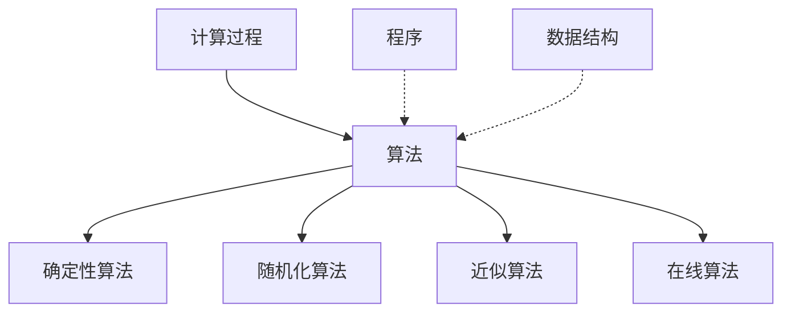

# 算法概念图谱


> **版本**: 1.0
> **创建日期**: 2026-04-19
> **最后更新**: 2026-04-19

> 算法设计与分析 - 详细概念定义
> 概念数量: 180个
> 最后更新: 2026-04-09

---

## 目录

1. [基础算法概念](#一基础算法概念)
2. [设计范式](#二设计范式)
3. [排序算法](#三排序算法)
4. [搜索算法](#四搜索算法)
5. [图算法](#五图算法)
6. [字符串算法](#六字符串算法)
7. [数值算法](#七数值算法)
8. [随机化算法](#八随机化算法)
9. [近似算法](#九近似算法)
10. [在线算法](#十在线算法)

---

## 一、基础算法概念

### 算法

**优先级**: P0
**编码**: CONCEPT-ALG-001

#### 1. 形式化定义

算法是计算问题的严格定义的计算过程，将输入映射到输出。

**定义**: 算法是一个五元组 $A = (Q, \Sigma, \delta, q_0, F)$ 的扩展形式，其中：

- $Q$: 状态集合
- $\Sigma$: 输入字母表
- $\delta$: 转移函数
- $q_0$: 初始状态
- $F$: 终止状态集合

或在RAM模型下：
$$A: \Sigma^* \rightarrow \Sigma^* \cup \{\bot\}$$

#### 2. 属性特征

**必要属性**:

- **有穷性**: 每个执行步骤在有限时间内完成
- **确定性**: 每个步骤有精确定义
- **有效性**: 每个操作可有效执行
- **输入/输出**: 有零个或多个输入，至少一个输出

**充分属性**:

- 终止性: 对所有有效输入最终停止
- 正确性: 产生期望输出

#### 3. 关系网络



**父概念**: 计算过程、可计算函数

**子概念**: 确定性算法、随机化算法、近似算法、在线算法、并行算法

**相关概念**: 数据结构、程序、复杂性类

#### 4. 直观解释

**算法即食谱**: 就像烹饪食谱精确描述制作一道菜的步骤，算法精确描述解决计算问题的步骤。

**算法即蓝图**: 算法是解决问题的设计蓝图，与具体实现（建筑材料）分离。

#### 5. 形式证明

**定理 (算法正确性)**: 若算法$A$满足循环不变式$P$，且：

1. 初始化: $P$在循环前成立
2. 保持: 若$P$在某次迭代前成立，则下次迭代前也成立
3. 终止: 循环终止时$P$推出期望结果

则$A$正确。

#### 6. 应用场景

- 排序、搜索数据处理
- 图网络分析
- 密码学安全协议
- 机器学习优化

---

### 时间复杂度

**优先级**: P0
**编码**: CONCEPT-ALG-002

#### 1. 形式化定义

**定义**: 算法的时间复杂度$T(n)$是输入规模为$n$时算法执行的基本操作数的函数。

在RAM模型下:
$$T(n) = \max\{t(x) : |x| = n\}$$

其中$t(x)$是输入$x$的实际运行时间。

**渐近记号**:

- 大$O$: $f(n) = O(g(n)) \Leftrightarrow \exists c, n_0: \forall n \geq n_0, f(n) \leq c \cdot g(n)$
- 大$\Omega$: $f(n) = \Omega(g(n)) \Leftrightarrow \exists c, n_0: \forall n \geq n_0, f(n) \geq c \cdot g(n)$
- 大$\Theta$: $f(n) = \Theta(g(n)) \Leftrightarrow f(n) = O(g(n)) \land f(n) = \Omega(g(n))$

#### 2. 属性特征

**必要属性**:

- 非负性: $T(n) \geq 0$
- 单调性: $n_1 \leq n_2 \Rightarrow T(n_1) \leq T(n_2)$（通常）

**等价刻画**:
$$T(n) = O(g(n)) \Leftrightarrow \limsup_{n \to \infty} \frac{T(n)}{g(n)} < \infty$$

#### 3. 关系网络

**父概念**: 算法、复杂性函数

**子概念**: 最坏情况复杂度、平均情况复杂度、摊还复杂度

**对偶概念**: 空间复杂度

#### 4. 直观解释

**时间复杂度即增长率**: 描述算法运行时间随输入规模增长的变化趋势，而非精确时间。

**时间复杂度即效率度量**: 不同机器速度不同，但增长率是算法本身的固有属性。

#### 5. 形式证明

**定理 (主定理)**: 对于递推式$T(n) = aT(n/b) + f(n)$，其中$a \geq 1, b > 1$:

1. 若$f(n) = O(n^{\log_b a - \epsilon})$，则$T(n) = \Theta(n^{\log_b a})$
2. 若$f(n) = \Theta(n^{\log_b a})$，则$T(n) = \Theta(n^{\log_b a} \log n)$
3. 若$f(n) = \Omega(n^{\log_b a + \epsilon})$且$af(n/b) \leq cf(n)$，则$T(n) = \Theta(f(n))$

#### 6. 应用场景

- 算法选择: 比较不同算法效率
- 性能预测: 预估大规模输入运行时间
- 优化目标: 指导算法优化方向

---

### 空间复杂度

**优先级**: P0
**编码**: CONCEPT-ALG-003

#### 1. 形式化定义

**定义**: 算法的空间复杂度$S(n)$是输入规模为$n$时算法执行所需内存空间（除输入外）的函数。

$$S(n) = \max\{s(x) : |x| = n\}$$

其中$s(x)$是输入$x$所需的辅助空间。

**空间层次**:

- 工作空间: 算法执行中临时使用的空间
- 递归栈: 递归调用所需的栈空间
- 输出空间: 存储结果所需空间（通常不计入）

#### 2. 属性特征

**必要属性**:

- 空间复杂度 $\leq$ 时间复杂度（在标准模型下）
- 原地算法: $S(n) = O(1)$ 或 $S(n) = O(\log n)$

**等价刻画**:

- DSPACE(s(n)): 确定性图灵机在$O(s(n))$空间内可判定的语言类

#### 3. 关系网络

**父概念**: 算法资源消耗

**对偶概念**: 时间复杂度

**相关概念**: 时间-空间权衡、原地算法

#### 4. 直观解释

**空间即内存**: 算法执行过程中需要的"草稿纸"空间。

**时间与空间的权衡**: 通常可以用更多空间换取更少时间，反之亦然。

#### 5. 形式证明

**定理 (空间层次定理)**: 对于空间可构造函数$s(n) \geq \log n$:
$$\text{DSPACE}(s(n)) \subsetneq \text{DSPACE}(s(n) \cdot \log s(n))$$

**定理 (Savitch)**:
$$\text{NSPACE}(s(n)) \subseteq \text{DSPACE}(s(n)^2)$$

#### 6. 应用场景

- 嵌入式系统: 内存受限环境
- 大数据处理: 流式算法设计
- 外部存储算法: 磁盘I/O优化

---

### 渐近分析

**优先级**: P1
**编码**: CONCEPT-ALG-004

#### 1. 形式化定义

**大O记号**:
$$O(g) = \{f : \exists c > 0, \exists n_0, \forall n \geq n_0, 0 \leq f(n) \leq c \cdot g(n)\}$$

**大Ω记号**:
$$\Omega(g) = \{f : \exists c > 0, \exists n_0, \forall n \geq n_0, 0 \leq c \cdot g(n) \leq f(n)\}$$

**大Θ记号**:
$$\Theta(g) = O(g) \cap \Omega(g)$$

**小o记号**:
$$o(g) = \{f : \forall c > 0, \exists n_0, \forall n \geq n_0, 0 \leq f(n) < c \cdot g(n)\}$$

#### 2. 属性特征

**传递性**: $f = O(g) \land g = O(h) \Rightarrow f = O(h)$

**自反性**: $f = O(f)$

**加法法则**: $O(f) + O(g) = O(\max(f, g))$

**乘法法则**: $O(f) \cdot O(g) = O(f \cdot g)$

#### 3. 关系网络

**父概念**: 算法分析

**子概念**: 最坏情况分析、平均情况分析、摊还分析

#### 4. 直观解释

**渐近分析即极限行为**: 关注$n \to \infty$时的增长趋势，忽略常数因子和低阶项。

**渐近分析即简化模型**: 提供独立于机器和实现的抽象比较框架。

#### 5. 形式证明

**定理**: 若$\lim_{n \to \infty} \frac{f(n)}{g(n)} = c$，则：

- $0 < c < \infty \Rightarrow f(n) = \Theta(g(n))$
- $c = 0 \Rightarrow f(n) = o(g(n))$
- $c = \infty \Rightarrow g(n) = o(f(n))$

#### 6. 应用场景

- 算法比较: 确定哪个算法在大规模输入下更优
- 复杂性分类: 定义复杂性类
- 性能保证: 提供算法性能上界

---

### 摊还分析

**优先级**: P1
**编码**: CONCEPT-ALG-008

#### 1. 形式化定义

**定义**: 摊还分析计算操作序列中每个操作的平均成本，其中某些操作可能"预付"后续操作的成本。

**摊还成本**:
$$\hat{c}_i = c_i + \Phi(D_i) - \Phi(D_{i-1})$$

其中：

- $c_i$: 实际成本
- $\Phi$: 势函数
- $D_i$: 第$i$次操作后的数据结构状态

#### 2. 属性特征

**三种方法**:

1. **聚合分析**: 计算总成本除以操作数
2. **记账方法**: 某些操作"预付"信用
3. **势函数方法**: 定义状态势函数

**必要属性**:

- 摊还成本 $\geq$ 实际平均成本
- 势函数非负: $\Phi(D) \geq \Phi(D_0) = 0$

#### 3. 关系网络

**父概念**: 算法分析、时间复杂度

**相关概念**: 势函数、数据结构（特别是伸展树、斐波那契堆）

#### 4. 直观解释

**摊还即平滑**: 昂贵操作的"冲击"被分摊到多个廉价操作中。

**摊还即保险**: 某些操作多付"保费"，为未来的昂贵操作储备。

#### 5. 形式证明

**定理**: 若$\hat{c}_i = c_i + \Phi(D_i) - \Phi(D_{i-1})$，则：
$$\sum_{i=1}^{n} \hat{c}_i = \sum_{i=1}^{n} c_i + \Phi(D_n) - \Phi(D_0) \geq \sum_{i=1}^{n} c_i$$

#### 6. 应用场景

- 动态表（动态数组）的插入
- 伸展树操作
- 斐波那契堆操作
- 并查集操作

---

## 二、设计范式

### 分治法

**优先级**: P0
**编码**: CONCEPT-ALG-026

#### 1. 形式化定义

**定义**: 分治法将问题分解为若干子问题，递归解决子问题，然后合并子问题的解。

**模式**:
$$T(n) = a \cdot T(n/b) + f(n)$$

其中：

- $a$: 子问题数量
- $n/b$: 子问题规模
- $f(n)$: 分解与合并成本

#### 2. 属性特征

**必要条件**:

- 子问题与原问题同类型
- 子问题可独立求解
- 子问题解可合并为原问题解

**充分条件**:

- 递归基例存在
- 子问题规模严格减小

#### 3. 关系网络

**父概念**: 递归、算法设计

**子概念**: 归并排序、快速排序、二分搜索、Strassen矩阵乘法

**对偶概念**: 动态规划（重叠子问题 vs 独立子问题）

#### 4. 直观解释

**分治即分而治之**: 像处理大项目一样，将其分解为小任务分配给团队成员。

**分治即递归**: 自相似问题的自相似解法。

#### 5. 形式证明

**定理 (主定理应用)**: 分治算法的时间复杂度由主定理确定。

**正确性证明** (结构归纳法):

1. **基例**: 小规模输入直接求解正确
2. **归纳步**: 假设子问题解正确，合并后原问题解正确

#### 6. 应用场景

- 排序: 归并排序、快速排序
- 搜索: 二分搜索
- 几何: 最近点对
- 矩阵: Strassen算法
- 选择: 中位数的中位数

---

### 动态规划

**优先级**: P0
**编码**: CONCEPT-ALG-027

#### 1. 形式化定义

**定义**: 动态规划通过记忆化或填表方式解决具有**最优子结构**和**重叠子问题**性质的问题。

**Bellman方程**:
$$OPT(i) = \min_{j < i} \{OPT(j) + c(j, i)\}$$

**最优子结构**:
$$OPT(S) = f(OPT(S_1), OPT(S_2), ..., OPT(S_k))$$

#### 2. 属性特征

**必要属性**:

- **最优子结构**: 最优解包含子问题的最优解
- **重叠子问题**: 子问题被重复求解

**实现方式**:

- 自顶向下 + 记忆化
- 自底向上 + 填表

#### 3. 关系网络

**父概念**: 递归、优化

**子概念**: 背包问题、最长公共子序列、最短路径、编辑距离

**对偶概念**: 分治法（重叠子问题 vs 独立子问题）

#### 4. 直观解释

**DP即记忆化**: "不要重复造轮子"，保存已计算结果避免重复计算。

**DP即填表**: 从小规模子问题开始，逐步构建大规模问题的解。

#### 5. 形式证明

**定理 (最优子结构)**: 若问题的最优解包含子问题的最优解，则可用DP求解。

**证明** (归纳法):

1. 证明所有子问题的最优解被正确计算
2. 证明原问题最优解可由子问题最优解构造

#### 6. 应用场景

- 组合优化: 背包、调度
- 字符串: LCS、编辑距离
- 图: 最短路径、最大流
- 生物信息: 序列比对
- 控制理论: 最优控制

---

### 贪心算法

**优先级**: P1
**编码**: CONCEPT-ALG-028

#### 1. 形式化定义

**定义**: 贪心算法在每一步做出局部最优选择，期望最终达到全局最优。

**贪心选择性质**:
$$\exists \text{最优解} S: \text{包含贪心选择} g$$

**最优子结构**:
$$OPT(S \setminus g) + g = OPT(S)$$

#### 2. 属性特征

**必要属性**:

- **贪心选择性质**: 局部最优可导向全局最优
- **最优子结构**: 子问题最优解构成原问题最优解

**充分条件**:

- 拟阵结构保证贪心最优性

#### 3. 关系网络

**父概念**: 算法设计、优化

**子概念**: 霍夫曼编码、Prim算法、Kruskal算法、Dijkstra算法、活动选择

**相关概念**: 动态规划、拟阵

#### 4. 直观解释

**贪心即短视**: 只看眼前利益，不做长远规划（但某些问题这样也有效！）

**贪心即贪心**: 每一步都"贪"取当前最好的。

#### 5. 形式证明

**证明技术**: "贪心 stays ahead" 或交换论证

**定理**: 若$(E, \mathcal{I})$是拟阵，则贪心算法找到最大权独立集。

#### 6. 应用场景

- 编码: 霍夫曼编码
- 图: MST、最短路径
- 调度: 活动选择、区间调度
- 覆盖: 集合覆盖近似
- 压缩: 最优合并

---

## 三、排序算法

### 快速排序

**优先级**: P0
**编码**: CONCEPT-ALG-046

#### 1. 形式化定义

**算法描述**:

```
QuickSort(A, p, r):
    if p < r:
        q = Partition(A, p, r)
        QuickSort(A, p, q-1)
        QuickSort(A, q+1, r)
```

**分区**:
$$\forall i < q: A[i] \leq A[q] \leq \forall j > q: A[j]$$

#### 2. 属性特征

**时间复杂度**:

- 最好: $\Theta(n \log n)$
- 平均: $\Theta(n \log n)$
- 最坏: $\Theta(n^2)$（已排序输入）

**空间复杂度**: $O(\log n)$（递归栈）

**稳定性**: 不稳定（但可修改）

#### 3. 关系网络

**父概念**: 分治法、比较排序

**相关概念**: 随机化快速排序、三向切分快速排序

#### 4. 直观解释

**快速排序即分而治之**: 选一个"基准"，小的放左边，大的放右边。

#### 5. 形式证明

**定理**: 快速排序平均比较次数为 $2n \ln n \approx 1.39n \log_2 n$

**证明** (递推):
$$C(n) = (n-1) + \frac{1}{n}\sum_{i=1}^{n}(C(i-1) + C(n-i))$$

#### 6. 应用场景

- 通用排序库实现
- 内存排序
- 并行排序基础

---

### 归并排序

**优先级**: P0
**编码**: CONCEPT-ALG-047

#### 1. 形式化定义

**算法描述**:

```
MergeSort(A, p, r):
    if p < r:
        q = floor((p+r)/2)
        MergeSort(A, p, q)
        MergeSort(A, q+1, r)
        Merge(A, p, q, r)
```

**归并**: 合并两个有序数组

#### 2. 属性特征

**时间复杂度**: $\Theta(n \log n)$（所有情况）

**空间复杂度**: $O(n)$（需要辅助数组）

**稳定性**: 稳定

#### 3. 关系网络

**父概念**: 分治法

**相关概念**: 外部排序、并行归并排序

#### 4. 直观解释

**归并排序即分而治之**: 先分成两半分别排序，再合并。

#### 5. 形式证明

**定理**: 归并排序时间复杂度为 $\Theta(n \log n)$

**证明**: $T(n) = 2T(n/2) + \Theta(n) = \Theta(n \log n)$（主定理情况2）

#### 6. 应用场景

- 外部排序（大数据）
- 链表排序
- 稳定排序需求
- 并行排序

---

## 四、搜索算法

### 深度优先搜索 (DFS)

**优先级**: P0
**编码**: CONCEPT-ALG-066

#### 1. 形式化定义

**算法描述**:

```
DFS(G, v):
    mark v as visited
    for each neighbor u of v:
        if u not visited:
            DFS(G, u)
```

**状态**: 未访问、访问中、已访问

#### 2. 属性特征

**时间复杂度**: $O(V + E)$

**空间复杂度**: $O(V)$（递归栈）

**完备性**: 有限图完备

#### 3. 关系网络

**父概念**: 图遍历

**子概念**: 拓扑排序、强连通分量、双连通分量

**对偶概念**: 广度优先搜索

#### 4. 直观解释

**DFS即"一条路走到黑"**: 尽可能深入，走不通再回溯。

#### 5. 形式证明

**定理**: DFS访问所有从起点可达的顶点

**证明** (归纳): 每次递归调用访问一个未访问邻居。

#### 6. 应用场景

- 拓扑排序
- 连通分量
- 环检测
- 迷宫求解
- 游戏树搜索

---

### 广度优先搜索 (BFS)

**优先级**: P1
**编码**: CONCEPT-ALG-067

#### 1. 形式化定义

**算法描述**:

```
BFS(G, s):
    initialize queue Q with s
    while Q not empty:
        v = Q.dequeue()
        for each neighbor u of v:
            if u not visited:
                mark u visited
                Q.enqueue(u)
```

#### 2. 属性特征

**时间复杂度**: $O(V + E)$

**空间复杂度**: $O(V)$

**最优性**: 无权图最短路径

#### 3. 关系网络

**父概念**: 图遍历

**子概念**: Dijkstra算法（带权版本）

**对偶概念**: 深度优先搜索

#### 4. 直观解释

**BFS即"层层推进"**: 像水波纹一样从起点向外扩散。

#### 5. 形式证明

**定理**: BFS找到无权图的最短路径

**证明**: 按距起点距离递增顺序访问顶点。

#### 6. 应用场景

- 最短路径（无权图）
- 社交网络分析
- Web爬虫
- 最小生成树（特殊版本）

---

## 五、图算法

### 最短路径

**优先级**: P0
**编码**: CONCEPT-ALG-081

#### 1. 形式化定义

**问题定义**: 给定带权图$G=(V, E, w)$和源点$s$，找到$s$到所有$v \in V$的最短路径。

**最短路径性质**:
$$\delta(s, v) = \min_{p: s \leadsto v} \sum_{e \in p} w(e)$$

**最优子结构**: 最短路径的子路径也是最短路径

#### 2. 属性特征

**三角不等式**: $\delta(s, v) \leq \delta(s, u) + w(u, v)$

**松弛操作**: 若$d[v] > d[u] + w(u, v)$，则更新$d[v]$

#### 3. 关系网络

**父概念**: 图优化

**子概念**: Dijkstra算法、Bellman-Ford算法、Floyd-Warshall算法

#### 4. 直观解释

**最短路径即"捷径"**: 图中两点间的最优路线。

#### 5. 形式证明

**定理 (最优子结构)**: 最短路径的子路径也是最短路径

**证明** (反证): 若子路径不是最短，则替换可得更短路径，矛盾。

#### 6. 应用场景

- 地图导航
- 网络路由
- 社交网络分析
- 供应链优化

---

### Dijkstra算法

**优先级**: P1
**编码**: CONCEPT-ALG-084

#### 1. 形式化定义

**算法描述**:

```
Dijkstra(G, w, s):
    Initialize-Single-Source(G, s)
    S = empty
    Q = V[G]
    while Q not empty:
        u = Extract-Min(Q)
        S = S ∪ {u}
        for each v in Adj[u]:
            Relax(u, v, w)
```

#### 2. 属性特征

**时间复杂度**: $O((V + E) \log V)$（使用二叉堆）

**正确性条件**: 所有边权非负

**贪心选择**: 每次选择距离最小的未处理顶点

#### 3. 关系网络

**父概念**: 最短路径、贪心算法

**相关概念**: Prim算法（结构类似）

#### 4. 直观解释

**Dijkstra即"稳扎稳打"**: 确定一个点的最短距离就不再改变。

#### 5. 形式证明

**定理**: Dijkstra算法正确计算单源最短路径（非负权图）

**证明** (归纳 + 贪心选择性质)

#### 6. 应用场景

- 地图导航
- 网络路由协议（OSPF）
- 游戏AI路径寻找

---

### 最小生成树

**优先级**: P0
**编码**: CONCEPT-ALG-082

#### 1. 形式化定义

**问题定义**: 给定连通无向图$G=(V, E, w)$，找到边权之和最小的生成树。

$$\min \sum_{e \in T} w(e) \text{ subject to } T \text{ 是生成树}$$

#### 2. 属性特征

**安全边**: 可被添加到当前森林而不形成环的边

**割性质**: 对于任意割，跨割的最小权边属于某MST

**环性质**: 对于任意环，最大权边不属于任何MST

#### 3. 关系网络

**父概念**: 图优化、贪心算法

**子概念**: Prim算法、Kruskal算法、Boruvka算法

#### 4. 直观解释

**MST即"最小连接"**: 连接所有顶点的最便宜方式。

#### 5. 形式证明

**定理 (割性质)**: 设$S \subset V$，$e$是横跨割$(S, V-S)$的最小权边，则$e$属于某MST。

#### 6. 应用场景

- 网络设计
- 聚类分析
- 图像分割
- 电路设计

---

## 六、字符串算法

### KMP算法

**优先级**: P1
**编码**: CONCEPT-ALG-127

#### 1. 形式化定义

**前缀函数**:
$$\pi[q] = \max\{k : k < q \text{ 且 } P[1..k] \text{ 是 } P[1..q] \text{ 的真后缀}\}$$

#### 2. 属性特征

**时间复杂度**: $O(n + m)$（匹配 + 预处理）

**空间复杂度**: $O(m)$

**不回溯**: 文本指针永不后退

#### 3. 关系分析

**核心思想**: 利用已匹配信息避免重复比较

#### 4. 应用场景

- 文本编辑器搜索
- DNA序列分析
- 网络入侵检测

---

## 七、数值算法

### 欧几里得算法

**优先级**: P0
**编码**: CONCEPT-ALG-141

#### 1. 形式化定义

**算法描述**:

```
GCD(a, b):
    if b = 0:
        return a
    else:
        return GCD(b, a mod b)
```

#### 2. 属性特征

**时间复杂度**: $O(\log \min(a, b))$

**正确性**: $\gcd(a, b) = \gcd(b, a \bmod b)$

#### 3. 形式证明

**定理**: 欧几里得算法正确计算最大公约数

**证明**: 基于$\gcd(a, b) = \gcd(b, a \bmod b)$

#### 4. 应用场景

- 分数化简
- 模逆元计算
- 密码学（RSA）

---

## 八、随机化算法

### 拉斯维加斯算法

**优先级**: P1
**编码**: CONCEPT-ALG-151

#### 1. 形式化定义

**定义**: 总是产生正确结果，但运行时间是随机的算法。

$$\forall x: P[A(x) \text{ 正确}] = 1$$

$$E[T_A(x)] = f(|x|)$$

#### 2. 属性特征

- 结果确定性
- 时间随机性
- 期望多项式时间

#### 3. 示例

- 随机快速排序
- 随机选择

---

### 蒙特卡洛算法

**优先级**: P1
**编码**: CONCEPT-ALG-152

#### 1. 形式化定义

**定义**: 运行时间确定，但结果可能错误的算法。

$$\forall x: P[A(x) \text{ 正确}] \geq 1 - \epsilon$$

$$T_A(x) = O(f(|x|))$$

#### 2. 属性特征

- 时间确定性
- 结果随机性
- 错误概率可控

#### 3. 示例

- Miller-Rabin素性测试
- 近似计数

---

## 九、近似算法

### 近似比

**优先级**: P1
**编码**: CONCEPT-ALG-161

#### 1. 形式化定义

**最大化问题**:
$$\frac{OPT}{A(I)} \leq \rho$$

**最小化问题**:
$$\frac{A(I)}{OPT} \leq \rho$$

其中$OPT$是最优解，$A(I)$是算法解。

#### 2. 属性特征

- $\rho = 1$: 最优算法
- $\rho$ 越接近1越好
- PTAS: $\rho = 1 + \epsilon$，时间关于$n$多项式，关于$1/\epsilon$任意

---

## 十、在线算法

### 在线算法

**优先级**: P0
**编码**: CONCEPT-ALG-171

#### 1. 形式化定义

**定义**: 输入逐个到达，算法必须在不预知未来输入的情况下立即做出决策。

**竞争比**:
$$\frac{ALG(\sigma)}{OPT(\sigma)} \leq c$$

其中$OPT$是离线最优算法。

#### 2. 属性特征

- 无未来信息
- 即时决策
- 与离线最优比较

#### 3. 示例

- 页置换问题
- ski租赁问题
- 列表更新问题

---

## 附录

### A. 算法分类索引

| 类别 | P0 | P1 | P2 |
|------|----|----|----|
| 基础算法 | 3 | 7 | 15 |
| 设计范式 | 2 | 6 | 12 |
| 排序 | 3 | 5 | 12 |
| 搜索 | 1 | 4 | 10 |
| 图算法 | 5 | 16 | 39 |
| 字符串 | 1 | 4 | 10 |
| 数值 | 1 | 3 | 6 |
| 随机化 | 0 | 3 | 7 |
| 近似 | 0 | 2 | 8 |
| 在线 | 1 | 3 | 6 |

### B. 参考文献

1. Cormen, T. H., et al. (2009). *Introduction to Algorithms* (3rd ed.). MIT Press.
2. Kleinberg, J., & Tardos, É. (2006). *Algorithm Design*. Pearson.
3. Motwani, R., & Raghavan, P. (1995). *Randomized Algorithms*. Cambridge University Press.
4. Borodin, A., & El-Yaniv, R. (1998). *Online Computation and Competitive Analysis*. Cambridge University Press.

---

*本图谱由FormalAlgorithm项目维护*

---

## 参考文献

- 待补充

---

## 知识导航

- [返回目录](README.md)
