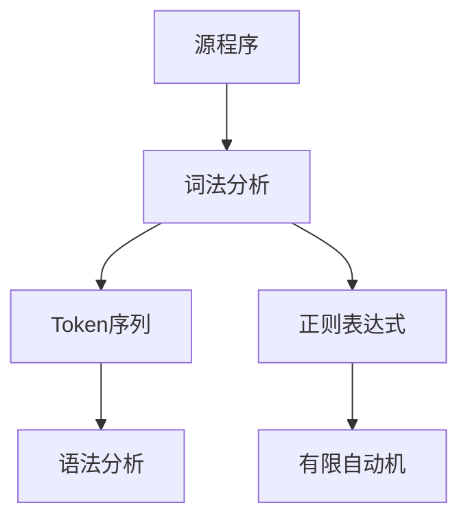
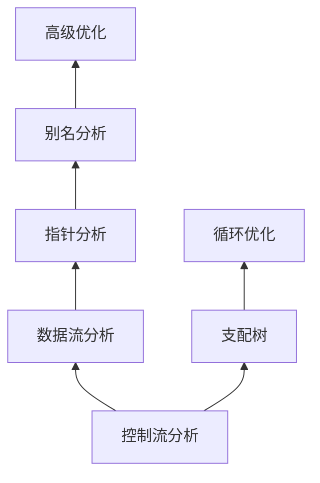
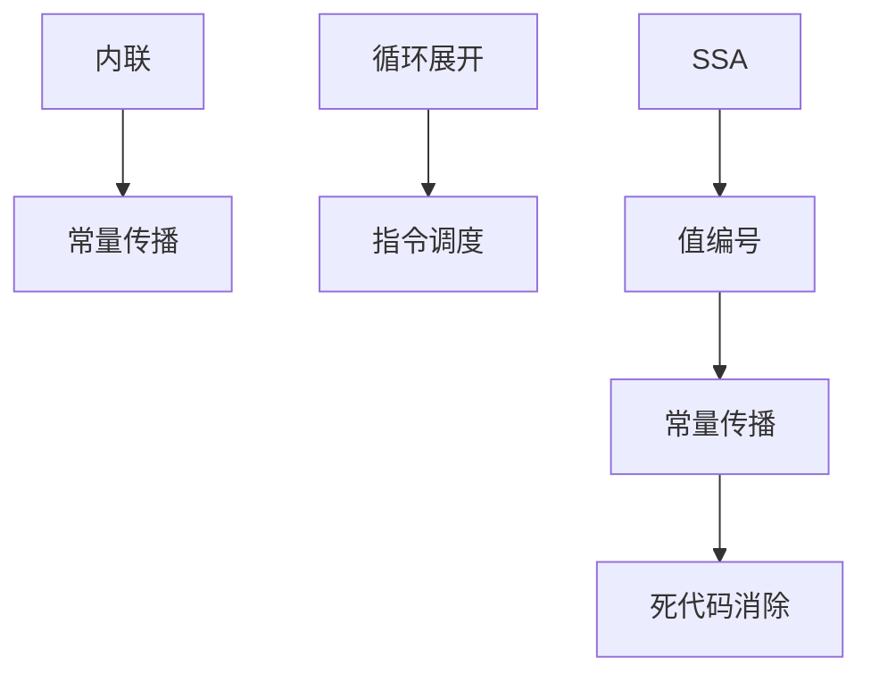

# 编译器概念图谱


> **版本**: 1.0
> **创建日期**: 2026-04-19
> **最后更新**: 2026-04-19

> 编译器设计与实现 - 详细概念定义
> 概念数量: 125个
> 最后更新: 2026-04-09

---

## 目录

- [编译器概念图谱](#编译器概念图谱)
  - [目录](#目录)
  - [一、词法分析](#一词法分析)
    - [词法分析](#词法分析)
      - [1. 形式化定义](#1-形式化定义)
      - [2. 属性特征](#2-属性特征)
      - [3. 关系网络](#3-关系网络)
    - [有限自动机](#有限自动机)
      - [1. 形式化定义](#1-形式化定义-1)
      - [2. 属性特征](#2-属性特征-1)
      - [3. 应用场景](#3-应用场景)
    - [Thompson构造法](#thompson构造法)
      - [1. 形式化定义](#1-形式化定义-2)
      - [2. 属性特征](#2-属性特征-2)
  - [二、语法分析](#二语法分析)
    - [上下文无关文法](#上下文无关文法)
      - [1. 形式化定义](#1-形式化定义-3)
      - [2. 属性特征](#2-属性特征-3)
    - [递归下降分析](#递归下降分析)
      - [1. 形式化定义](#1-形式化定义-4)
      - [2. 属性特征](#2-属性特征-4)
    - [LR分析](#lr分析)
      - [1. 形式化定义](#1-形式化定义-5)
      - [2. 属性特征](#2-属性特征-5)
      - [3. 应用场景](#3-应用场景-1)
    - [抽象语法树](#抽象语法树)
      - [1. 形式化定义](#1-形式化定义-6)
      - [2. 属性特征](#2-属性特征-6)
  - [三、中间表示与类型检查](#三中间表示与类型检查)
    - [中间表示](#中间表示)
      - [1. 形式化定义](#1-形式化定义-7)
      - [2. 属性特征](#2-属性特征-7)
    - [SSA形式](#ssa形式)
      - [1. 形式化定义](#1-形式化定义-8)
      - [2. 属性特征](#2-属性特征-8)
      - [3. 应用场景](#3-应用场景-2)
    - [类型检查](#类型检查)
      - [1. 形式化定义](#1-形式化定义-9)
      - [2. 属性特征](#2-属性特征-9)
    - [Hindley-Milner类型推断](#hindley-milner类型推断)
      - [1. 形式化定义](#1-形式化定义-10)
      - [2. 属性特征](#2-属性特征-10)
      - [3. 应用场景](#3-应用场景-3)
  - [四、数据流分析](#四数据流分析)
    - [数据流分析](#数据流分析)
      - [1. 形式化定义](#1-形式化定义-11)
      - [2. 属性特征](#2-属性特征-11)
    - [到达定值](#到达定值)
      - [1. 形式化定义](#1-形式化定义-12)
      - [2. 属性特征](#2-属性特征-12)
    - [活跃变量分析](#活跃变量分析)
      - [1. 形式化定义](#1-形式化定义-13)
      - [2. 属性特征](#2-属性特征-13)
    - [常量传播](#常量传播)
      - [1. 形式化定义](#1-形式化定义-14)
      - [2. 属性特征](#2-属性特征-14)
  - [五、指针分析与别名分析](#五指针分析与别名分析)
    - [指针分析](#指针分析)
      - [1. 形式化定义](#1-形式化定义-15)
      - [2. 属性特征](#2-属性特征-15)
    - [别名分析](#别名分析)
      - [1. 形式化定义](#1-形式化定义-16)
      - [2. 属性特征](#2-属性特征-16)
    - [调用图构建](#调用图构建)
      - [1. 形式化定义](#1-形式化定义-17)
  - [六、代码优化与生成](#六代码优化与生成)
    - [代码优化](#代码优化)
      - [1. 形式化定义](#1-形式化定义-18)
      - [2. 属性特征](#2-属性特征-17)
    - [死代码消除](#死代码消除)
      - [1. 形式化定义](#1-形式化定义-19)
      - [2. 属性特征](#2-属性特征-18)
    - [寄存器分配](#寄存器分配)
      - [1. 形式化定义](#1-形式化定义-20)
      - [2. 属性特征](#2-属性特征-19)
    - [指令选择](#指令选择)
      - [1. 形式化定义](#1-形式化定义-21)
  - [七、概念关系图谱](#七概念关系图谱)
    - [编译器整体架构](#编译器整体架构)
    - [分析层次](#分析层次)
    - [优化依赖](#优化依赖)
  - [八、学习路径](#八学习路径)
    - [P0 核心概念（3个）](#p0-核心概念3个)
    - [P1 重要概念（37个）](#p1-重要概念37个)
    - [P2 扩展概念（85个）](#p2-扩展概念85个)
  - [附录](#附录)
    - [参考资料](#参考资料)
  - [参考文献](#参考文献)
  - [知识导航](#知识导航)

---

## 一、词法分析

### 词法分析

**优先级**: P0
**编码**: CONCEPT-CMP-001

#### 1. 形式化定义

**定义**: 词法分析将字符流转换为词法单元(token)序列：

$$\text{Lexer}: \Sigma^* \rightarrow (\text{TokenType} \times \text{Attribute})^*$$

**Token结构**: $(\text{type}, \text{value}, \text{position})$

#### 2. 属性特征

**核心任务**:

- 识别关键字、标识符、常量、运算符
- 跳过空白和注释
- 报告词法错误

**最长匹配原则**: 选择最长的可能token

#### 3. 关系网络



---

### 有限自动机

**优先级**: P1
**编码**: CONCEPT-CMP-003

#### 1. 形式化定义

**DFA定义**: $M = (Q, \Sigma, \delta, q_0, F)$

- $Q$: 有限状态集合
- $\Sigma$: 输入字母表
- $\delta: Q \times \Sigma \rightarrow Q$: 转移函数
- $q_0 \in Q$: 初始状态
- $F \subseteq Q$: 接受状态集

**NFA定义**: $\delta: Q \times (\Sigma \cup \{\epsilon\}) \rightarrow 2^Q$

#### 2. 属性特征

**NFA转DFA**: 子集构造法，复杂度 $O(2^n)$ 最坏情况

**DFA最小化**: Hopcroft算法，$O(n \log n)$

#### 3. 应用场景

- 词法分析器生成（Lex/Flex）
- 正则表达式匹配
- 模式识别

---

### Thompson构造法

**优先级**: P2
**编码**: CONCEPT-CMP-009

#### 1. 形式化定义

**算法**: 从正则表达式递归构造NFA

**基本规则**:

- $\epsilon$: 两个状态，$\epsilon$转移
- $a \in \Sigma$: 两个状态，$a$转移
- $r_1 r_2$: NFA连接
- $r_1 | r_2$: NFA并行
- $r^*$: Kleene闭包构造

#### 2. 属性特征

**构造复杂度**: $O(|r|)$，产生的NFA状态数 $O(|r|)$

---

## 二、语法分析

### 上下文无关文法

**优先级**: P0
**编码**: CONCEPT-CMP-017

#### 1. 形式化定义

**CFG定义**: $G = (V, \Sigma, R, S)$

- $V$: 非终结符集合
- $\Sigma$: 终结符集合
- $R$: 产生式规则集合 $A \rightarrow \alpha$
- $S \in V$: 开始符号

#### 2. 属性特征

**推导**:

- 最左推导: 每次替换最左非终结符
- 最右推导: 每次替换最右非终结符

**文法分类**:

- LL(k): 从左到右、最左推导、向前看k个符号
- LR(k): 从左到右、最右推导、向前看k个符号

---

### 递归下降分析

**优先级**: P1
**编码**: CONCEPT-CMP-019

#### 1. 形式化定义

**方法**: 每个非终结符对应一个递归函数

```
parse_E():
    parse_T()
    while current_token == '+':
        consume('+')
        parse_T()
```

#### 2. 属性特征

**适用文法**: LL(1)文法

**优点**: 直观、易于手工实现

**局限**: 无法处理左递归、需要文法转换

---

### LR分析

**优先级**: P1
**编码**: CONCEPT-CMP-021

#### 1. 形式化定义

**LR分析器组成**:

- 输入缓冲区
- 分析栈（状态+符号）
- 分析表（ACTION + GOTO）

**ACTION表**:

- Shift: 移入下一个token
- Reduce: 按产生式规约
- Accept: 接受输入
- Error: 语法错误

#### 2. 属性特征

**LR变体**:

- SLR: 简单LR，基于FOLLOW集
- LALR: 向前看LR，合并同心项目集
- LR(1): 规范LR，最强大

#### 3. 应用场景

- Yacc/Bison生成的解析器
- 大多数编程语言
- 表达式求值

---

### 抽象语法树

**优先级**: P1
**编码**: CONCEPT-CMP-023

#### 1. 形式化定义

**定义**: AST是源代码的抽象语法结构：

- 去除括号等语法糖
- 保留语义信息
- 便于后续分析和代码生成

**语法树 vs AST**: 语法树保留所有语法细节，AST更抽象

#### 2. 属性特征

**节点类型**:

- 声明节点
- 表达式节点
- 语句节点
- 类型节点

---

## 三、中间表示与类型检查

### 中间表示

**优先级**: P1
**编码**: CONCEPT-CMP-042

#### 1. 形式化定义

**定义**: 介于源代码和目标代码之间的程序表示形式

**常见形式**:

- 三地址码: $x = y \text{ op } z$
- SSA形式: 静态单赋值
- 控制流图: 基本块的有向图

#### 2. 属性特征

**优点**:

- 机器无关
- 便于优化
- 便于移植

**LLVM IR**: 现代编译器广泛使用的IR

---

### SSA形式

**优先级**: P1
**编码**: CONCEPT-CMP-043

#### 1. 形式化定义

**SSA性质**: 每个变量只被赋值一次

**phi函数**: 在控制流合并处引入伪赋值
$$x_3 = \phi(x_1, x_2)$$

#### 2. 属性特征

**优势**:

- 简化数据流分析
- 优化更精确
- 便于寄存器分配

**转换**: 插入phi函数，重命名变量

#### 3. 应用场景

- LLVM、GCC中间表示
- JIT编译
- 静态分析

---

### 类型检查

**优先级**: P1
**编码**: CONCEPT-CMP-047

#### 1. 形式化定义

**类型推导规则**:
$$\frac{\Gamma \vdash e_1 : \text{int} \quad \Gamma \vdash e_2 : \text{int}}{\Gamma \vdash e_1 + e_2 : \text{int}}$$

**类型环境**: $\Gamma = \{x_1: \tau_1, x_2: \tau_2, \cdots\}$

#### 2. 属性特征

**检查方式**:

- 静态类型检查: 编译时检查
- 动态类型检查: 运行时检查
- gradual typing: 混合检查

---

### Hindley-Milner类型推断

**优先级**: P2
**编码**: CONCEPT-CMP-049

#### 1. 形式化定义

**算法步骤**:

1. 为每个表达式分配类型变量
2. 根据语法结构生成类型约束
3. 使用合一算法求解约束

**合一**: 找到最一般的类型替换

#### 2. 属性特征

**多态性**: 支持参数多态

**复杂度**: 接近线性时间

#### 3. 应用场景

- ML语言家族
- Haskell
- TypeScript部分特性

---

## 四、数据流分析

### 数据流分析

**优先级**: P1
**编码**: CONCEPT-CMP-065

#### 1. 形式化定义

**通用框架**: $(L, \wedge, F)$

- $L$: 数据流值的格
- $\wedge$: 交汇操作（meet/join）
- $F$: 转移函数集合

**方程组**:
$$\text{OUT}[b] = f_b(\text{IN}[b])$$
$$\text{IN}[b] = \bigwedge_{p \in pred(b)} \text{OUT}[p]$$

#### 2. 属性特征

**迭代求解**: 重复应用方程直到不动点

**收敛性**: 要求 $f$ 单调且格有有限高度

---

### 到达定值

**优先级**: P1
**编码**: CONCEPT-CMP-066

#### 1. 形式化定义

**定义**: 变量 $x$ 的定值 $d$ 到达程序点 $p$，如果存在从 $d$ 到 $p$ 的路径，且 $x$ 未被重新定义。

**数据流值**: 定值集合的位向量

**转移函数**:
$$\text{gen}[b]: \text{块内产生的定值}$$
$$\text{kill}[b]: \text{块内杀死的定值}$$

#### 2. 属性特征

**方向**: 前向分析

**交汇操作**: 并集（may分析）

---

### 活跃变量分析

**优先级**: P1
**编码**: CONCEPT-CMP-067

#### 1. 形式化定义

**定义**: 变量 $x$ 在程序点 $p$ 活跃，如果从 $p$ 到出口的路径上存在对 $x$ 的使用，且使用前无重新定义。

**用途**:

- 寄存器分配
- 死代码消除

#### 2. 属性特征

**方向**: 后向分析

**交汇操作**: 并集

---

### 常量传播

**优先级**: P1
**编码**: CONCEPT-CMP-069

#### 1. 形式化定义

**lattice**: $\top$（非常量）$> c$（常量）$> \bot$（未定义）

**转移**:

- $x = c \Rightarrow [x \mapsto c]$
- $x = y + z$，若 $y, z$ 均为常量，则传播结果

#### 2. 属性特征

**条件常量传播**: 在SSA上更精确，考虑控制流

---

## 五、指针分析与别名分析

### 指针分析

**优先级**: P1
**编码**: CONCEPT-CMP-086

#### 1. 形式化定义

**问题**: 确定指针可能指向的内存位置集合

**Andersen分析** (包含型):
$$p \supseteq q \Rightarrow pt(p) \supseteq pt(q)$$

**Steensgaard分析** (等价型):
$$p = q \Rightarrow pt(p) = pt(q)$$

#### 2. 属性特征

**精度 vs 效率权衡**:

- Andersen: $O(n^3)$，更精确
- Steensgaard: 近乎线性，较粗略

---

### 别名分析

**优先级**: P1
**编码**: CONCEPT-CMP-087

#### 1. 形式化定义

**别名**: 两个指针指向同一内存位置

**分类**:

- 必别名: 总是指向同一位置
- 可能别名: 可能指向同一位置
- 不别名: 绝不指向同一位置

#### 2. 属性特征

**敏感性维度**:

- 流敏感: 考虑程序点
- 上下文敏感: 考虑调用上下文
- 域敏感: 考虑结构体字段
- 对象敏感: 区分不同分配点

---

### 调用图构建

**优先级**: P2
**编码**: CONCEPT-CMP-099

#### 1. 形式化定义

**问题**: 确定程序中哪些函数可能调用哪些函数

**CHA (Class Hierarchy Analysis)**:

- 基于类型层次
- 快速但不精确

**RTA (Rapid Type Analysis)**:

- 考虑实例化类型
- 比CHA精确

**k-CFA (Control Flow Analysis)**:

- 上下文敏感
- 最精确但昂贵

---

## 六、代码优化与生成

### 代码优化

**优先级**: P1
**编码**: CONCEPT-CMP-106

#### 1. 形式化定义

**优化**: 程序转换 $P \rightarrow P'$，保持语义但提升性能

**类型**:

- 机器无关优化: 在IR上进行
- 机器相关优化: 针对特定架构

#### 2. 属性特征

**优化级别**:

- O0: 无优化
- O1: 基本优化
- O2: 激进优化（推荐）
- O3: 高度优化（可能增加代码大小）
- Os: 优化代码大小

---

### 死代码消除

**优先级**: P1
**编码**: CONCEPT-CMP-070

#### 1. 形式化定义

**死代码**: 不影响程序输出的代码

**不可达代码**: 没有任何执行路径到达的代码

**无用赋值**: 赋值后不再使用的变量

#### 2. 属性特征

**分析方法**:

- 控制流分析: 检测不可达代码
- 活跃分析: 检测无用赋值

---

### 寄存器分配

**优先级**: P1
**编码**: CONCEPT-CMP-110

#### 1. 形式化定义

**问题**: 将无限虚拟寄存器映射到有限物理寄存器

**图着色法**:

- 构造冲突图（同时活跃的变量连边）
- 尝试 $k$ 着色（$k$ 为寄存器数）
- 若不可着色，选择溢出变量

#### 2. 属性特征

**线性扫描**: 简单高效，用于JIT编译

**图着色**: 更优分配，用于AOT编译

---

### 指令选择

**优先级**: P2
**编码**: CONCEPT-CMP-109

#### 1. 形式化定义

**问题**: 将IR指令映射到目标机器指令

**方法**:

- 宏展开: 简单替换
- 树模式匹配: 覆盖AST
- 基于文法的: BURS（Bottom-Up Rewriting System）

---

## 七、概念关系图谱

### 编译器整体架构


### 分析层次



### 优化依赖



---

## 八、学习路径

### P0 核心概念（3个）

1. **词法分析** - 编译器前端入口
2. **上下文无关文法** - 语法基础
3. **语法分析** - 程序结构解析

### P1 重要概念（37个）

**词法分析**: 正则表达式、有限自动机、DFA最小化

**语法分析**: 递归下降、LR分析、LL分析、AST

**IR与类型**: 中间表示、SSA、类型检查、类型推断

**数据流分析**: 到达定值、活跃变量、常量传播、控制流图

**代码生成**: 代码优化、死代码消除、寄存器分配

### P2 扩展概念（85个）

深入学习：

- 高级语法分析技术
- 高级类型系统
- 指针分析敏感性
- 高级优化技术（向量化、并行化）
- 现代编译器框架（LLVM、MLIR）

---

## 附录

### 参考资料

1. Aho, A.V., et al. "Compilers: Principles, Techniques, and Tools" (Dragon Book)
2. Cooper, K.D., and Torczon, L. "Engineering a Compiler"
3. Appel, A.W. "Modern Compiler Implementation in ML/C/Java"
4. LLVM Documentation (llvm.org)

---

*本概念图谱由FormalAlgorithm项目维护*

---

## 参考文献

- 待补充

---

## 知识导航

- [返回目录](README.md)
