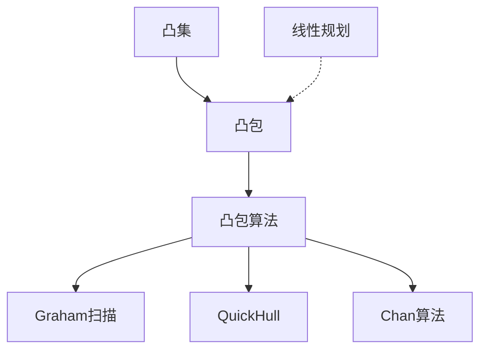
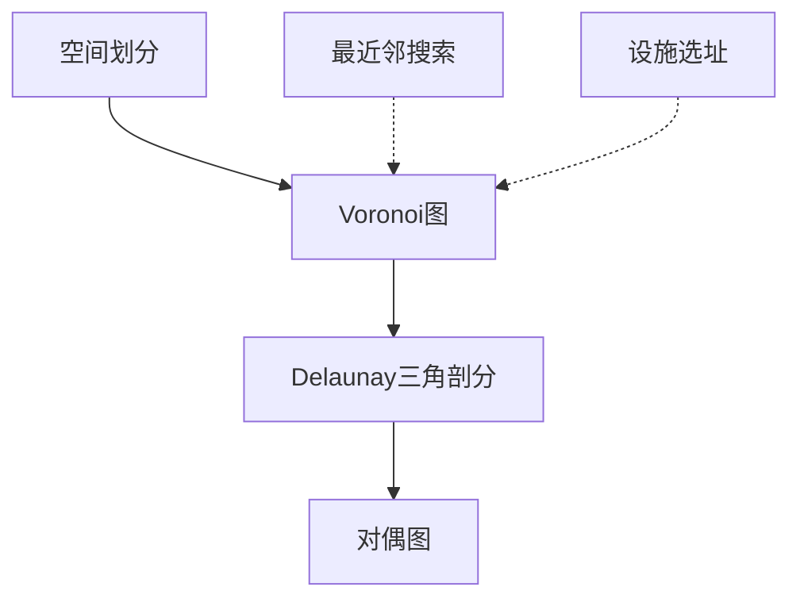
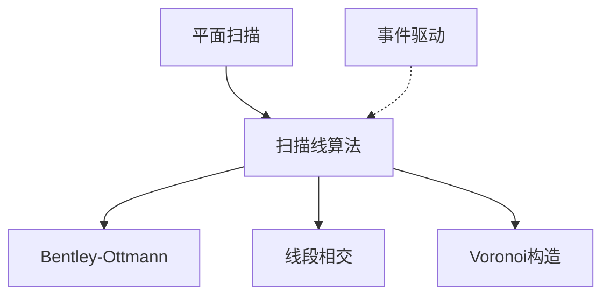
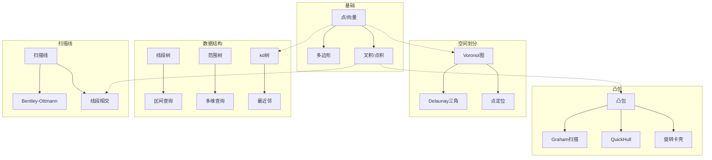
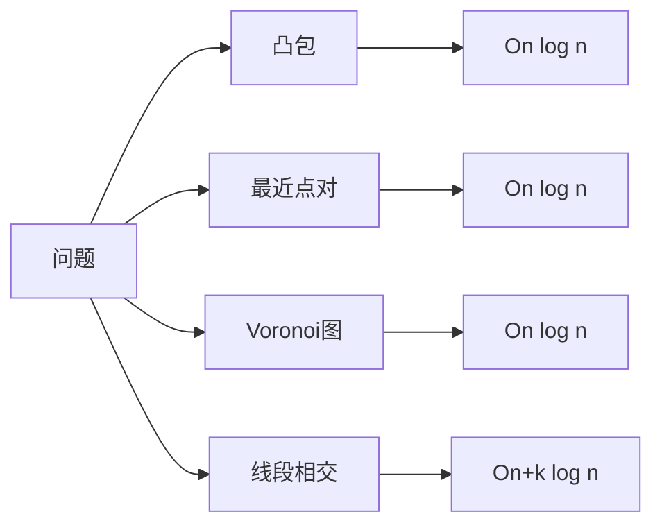

# 计算几何概念图谱

> **版本**: 1.0
> **创建日期**: 2026-04-19
> **最后更新**: 2026-04-19

> 计算几何算法与应用 - 详细概念定义
> 概念数量: 90个
> 最后更新: 2026-04-09

---

## 目录

1. [基础几何对象](#一基础几何对象)
2. [凸包算法](#二凸包算法)
3. [空间划分与Voronoi图](#三空间划分与voronoi图)
4. [范围查询与数据结构](#四范围查询与数据结构)
5. [扫描线与交点检测](#五扫描线与交点检测)
6. [概念关系图谱](#六概念关系图谱)
7. [学习路径](#七学习路径)

---

## 一、基础几何对象

### 点与向量

**优先级**: P0
**编码**: CONCEPT-CGM-001/002

#### 1. 形式化定义

**点** (Point): 欧几里得空间中的位置
$$P = (x, y) \in \mathbb{R}^2 \text{ 或 } (x, y, z) \in \mathbb{R}^3$$

**向量** (Vector): 有方向和大小的量
$$\vec{v} = \overrightarrow{AB} = B - A = (v_x, v_y)$$

**点积**:
$$\vec{a} \cdot \vec{b} = a_x b_x + a_y b_y = |\vec{a}| |\vec{b}| \cos \theta$$

**叉积** (二维):
$$\vec{a} \times \vec{b} = a_x b_y - a_y b_x = |\vec{a}| |\vec{b}| \sin \theta$$

#### 2. 属性特征

**叉积方向判断**:

- $\vec{a} \times \vec{b} > 0$: $\vec{b}$ 在 $\vec{a}$ 左侧（逆时针）
- $\vec{a} \times \vec{b} < 0$: $\vec{b}$ 在 $\vec{a}$ 右侧（顺时针）
- $\vec{a} \times \vec{b} = 0$: 共线

#### 3. 应用场景

- 方向判断
- 面积计算
- 线段相交检测

---

### 多边形

**优先级**: P1
**编码**: CONCEPT-CGM-007

#### 1. 形式化定义

**简单多边形**: 由顶点序列 $P_1, P_2, \cdots, P_n$ 定义的封闭链，边不相交（除相邻边在顶点相交）

**凸多边形**: 对任意两点 $A, B \in P$，线段 $AB \subseteq P$

**多边形面积** (Shoelace公式):
$$A = \frac{1}{2} \left| \sum_{i=1}^{n} (x_i y_{i+1} - x_{i+1} y_i) \right|$$

#### 2. 属性特征

**点包含测试**:

- 射线法: 从点发射射线，计算与多边形边交点数量
- 环绕数法: 计算多边形绕点的总角度

---

## 二、凸包算法

### 凸包

**优先级**: P0
**编码**: CONCEPT-CGM-018

#### 1. 形式化定义

**定义**: 点集 $S$ 的凸包是包含 $S$ 的最小凸集：

$$\text{CH}(S) = \left\{ \sum_{i=1}^{k} \lambda_i p_i : k \geq 1, p_i \in S, \lambda_i \geq 0, \sum \lambda_i = 1 \right\}$$

**等价定义**: 所有包含 $S$ 的凸集的交集

#### 2. 属性特征

**凸包顶点**: 凸包的极值点，必为 $S$ 中的点

**Carathéodory定理**: $\mathbb{R}^d$ 中任何点可表示为至多 $d+1$ 个点的凸组合

#### 3. 关系网络

#### 4. 应用场景

- 碰撞检测
- 形状分析
- 最小包围盒计算

---

### Graham扫描

**优先级**: P1
**编码**: CONCEPT-CGM-019

#### 1. 形式化定义

**算法步骤**:

1. 找到最下最左的点 $p_0$ 作为极点
2. 按极角对其他点排序
3. 使用栈构建凸包，维护左转性质

**左转测试**: 对连续三点 $p_{i-1}, p_i, p_{i+1}$，计算叉积
$$(p_i - p_{i-1}) \times (p_{i+1} - p_i) > 0$$

#### 2. 属性特征

**时间复杂度**: $O(n \log n)$（主要由排序决定）

**空间复杂度**: $O(n)$

#### 3. 形式证明

**正确性**: 算法维护的栈始终包含已处理点的凸包

**终止性**: 每个点入栈和出栈最多一次

---

### 旋转卡壳

**优先级**: P2
**编码**: CONCEPT-CGM-028

#### 1. 形式化定义

**技术**: 在凸包上放置两条平行支持线，同时旋转扫描

**应用**:

- 直径: 最远距离点对
- 宽度: 最小平行线距离
- 最小包围矩形

#### 2. 属性特征

**时间复杂度**: $O(n)$（凸包已构建）

**对踵点**: 旋转过程中距离最远的点对

---

## 三、空间划分与Voronoi图

### Voronoi图

**优先级**: P0
**编码**: CONCEPT-CGM-030

#### 1. 形式化定义

**定义**: 给定站点集 $P = \{p_1, p_2, \cdots, p_n\}$，Voronoi区域定义为：

$$V(p_i) = \{x \in \mathbb{R}^d : \|x - p_i\| \leq \|x - p_j\|, \forall j \neq i\}$$

**Voronoi边**: 两个区域的边界，到两个站点等距

**Voronoi顶点**: 三个或更多区域的交点

#### 2. 属性特征

**性质**:

- Voronoi区域是凸多边形
- $n$ 个站点的Voronoi图有 $O(n)$ 个顶点和边
- Voronoi图是点定位的有效数据结构

#### 3. 关系网络

**对偶关系**: Voronoi图与Delaunay三角剖分互为对偶图

#### 4. 应用场景

- 最近邻搜索
- 设施选址
- 网格生成
- 自然邻插值

---

### Delaunay三角剖分

**优先级**: P1
**编码**: CONCEPT-CGM-031

#### 1. 形式化定义

**定义**: 点集 $P$ 的Delaunay三角剖分是满足以下条件的三角剖分：

**空外接圆性质**: 任何三角形的外接圆内不含其他点

**最大化最小角**: 在所有三角剖分中，Delaunay剖分最大化最小内角

#### 2. 属性特征

**边数**: 平面点集的Delaunay三角剖分有 $3n - 3 - h$ 条边，$h$ 为凸包顶点数

**构造算法**:

- 分治法: $O(n \log n)$
- 逐点插入: 期望 $O(n \log n)$
- 扫描线: $O(n \log n)$

#### 3. 应用场景

- 地形建模
- 有限元分析
- 计算机图形学

---

## 四、范围查询与数据结构

### 线段树

**优先级**: P1
**编码**: CONCEPT-CGM-045

#### 1. 形式化定义

**定义**: 线段树是一种平衡二叉树，用于存储区间信息：

- 每个节点对应一个区间 $[l, r]$
- 叶子节点对应单位区间 $[i, i]$
- 内部节点 $[l, r]$ 的子节点为 $[l, mid]$ 和 $[mid+1, r]$

**高度**: $\lceil \log_2 n \rceil$

#### 2. 属性特征

**操作复杂度**:

- 单点更新: $O(\log n)$
- 区间查询: $O(\log n)$
- 区间更新（懒标记）: $O(\log n)$

#### 3. 应用场景

- 区间最值查询（RMQ）
- 区间和/统计
- 矩形区域查询

---

### 范围树

**优先级**: P1
**编码**: CONCEPT-CGM-047

#### 1. 形式化定义

**定义**: $d$ 维范围树是嵌套的二叉搜索树结构：

- 第一层按第一维排序
- 每个节点包含关联结构，按第二维排序（递归定义）

**查询**: 正交范围查询 $[x_1, x_2] \times [y_1, y_2]$

#### 2. 属性特征

**空间**: $O(n \log^{d-1} n)$

**查询时间**: $O(\log^d n + k)$，$k$ 为输出大小

**分数级联优化**: 降至 $O(\log^{d-1} n + k)$

#### 3. 应用场景

- 多维数据库查询
- 空间索引
- 正交范围搜索

---

### kd树

**优先级**: P1
**编码**: CONCEPT-CGM-048

#### 1. 形式化定义

**定义**: kd树是空间划分树，循环使用各维度进行划分：

- 第 $i$ 层使用维度 $i \mod d$ 进行划分
- 选择中位数作为划分点，保持平衡

#### 2. 属性特征

**构造**: $O(n \log n)$

**最近邻查询**: 平均 $O(\log n)$，最坏 $O(n)$

**范围查询**: $O(\sqrt{n} + k)$（二维）

#### 3. 应用场景

- 最近邻搜索
- 范围搜索
- N体问题

---

## 五、扫描线与交点检测

### 扫描线算法

**优先级**: P1
**编码**: CONCEPT-CGM-065

#### 1. 形式化定义

**思想**: 用一条扫描线从左到右扫过平面，维护与扫描线相交的几何对象集合

**事件驱动**: 在关键位置（如线段端点）处理事件

**数据结构**: 扫描线状态（通常用平衡二叉搜索树维护）

#### 2. 属性特征

**时间复杂度**: $O((n + k) \log n)$，$k$ 为输出大小

**空间复杂度**: $O(n)$

#### 3. 关系网络

---

### Bentley-Ottmann算法

**优先级**: P1
**编码**: CONCEPT-CGM-067

#### 1. 形式化定义

**问题**: 报告 $n$ 条线段的全部 $k$ 个交点

**算法**: 扫描线 + 事件队列

**事件类型**:

- 线段左端点: 插入到扫描线状态
- 线段右端点: 从扫描线状态删除
- 交点: 交换相交线段顺序

#### 2. 属性特征

**时间复杂度**: $O((n + k) \log n)$

**空间复杂度**: $O(n + k)$

#### 3. 应用场景

- 地图叠加
- 布尔运算
- 电路设计验证

---

### 最近点对

**优先级**: P1
**编码**: CONCEPT-CGM-081

#### 1. 形式化定义

**问题**: 给定 $n$ 个点，找到距离最近的点对

**分治算法**:

1. 按 $x$ 坐标中位数划分
2. 递归求解左右两半
3. 处理跨越中线的点对（只需检查带状区域内最多6个点）

#### 2. 属性特征

**时间复杂度**: $O(n \log n)$

**关键引理**: 对于带状区域内的每个点，只需检查其后继的最多6个点

#### 3. 形式证明

**引理证明**: 将带状区域划分为 $\delta/2 \times 2\delta/3$ 的小格，每格最多一个点。

---

## 六、概念关系图谱

### 全局关系图

### 算法复杂度对比

---

## 七、学习路径

### P0 核心概念（3个）

1. **点与向量** - 几何计算基础
2. **凸包** - 最基础的几何结构
3. **Voronoi图** - 空间划分的核心概念

### P1 重要概念（27个）

**凸包算法**: Graham扫描、QuickHull、旋转卡壳

**空间划分**: Delaunay三角剖分、点定位、梯形图

**数据结构**: 线段树、范围树、kd树、区间树

**扫描线**: Bentley-Ottmann、线段相交、半平面交

**几何优化**: 最近点对、最小包围圆

### P2 扩展概念（70个）

深入学习：

- 高级凸包算法（Chan算法、Kirkpatrick-Seidel）
- 高维Voronoi与Delaunay
- 分数级联优化
- 计算几何在图形学、机器人学的应用

---

## 附录

### 参考资料

1. de Berg, M., et al. "Computational Geometry: Algorithms and Applications"
2. O'Rourke, J. "Computational Geometry in C"
3. Preparata, F.P., and Shamos, M.I. "Computational Geometry"

---

*本概念图谱由FormalAlgorithm项目维护*

---

## 参考文献

- 待补充

---

## 知识导航

- [返回目录](README.md)
