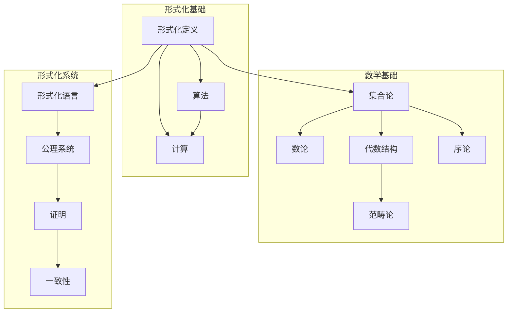
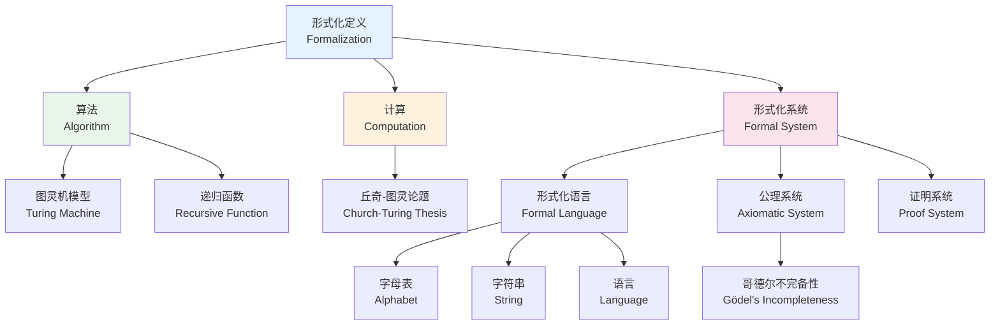
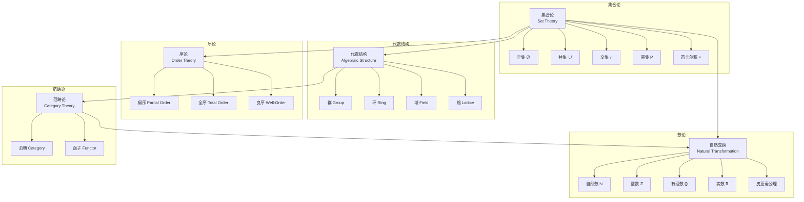
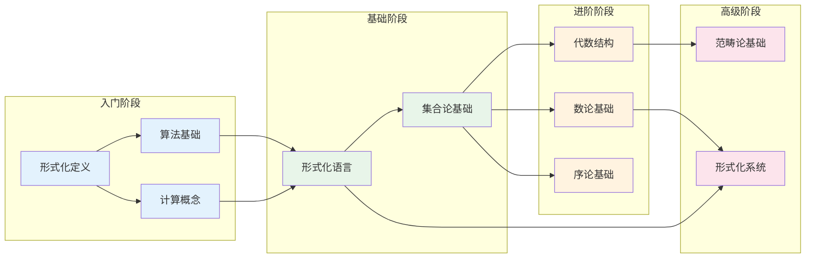

# 01-基础理论知识图谱

> **创建日期**: 2025-04-08
> **覆盖范围**: 01-基础理论模块全部文档
> **目的**: 建立基础理论概念间的语义链接网络

---

## 一、模块概念依赖图

### 1.1 核心概念依赖关系

### 1.2 详细概念关系表

| 源概念 | 目标概念 | 关系类型 | 强度 | 说明 |
|--------|----------|----------|------|------|
| 形式化定义 | 算法 | depends_on | 强 | 算法需要形式化定义 |
| 形式化定义 | 计算 | depends_on | 强 | 计算过程需要形式化 |
| 算法 | 计算 | implements | 强 | 算法实现计算过程 |
| 形式化定义 | 形式化语言 | is_part_of | 强 | 形式化语言是形式化的组成部分 |
| 形式化语言 | 公理系统 | depends_on | 中 | 公理系统建立在形式化语言上 |
| 集合论 | 数论 | depends_on | 中 | 自然数在集合论中构造 |
| 集合论 | 代数结构 | depends_on | 中 | 代数结构基于集合论 |
| 代数结构 | 范畴论 | specializes | 弱 | 范畴论推广代数结构 |

---

## 二、核心概念图谱

### 2.1 形式化定义概念层次

### 2.2 数学基础概念层次

---

## 三、概念详细列表

### 3.1 形式化与算法概念

| 概念ID | 中文名 | 英文名 | 难度 | 前置概念 | 后续概念 | 文档位置 |
|--------|--------|--------|------|---------|---------|---------|
| formalization | 形式化 | Formalization | beginner | 无 | algorithm, computation | 01-形式化定义.md §1.1 |
| algorithm | 算法 | Algorithm | beginner | formalization | complexity, recursion | 01-形式化定义.md §1.2 |
| computation | 计算 | Computation | beginner | formalization, algorithm | computability | 01-形式化定义.md §1.3 |
| turing_machine | 图灵机 | Turing Machine | intermediate | algorithm, computation | computability_models | 01-形式化定义.md §3.1 |
| church_turing_thesis | 丘奇-图灵论题 | Church-Turing Thesis | intermediate | computation, lambda_calculus | computability | 01-形式化定义.md §1.3 |
| formal_system | 形式化系统 | Formal System | intermediate | formalization | proof_system | 01-形式化定义.md §5 |
| axiom | 公理 | Axiom | beginner | formal_system | theorem | 01-形式化定义.md §5.1 |
| proof | 证明 | Proof | intermediate | formal_system | proof_system | 01-形式化定义.md §5.2 |
| consistency | 一致性 | Consistency | advanced | formal_system | completeness | 01-形式化定义.md §5.3 |
| completeness | 完备性 | Completeness | advanced | formal_system, consistency | incompleteness | 01-形式化定义.md §5.3 |
| incompleteness | 不完备性 | Incompleteness | advanced | completeness | 无 | 01-形式化定义.md §5.3 |

### 3.2 形式化语言概念

| 概念ID | 中文名 | 英文名 | 难度 | 前置概念 | 后续概念 | 文档位置 |
|--------|--------|--------|------|---------|---------|---------|
| alphabet | 字母表 | Alphabet | beginner | 无 | string, language | 01-形式化定义.md §2.1 |
| string | 字符串 | String | beginner | alphabet | language | 01-形式化定义.md §2.2 |
| language | 语言 | Language | beginner | string | formal_grammar | 01-形式化定义.md §2.3 |
| kleene_star | 克林闭包 | Kleene Star | intermediate | language | regular_expression | 01-形式化定义.md §2.3 |
| grammar | 文法 | Grammar | intermediate | language | context_free_grammar | 01-形式化定义.md §2 |

### 3.3 数学基础概念

#### 3.3.1 集合论概念

| 概念ID | 中文名 | 英文名 | 难度 | 前置概念 | 后续概念 |
|--------|--------|--------|------|---------|---------|
| set | 集合 | Set | beginner | 无 | subset, union, intersection |
| element | 元素 | Element | beginner | set | membership |
| membership | 属于 | Membership | beginner | set, element | subset |
| subset | 子集 | Subset | beginner | set | power_set |
| union | 并集 | Union | beginner | set | intersection |
| intersection | 交集 | Intersection | beginner | set | difference |
| difference | 差集 | Difference | beginner | set, union | symmetric_difference |
| power_set | 幂集 | Power Set | intermediate | set | cartesian_product |
| cartesian_product | 笛卡尔积 | Cartesian Product | intermediate | set | relation |
| relation | 关系 | Relation | intermediate | cartesian_product | function |
| function | 函数 | Function | intermediate | relation | injection, surjection |
| injection | 单射 | Injection | intermediate | function | bijection |
| surjection | 满射 | Surjection | intermediate | function | bijection |
| bijection | 双射 | Bijection | intermediate | injection, surjection | cardinality |
| equivalence_relation | 等价关系 | Equivalence Relation | intermediate | relation | equivalence_class |
| equivalence_class | 等价类 | Equivalence Class | intermediate | equivalence_relation | quotient_set |
| zfc | ZFC公理系统 | ZFC Axioms | advanced | set | ordinal, cardinal |

#### 3.3.2 数论概念

| 概念ID | 中文名 | 英文名 | 难度 | 前置概念 | 后续概念 |
|--------|--------|--------|------|---------|---------|
| natural_number | 自然数 | Natural Number | beginner | set | integer |
| peano_axioms | 皮亚诺公理 | Peano Axioms | intermediate | natural_number | mathematical_induction |
| mathematical_induction | 数学归纳法 | Mathematical Induction | intermediate | peano_axioms | strong_induction |
| integer | 整数 | Integer | beginner | natural_number | rational_number |
| rational_number | 有理数 | Rational Number | intermediate | integer | real_number |
| real_number | 实数 | Real Number | intermediate | rational_number | complex_number |
| prime_number | 素数 | Prime Number | beginner | natural_number | fundamental_theorem_arithmetic |
| gcd | 最大公约数 | GCD | intermediate | integer | euclidean_algorithm |
| euclidean_algorithm | 欧几里得算法 | Euclidean Algorithm | intermediate | gcd | bezout_identity |
| bezout_identity | 贝祖定理 | Bézout's Identity | advanced | euclidean_algorithm | modular_arithmetic |
| modular_arithmetic | 模运算 | Modular Arithmetic | intermediate | integer | cryptography |
| fundamental_theorem_arithmetic | 算术基本定理 | Fundamental Theorem of Arithmetic | intermediate | prime_number | factorization |

#### 3.3.3 代数结构概念

| 概念ID | 中文名 | 英文名 | 难度 | 前置概念 | 后续概念 |
|--------|--------|--------|------|---------|---------|
| group | 群 | Group | intermediate | set, function | subgroup, homomorphism |
| subgroup | 子群 | Subgroup | intermediate | group | normal_subgroup |
| cyclic_group | 循环群 | Cyclic Group | intermediate | group | abelian_group |
| abelian_group | 阿贝尔群 | Abelian Group | intermediate | group | ring |
| homomorphism | 同态 | Homomorphism | advanced | group | isomorphism |
| isomorphism | 同构 | Isomorphism | advanced | homomorphism | automorphism |
| ring | 环 | Ring | intermediate | abelian_group | field, ideal |
| field | 域 | Field | advanced | ring | vector_space |
| ideal | 理想 | Ideal | advanced | ring | quotient_ring |
| lattice | 格 | Lattice | intermediate | order | boolean_algebra |
| boolean_algebra | 布尔代数 | Boolean Algebra | advanced | lattice | logic |

#### 3.3.4 序论概念

| 概念ID | 中文名 | 英文名 | 难度 | 前置概念 | 后续概念 |
|--------|--------|--------|------|---------|---------|
| partial_order | 偏序 | Partial Order | intermediate | relation | total_order |
| total_order | 全序 | Total Order | intermediate | partial_order | well_order |
| well_order | 良序 | Well-Order | advanced | total_order | transfinite_induction |
| poset | 偏序集 | Poset | intermediate | partial_order | hasse_diagram |
| chain | 链 | Chain | intermediate | poset | antichain |
| antichain | 反链 | Antichain | intermediate | poset | dilworth_theorem |
| lub | 最小上界 | LUB/Supremum | intermediate | poset | complete_lattice |
| glb | 最大下界 | GLB/Infimum | intermediate | poset | complete_lattice |

#### 3.3.5 范畴论概念

| 概念ID | 中文名 | 英文名 | 难度 | 前置概念 | 后续概念 |
|--------|--------|--------|------|---------|---------|
| category | 范畴 | Category | advanced | set, function | functor |
| object | 对象 | Object | advanced | category | morphism |
| morphism | 态射 | Morphism | advanced | object | composition |
| composition | 复合 | Composition | advanced | morphism | associativity |
| identity | 单位态射 | Identity | advanced | morphism | isomorphism_cat |
| functor | 函子 | Functor | advanced | category | natural_transformation |
| natural_transformation | 自然变换 | Natural Transformation | advanced | functor | adjunction |
| adjunction | 伴随 | Adjunction | expert | functor | monad |
| limit | 极限 | Limit | expert | functor | colimit |
| colimit | 余极限 | Colimit | expert | functor | adjunction |

---

## 四、学习路径图

### 4.1 基础理论学习路径

### 4.2 学习路径说明

**阶段1 - 入门 (10-15小时)**:
- 形式化定义的概念和意义
- 算法的基本定义和特性
- 计算过程的形式化理解

**阶段2 - 基础 (15-20小时)**:
- 形式化语言的构成
- 字母表、字符串、语言的概念
- 集合论的基本概念和运算

**阶段3 - 进阶 (25-35小时)**:
- 数论：自然数、整数、皮亚诺公理
- 代数结构：群、环、域的基本概念
- 序论：偏序、全序、良序

**阶段4 - 高级 (30-40小时)**:
- 范畴论基础
- 形式化系统的深入理解
- 公理系统、证明、一致性和完备性

---

## 五、概念快速检索

### 5.1 按主题检索

**形式化基础**:
- 形式化定义: 01-形式化定义.md §1.1
- 算法定义: 01-形式化定义.md §1.2
- 计算定义: 01-形式化定义.md §1.3
- 图灵机: 01-形式化定义.md §3.1
- 递归函数: 01-形式化定义.md §4

**数学基础**:
- 集合论: 02-数学基础.md §1
- 数论: 02-数学基础.md §2
- 代数结构: 02-数学基础.md §3
- 序论: 02-数学基础.md §4
- 范畴论: 02-数学基础.md §5

**形式化系统**:
- 形式化语言: 01-形式化定义.md §2
- 公理系统: 01-形式化定义.md §5.1
- 证明系统: 01-形式化定义.md §5.2
- 哥德尔不完备性: 01-形式化定义.md §5.3

### 5.2 按文档检索

| 文档 | 核心概念 | 难度 |
|------|---------|------|
| 01-形式化定义.md | 形式化、算法、计算、图灵机、形式化系统 | 中级 |
| 02-数学基础.md | 集合论、数论、代数结构、序论、范畴论 | 中级到高级 |
| 03-集合论基础.md | 集合、关系、函数、基数 | 中级 |
| 04-函数论基础.md | 函数性质、函数类型 | 中级 |
| 05-数论基础.md | 自然数、素数、同余 | 中级 |
| 06-代数结构基础.md | 群、环、域 | 高级 |
| 07-概率与统计基础.md | 概率空间、随机变量 | 中级 |
| 08-信息论基础.md | 熵、信道容量 | 高级 |
| 09-序论基础.md | 偏序、全序、良序 | 中级 |
| 10-范畴论基础.md | 范畴、函子、自然变换 | 高级 |

---

**文档版本**: 1.0
**最后更新**: 2025-04-08
**状态**: 基础理论模块知识图谱完成
