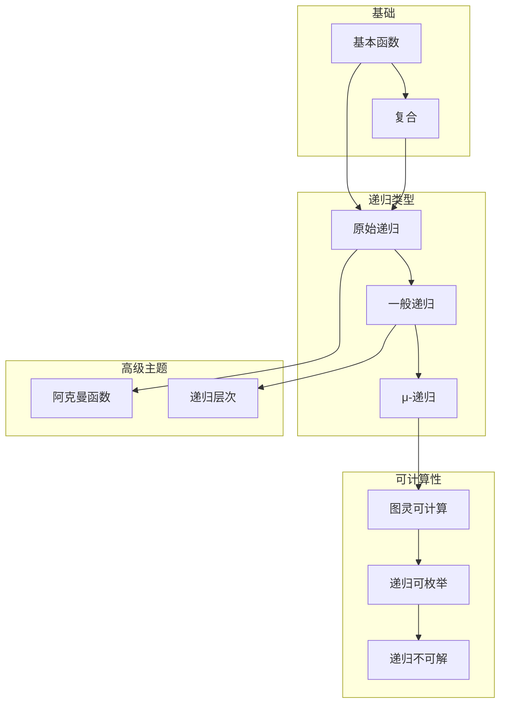
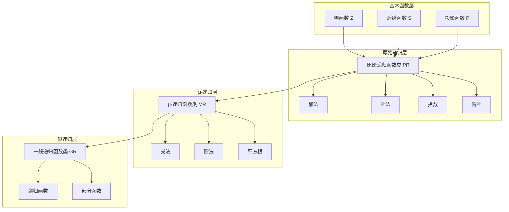
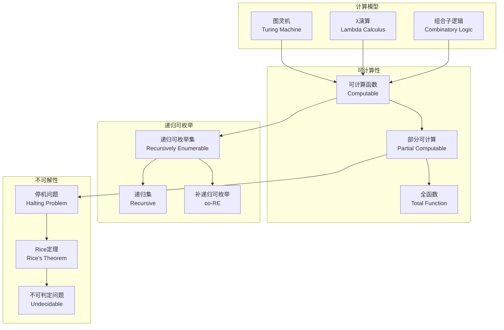
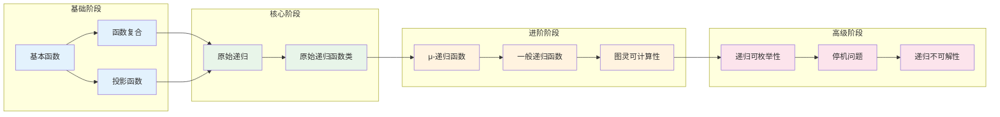
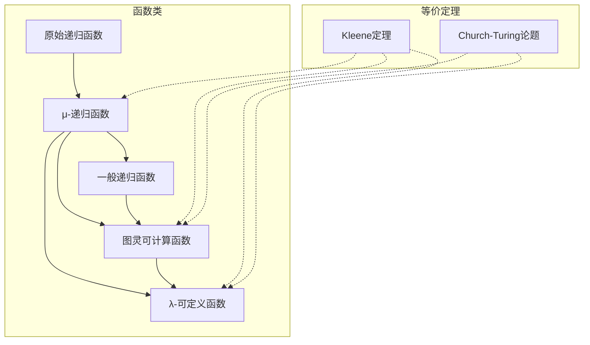

# 02-递归理论知识图谱

> **创建日期**: 2025-04-08
> **覆盖范围**: 02-递归理论模块全部文档
> **目的**: 建立递归理论概念间的语义链接网络

---

## 一、模块概念依赖图

### 1.1 核心概念依赖关系



### 1.2 递归函数层次结构



---

## 二、核心概念图谱

### 2.1 递归函数定义与构造

```mermaid
graph TB
    subgraph 基本函数
        ZERO[零函数<br/>Z(x) = 0]
        SUCC[后继函数<br/>S(x) = x + 1]
        PROJ[投影函数<br/>Pᵢⁿ(x₁,...,xₙ) = xᵢ]
    end

    subgraph 构造规则
        COMP_OP[复合运算<br/>f∘(g₁,...,gₙ)]
        PR_OP[原始递归<br/>h(0,x̄)=f(x̄)<br/>h(y+1,x̄)=g(y,h(y,x̄),x̄)]
        MU_OP[μ算子<br/>μy[f(x̄,y)=0]]
    end

    subgraph 递归函数类
        PR_CLASS[原始递归函数<br/>Primitive Recursive]
        MR_CLASS[μ-递归函数<br/>μ-Recursive]
        GR_CLASS[一般递归函数<br/>General Recursive]
    end

    ZERO --> PR_CLASS
    SUCC --> PR_CLASS
    PROJ --> PR_CLASS
    COMP_OP --> PR_CLASS
    PR_OP --> PR_CLASS
    PR_CLASS --> MR_CLASS
    MU_OP --> MR_CLASS
    MR_CLASS --> GR_CLASS
```

### 2.2 可计算性理论图谱



---

## 三、概念详细列表

### 3.1 基本函数概念

| 概念ID | 中文名 | 英文名 | 难度 | 前置概念 | 后续概念 | 文档位置 |
|--------|--------|--------|------|---------|---------|---------|
| zero_function | 零函数 | Zero Function | beginner | 无 | primitive_recursion | 01-递归函数定义.md §1.2 |
| successor_function | 后继函数 | Successor Function | beginner | 无 | primitive_recursion | 01-递归函数定义.md §1.2 |
| projection_function | 投影函数 | Projection Function | beginner | 无 | composition | 01-递归函数定义.md §1.2 |
| basic_function | 基本函数 | Basic Function | beginner | 无 | primitive_recursive_function | 01-递归函数定义.md §1.2 |

### 3.2 函数构造概念

| 概念ID | 中文名 | 英文名 | 难度 | 前置概念 | 后续概念 | 文档位置 |
|--------|--------|--------|------|---------|---------|---------|
| composition | 复合 | Composition | beginner | basic_function | primitive_recursion | 01-递归函数定义.md §1.3 |
| primitive_recursion | 原始递归 | Primitive Recursion | intermediate | composition | primitive_recursive_function | 01-递归函数定义.md §1.3 |
| mu_operator | μ算子 | μ-Operator | advanced | primitive_recursion | mu_recursive_function | 01-递归函数定义.md §4.1 |
| minimization | 最小化 | Minimization | advanced | mu_operator | general_recursive_function | 01-递归函数定义.md §4.1 |

### 3.3 递归函数类概念

| 概念ID | 中文名 | 英文名 | 难度 | 前置概念 | 后续概念 | 文档位置 |
|--------|--------|--------|------|---------|---------|---------|
| primitive_recursive_function | 原始递归函数 | Primitive Recursive Function | intermediate | primitive_recursion | ackermann_function | 02-原始递归函数.md §2.1 |
| mu_recursive_function | μ-递归函数 | μ-Recursive Function | advanced | mu_operator | general_recursive_function | 04-μ-递归函数.md §4.2 |
| general_recursive_function | 一般递归函数 | General Recursive Function | advanced | mu_recursive_function | computability | 03-一般递归函数.md §3.1 |
| recursive_function | 递归函数 | Recursive Function | intermediate | 无 | computability | 01-递归函数定义.md §1.1 |
| total_function | 全函数 | Total Function | intermediate | function | primitive_recursive_function | 03-一般递归函数.md §3.1 |
| partial_function | 部分函数 | Partial Function | intermediate | function | general_recursive_function | 03-一般递归函数.md §3.1 |

### 3.4 可计算性概念

| 概念ID | 中文名 | 英文名 | 难度 | 前置概念 | 后续概念 | 文档位置 |
|--------|--------|--------|------|---------|---------|---------|
| computability | 可计算性 | Computability | intermediate | recursive_function | turing_computability | 03-一般递归函数.md §3.2 |
| turing_computable | 图灵可计算 | Turing Computable | intermediate | turing_machine | church_turing_thesis | 03-一般递归函数.md §3.2 |
| church_turing_thesis | 丘奇-图灵论题 | Church-Turing Thesis | advanced | turing_computable, lambda_calculus | computability | 03-一般递归函数.md §3.2 |
| recursive_enumerability | 递归可枚举性 | Recursive Enumerability | advanced | computability | halting_problem | 03-一般递归函数.md §3.3 |
| recursively_enumerable_set | 递归可枚举集 | Recursively Enumerable Set | advanced | recursive_enumerability | undecidability | 03-一般递归函数.md §3.3 |
| recursive_set | 递归集 | Recursive Set | intermediate | recursively_enumerable_set | computability | 03-一般递归函数.md §3.3 |

### 3.5 不可解性概念

| 概念ID | 中文名 | 英文名 | 难度 | 前置概念 | 后续概念 | 文档位置 |
|--------|--------|--------|------|---------|---------|---------|
| halting_problem | 停机问题 | Halting Problem | advanced | computability | rice_theorem | 05-递归不可解性.md |
| undecidability | 不可判定性 | Undecidability | advanced | halting_problem | reduction | 05-递归不可解性.md |
| rice_theorem | Rice定理 | Rice's Theorem | advanced | halting_problem | undecidability | 05-递归不可解性.md |
| reduction | 归约 | Reduction | advanced | undecidability | np_completeness | 05-递归不可解性.md |

### 3.6 高级主题概念

| 概念ID | 中文名 | 英文名 | 难度 | 前置概念 | 后续概念 | 文档位置 |
|--------|--------|--------|------|---------|---------|---------|
| ackermann_function | 阿克曼函数 | Ackermann Function | advanced | primitive_recursive_function | 无 | 02-原始递归函数.md §5.2 |
| recursion_hierarchy | 递归层次 | Recursion Hierarchy | expert | recursive_function | ordinal_analysis | 05-递归层次.md |
| characteristic_function | 特征函数 | Characteristic Function | intermediate | recursive_function | primitive_recursive_set | 02-原始递归函数.md §2.3 |
| primitive_recursive_set | 原始递归集 | Primitive Recursive Set | intermediate | characteristic_function | recursively_enumerable_set | 02-原始递归函数.md §2.3 |
| kleene_theorem | 克莱尼定理 | Kleene's Theorem | advanced | mu_recursive_function, turing_computable | computability | 04-μ-递归函数.md §4.3 |
| fixed_point_theorem | 不动点定理 | Fixed Point Theorem | expert | computability | recursion_theorem | 03-一般递归函数.md |
| recursion_theorem | 递归定理 | Recursion Theorem | expert | fixed_point_theorem | self_reference | 03-一般递归函数.md |

---

## 四、学习路径图

### 4.1 递归理论学习路径



### 4.2 学习路径说明

**阶段1 - 基础 (5-8小时)**:

- 基本函数：零函数、后继函数、投影函数
- 函数复合：理解函数的复合运算

**阶段2 - 核心 (10-15小时)**:

- 原始递归模式
- 原始递归函数类的定义和性质
- 原始递归函数的示例（加法、乘法、指数）

**阶段3 - 进阶 (15-20小时)**:

- μ算子与最小化
- μ-递归函数类
- 一般递归函数类
- 丘奇-图灵论题

**阶段4 - 高级 (15-20小时)**:

- 递归可枚举性
- 停机问题
- Rice定理
- 不可判定性理论

---

## 五、关键定理与等价性

### 5.1 递归函数等价性



### 5.2 核心定理列表

| 定理 | 说明 | 前置知识 | 难度 |
|------|------|---------|------|
| Kleene定理 | μ-递归函数 = 图灵可计算函数 = λ-可定义函数 | 递归函数、图灵机 | 高级 |
| Church-Turing论题 | 可计算 = 图灵可计算 | 可计算性理论 | 高级 |
| 原始递归全域性 | 所有原始递归函数都是全函数 | 原始递归 | 中级 |
| μ-递归部分性 | μ-递归函数可能是部分函数 | μ算子 | 中级 |
| 递归可枚举判定 | A递归当且仅当A和A补都是递归可枚举 | 递归可枚举性 | 高级 |
| 停机问题不可判定 | 停机问题是递归不可解的 | 递归可枚举性 | 高级 |
| Rice定理 | 任何非平凡语义性质都是不可判定的 | 停机问题 | 高级 |

---

## 六、概念快速检索

### 6.1 按主题检索

**递归函数基础**:

- 基本函数: 01-递归函数定义.md §1.2
- 函数复合: 01-递归函数定义.md §1.3
- 原始递归: 01-递归函数定义.md §1.3

**原始递归函数**:

- 定义: 02-原始递归函数.md §2.1
- 基本运算: 02-原始递归函数.md §2.2
- 特征函数: 02-原始递归函数.md §2.3

**一般递归函数**:

- 定义: 03-一般递归函数.md §3.1
- 图灵可计算性: 03-一般递归函数.md §3.2
- 递归可枚举性: 03-一般递归函数.md §3.3

**μ-递归函数**:

- μ算子: 04-μ-递归函数.md §4.1
- μ-递归函数类: 04-μ-递归函数.md §4.2
- 等价性: 04-μ-递归函数.md §4.3

### 6.2 按文档检索

| 文档 | 核心概念 | 难度 |
|------|---------|------|
| 01-递归函数定义.md | 基本函数、函数复合、原始递归 | 中级 |
| 02-原始递归函数.md | 原始递归函数、特征函数 | 中级 |
| 03-一般递归函数.md | 一般递归、图灵可计算、递归可枚举 | 高级 |
| 04-递归可枚举性.md | 递归可枚举集、判定问题 | 高级 |
| 05-递归不可解性.md | 停机问题、Rice定理、不可判定性 | 高级 |

---

**文档版本**: 1.0
**最后更新**: 2025-04-08
**状态**: 递归理论模块知识图谱完成
