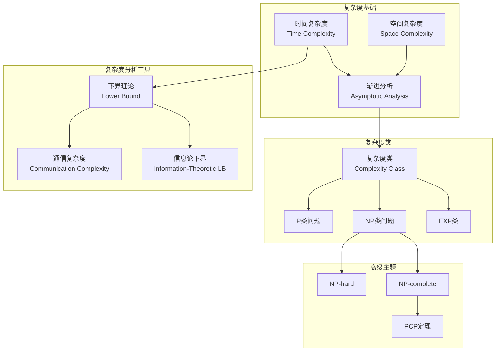
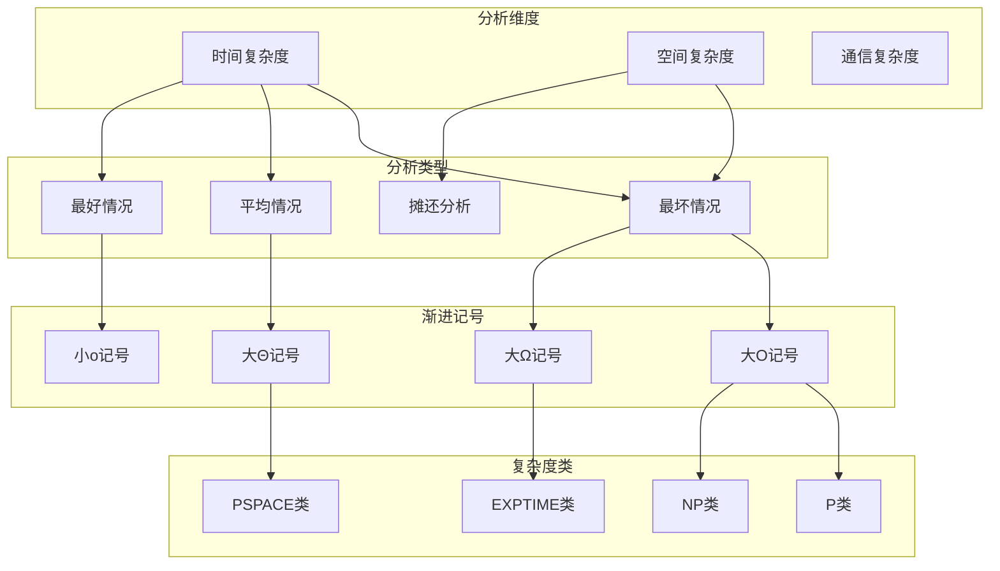
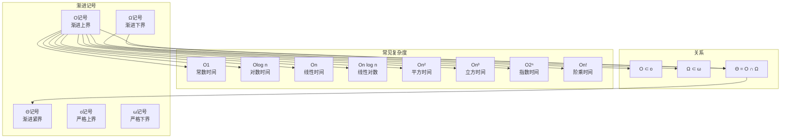
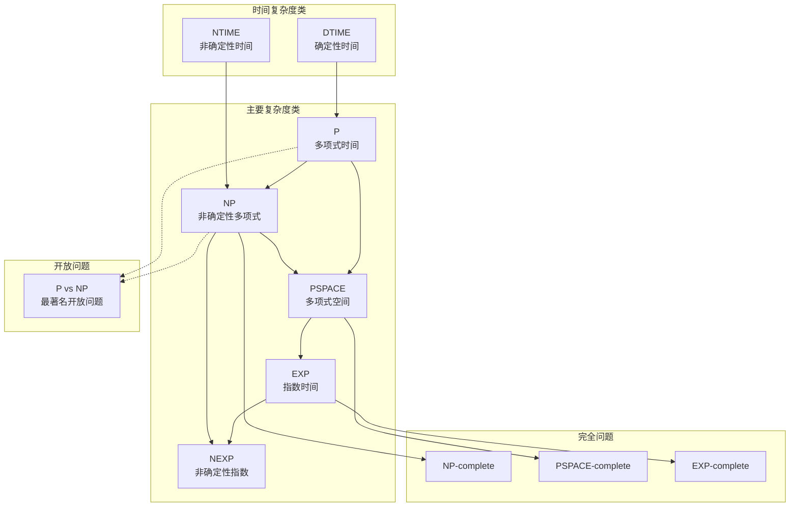
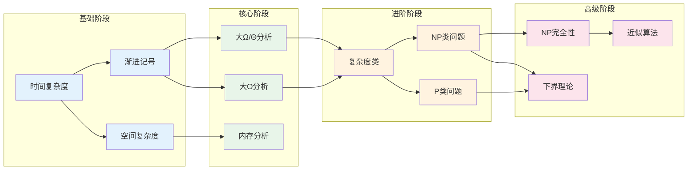
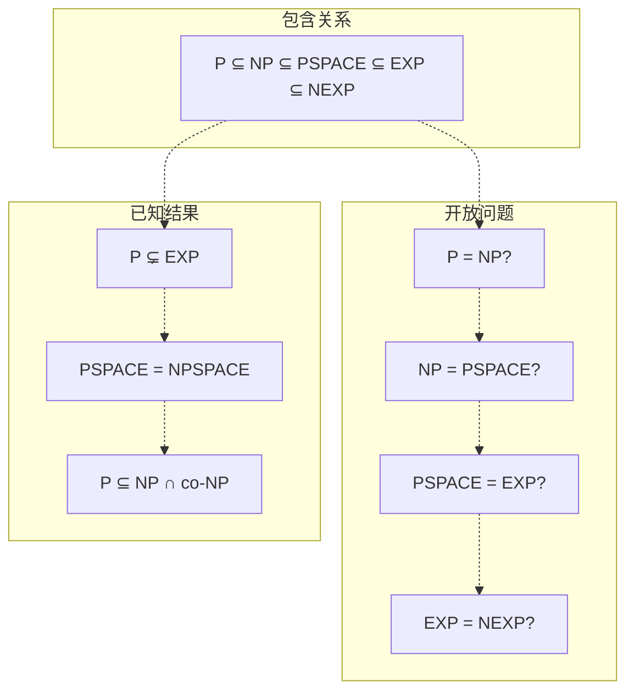

# 04-算法复杂度知识图谱

> **创建日期**: 2025-04-08
> **覆盖范围**: 04-算法复杂度模块全部文档
> **目的**: 建立算法复杂度概念间的语义链接网络

---

## 一、模块概念依赖图

### 1.1 核心概念依赖关系

### 1.2 复杂度分析层次结构

---

## 二、核心概念图谱

### 2.1 渐进分析概念层次

### 2.2 复杂度类关系图谱

---

## 三、概念详细列表

### 3.1 复杂度基础概念

| 概念ID | 中文名 | 英文名 | 难度 | 前置概念 | 后续概念 | 文档位置 |
|--------|--------|--------|------|---------|---------|---------|
| time_complexity | 时间复杂度 | Time Complexity | beginner | algorithm | asymptotic_analysis | 01-时间复杂度.md §1.1 |
| space_complexity | 空间复杂度 | Space Complexity | beginner | algorithm | asymptotic_analysis | 02-空间复杂度.md §1.1 |
| worst_case | 最坏情况 | Worst Case | beginner | time_complexity | big_o_notation | 01-时间复杂度.md §1.1 |
| average_case | 平均情况 | Average Case | intermediate | time_complexity | probabilistic_analysis | 01-时间复杂度.md §1.1 |
| best_case | 最好情况 | Best Case | beginner | time_complexity | lower_bound | 01-时间复杂度.md §1.1 |
| amortized_analysis | 摊还分析 | Amortized Analysis | intermediate | time_complexity | advanced_data_structures | 02-空间复杂度.md §3 |
| time_constructible | 时间可构造 | Time Constructible | advanced | time_complexity | time_hierarchy | 01-时间复杂度.md §4 |

### 3.2 渐进分析概念

| 概念ID | 中文名 | 英文名 | 难度 | 前置概念 | 后续概念 | 文档位置 |
|--------|--------|--------|------|---------|---------|---------|
| big_o | 大O记号 | Big O Notation | beginner | worst_case | complexity_class | 03-渐进分析.md §2.1 |
| big_omega | 大Ω记号 | Big Omega Notation | beginner | time_complexity | big_theta | 03-渐进分析.md §2.2 |
| big_theta | 大Θ记号 | Big Theta Notation | beginner | big_o, big_omega | tight_bound | 03-渐进分析.md §2.3 |
| little_o | 小o记号 | Little o Notation | intermediate | big_o | loose_bound | 03-渐进分析.md §2.4 |
| little_omega | 小ω记号 | Little Omega Notation | intermediate | big_omega | loose_bound | 03-渐进分析.md §2.4 |
| asymptotic_notation | 渐进记号 | Asymptotic Notation | beginner | algorithm | complexity_analysis | 03-渐进分析.md §2 |
| asymptotic_analysis | 渐进分析 | Asymptotic Analysis | beginner | asymptotic_notation | complexity_class | 03-渐进分析.md §2 |

### 3.3 复杂度类概念

| 概念ID | 中文名 | 英文名 | 难度 | 前置概念 | 后续概念 | 文档位置 |
|--------|--------|--------|------|---------|---------|---------|
| complexity_class | 复杂度类 | Complexity Class | intermediate | asymptotic_analysis | p_class | 04-复杂度类.md §1 |
| dtime | DTIME | Deterministic Time | intermediate | time_complexity | p_class | 04-复杂度类.md §3.1 |
| ntime | NTIME | Non-deterministic Time | intermediate | dtime | np_class | 04-复杂度类.md §3.2 |
| p_class | P类 | P (Polynomial Time) | intermediate | dtime | np_class | 04-复杂度类.md §3.1 |
| np_class | NP类 | NP (Non-deterministic Polynomial) | intermediate | ntime | np_complete | 04-复杂度类.md §3.2 |
| pspace | PSPACE | Polynomial Space | advanced | p_class | pspace_complete | 04-复杂度类.md |
| exp_class | EXP类 | Exponential Time | advanced | p_class | nexp_class | 04-复杂度类.md |
| nexp_class | NEXP类 | Non-deterministic Exponential | advanced | exp_class | complexity_hierarchy | 04-复杂度类.md |
| co_np | co-NP | Complement of NP | advanced | np_class | co_np_complete | 04-复杂度类.md |
| rp | RP | Randomized Polynomial | advanced | p_class | bpp | 04-复杂度类.md |
| bpp | BPP | Bounded-error Probabilistic Polynomial | advanced | rp | randomized_complexity | 04-复杂度类.md |

### 3.4 完全性概念

| 概念ID | 中文名 | 英文名 | 难度 | 前置概念 | 后续概念 | 文档位置 |
|--------|--------|--------|------|---------|---------|---------|
| polynomial_reduction | 多项式归约 | Polynomial Reduction | advanced | p_class | np_hard | 04-复杂度类.md |
| np_hard | NP-hard | NP-hard | advanced | polynomial_reduction | np_complete | 04-复杂度类.md |
| np_complete | NP-complete | NP-complete | advanced | np_hard | p_vs_np | 04-复杂度类.md |
| pspace_complete | PSPACE-complete | PSPACE-complete | expert | pspace | game_complexity | 04-复杂度类.md |
| exp_complete | EXP-complete | EXP-complete | expert | exp_class | game_tree | 04-复杂度类.md |
| p_vs_np | P vs NP问题 | P vs NP Problem | expert | np_complete | millennium_problem | 04-复杂度类.md |

### 3.5 下界理论概念

| 概念ID | 中文名 | 英文名 | 难度 | 前置概念 | 后续概念 | 文档位置 |
|--------|--------|--------|------|---------|---------|---------|
| lower_bound | 下界 | Lower Bound | intermediate | big_omega | information_theory_lower_bound | 05-下界理论.md |
| information_theory_lower_bound | 信息论下界 | Information-Theoretic Lower Bound | advanced | lower_bound | comparison_lower_bound | 06-信息论下界.md |
| comparison_lower_bound | 比较下界 | Comparison Lower Bound | intermediate | information_theory_lower_bound | sorting_lower_bound | 06-信息论下界.md |
| communication_complexity | 通信复杂度 | Communication Complexity | advanced | complexity_class | circuit_complexity | 05-通信复杂度.md |
| circuit_complexity | 电路复杂度 | Circuit Complexity | advanced | communication_complexity | shannon_lower_bound | 05-下界理论.md §5.3 |
| shannon_lower_bound | 香农下界 | Shannon Lower Bound | advanced | circuit_complexity | boolean_function | 05-下界理论.md §5.3 |

### 3.6 高级主题概念

| 概念ID | 中文名 | 英文名 | 难度 | 前置概念 | 后续概念 | 文档位置 |
|--------|--------|--------|------|---------|---------|---------|
| time_hierarchy | 时间层次定理 | Time Hierarchy Theorem | advanced | time_constructible | complexity_separation | 04-复杂度类.md §3.3 |
| space_hierarchy | 空间层次定理 | Space Hierarchy Theorem | advanced | space_complexity | complexity_separation | 04-复杂度类.md |
| savitch_theorem | Savitch定理 | Savitch's Theorem | advanced | pspace | nspace | 04-复杂度类.md |
| pcp_theorem | PCP定理 | PCP Theorem | expert | np_complete | approximation_hardness | 04-复杂度类.md |
| approximation_algorithm | 近似算法 | Approximation Algorithm | intermediate | np_hard | approximation_ratio | 09-算法理论.md |
| approximation_ratio | 近似比 | Approximation Ratio | intermediate | approximation_algorithm | ptas | 09-算法理论.md |
| ptas | PTAS | Polynomial-Time Approximation Scheme | advanced | approximation_ratio | fptas | 09-算法理论.md |

---

## 四、学习路径图

### 4.1 算法复杂度学习路径

### 4.2 学习路径说明

**阶段1 - 基础 (8-12小时)**:

- 时间复杂度的概念和意义
- 空间复杂度的基本概念
- 渐进记号系统介绍

**阶段2 - 核心 (12-18小时)**:

- 大O记号的深入理解和应用
- 大Ω和大Θ记号的掌握
- 内存使用和空间分析

**阶段3 - 进阶 (15-20小时)**:

- 复杂度类的分类和理解
- P类问题的识别和分析
- NP类问题的概念和示例

**阶段4 - 高级 (20-30小时)**:

- NP完全性理论
- 多项式归约和NP完全证明
- 下界理论和信息论下界
- 近似算法和近似比

---

## 五、关键定理与层次结构

### 5.1 复杂度层次结构

### 5.2 核心定理列表

| 定理 | 说明 | 前置知识 | 难度 |
|------|------|---------|------|
| 时间层次定理 | DTIME(f(n)) ⊊ DTIME(g(n)) 当 f log f = o(g) | 时间可构造性 | 高级 |
| 空间层次定理 | SPACE(f(n)) ⊊ SPACE(g(n)) 当 f = o(g) | 空间可构造性 | 高级 |
| Savitch定理 | NSPACE(f(n)) ⊆ SPACE(f(n)²) | 非确定性空间 | 高级 |
| PCP定理 | NP = PCP(log n, 1) | NP完全性 | 专家 |
| 多项式时间归约传递性 | A ≤ₚ B 且 B ≤ₚ C ⇒ A ≤ₚ C | 归约概念 | 中级 |
| 比较排序下界 | Ω(n log n) | 决策树模型 | 中级 |
| 香农电路下界 | 几乎所有布尔函数需要Ω(2ⁿ/n)门 | 电路模型 | 高级 |

---

## 六、概念快速检索

### 6.1 按主题检索

**复杂度基础**:

- 时间复杂度: 01-时间复杂度.md §1.1
- 空间复杂度: 02-空间复杂度.md §1.1
- 渐进记号: 03-渐进分析.md §2

**复杂度类**:

- P类和NP类: 04-复杂度类.md §3
- 复杂度层次: 04-复杂度类.md §3.3
- 完全性理论: 04-复杂度类.md §4

**下界理论**:

- 信息论下界: 06-信息论下界.md
- 通信复杂度: 05-通信复杂度.md
- 电路复杂度: 05-下界理论.md §5.3

### 6.2 按文档检索

| 文档 | 核心概念 | 难度 |
|------|---------|------|
| 01-时间复杂度.md | 时间复杂度、渐进分析、复杂度类 | 中级 |
| 02-空间复杂度.md | 空间复杂度、内存分析、摊还分析 | 中级 |
| 03-渐进分析.md | 大O/Ω/Θ记号、渐进比较 | 中级 |
| 04-复杂度类.md | P/NP、复杂度层次、完全性 | 高级 |
| 05-通信复杂度.md | 通信复杂度、协议复杂度 | 高级 |
| 06-信息论下界.md | 比较下界、信息论方法 | 高级 |

---

**文档版本**: 1.0
**最后更新**: 2025-04-08
**状态**: 算法复杂度模块知识图谱完成
