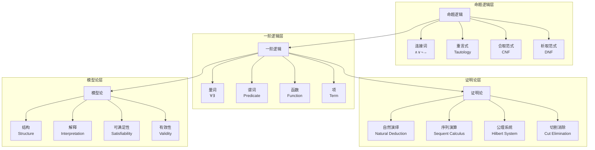
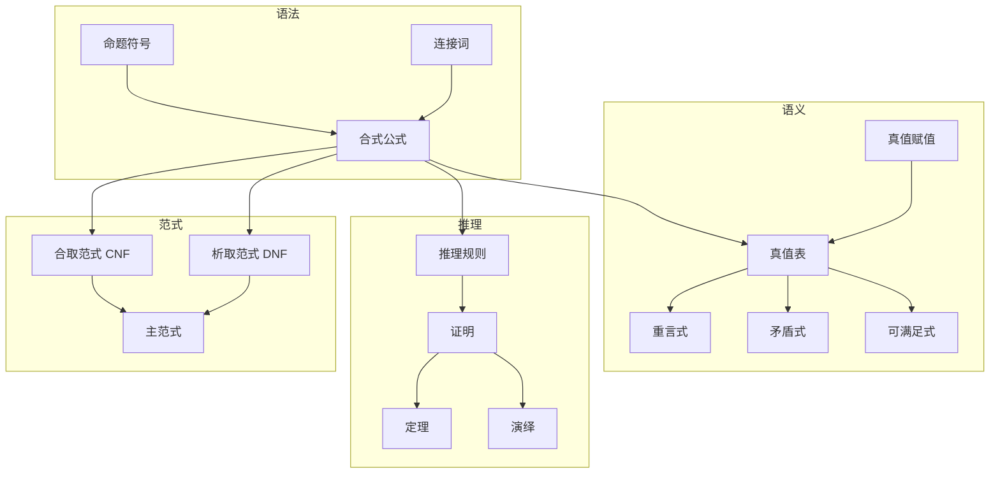
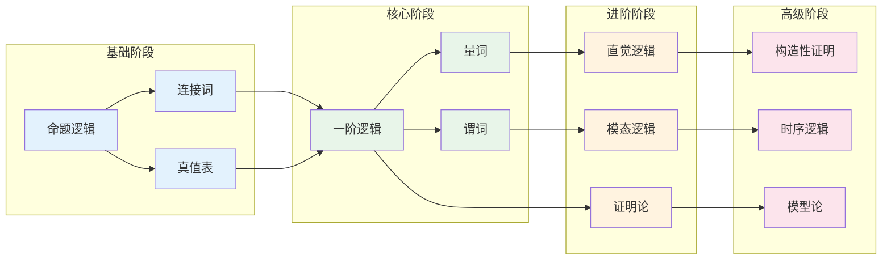
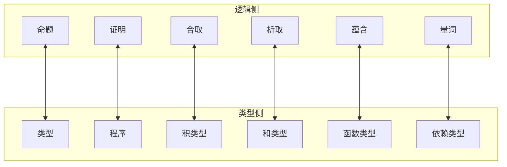

# 06-逻辑系统知识图谱

> **创建日期**: 2025-04-08
> **覆盖范围**: 06-逻辑系统模块全部文档
> **目的**: 建立逻辑系统概念间的语义链接网络

---

## 一、模块概念依赖图

### 1.1 核心概念依赖关系

```mermaid
graph TD
    subgraph 经典逻辑
        PL[命题逻辑
        Propositional Logic]
        FOL[一阶逻辑
        First-Order Logic]
    end

    subgraph 构造性逻辑
        IL[直觉逻辑
        Intuitionistic Logic]
        CP[构造性证明
        Constructive Proof]
    end

    subgraph 模态逻辑
        ML[模态逻辑
        Modal Logic]
        TL[时序逻辑
        Temporal Logic]
    end

    subgraph 高阶逻辑
        HOL[高阶逻辑
        Higher-Order Logic]
        LL[线性逻辑
        Linear Logic]
    end

    subgraph 类型论连接
        CH[Curry-Howard同构]
        TT[类型理论]
    end

    PL --> FOL
    FOL --> IL
    FOL --> ML
    IL --> CP
    ML --> TL
    FOL --> HOL
    FOL --> LL
    IL --> CH
    CH --> TT
```



### 1.2 逻辑系统层次结构



---

## 二、核心概念图谱

### 2.1 命题逻辑概念层次



### 2.2 模态逻辑概念层次

```mermaid
graph TB
    subgraph 模态算子
        BOX[□ 必然]
        DIAM[◇ 可能]
    end

    subgraph 系统
        K[K系统]
        T[T系统]
        S4[S4系统]
        S5[S5系统]
    end

    subgraph 语义
        FRAME[框架
        Frame]
        MODEL_M[模型
        Model]
        ACCESS[可达关系
        Accessibility]
        WORLD[可能世界
        Possible World]
    end

    subgraph 公理
        K_AXIOM[K公理
        □(A→B)→(□A→□B)]
        T_AXIOM[T公理
        □A→A]
        S4_AXIOM[4公理
        □A→□□A]
        S5_AXIOM[5公理
        ◇A→□◇A]
    end

    BOX --> K
    DIAM --> K
    K --> T
    T --> S4
    S4 --> S5

    T --> T_AXIOM
    S4 --> S4_AXIOM
    S5 --> S5_AXIOM

    FRAME --> MODEL_M
    ACCESS --> FRAME
    WORLD --> FRAME
    MODEL_M --> K
    MODEL_M --> T
```

---

## 三、概念详细列表

### 3.1 命题逻辑概念

| 概念ID | 中文名 | 英文名 | 难度 | 前置概念 | 后续概念 | 文档位置 |
|--------|--------|--------|------|---------|---------|---------|
| proposition | 命题 | Proposition | beginner | 无 | propositional_logic | 01-命题逻辑.md §1 |
| propositional_logic | 命题逻辑 | Propositional Logic | beginner | proposition | first_order_logic | 01-命题逻辑.md §2 |
| logical_connective | 逻辑连接词 | Logical Connective | beginner | proposition | well_formed_formula | 01-命题逻辑.md §2.1 |
| conjunction | 合取 | Conjunction (AND) | beginner | logical_connective | tautology | 01-命题逻辑.md §2.1 |
| disjunction | 析取 | Disjunction (OR) | beginner | logical_connective | tautology | 01-命题逻辑.md §2.1 |
| negation | 否定 | Negation (NOT) | beginner | logical_connective | tautology | 01-命题逻辑.md §2.1 |
| implication | 蕴含 | Implication | beginner | logical_connective | tautology | 01-命题逻辑.md §2.1 |
| equivalence | 等价 | Equivalence | beginner | implication | tautology | 01-命题逻辑.md §2.1 |
| well_formed_formula | 合式公式 | Well-Formed Formula | beginner | logical_connective | semantics | 01-命题逻辑.md §2.2 |
| tautology | 重言式 | Tautology | intermediate | well_formed_formula | deduction | 01-命题逻辑.md §3 |
| contradiction | 矛盾式 | Contradiction | intermediate | well_formed_formula | consistency | 01-命题逻辑.md §3 |
| satisfiable | 可满足式 | Satisfiable Formula | intermediate | well_formed_formula | model | 01-命题逻辑.md §3 |
| conjunctive_normal_form | 合取范式 | CNF | intermediate | well_formed_formula | resolution | 01-命题逻辑.md §4 |
| disjunctive_normal_form | 析取范式 | DNF | intermediate | well_formed_formula | boolean_function | 01-命题逻辑.md §4 |
| resolution | 归结原理 | Resolution | advanced | conjunctive_normal_form | automated_reasoning | 01-命题逻辑.md §5 |

### 3.2 一阶逻辑概念

| 概念ID | 中文名 | 英文名 | 难度 | 前置概念 | 后续概念 | 文档位置 |
|--------|--------|--------|------|---------|---------|---------|
| first_order_logic | 一阶逻辑 | First-Order Logic | intermediate | propositional_logic | predicate | 02-一阶逻辑.md §1 |
| predicate | 谓词 | Predicate | intermediate | first_order_logic | quantifier | 02-一阶逻辑.md §2.1 |
| quantifier | 量词 | Quantifier | intermediate | predicate | universal_quantifier | 02-一阶逻辑.md §2.1 |
| universal_quantifier | 全称量词 | Universal Quantifier (∀) | intermediate | quantifier | existential_quantifier | 02-一阶逻辑.md §2.1 |
| existential_quantifier | 存在量词 | Existential Quantifier (∃) | intermediate | quantifier | quantifier_equivalence | 02-一阶逻辑.md §2.2 |
| term | 项 | Term | intermediate | first_order_logic | formula | 02-一阶逻辑.md §2.3 |
| formula_fol | 公式 | Formula | intermediate | term | interpretation | 02-一阶逻辑.md §2.4 |
| interpretation | 解释 | Interpretation | advanced | formula_fol | model | 02-一阶逻辑.md §3 |
| model_fol | 模型 | Model | advanced | interpretation | validity | 02-一阶逻辑.md §3 |
| satisfaction | 满足 | Satisfaction | advanced | model_fol | validity | 02-一阶逻辑.md §3 |
| validity | 有效性 | Validity | advanced | satisfaction | completeness | 02-一阶逻辑.md §3 |
| logical_consequence | 逻辑后承 | Logical Consequence | advanced | validity | deduction | 02-一阶逻辑.md §4 |

### 3.3 直觉逻辑概念

| 概念ID | 中文名 | 英文名 | 难度 | 前置概念 | 后续概念 | 文档位置 |
|--------|--------|--------|------|---------|---------|---------|
| intuitionistic_logic | 直觉逻辑 | Intuitionistic Logic | advanced | propositional_logic | constructive_proof | 03-直觉逻辑.md §1 |
| constructive_proof | 构造性证明 | Constructive Proof | advanced | intuitionistic_logic | curry_howard | 03-直觉逻辑.md §2 |
| brouwer_heyting_kolmogorov | BHK解释 | BHK Interpretation | advanced | constructive_proof | realizability | 03-直觉逻辑.md §2 |
| excluded_middle | 排中律 | Law of Excluded Middle | intermediate | tautology | intuitionistic_logic | 03-直觉逻辑.md §3 |
| double_negation | 双重否定 | Double Negation | intermediate | negation | intuitionistic_logic | 03-直觉逻辑.md §3 |
| kripke_model | Kripke模型 | Kripke Model | expert | model | intuitionistic_logic | 03-直觉逻辑.md §4 |
| realizability | 可实现性 | Realizability | expert | constructive_proof | type_theory | 03-直觉逻辑.md §5 |

### 3.4 模态逻辑概念

| 概念ID | 中文名 | 英文名 | 难度 | 前置概念 | 后续概念 | 文档位置 |
|--------|--------|--------|------|---------|---------|---------|
| modal_logic | 模态逻辑 | Modal Logic | advanced | propositional_logic | modal_operators | 04-模态逻辑.md §1 |
| necessity | 必然 | Necessity (□) | advanced | modal_logic | possible_world | 04-模态逻辑.md §2 |
| possibility | 可能 | Possibility (◇) | advanced | modal_logic | possible_world | 04-模态逻辑.md §2 |
| possible_world | 可能世界 | Possible World | advanced | necessity | kripke_semantics | 04-模态逻辑.md §3 |
| accessibility_relation | 可达关系 | Accessibility Relation | advanced | possible_world | frame | 04-模态逻辑.md §3 |
| kripke_semantics | Kripke语义 | Kripke Semantics | expert | accessibility_relation | modal_axioms | 04-模态逻辑.md §3 |
| modal_system_k | K系统 | System K | advanced | modal_logic | system_t | 04-模态逻辑.md §4 |
| modal_system_t | T系统 | System T | advanced | modal_system_k | system_s4 | 04-模态逻辑.md §4 |
| modal_system_s4 | S4系统 | System S4 | advanced | modal_system_t | system_s5 | 04-模态逻辑.md §4 |
| modal_system_s5 | S5系统 | System S5 | advanced | modal_system_s4 | temporal_logic | 04-模态逻辑.md §4 |
| temporal_logic | 时序逻辑 | Temporal Logic | expert | modal_logic | ltl | 07-时序逻辑.md |
| ltl | 线性时序逻辑 | LTL | expert | temporal_logic | ctl | 07-时序逻辑.md |
| ctl | 计算树逻辑 | CTL | expert | temporal_logic | model_checking | 07-时序逻辑.md |

### 3.5 高级逻辑概念

| 概念ID | 中文名 | 英文名 | 难度 | 前置概念 | 后续概念 | 文档位置 |
|--------|--------|--------|------|---------|---------|---------|
| higher_order_logic | 高阶逻辑 | Higher-Order Logic | expert | first_order_logic | type_theory | 08-高阶逻辑.md |
| linear_logic | 线性逻辑 | Linear Logic | expert | intuitionistic_logic | resource_logic | 06-线性逻辑.md |
| multi_valued_logic | 多值逻辑 | Multi-Valued Logic | advanced | propositional_logic | fuzzy_logic | 05-多值逻辑.md |
| fuzzy_logic | 模糊逻辑 | Fuzzy Logic | advanced | multi_valued_logic | soft_computing | 05-多值逻辑.md |
| paraconsistent_logic | 次协调逻辑 | Paraconsistent Logic | expert | contradiction | inconsistent_reasoning | 05-多值逻辑.md |

### 3.6 证明论概念

| 概念ID | 中文名 | 英文名 | 难度 | 前置概念 | 后续概念 | 文档位置 |
|--------|--------|--------|------|---------|---------|---------|
| proof_theory | 证明论 | Proof Theory | advanced | first_order_logic | natural_deduction | 证明论.md |
| natural_deduction | 自然演绎 | Natural Deduction | advanced | proof_theory | sequent_calculus | 证明论.md |
| sequent_calculus | 序列演算 | Sequent Calculus | advanced | natural_deduction | cut_elimination | 证明论.md |
| cut_elimination | 切割消除 | Cut Elimination | expert | sequent_calculus | normalization | 证明论.md |
| hilbert_system | 希尔伯特系统 | Hilbert System | advanced | proof_theory | completeness | 证明论.md |
| consistency_proof | 一致性证明 | Consistency Proof | expert | cut_elimination | ordinal_analysis | 证明论.md |

---

## 四、学习路径图

### 4.1 逻辑系统学习路径



### 4.2 学习路径说明

**阶段1 - 基础 (10-15小时)**:

- 命题逻辑的基本概念
- 逻辑连接词的理解和应用
- 真值表和语义分析

**阶段2 - 核心 (15-20小时)**:

- 一阶逻辑的语法和语义
- 量词（全称、存在）的掌握
- 谓词和项的概念

**阶段3 - 进阶 (20-25小时)**:

- 直觉逻辑和构造性证明
- 模态逻辑（必然、可能）
- 证明论基础（自然演绎、序列演算）

**阶段4 - 高级 (25-35小时)**:

- 构造性证明理论
- 时序逻辑（LTL、CTL）
- 模型论基础

---

## 五、与类型论的连接

### 5.1 Curry-Howard同构



---

## 六、概念快速检索

### 6.1 按主题检索

**命题逻辑**:

- 命题与连接词: 01-命题逻辑.md §2
- 真值表: 01-命题逻辑.md §3
- 范式: 01-命题逻辑.md §4

**一阶逻辑**:

- 量词与谓词: 02-一阶逻辑.md §2
- 语义: 02-一阶逻辑.md §3
- 推理: 02-一阶逻辑.md §4

**构造性逻辑**:

- 直觉逻辑: 03-直觉逻辑.md
- BHK解释: 03-直觉逻辑.md §2
- 可实现性: 03-直觉逻辑.md §5

**模态逻辑**:

- 模态算子: 04-模态逻辑.md §2
- Kripke语义: 04-模态逻辑.md §3
- 模态系统: 04-模态逻辑.md §4

### 6.2 按文档检索

| 文档 | 核心概念 | 难度 |
|------|---------|------|
| 01-命题逻辑.md | 命题、连接词、真值表、范式 | 初级 |
| 02-一阶逻辑.md | 量词、谓词、模型、推理 | 中级 |
| 03-直觉逻辑.md | 构造性证明、BHK、可实现性 | 高级 |
| 04-模态逻辑.md | 模态算子、Kripke语义、模态系统 | 高级 |
| 05-多值逻辑.md | 多值逻辑、模糊逻辑 | 高级 |
| 06-线性逻辑.md | 线性逻辑、资源逻辑 | 专家 |
| 07-时序逻辑.md | LTL、CTL、模型检测 | 专家 |
| 08-高阶逻辑.md | 高阶逻辑、类型论 | 专家 |

---

**文档版本**: 1.0
**最后更新**: 2025-04-08
**状态**: 逻辑系统模块知识图谱完成
