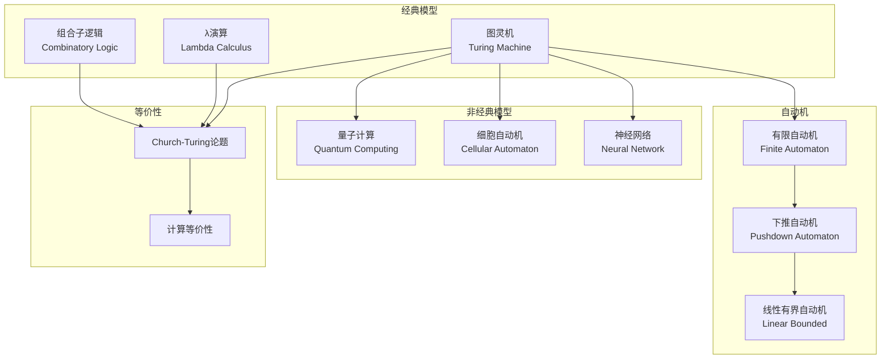
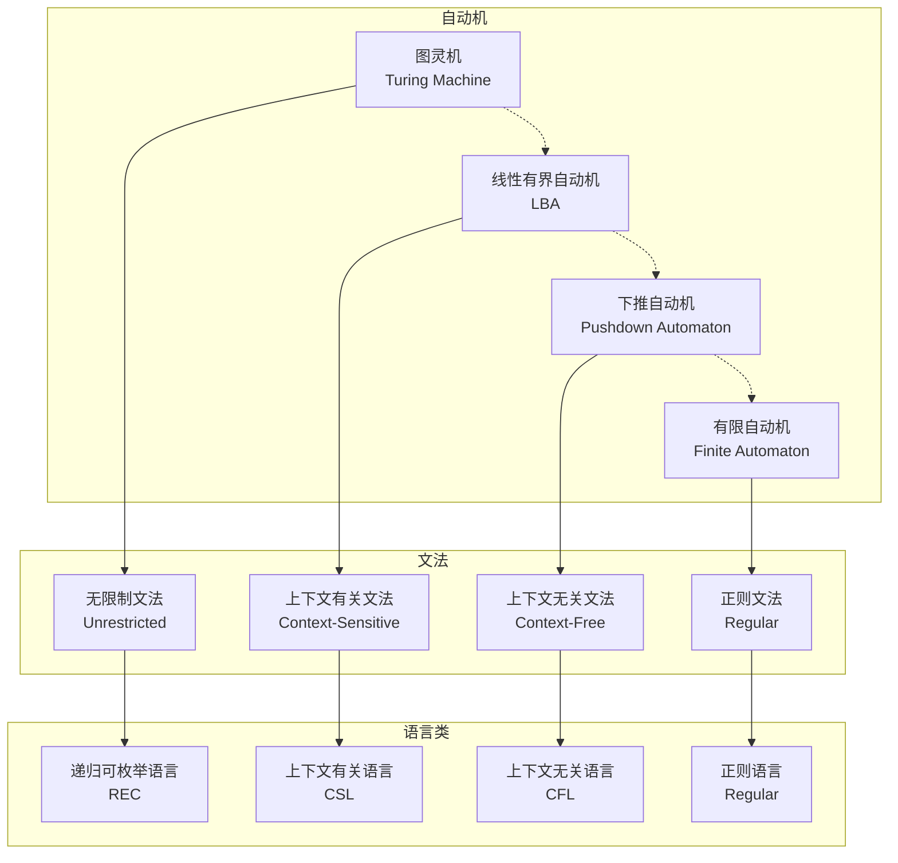
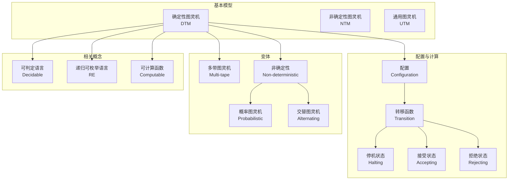
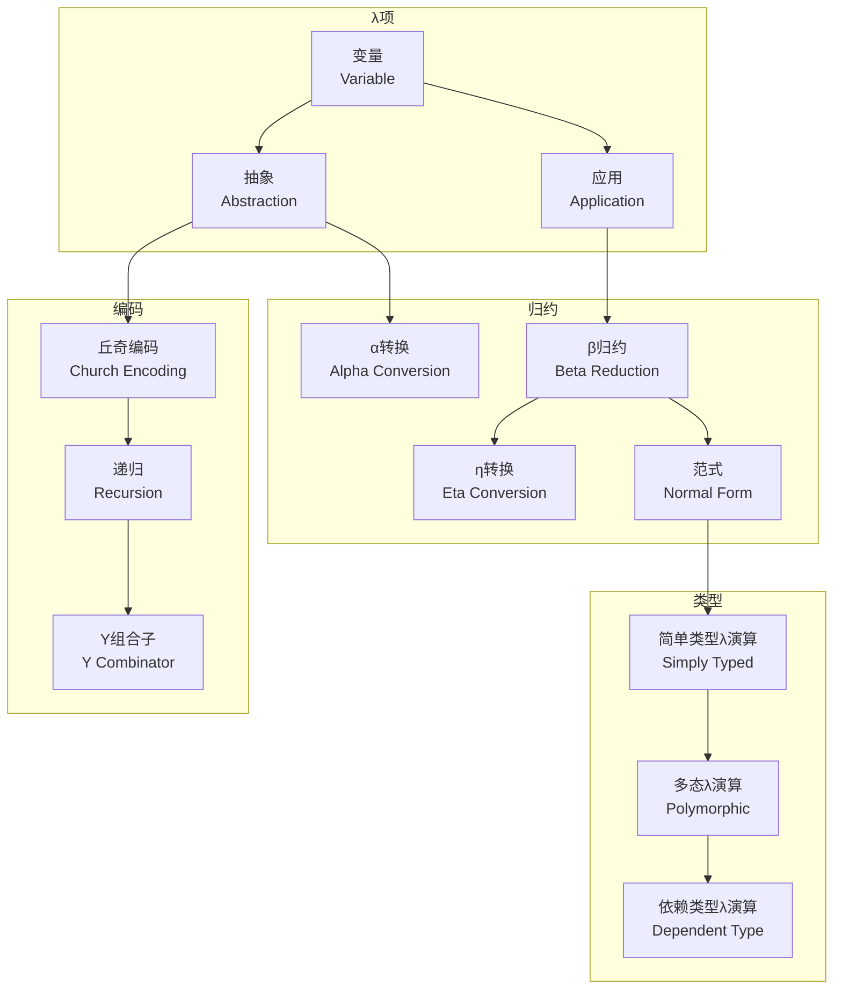
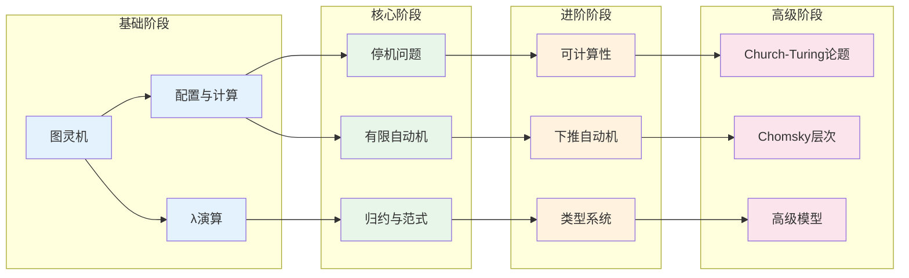
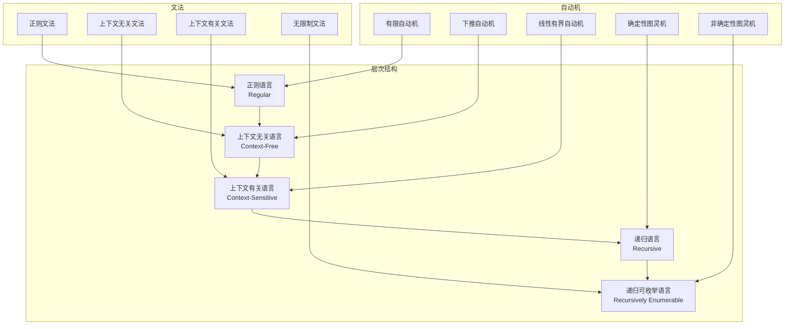

# 07-计算模型知识图谱

> **创建日期**: 2025-04-08
> **覆盖范围**: 07-计算模型模块全部文档
> **目的**: 建立计算模型概念间的语义链接网络

---

## 一、模块概念依赖图

### 1.1 核心概念依赖关系

### 1.2 自动机层次结构（Chomsky层次）

---

## 二、核心概念图谱

### 2.1 图灵机概念层次

### 2.2 λ演算概念层次

---

## 三、概念详细列表

### 3.1 图灵机概念

| 概念ID | 中文名 | 英文名 | 难度 | 前置概念 | 后续概念 | 文档位置 |
|--------|--------|--------|------|---------|---------|---------|
| turing_machine | 图灵机 | Turing Machine | intermediate | algorithm | computability | 01-图灵机.md §1 |
| deterministic_tm | 确定性图灵机 | Deterministic TM | intermediate | turing_machine | configuration | 01-图灵机.md §2 |
| nondeterministic_tm | 非确定性图灵机 | Non-deterministic TM | advanced | deterministic_tm | complexity | 01-图灵机.md §3 |
| configuration | 配置 | Configuration | intermediate | turing_machine | transition | 01-图灵机.md §2 |
| transition_function | 转移函数 | Transition Function | intermediate | configuration | computation | 01-图灵机.md §2 |
| computation | 计算 | Computation | intermediate | transition_function | halting | 01-图灵机.md §2 |
| halting | 停机 | Halting | intermediate | computation | decidability | 01-图灵机.md §2 |
| universal_tm | 通用图灵机 | Universal Turing Machine | advanced | turing_machine | computability | 01-图灵机.md §4 |
| multitape_tm | 多带图灵机 | Multi-tape TM | intermediate | turing_machine | time_complexity | 01-图灵机.md §5 |
| oracle_tm | 谕示图灵机 | Oracle TM | expert | turing_machine | relativization | 01-图灵机.md §6 |
| decidable_language | 可判定语言 | Decidable Language | intermediate | halting | recursive | 01-图灵机.md §7 |
| recognizable_language | 可识别语言 | Recognizable Language | intermediate | halting | recursively_enumerable | 01-图灵机.md §7 |

### 3.2 λ演算概念

| 概念ID | 中文名 | 英文名 | 难度 | 前置概念 | 后续概念 | 文档位置 |
|--------|--------|--------|------|---------|---------|---------|
| lambda_calculus | λ演算 | Lambda Calculus | intermediate | function | lambda_term | 02-λ演算.md §1 |
| lambda_term | λ项 | Lambda Term | intermediate | lambda_calculus | alpha_conversion | 02-λ演算.md §2 |
| variable | 变量 | Variable | beginner | lambda_term | abstraction | 02-λ演culus.md §2.1 |
| abstraction | 抽象 | Abstraction | intermediate | variable | application | 02-λ演算.md §2.2 |
| application | 应用 | Application | intermediate | abstraction | beta_reduction | 02-λ演算.md §2.3 |
| alpha_conversion | α转换 | Alpha Conversion | intermediate | lambda_term | beta_reduction | 02-λ演算.md §3.1 |
| beta_reduction | β归约 | Beta Reduction | intermediate | alpha_conversion | normal_form | 02-λ演算.md §3.2 |
| eta_conversion | η转换 | Eta Conversion | advanced | beta_reduction | extensionality | 02-λ演算.md §3.3 |
| normal_form | 范式 | Normal Form | intermediate | beta_reduction | confluence | 02-λ演算.md §3.4 |
| church_rosser | Church-Rosser定理 | Church-Rosser Theorem | advanced | beta_reduction | confluence | 02-λ演算.md §4 |
| simply_typed_lambda | 简单类型λ演算 | Simply Typed Lambda | advanced | lambda_calculus | type_safety | 02-λ演算.md §5 |
| church_encoding | 丘奇编码 | Church Encoding | advanced | lambda_calculus | arithmetic_encoding | 02-λ演算.md §6 |
| y_combinator | Y组合子 | Y Combinator | expert | lambda_calculus | recursion | 02-λ演算.md §7 |

### 3.3 组合子逻辑概念

| 概念ID | 中文名 | 英文名 | 难度 | 前置概念 | 后续概念 | 文档位置 |
|--------|--------|--------|------|---------|---------|---------|
| combinatory_logic | 组合子逻辑 | Combinatory Logic | advanced | lambda_calculus | combinator | 03-组合子逻辑.md §1 |
| combinator | 组合子 | Combinator | advanced | combinatory_logic | s_combinator | 03-组合子逻辑.md §2 |
| s_combinator | S组合子 | S Combinator | advanced | combinator | k_combinator | 03-组合子逻辑.md §2 |
| i_combinator | I组合子 | I Combinator | advanced | combinator | ski_completeness | 03-组合子逻辑.md §2 |
| k_combinator | K组合子 | K Combinator | advanced | combinator | i_combinator | 03-组合子逻辑.md §2 |
| ski_basis | SK(I)基 | SK(I) Basis | advanced | s_combinator, k_combinator | combinatory_completeness | 03-组合子逻辑.md §3 |
| combinatory_completeness | 组合子完备性 | Combinatory Completeness | expert | ski_basis | lambda_combinator_equivalence | 03-组合子逻辑.md §4 |
| bracket_abstraction | 括号抽象 | Bracket Abstraction | expert | combinatory_completeness | compilation | 03-组合子逻辑.md §5 |

### 3.4 自动机概念

| 概念ID | 中文名 | 英文名 | 难度 | 前置概念 | 后续概念 | 文档位置 |
|--------|--------|--------|------|---------|---------|---------|
| finite_automaton | 有限自动机 | Finite Automaton | beginner | formal_language | dfa | 04-自动机理论.md §1 |
| dfa | 确定性有限自动机 | DFA | beginner | finite_automaton | nfa | 04-自动机理论.md §2 |
| nfa | 非确定性有限自动机 | NFA | beginner | dfa | dfa_equivalence | 04-自动机理论.md §3 |
| epsilon_nfa | ε-NFA | ε-NFA | intermediate | nfa | regular_expression | 04-自动机理论.md §4 |
| regular_expression | 正则表达式 | Regular Expression | beginner | finite_automaton | regex_equivalence | 04-自动机理论.md §5 |
| regular_language | 正则语言 | Regular Language | intermediate | dfa | pumping_lemma | 04-自动机理论.md §6 |
| pumping_lemma | 泵引理 | Pumping Lemma | intermediate | regular_language | non_regular | 04-自动机理论.md §6 |
| pushdown_automaton | 下推自动机 | Pushdown Automaton | intermediate | finite_automaton | cfg | 04-自动机理论.md §7 |
| context_free_grammar | 上下文无关文法 | CFG | intermediate | pushdown_automaton | cfl | 04-自动机理论.md §8 |
| context_free_language | 上下文无关语言 | CFL | intermediate | context_free_grammar | pumping_lemma_cfl | 04-自动机理论.md §9 |
| turing_machine_auto | 图灵机作为自动机 | TM as Automaton | advanced | pushdown_automaton | chomsky_hierarchy | 04-自动机理论.md §10 |
| chomsky_hierarchy | Chomsky层次 | Chomsky Hierarchy | advanced | regular_language, context_free_language | language_classification | 04-自动机理论.md §11 |

### 3.5 高级计算模型概念

| 概念ID | 中文名 | 英文名 | 难度 | 前置概念 | 后续概念 | 文档位置 |
|--------|--------|--------|------|---------|---------|---------|
| quantum_computing | 量子计算 | Quantum Computing | expert | turing_machine | qubit | 05-量子计算模型.md §1 |
| qubit | 量子比特 | Qubit | expert | quantum_computing | superposition | 05-量子计算模型.md §2 |
| superposition | 叠加态 | Superposition | expert | qubit | entanglement | 05-量子计算模型.md §2 |
| entanglement | 纠缠 | Entanglement | expert | superposition | quantum_algorithm | 05-量子计算模型.md §2 |
| quantum_gate | 量子门 | Quantum Gate | expert | qubit | quantum_circuit | 05-量子计算模型.md §3 |
| quantum_circuit | 量子电路 | Quantum Circuit | expert | quantum_gate | quantum_algorithm | 05-量子计算模型.md §3 |
| cellular_automaton | 细胞自动机 | Cellular Automaton | advanced | turing_machine | game_of_life | 06-细胞自动机.md §1 |
| game_of_life | 生命游戏 | Game of Life | intermediate | cellular_automaton | universality_ca | 06-细胞自动机.md §2 |
| neural_network_model | 神经网络计算模型 | Neural Network Model | advanced | turing_machine | ann | 07-神经网络计算模型.md §1 |
| ann | 人工神经网络 | ANN | advanced | neural_network_model | cnn | 07-神经网络计算模型.md §2 |
| cnn | 卷积神经网络 | CNN | advanced | ann | rnn | 07-神经网络计算模型.md §3 |
| rnn | 循环神经网络 | RNN | advanced | ann | lstm | 07-神经网络计算模型.md §4 |

### 3.6 计算等价性概念

| 概念ID | 中文名 | 英文名 | 难度 | 前置概念 | 后续概念 | 文档位置 |
|--------|--------|--------|------|---------|---------|---------|
| church_turing_thesis | Church-Turing论题 | Church-Turing Thesis | advanced | turing_machine, lambda_calculus | computability | 08-计算模型等价性.md §1 |
| turing_completeness | 图灵完备性 | Turing Completeness | advanced | church_turing_thesis | universal_computation | 08-计算模型等价性.md §2 |
| simulation | 模拟 | Simulation | advanced | turing_machine | equivalence | 08-计算模型等价性.md §3 |
| computational_equivalence | 计算等价性 | Computational Equivalence | advanced | simulation | complexity_equivalence | 08-计算模型等价性.md §4 |
| effective_procedure | 有效过程 | Effective Procedure | intermediate | algorithm | church_turing_thesis | 08-计算模型等价性.md §1 |

---

## 四、学习路径图

### 4.1 计算模型学习路径

### 4.2 学习路径说明

**阶段1 - 基础 (15-20小时)**:

- 图灵机的定义和工作原理
- 配置、转移函数、计算过程
- λ演算的基本概念

**阶段2 - 核心 (20-25小时)**:

- 停机问题和可判定性
- λ归约和范式
- 有限自动机（DFA、NFA）

**阶段3 - 进阶 (20-25小时)**:

- 可计算性理论
- 简单类型λ演算
- 下推自动机和上下文无关文法

**阶段4 - 高级 (25-35小时)**:

- Church-Turing论题
- Chomsky语言层次
- 高级计算模型（量子计算、神经网络）

---

## 五、Chomsky层次结构详解

---

## 六、概念快速检索

### 6.1 按主题检索

**图灵机**:

- 基本模型: 01-图灵机.md §1-2
- 变体: 01-图灵机.md §3-6
- 可计算性: 01-图灵机.md §7

**λ演算**:

- 基本语法: 02-λ演算.md §1-2
- 归约: 02-λ演算.md §3-4
- 类型: 02-λ演算.md §5

**自动机**:

- 有限自动机: 04-自动机理论.md §1-6
- 下推自动机: 04-自动机理论.md §7-9
- Chomsky层次: 04-自动机理论.md §10-11

### 6.2 按文档检索

| 文档 | 核心概念 | 难度 |
|------|---------|------|
| 01-图灵机.md | 图灵机、配置、停机问题 | 中级 |
| 02-λ演算.md | λ项、归约、类型 | 中级 |
| 03-组合子逻辑.md | 组合子、SK基、完备性 | 高级 |
| 04-自动机理论.md | 自动机、文法、语言层次 | 中级 |
| 05-量子计算模型.md | 量子比特、量子门、电路 | 专家 |
| 06-细胞自动机.md | CA、生命游戏 | 高级 |
| 07-神经网络计算模型.md | ANN、CNN、RNN | 高级 |
| 08-计算模型等价性.md | Church-Turing论题、等价性 | 高级 |

---

**文档版本**: 1.0
**最后更新**: 2025-04-08
**状态**: 计算模型模块知识图谱完成
