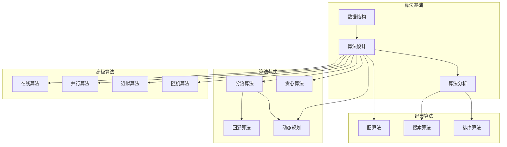
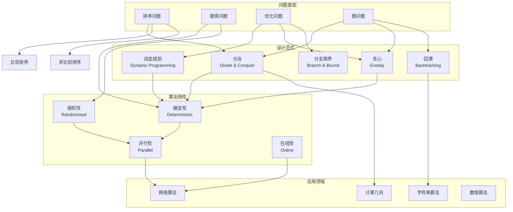
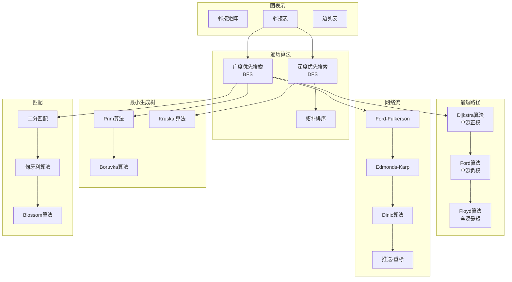
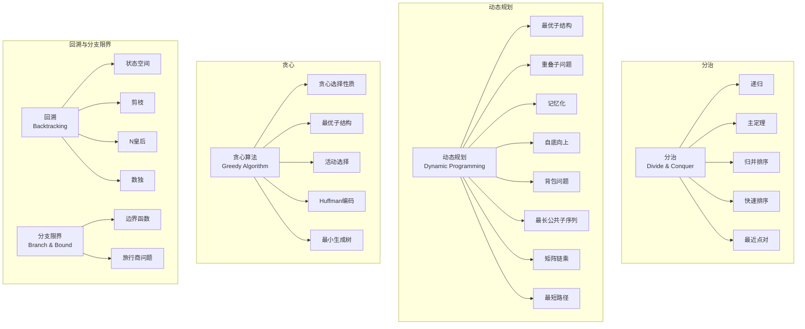
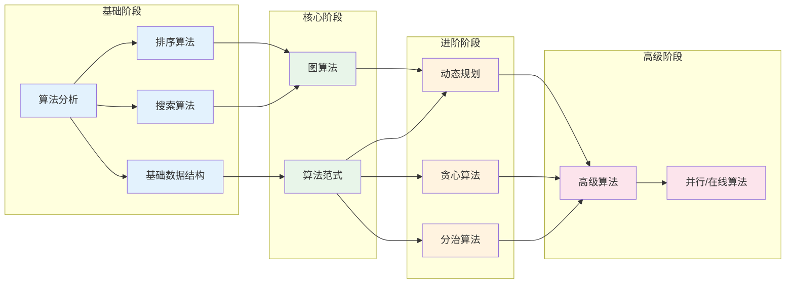
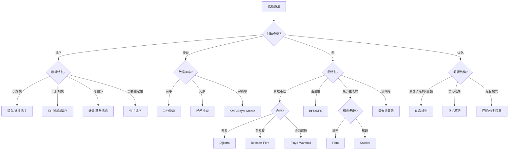

# 09-算法理论知识图谱

> **创建日期**: 2025-04-08
> **覆盖范围**: 09-算法理论模块全部文档
> **目的**: 建立算法理论概念间的语义链接网络

---

## 一、模块概念依赖图

### 1.1 核心概念依赖关系



### 1.2 算法分类体系



---

## 二、核心概念图谱

### 2.1 排序算法概念层次

```mermaid
graph TB
    subgraph 简单排序
        BUBBLE[冒泡排序
        O(n²)]
        INSERTION[插入排序
        O(n²)]
        SELECTION[选择排序
        O(n²)]
    end

    subgraph 高效排序
        MERGE[归并排序
        O(n log n)]
        QUICK[快速排序
        O(n log n) avg]
        HEAP[堆排序
        O(n log n)]
    end

    subgraph 特殊排序
        COUNTING[计数排序
        O(n+k)]
        RADIX[基数排序
        O(d(n+k))]
        BUCKET[桶排序
        O(n)]
    end

    subgraph 排序性质
        STABLE[稳定性]
        INPLACE[原地排序]
        ADAPTIVE[自适应]
        COMPARISON[基于比较]
    end

    BUBBLE --> STABLE
    INSERTION --> STABLE
    INSERTION --> ADAPTIVE
    SELECTION --> INPLACE

    MERGE --> STABLE
    MERGE --> COMPARISON
    QUICK --> INPLACE
    QUICK --> COMPARISON
    HEAP --> INPLACE
    HEAP --> COMPARISON

    COUNTING --> STABLE
    RADIX --> STABLE
    BUCKET --> STABLE
```

### 2.2 图算法概念层次



### 2.3 算法设计范式概念层次



---

## 三、概念详细列表

### 3.1 算法基础概念

| 概念ID | 中文名 | 英文名 | 难度 | 前置概念 | 后续概念 | 文档位置 |
|--------|--------|--------|------|---------|---------|---------|
| algorithm_design | 算法设计 | Algorithm Design | beginner | algorithm | algorithm_analysis | 01-算法设计理论.md |
| algorithm_analysis | 算法分析 | Algorithm Analysis | beginner | algorithm_design | time_complexity | 01-算法设计理论.md |
| data_structure | 数据结构 | Data Structure | beginner | algorithm | array, list, tree | 02-数据结构理论.md |
| correctness | 正确性 | Correctness | intermediate | algorithm | loop_invariant | 01-算法设计理论.md |
| termination | 终止性 | Termination | intermediate | algorithm | well_founded | 01-算法设计理论.md |
| loop_invariant | 循环不变式 | Loop Invariant | intermediate | correctness | proof_correctness | 01-算法设计理论.md |

### 3.2 排序算法概念

| 概念ID | 中文名 | 英文名 | 难度 | 前置概念 | 后续概念 | 文档位置 |
|--------|--------|--------|------|---------|---------|---------|
| comparison_sort | 比较排序 | Comparison Sort | beginner | algorithm_analysis | merge_sort | 03-排序算法理论.md |
| merge_sort | 归并排序 | Merge Sort | beginner | divide_conquer | external_sort | 03-排序算法理论.md §3.1 |
| quick_sort | 快速排序 | Quick Sort | beginner | divide_conquer | randomized_quicksort | 03-排序算法理论.md §3.2 |
| heap_sort | 堆排序 | Heap Sort | intermediate | heap | priority_queue | 03-排序算法理论.md §3.3 |
| insertion_sort | 插入排序 | Insertion Sort | beginner | comparison_sort | shell_sort | 03-排序算法理论.md §2.1 |
| selection_sort | 选择排序 | Selection Sort | beginner | comparison_sort | heap_sort | 03-排序算法理论.md §2.2 |
| bubble_sort | 冒泡排序 | Bubble Sort | beginner | comparison_sort | 无 | 03-排序算法理论.md §2.3 |
| counting_sort | 计数排序 | Counting Sort | intermediate | sorting_lower_bound | radix_sort | 03-排序算法理论.md §4.1 |
| radix_sort | 基数排序 | Radix Sort | intermediate | counting_sort | 无 | 03-排序算法理论.md §4.2 |
| bucket_sort | 桶排序 | Bucket Sort | intermediate | comparison_sort | 无 | 03-排序算法理论.md §4.3 |
| sorting_lower_bound | 排序下界 | Sorting Lower Bound | advanced | comparison_sort | information_theory | 03-排序算法理论.md §5 |
| stability | 稳定性 | Stability | beginner | sorting | stable_sort | 03-排序算法理论.md §1 |
| in_place | 原地排序 | In-Place Sorting | beginner | sorting | heap_sort | 03-排序算法理论.md §1 |

### 3.3 搜索算法概念

| 概念ID | 中文名 | 英文名 | 难度 | 前置概念 | 后续概念 | 文档位置 |
|--------|--------|--------|------|---------|---------|---------|
| linear_search | 线性搜索 | Linear Search | beginner | algorithm | binary_search | 04-搜索算法理论.md §1 |
| binary_search | 二分搜索 | Binary Search | beginner | divide_conquer | exponential_search | 04-搜索算法理论.md §2 |
| interpolation_search | 插值搜索 | Interpolation Search | intermediate | binary_search | 无 | 04-搜索算法理论.md §3 |
| exponential_search | 指数搜索 | Exponential Search | intermediate | binary_search | unbounded_search | 04-搜索算法理论.md §4 |
| hash_search | 哈希搜索 | Hash Search | intermediate | hash_table | perfect_hash | 04-搜索算法理论.md §5 |
| string_matching | 字符串匹配 | String Matching | intermediate | search | kmp | 字符串算法.md |
| kmp | KMP算法 | Knuth-Morris-Pratt | advanced | string_matching | boyer_moore | 字符串算法.md |

### 3.4 图算法概念

| 概念ID | 中文名 | 英文名 | 难度 | 前置概念 | 后续概念 | 文档位置 |
|--------|--------|--------|------|---------|---------|---------|
| graph_representation | 图表示 | Graph Representation | beginner | data_structure | adjacency_list | 05-图算法理论.md §1 |
| adjacency_list | 邻接表 | Adjacency List | beginner | graph_representation | bfs | 05-图算法理论.md §1.1 |
| adjacency_matrix | 邻接矩阵 | Adjacency Matrix | beginner | graph_representation | graph_traversal | 05-图算法理论.md §1.2 |
| bfs | 广度优先搜索 | BFS | beginner | graph_representation | shortest_path | 05-图算法理论.md §2.1 |
| dfs | 深度优先搜索 | DFS | beginner | graph_representation | topological_sort | 05-图算法理论.md §2.2 |
| topological_sort | 拓扑排序 | Topological Sort | intermediate | dfs | critical_path | 05-图算法理论.md §3 |
| shortest_path | 最短路径 | Shortest Path | intermediate | bfs | dijkstra | 05-图算法理论.md §4 |
| dijkstra | Dijkstra算法 | Dijkstra Algorithm | intermediate | shortest_path, greedy | priority_queue | 05-图算法理论.md §4.1 |
| bellman_ford | Bellman-Ford算法 | Bellman-Ford Algorithm | intermediate | shortest_path, dp | negative_cycle | 05-图算法理论.md §4.2 |
| floyd_warshall | Floyd-Warshall算法 | Floyd-Warshall Algorithm | intermediate | shortest_path, dp | transitive_closure | 05-图算法理论.md §4.3 |
| minimum_spanning_tree | 最小生成树 | MST | intermediate | graph, greedy | prim | 05-图算法理论.md §5 |
| prim | Prim算法 | Prim Algorithm | intermediate | mst | dijkstra_comparison | 05-图算法理论.md §5.1 |
| kruskal | Kruskal算法 | Kruskal Algorithm | intermediate | mst, union_find | 无 | 05-图算法理论.md §5.2 |
| network_flow | 网络流 | Network Flow | advanced | graph | max_flow | 05-图算法理论.md §6 |
| max_flow | 最大流 | Maximum Flow | advanced | network_flow | min_cut | 05-图算法理论.md §6.1 |
| min_cut | 最小割 | Minimum Cut | advanced | max_flow | max_flow_min_cut | 05-图算法理论.md §6.2 |

### 3.5 算法设计范式概念

| 概念ID | 中文名 | 英文名 | 难度 | 前置概念 | 后续概念 | 文档位置 |
|--------|--------|--------|------|---------|---------|---------|
| divide_conquer | 分治 | Divide and Conquer | intermediate | recursion | master_theorem | 08-分治算法理论.md |
| master_theorem | 主定理 | Master Theorem | intermediate | divide_conquer | recurrence_analysis | 08-分治算法理论.md §3 |
| dynamic_programming | 动态规划 | Dynamic Programming | intermediate | recursion, memoization | optimal_substructure | 06-动态规划理论.md |
| optimal_substructure | 最优子结构 | Optimal Substructure | intermediate | dynamic_programming | dp_steps | 06-动态规划理论.md §2 |
| overlapping_subproblems | 重叠子问题 | Overlapping Subproblems | intermediate | dynamic_programming | memoization | 06-动态规划理论.md §2 |
| memoization | 记忆化 | Memoization | intermediate | overlapping_subproblems | dp_vs_memoization | 06-动态规划理论.md §3 |
| greedy_algorithm | 贪心算法 | Greedy Algorithm | intermediate | algorithm_design | greedy_choice_property | 07-贪心算法理论.md |
| greedy_choice_property | 贪心选择性质 | Greedy Choice Property | intermediate | greedy_algorithm | activity_selection | 07-贪心算法理论.md §2 |
| backtracking | 回溯 | Backtracking | intermediate | recursion | state_space_tree | 09-回溯算法理论.md |
| branch_bound | 分支限界 | Branch and Bound | advanced | backtracking, bound | tsp | 10-分支限界算法理论.md |
| state_space | 状态空间 | State Space | intermediate | backtracking | pruning | 09-回溯算法理论.md §2 |
| pruning | 剪枝 | Pruning | intermediate | state_space | constraint_satisfaction | 09-回溯算法理论.md §3 |

### 3.6 高级算法概念

| 概念ID | 中文名 | 英文名 | 难度 | 前置概念 | 后续概念 | 文档位置 |
|--------|--------|--------|------|---------|---------|---------|
| randomized_algorithm | 随机算法 | Randomized Algorithm | advanced | algorithm_analysis, probability | monte_carlo | 11-随机算法理论.md |
| monte_carlo | Monte Carlo算法 | Monte Carlo | advanced | randomized_algorithm | las_vegas | 11-随机算法理论.md §2 |
| las_vegas | Las Vegas算法 | Las Vegas | advanced | randomized_algorithm | 无 | 11-随机算法理论.md §3 |
| approximation_algorithm | 近似算法 | Approximation Algorithm | advanced | np_hard, optimization | approximation_ratio | 12-近似算法理论.md |
| approximation_ratio | 近似比 | Approximation Ratio | advanced | approximation_algorithm | ptas | 12-近似算法理论.md §2 |
| ptas | PTAS | PTAS | expert | approximation_ratio | fptas | 12-近似算法理论.md §3 |
| online_algorithm | 在线算法 | Online Algorithm | advanced | algorithm | competitive_analysis | 13-在线算法理论.md |
| competitive_ratio | 竞争比 | Competitive Ratio | advanced | online_algorithm | paging | 13-在线算法理论.md §2 |
| parallel_algorithm | 并行算法 | Parallel Algorithm | advanced | algorithm | pram | 并行算法理论.md |
| distributed_algorithm | 分布式算法 | Distributed Algorithm | advanced | parallel_algorithm | consensus | 分布式算法理论.md |

---

## 四、学习路径图

### 4.1 算法理论学习路径



### 4.2 学习路径说明

**阶段1 - 基础 (20-30小时)**:

- 算法分析基础（时间/空间复杂度）
- 基本排序算法（冒泡、插入、选择）
- 基本搜索算法（线性、二分）
- 基础数据结构（数组、链表、栈、队列）

**阶段2 - 核心 (30-40小时)**:

- 高级排序（归并、快排、堆排）
- 图表示和遍历（BFS、DFS）
- 最短路径算法（Dijkstra、Bellman-Ford、Floyd）
- 最小生成树（Prim、Kruskal）

**阶段3 - 进阶 (40-50小时)**:

- 动态规划（背包、LCS、矩阵链乘）
- 贪心算法（活动选择、Huffman编码）
- 分治算法（归并排序、最近点对）
- 回溯和分支限界

**阶段4 - 高级 (50-70小时)**:

- 随机算法（Monte Carlo、Las Vegas）
- 近似算法和在线算法
- 并行和分布式算法
- 网络流和匹配算法

---

## 五、算法选择决策树



---

## 六、概念快速检索

### 6.1 按主题检索

**排序算法**:

- 比较排序: 03-排序算法理论.md §2-3
- 非比较排序: 03-排序算法理论.md §4
- 排序下界: 03-排序算法理论.md §5

**搜索算法**:

- 基本搜索: 04-搜索算法理论.md §1-4
- 高级搜索: 04-搜索算法理论.md §5+

**图算法**:

- 遍历: 05-图算法理论.md §2
- 最短路径: 05-图算法理论.md §4
- 最小生成树: 05-图算法理论.md §5
- 网络流: 05-图算法理论.md §6

**算法范式**:

- 分治: 08-分治算法理论.md
- 动态规划: 06-动态规划理论.md
- 贪心: 07-贪心算法理论.md
- 回溯: 09-回溯算法理论.md

### 6.2 按文档检索

| 文档 | 核心概念 | 难度 |
|------|---------|------|
| 01-算法设计理论.md | 算法设计、分析、正确性证明 | 中级 |
| 02-数据结构理论.md | 线性结构、树、图、高级DS | 中级 |
| 03-排序算法理论.md | 各类排序算法、稳定性分析 | 初级-中级 |
| 04-搜索算法理论.md | 搜索算法、字符串匹配 | 中级 |
| 05-图算法理论.md | 遍历、最短路径、MST、流 | 中级-高级 |
| 06-动态规划理论.md | DP范式、经典问题 | 中级-高级 |
| 07-贪心算法理论.md | 贪心选择、经典问题 | 中级 |
| 08-分治算法理论.md | 分治策略、主定理 | 中级 |
| 09-回溯算法理论.md | 回溯、状态空间、剪枝 | 中级 |
| 10-分支限界算法理论.md | 分支限界、边界函数 | 高级 |
| 11-随机算法理论.md | Monte Carlo、Las Vegas | 高级 |
| 12-近似算法理论.md | 近似比、PTAS | 高级 |
| 13-在线算法理论.md | 竞争分析、在线策略 | 高级 |

---

**文档版本**: 1.0
**最后更新**: 2025-04-08
**状态**: 算法理论模块知识图谱完成
