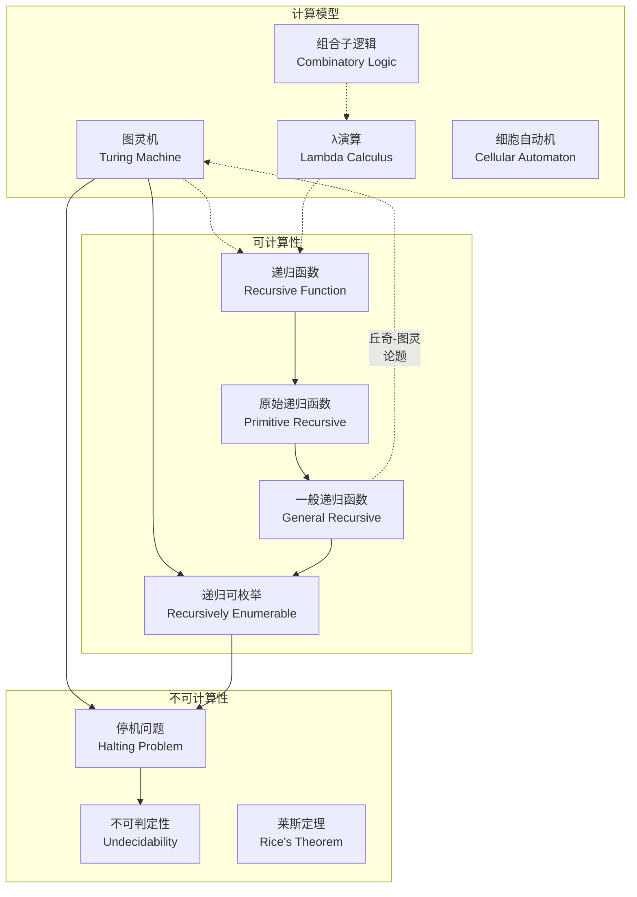
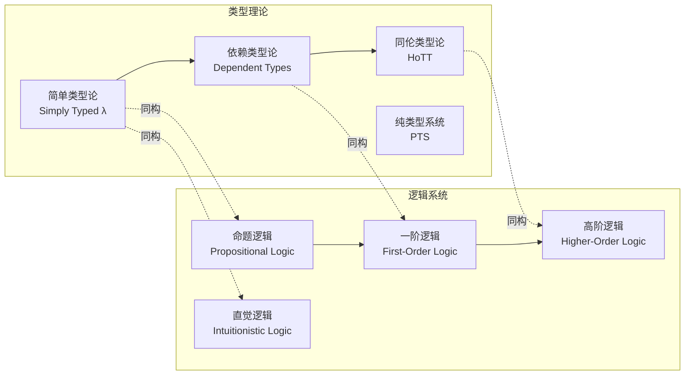
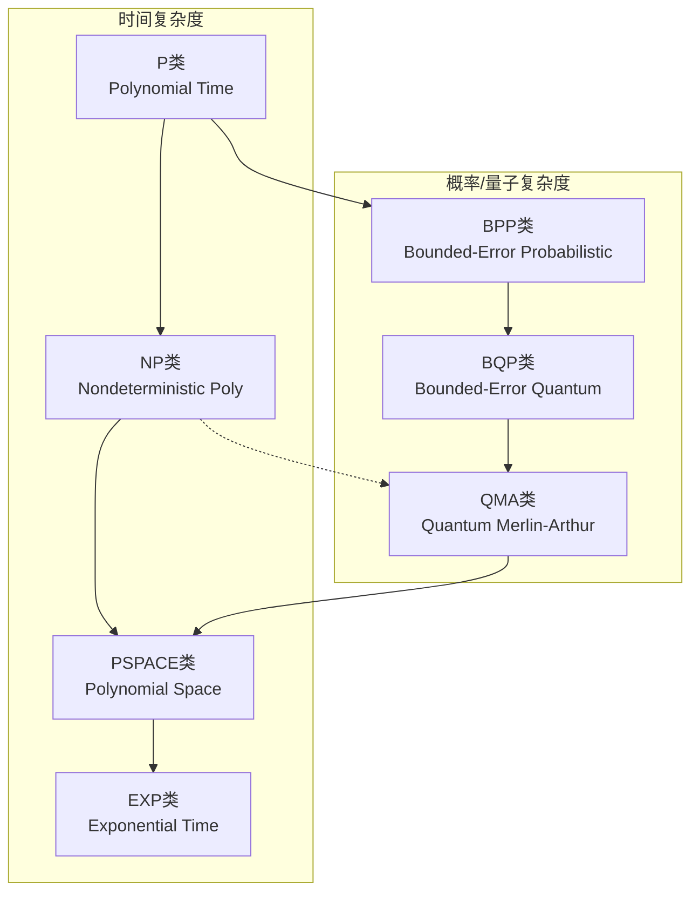
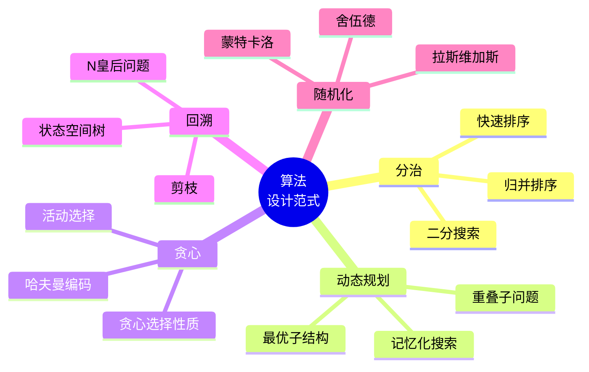
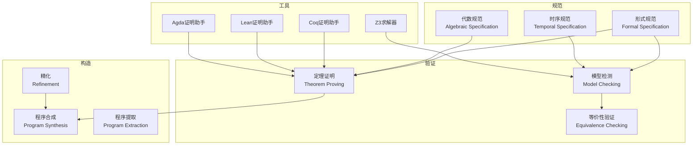
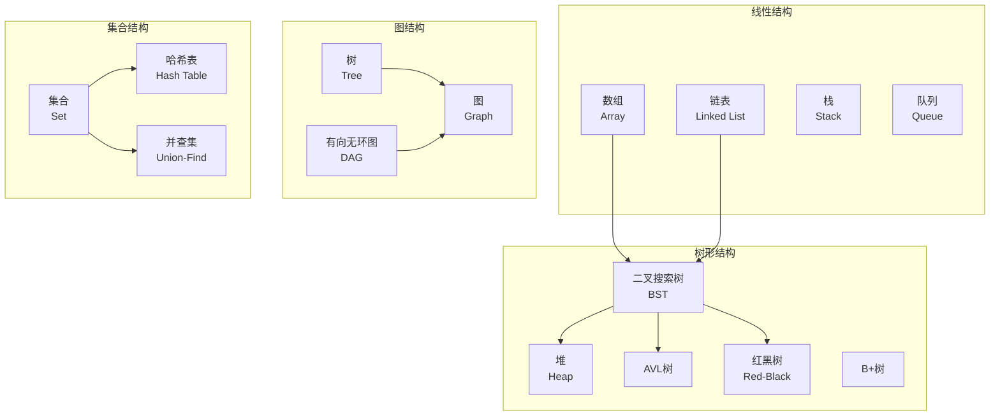
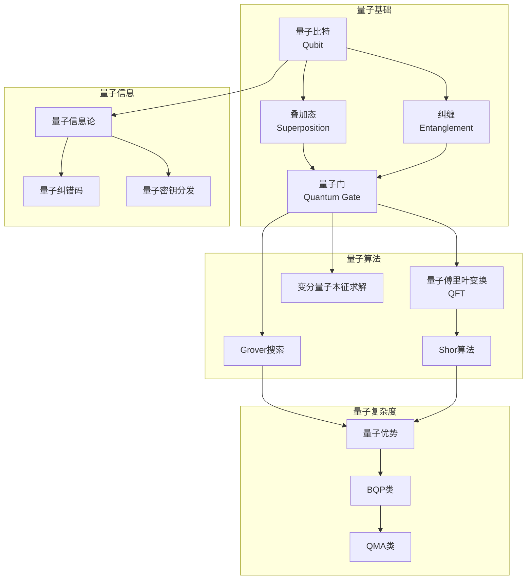
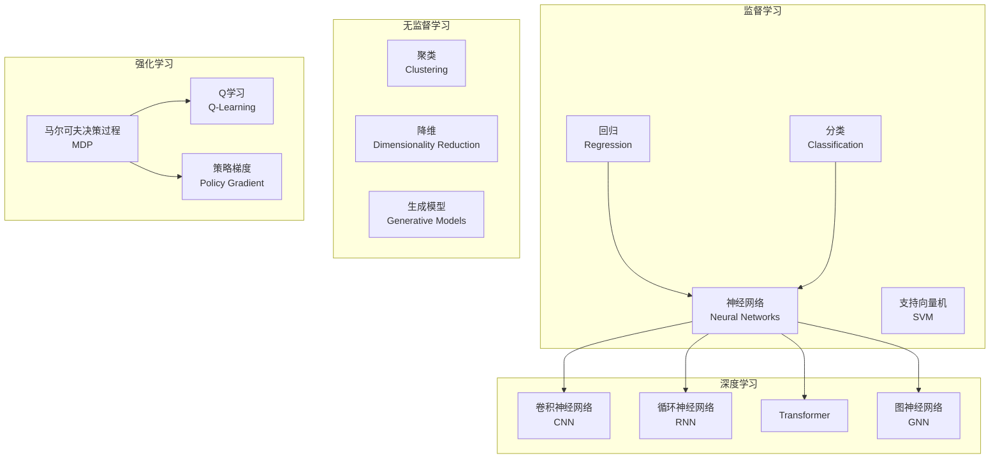

# 知识图谱 - 核心概念关系图

## 可计算性理论核心

```mermaid
graph TB
    subgraph "计算模型"
        TM[图灵机<br/>Turing Machine]
        LC[λ演算<br/>Lambda Calculus]
        CL[组合子逻辑<br/>Combinatory Logic]
        CA[细胞自动机<br/>Cellular Automaton]
    end
    
    subgraph "可计算性"
        RF[递归函数<br/>Recursive Function]
        PR[原始递归函数<br/>Primitive Recursive]
        GR[一般递归函数<br/>General Recursive]
        RE[递归可枚举<br/>Recursively Enumerable]
    end
    
    subgraph "不可计算性"
        HP[停机问题<br/>Halting Problem]
        UD[不可判定性<br/>Undecidability]
        RP[莱斯定理<br/>Rice's Theorem]
    end
    
    TM -.-> RF
    LC -.-> RF
    CL -.-> LC
    
    RF --> PR
    PR --> GR
    GR -.丘奇-图灵<br/>论题.-> TM
    
    TM --> HP
    HP --> UD
    RE --> HP
    
    TM --> RE
    GR --> RE
```

## 类型与逻辑对应 (柯里-霍华德同构)

```mermaid
graph LR
    subgraph "类型理论"
        STT[简单类型论<br/>Simply Typed λ]
        DTT[依赖类型论<br/>Dependent Types]
        HTT[同伦类型论<br/>HoTT]
        PTS[纯类型系统<br/>PTS]
    end
    
    subgraph "逻辑系统"
        PL[命题逻辑<br/>Propositional Logic]
        FOL[一阶逻辑<br/>First-Order Logic]
        HOL[高阶逻辑<br/>Higher-Order Logic]
        IL[直觉逻辑<br/>Intuitionistic Logic]
    end
    
    STT -.同构.-> PL
    STT -.同构.-> IL
    DTT -.同构.-> FOL
    HTT -.同构.-> HOL
    
    STT --> DTT
    DTT --> HTT
    PL --> FOL
    FOL --> HOL
```

## 复杂度类层次

```mermaid
graph TB
    subgraph "时间复杂度"
        P[P类<br/>Polynomial Time]
        NP[NP类<br/>Nondeterministic Poly]
        PSPACE[PSPACE类<br/>Polynomial Space]
        EXP[EXP类<br/>Exponential Time]
    end
    
    subgraph "概率/量子复杂度"
        BPP[BPP类<br/>Bounded-Error Probabilistic]
        BQP[BQP类<br/>Bounded-Error Quantum]
        QMA[QMA类<br/>Quantum Merlin-Arthur]
    end
    
    P --> NP
    NP --> PSPACE
    PSPACE --> EXP
    
    P --> BPP
    BPP --> BQP
    BQP --> QMA
    QMA --> PSPACE
    
    NP -.-> QMA
```

## 算法设计范式

```mermaid
mindmap
  root((算法<br/>设计范式))
    分治
      归并排序
      快速排序
      二分搜索
    动态规划
      最优子结构
      重叠子问题
      记忆化搜索
    贪心
      贪心选择性质
      活动选择
      哈夫曼编码
    回溯
      状态空间树
      剪枝
      N皇后问题
    随机化
      拉斯维加斯
      蒙特卡洛
      舍伍德
```

## 形式化方法层次

```mermaid
graph TB
    subgraph "规范"
        SPEC[形式规范<br/>Formal Specification]
        TEMP[时序规范<br/>Temporal Specification]
        ALG[代数规范<br/>Algebraic Specification]
    end
    
    subgraph "验证"
        MODEL[模型检测<br/>Model Checking]
        THEO[定理证明<br/>Theorem Proving]
        EQUIV[等价性验证<br/>Equivalence Checking]
    end
    
    subgraph "构造"
      SYNTH[程序合成<br/>Program Synthesis]
        REFINE[精化<br/>Refinement]
        EXTRACT[程序提取<br/>Program Extraction]
    end
    
    subgraph "工具"
        COQ[Coq证明助手]
        LEAN[Lean证明助手]
        AGDA[Agda证明助手]
        Z3[Z3求解器]
    end
    
    SPEC --> MODEL
    SPEC --> THEO
    TEMP --> MODEL
    ALG --> THEO
    
    THEO --> SYNTH
    MODEL --> EQUIV
    REFINE --> SYNTH
    
    COQ --> THEO
    LEAN --> THEO
    AGDA --> THEO
    Z3 --> MODEL
```

## 数据结构层次

```mermaid
graph TB
    subgraph "线性结构"
        ARRAY[数组<br/>Array]
        LIST[链表<br/>Linked List]
        STACK[栈<br/>Stack]
        QUEUE[队列<br/>Queue]
    end
    
    subgraph "树形结构"
        BST[二叉搜索树<br/>BST]
        HEAP[堆<br/>Heap]
        AVL[AVL树]
        RB[红黑树<br/>Red-Black]
        BPT[B+树]
    end
    
    subgraph "图结构"
        GRAPH[图<br/>Graph]
        TREE[树<br/>Tree]
        DAG[有向无环图<br/>DAG]
    end
    
    subgraph "集合结构"
        SET[集合<br/>Set]
        HASH[哈希表<br/>Hash Table]
        UF[并查集<br/>Union-Find]
    end
    
    ARRAY --> BST
    LIST --> BST
    BST --> AVL
    BST --> RB
    BST --> HEAP
    
    TREE --> GRAPH
    DAG --> GRAPH
    
    SET --> HASH
    SET --> UF
```

## 量子计算概念图

```mermaid
graph TB
    subgraph "量子基础"
        QUBIT[量子比特<br/>Qubit]
        SUPER[叠加态<br/>Superposition]
        ENT[纠缠<br/>Entanglement]
        GATE[量子门<br/>Quantum Gate]
    end
    
    subgraph "量子算法"
        QFT[量子傅里叶变换<br/>QFT]
        GROVER[Grover搜索]
        SHOR[Shor算法]
        VQE[变分量子本征求解]
    end
    
    subgraph "量子信息"
        QI[量子信息论]
        QECC[量子纠错码]
        QKD[量子密钥分发]
    end
    
    subgraph "量子复杂度"
        BQP2[BQP类]
        QMA2[QMA类]
        QADV[量子优势]
    end
    
    QUBIT --> SUPER
    QUBIT --> ENT
    SUPER --> GATE
    ENT --> GATE
    
    GATE --> QFT
    QFT --> SHOR
    GATE --> GROVER
    GATE --> VQE
    
    QUBIT --> QI
    QI --> QECC
    QI --> QKD
    
    GROVER --> QADV
    SHOR --> QADV
    QADV --> BQP2
    BQP2 --> QMA2
```

## 机器学习算法分类

```mermaid
graph TB
    subgraph "监督学习"
        REG[回归<br/>Regression]
        CLASS[分类<br/>Classification]
        NN[神经网络<br/>Neural Networks]
        SVM[支持向量机<br/>SVM]
    end
    
    subgraph "无监督学习"
        CLUSTER[聚类<br/>Clustering]
        DIM[降维<br/>Dimensionality Reduction]
        GEN[生成模型<br/>Generative Models]
    end
    
    subgraph "强化学习"
        MDP[马尔可夫决策过程<br/>MDP]
        QL[Q学习<br/>Q-Learning]
        PG[策略梯度<br/>Policy Gradient]
    end
    
    subgraph "深度学习"
        CNN[卷积神经网络<br/>CNN]
        RNN[循环神经网络<br/>RNN]
        TRANS[Transformer]
        GNN[图神经网络<br/>GNN]
    end
    
    REG --> NN
    CLASS --> NN
    NN --> CNN
    NN --> RNN
    NN --> TRANS
    NN --> GNN
    
    MDP --> QL
    MDP --> PG
```

---

*此图表展示核心概念之间的深层关系和层次结构*
