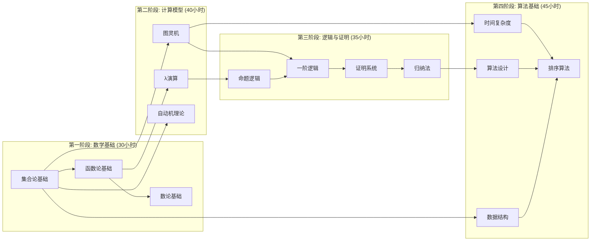
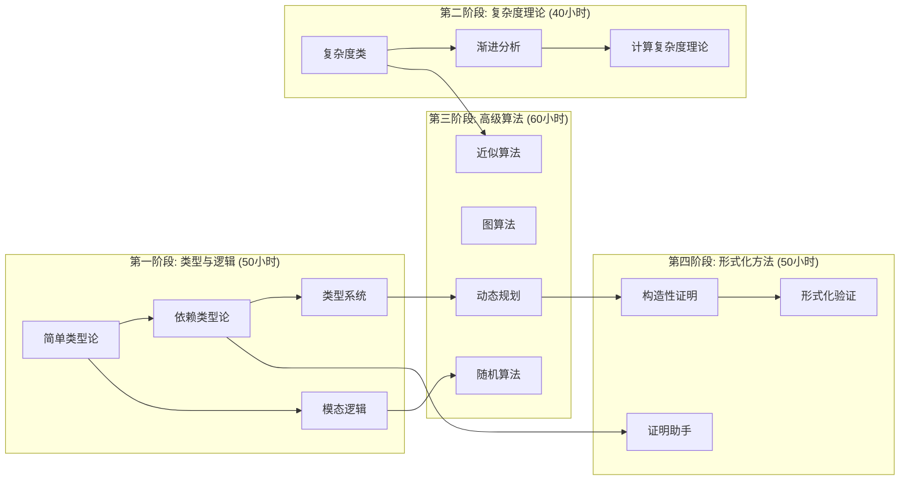
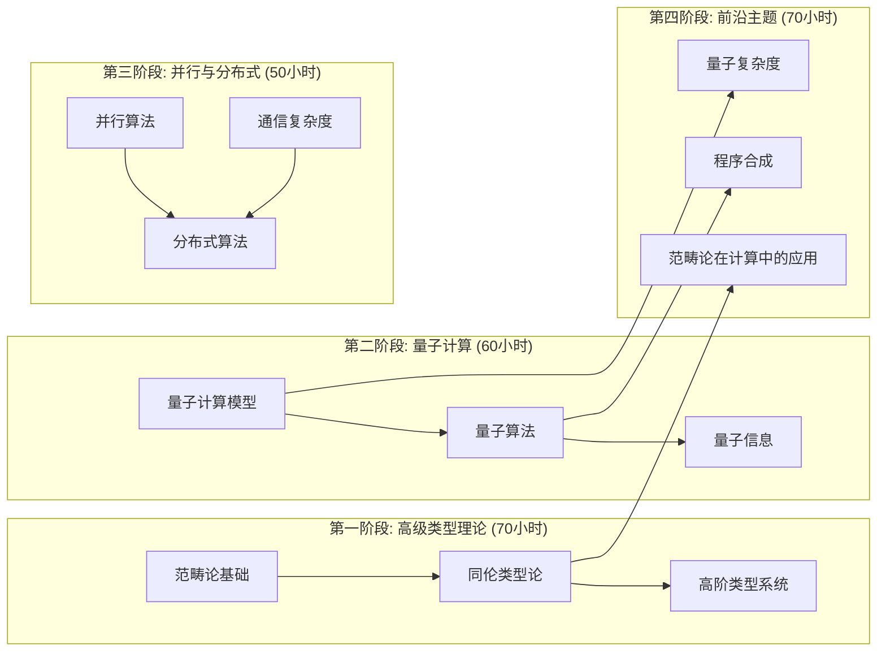
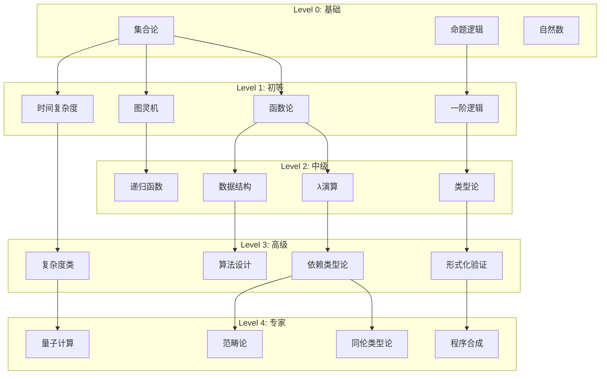
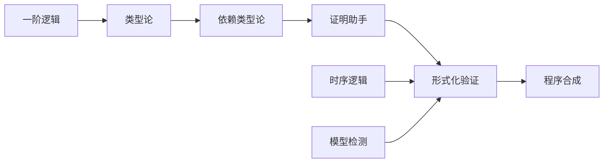
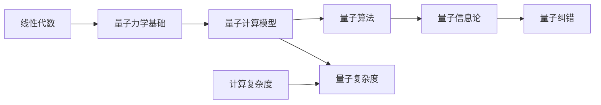
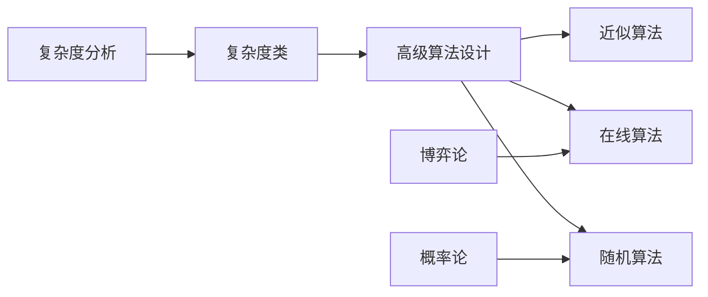
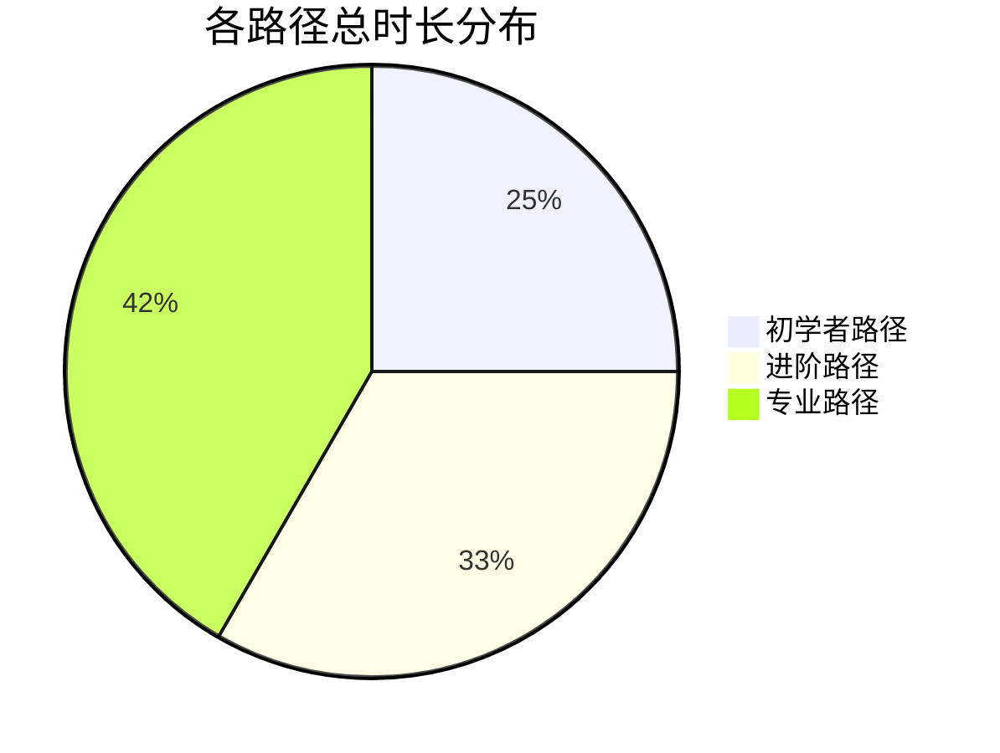
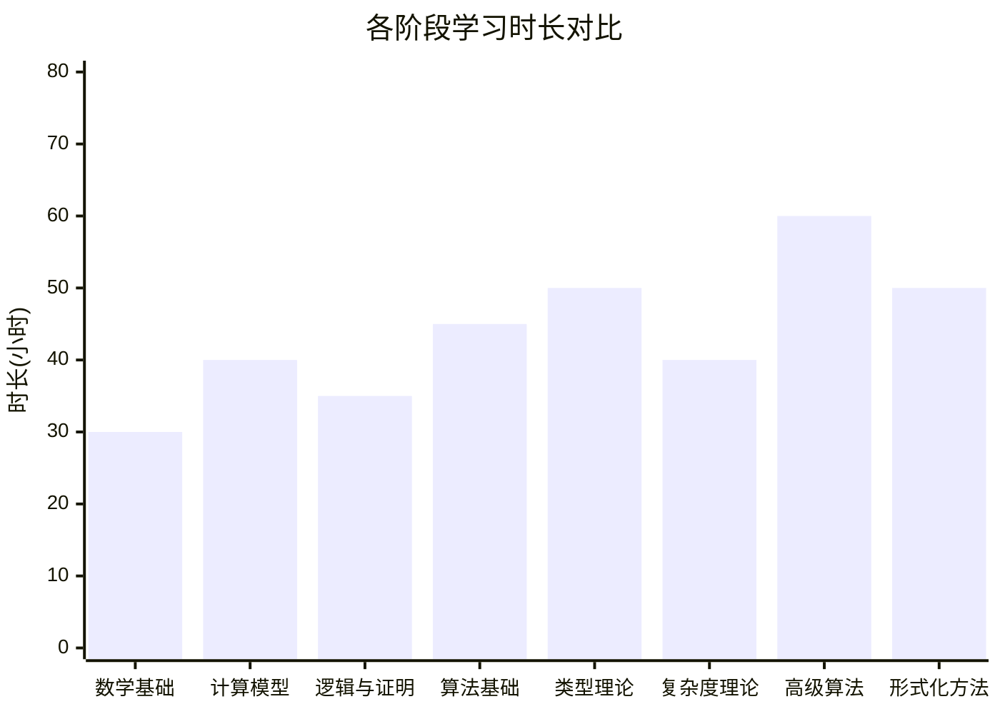

# 知识图谱 - 学习路径图

## 初学者学习路径



## 进阶学习路径



## 专业学习路径



## 知识依赖深度图



## 领域专家路径

### 形式化验证专家



### 量子计算专家



### 算法理论专家



## 学习时长估算





## 知识广度vs深度

```mermaid
quadrantChart
    title 知识领域广度与深度矩阵
    x-axis 低广度 --> 高广度
    y-axis 低深度 --> 高深度

    quadrant-1 专家级(深且广)
    quadrant-2 专精型(深但窄)
    quadrant-3 入门型(浅且窄)
    quadrant-4 通识型(广但浅)

    "集合论": [0.2, 0.3]
    "图灵机": [0.3, 0.4]
    "类型论": [0.6, 0.7]
    "同伦类型论": [0.8, 0.9]
    "量子计算": [0.7, 0.8]
    "算法设计": [0.8, 0.6]
    "形式化验证": [0.7, 0.8]
    "范畴论": [0.9, 0.8]
```

## 推荐学习顺序表

| 序号 | 概念 | 前置知识 | 难度 | 时长(小时) | 路径 |
|------|------|----------|------|------------|------|
| 1 | 集合论 | 无 | ⭐ | 10 | 所有 |
| 2 | 命题逻辑 | 无 | ⭐ | 8 | 所有 |
| 3 | 函数论 | 集合论 | ⭐ | 8 | 所有 |
| 4 | 图灵机 | 集合论,函数论 | ⭐⭐ | 15 | 所有 |
| 5 | λ演算 | 函数论 | ⭐⭐ | 12 | 所有 |
| 6 | 一阶逻辑 | 命题逻辑 | ⭐⭐ | 12 | 所有 |
| 7 | 简单类型论 | λ演算 | ⭐⭐ | 12 | 进阶,专业 |
| 8 | 时间复杂度 | 函数论 | ⭐⭐ | 8 | 所有 |
| 9 | 算法设计 | 时间复杂度 | ⭐⭐ | 12 | 所有 |
| 10 | 依赖类型论 | 简单类型论 | ⭐⭐⭐ | 18 | 进阶,专业 |
| 11 | 复杂度类 | 时间复杂度,图灵机 | ⭐⭐⭐ | 15 | 进阶,专业 |
| 12 | 动态规划 | 算法设计,归纳法 | ⭐⭐⭐ | 15 | 进阶,专业 |
| 13 | 形式化验证 | 证明系统,时序逻辑 | ⭐⭐⭐⭐ | 20 | 专业 |
| 14 | 同伦类型论 | 依赖类型论,范畴论 | ⭐⭐⭐⭐⭐ | 30 | 专业 |
| 15 | 量子计算 | 图灵机,线性代数 | ⭐⭐⭐⭐ | 25 | 专业 |

---

*此图表提供结构化的学习路径规划建议*
