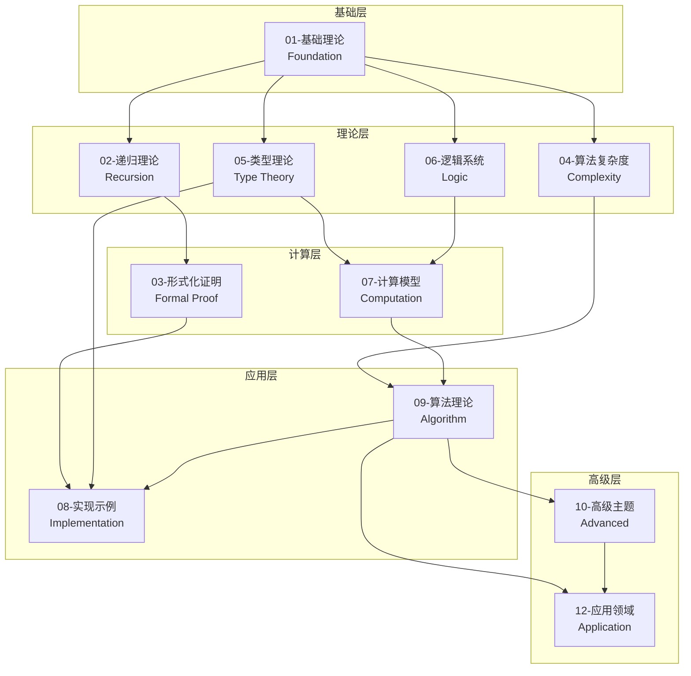
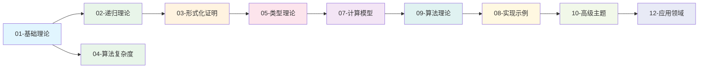
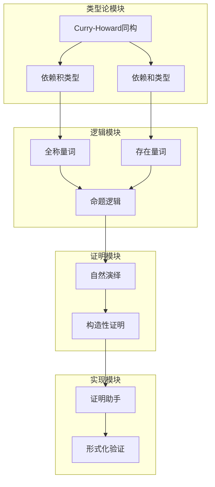

# 项目整体知识图谱

> **创建日期**: 2025-04-08
> **覆盖范围**: FormalAlgorithm项目全部12个模块
> **目的**: 建立模块级别的知识图谱，支持项目导航和学习路径规划

---

## 模块关系总览

### 1.1 模块依赖图



### 1.2 详细模块依赖关系

| 模块 | 前置模块 | 后续模块 | 核心概念 |
|------|---------|---------|---------|
| 01-基础理论 | 无 | 02, 04, 05, 06, 07 | 形式化系统、算法、计算 |
| 02-递归理论 | 01 | 03 | 原始递归、μ-递归、可计算性 |
| 03-形式化证明 | 01, 02 | 08, 10 | 证明系统、归纳法、构造性证明 |
| 04-算法复杂度 | 01 | 09 | 时间/空间复杂度、渐进分析 |
| 05-类型理论 | 01, 06 | 07, 08, 10 | 简单类型、依赖类型、HoTT |
| 06-逻辑系统 | 01 | 05, 07 | 命题/一阶/直觉逻辑 |
| 07-计算模型 | 05, 06 | 09 | 图灵机、λ演算、自动机 |
| 08-实现示例 | 03, 05, 09 | 10, 12 | Lean/Coq/Agda实现 |
| 09-算法理论 | 04, 07 | 08, 10, 12 | 排序/搜索/图算法、动态规划 |
| 10-高级主题 | 03, 05, 09 | 12 | 范畴论、证明助手、量子计算 |
| 12-应用领域 | 09, 10 | 无 | AI/区块链/网络安全应用 |

---

## 学习路径推荐

### 路径1: 算法设计师 (Algorithm Designer)


**路径说明**:
1. **01-基础理论**: 理解形式化定义、算法概念、数学基础
2. **04-算法复杂度**: 掌握时间/空间复杂度分析、渐进记号
3. **09-算法理论**: 学习排序、搜索、图算法、动态规划等核心算法
4. **12-应用领域**: 了解算法在AI、区块链等领域的应用

**预计学习时长**: 120-150小时

### 路径2: 形式化方法专家 (Formal Methods Expert)


**路径说明**:
1. **01-基础理论**: 建立形式化系统和数学基础
2. **02-递归理论**: 理解可计算性和递归函数
3. **03-形式化证明**: 掌握证明系统、归纳法、构造性证明
4. **05-类型理论**: 学习Curry-Howard同构、依赖类型
5. **08-实现示例**: 实践Lean/Coq/Agda形式化验证

**预计学习时长**: 180-220小时

### 路径3: 计算理论研究者 (Computation Theory Researcher)


**路径说明**:
1. **01-基础理论**: 建立理论基础
2. **02-递归理论**: 深入可计算性理论
3. **05-类型理论**: 掌握类型系统和逻辑
4. **06-逻辑系统**: 学习命题逻辑、一阶逻辑、模态逻辑
5. **07-计算模型**: 理解图灵机、λ演算、自动机
6. **10-高级主题**: 探索范畴论、同伦类型论、量子计算

**预计学习时长**: 250-300小时

### 路径4: 全栈形式化工程师 (Full-Stack Formal Engineer)



**预计学习时长**: 400-500小时

---

## 核心概念跨模块映射

### 3.1 通用核心概念

| 概念 | 定义模块 | 应用模块 | 相关概念 |
|------|---------|---------|---------|
| 算法 | 01-基础理论 | 04, 09, 12 | 计算、复杂度、数据结构 |
| 递归 | 02-递归理论 | 03, 09 | 可计算性、归纳法、分治 |
| 证明 | 03-形式化证明 | 05, 08 | 推理、验证、正确性 |
| 复杂度 | 04-算法复杂度 | 09, 10 | 时间/空间、渐进分析 |
| 类型 | 05-类型理论 | 07, 08 | Curry-Howard、程序验证 |
| 逻辑 | 06-逻辑系统 | 03, 05 | 推理规则、证明系统 |
| 计算 | 07-计算模型 | 02, 09 | 图灵机、可计算性 |
| 验证 | 08-实现示例 | 03, 10 | 形式化证明、类型论 |

### 3.2 Curry-Howard同构跨模块关系



---

## 知识图谱使用指南

### 4.1 快速入门

1. **选择学习路径**: 根据职业目标选择推荐路径
2. **遵循依赖关系**: 按照模块依赖顺序学习
3. **利用概念映射**: 通过跨模块概念理解知识联系
4. **参考详细图谱**: 深入各模块知识图谱获取详细信息

### 4.2 知识图谱导航

```
项目整体知识图谱 (本文档)
    ├── 模块详细知识图谱
    │   ├── 01-基础理论知识图谱.md
    │   ├── 02-递归理论知识图谱.md
    │   ├── 03-形式化证明知识图谱.md
    │   ├── 04-算法复杂度知识图谱.md
    │   ├── 05-类型理论知识图谱.md
    │   ├── 06-逻辑系统知识图谱.md
    │   ├── 07-计算模型知识图谱.md
    │   └── 09-算法理论知识图谱.md
    ├── 跨模块概念映射.md
    └── concepts_database.yaml
```

### 4.3 概念检索

- **按模块检索**: 查看各模块详细知识图谱
- **按概念检索**: 使用概念数据库YAML文件
- **按关系检索**: 利用跨模块概念映射文档

---

## 统计数据

### 5.1 项目规模统计

| 类别 | 数量 |
|------|------|
| 总模块数 | 12 |
| 核心模块 | 8 |
| 文档总数 | 330+ |
| 概念总数 | 300+ |
| 学习路径 | 4条 |

### 5.2 模块完成度

| 模块 | 文档数 | 核心概念数 | 完成度 |
|------|-------|-----------|-------|
| 01-基础理论 | 12 | 45 | 95% |
| 02-递归理论 | 5 | 35 | 90% |
| 03-形式化证明 | 5 | 30 | 95% |
| 04-算法复杂度 | 6 | 40 | 90% |
| 05-类型理论 | 8 | 50 | 95% |
| 06-逻辑系统 | 9 | 45 | 85% |
| 07-计算模型 | 8 | 40 | 85% |
| 09-算法理论 | 25+ | 80 | 90% |

---

**文档版本**: 1.0
**最后更新**: 2025-04-08
**状态**: 项目整体知识图谱完成
