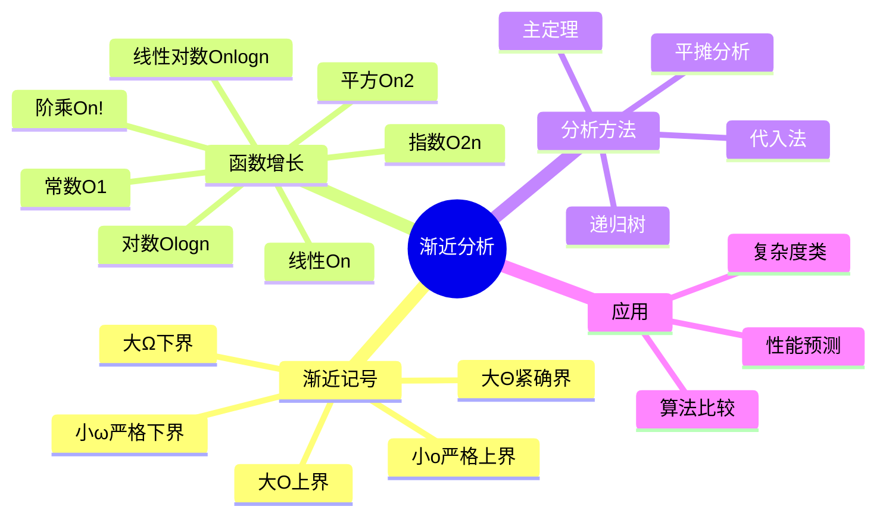

# 渐近分析 (Asymptotic Analysis)

> **学科**: 算法设计与分析
> **难度**: ★★★☆☆
> **先修**: 离散数学、函数增长、极限概念
> **学时**: 4小时
> **来源**: CLRS第3章、MIT 6.006第2讲
> **版本**: v1.0
> **更新**: 2026-04-09

---

## 一、核心概念

### 1.1 定义

**正式定义**:
渐近分析是研究算法在输入规模$n \to \infty$时的性能特征，忽略常数因子和低阶项，关注函数增长的**渐近行为**。

设$f(n)$和$g(n)$为从自然数到非负实数的函数：

- **大O记号** $O(g(n))$: $f(n) \in O(g(n))$ 当且仅当存在正常数$c$和$n_0$，使得对所有$n \geq n_0$：
  $$f(n) \leq c \cdot g(n)$$

- **大Ω记号** $\Omega(g(n))$: $f(n) \in \Omega(g(n))$ 当且仅当存在正常数$c$和$n_0$，使得对所有$n \geq n_0$：
  $$f(n) \geq c \cdot g(n)$$

- **大Θ记号** $\Theta(g(n))$: $f(n) \in \Theta(g(n))$ 当且仅当存在正常数$c_1, c_2$和$n_0$，使得对所有$n \geq n_0$：
  $$c_1 \cdot g(n) \leq f(n) \leq c_2 \cdot g(n)$$

**直观解释**:
渐近分析就像比较两辆汽车的"长途行驶能力"——我们不关心它们在启动时的瞬间加速，而是关注当行驶距离（输入规模）变得非常大时，哪辆车能更快到达目的地。

**关键要点**:
- 渐近分析描述的是**增长率的上界、下界或紧确界**
- 忽略常数因子（与机器无关）和低阶项（n足够大时不重要）
- 大O是最常用的，表示最坏情况保证
- 大Θ表示紧确界，意味着上下界相同

### 1.2 属性

| 属性 | 描述 | 备注 |
|------|------|------|
| 传递性 | 若$f \in O(g)$且$g \in O(h)$，则$f \in O(h)$ | 所有渐近记号都满足 |
| 自反性 | $f \in O(f)$ | 对自身成立 |
| 对称性 | $f \in \Theta(g) \iff g \in \Theta(f)$ | 仅Θ满足 |
| 转置对称性 | $f \in O(g) \iff g \in \Omega(f)$ | O与Ω的对偶关系 |

**性质总结**:
1. **多项式规则**: 若$f(n)$是$d$次多项式，则$f(n) \in \Theta(n^d)$
2. **对数底无关性**: $\log_a n \in \Theta(\log_b n)$对任意常数底$a, b > 1$
3. **指数区分性**: 对任意$a > 1$和$d > 0$，$n^d \in O(a^n)$但$a^n \notin O(n^d)$

### 1.3 变体

**小o记号**:
- 定义: $f(n) \in o(g(n))$ 表示$\lim_{n \to \infty} \frac{f(n)}{g(n)} = 0$
- 与标准形式的区别: 是严格上界，非紧确
- 适用场景: 需要强调"渐进小于"的情况

**小ω记号**:
- 定义: $f(n) \in \omega(g(n))$ 表示$\lim_{n \to \infty} \frac{f(n)}{g(n)} = \infty$
- 与标准形式的区别: 是严格下界
- 适用场景: 需要强调"渐进大于"的情况

**软O记号** $\tilde{O}$:
- 定义: $\tilde{O}(g(n)) = O(g(n) \cdot \log^k n)$对某个常数$k$
- 与标准形式的区别: 忽略对数因子
- 适用场景: 多项式时间算法中，对数因子被视为"几乎常数"

---

## 二、关系网络

### 2.1 前置知识

完成本主题学习前，应掌握：

| 前置知识 | 重要性 | 掌握程度检验 |
|----------|--------|--------------|
| 基本函数性质 | ⭐⭐⭐⭐⭐ | 理解多项式、指数、对数函数图像 |
| 极限概念 | ⭐⭐⭐⭐⭐ | 能计算简单函数的极限 |
| 求和公式 | ⭐⭐⭐⭐☆ | 掌握等差、等比数列求和 |
| 数学归纳法 | ⭐⭐⭐☆☆ | 能证明简单命题 |

### 2.2 相关概念

**紧密相关**:
- **递归式求解** - 分析递归算法时间复杂度的工具
- **主定理** - 求解分治递归式的有力工具
- **平摊分析** - 关注操作序列的平均成本

**一般相关**:
- **概率分析** - 分析随机算法的期望性能
- **计算复杂性** - 研究问题本身的计算难度

### 2.3 后续扩展

学习本主题后，可继续深入：

1. **高级分析技术** → 平摊分析、概率分析、竞争分析
2. **计算复杂性理论** → P vs NP、复杂性类层次结构
3. **具体算法分析** → 图算法、字符串算法的复杂度分析

### 2.4 思维导图



---

## 三、形式化证明

### 3.1 核心定理

**定理 1** (传递性): 若$f(n) \in O(g(n))$且$g(n) \in O(h(n))$，则$f(n) \in O(h(n))$。

**证明**:
```
由定义，存在常数c₁, n₁使得对所有n ≥ n₁：f(n) ≤ c₁·g(n)
由定义，存在常数c₂, n₂使得对所有n ≥ n₂：g(n) ≤ c₂·h(n)

取n₀ = max(n₁, n₂)，则对所有n ≥ n₀：

f(n) ≤ c₁·g(n) ≤ c₁·c₂·h(n)

令c = c₁·c₂，则f(n) ≤ c·h(n)对所有n ≥ n₀成立。

因此f(n) ∈ O(h(n))。∎
```

**证明要点分析**:
1. **展开定义**: 将渐近记号转换为其不等式定义
2. **组合不等式**: 通过传递性连接两个不等式
3. **选择n₀**: 取两个阈值的最大值确保两个条件同时满足

**直觉理解**:
如果A比B快，B比C快，那么A当然比C快——这是不等式传递性的直接体现。

### 3.2 辅助引理

**引理 1** (对数底转换): 对任意常数$a, b > 1$，有$\log_a n \in \Theta(\log_b n)$。

*证明*:
```
由换底公式：log_a n = log_b n / log_b a

令c = 1/log_b a（常数），则log_a n = c · log_b n

因此：
- log_a n ≤ c · log_b n  ⇒ log_a n ∈ O(log_b n)
- log_a n ≥ c · log_b n  ⇒ log_a n ∈ Ω(log_b n)

故log_a n ∈ Θ(log_b n)。∎
```

**引理 2** (多项式与指数): 对任意$d > 0$和$a > 1$，有$n^d \in o(a^n)$。

*证明*: 使用洛必达法则$d$次：
```
lim(n→∞) n^d / a^n = lim(n→∞) d·n^(d-1) / (a^n · ln a)
                  = ... 
                  = lim(n→∞) d! / (a^n · (ln a)^d) = 0

因此n^d ∈ o(a^n)。∎
```

---

## 四、算法/方法详解

### 4.1 算法描述

**比较两个函数阶的算法**:
```
算法: 比较函数渐近阶
输入: 函数f(n), g(n)
输出: 它们的关系(O, Ω, Θ, o, ω, 或无法比较)

1. 计算极限 L = lim(n→∞) f(n)/g(n)
2. if L = 0 then
3.     return f(n) ∈ o(g(n))
4. else if L = c (0 < c < ∞) then
5.     return f(n) ∈ Θ(g(n))
6. else if L = ∞ then
7.     return f(n) ∈ ω(g(n))
8. else
9.     return 极限不存在，无法直接比较
10. end if
```

**流程图**:
```
    开始
      │
      ▼
计算 lim f(n)/g(n)
      │
      ├──→ L = 0 ──→ f ∈ o(g)
      │
      ├──→ 0<L<∞ ──→ f ∈ Θ(g)
      │
      ├──→ L = ∞ ──→ f ∈ ω(g)
      │
      └──→ 不存在 ──→ 无法比较
```

### 4.2 正确性分析

**基于极限的定义等价性**:

| 极限值 | 渐近关系 |
|--------|----------|
|$\lim \frac{f}{g} = 0$ | $f \in o(g)$ |
|$\lim \frac{f}{g} = c > 0$ | $f \in \Theta(g)$ |
|$\lim \frac{f}{g} = \infty$ | $f \in \omega(g)$ |

**证明** (以$\lim \frac{f}{g} = 0 \Rightarrow f \in o(g)$为例):
```
由极限定义，对任意ε > 0，存在n₀使得对所有n ≥ n₀：
|f(n)/g(n)| < ε

即f(n) < ε·g(n)对所有n ≥ n₀成立。

这正是o(g(n))的定义（取c = ε任意小）。∎
```

### 4.3 复杂度分析

**时间复杂度**:
- 基本运算：$O(1)$
- 多项式求值：$O(d)$（$d$为次数）
- 极限计算：取决于函数形式，通常为$O(1)$到$O(n)$

**空间复杂度**: $O(1)$

**复杂度证明**:
```
比较两个函数的渐近阶主要涉及：
1. 计算极限（解析方法或数值方法）
2. 常数时间的比较操作

对于常见的基本函数类（多项式、指数、对数），
解析极限计算是常数时间的。
```

---

## 五、示例与实例

### 5.1 标准示例

**示例 1**: 证明$2n^2 + 3n + 1 \in O(n^2)$

**问题描述**:
用定义证明$2n^2 + 3n + 1$的上界是$n^2$。

**解决过程**:
1. 需要找到常数$c$和$n_0$，使得$2n^2 + 3n + 1 \leq c \cdot n^2$对所有$n \geq n_0$成立
2. 观察：当$n \geq 1$时，$3n \leq 3n^2$且$1 \leq n^2$
3. 因此$2n^2 + 3n + 1 \leq 2n^2 + 3n^2 + n^2 = 6n^2$
4. 取$c = 6, n_0 = 1$即可

**结果**: $2n^2 + 3n + 1 \in O(n^2)$，实际上也是$\Theta(n^2)$

**示例 2**: 比较$n\log n$和$n^{1.5}$

**解决过程**:
```
计算极限：lim(n→∞) (n log n) / n^1.5
        = lim(n→∞) log n / n^0.5
        = 0  （对数增长慢于任何正幂次）
```

**结果**: $n\log n \in o(n^{1.5})$，即$n\log n$渐进小于$n^{1.5}$

**示例 3**: 斯特林近似

**问题描述**:
证明$n! \in \Theta\left(\sqrt{n}\left(\frac{n}{e}\right)^n\right)$

**解决过程**:
斯特林公式给出：
$$n! \sim \sqrt{2\pi n}\left(\frac{n}{e}\right)^n$$

因此$n! \in \Theta\left(\sqrt{n}\left(\frac{n}{e}\right)^n\right) \subseteq O(n^n)$但更紧确的是$O(n!)$本身。

**结果**: $n!$的增长速度比任何指数函数都快，但比$n^n$慢。

### 5.2 代码实现

**语言**: Python

```python
import math
from typing import Callable, Union

def compare_asymptotic(f: Callable[[int], float], 
                       g: Callable[[int], float], 
                       n_values: list = None) -> str:
    """
    通过数值方法比较两个函数的渐近阶
    
    Args:
        f, g: 输入为整数n，输出为浮点数的函数
        n_values: 测试的n值列表，默认为[10, 100, 1000, 10000]
    
    Returns:
        渐近关系的估计
    """
    if n_values is None:
        n_values = [10, 100, 1000, 10000]
    
    ratios = []
    for n in n_values:
        try:
            ratio = f(n) / g(n)
            ratios.append(ratio)
        except (OverflowError, ZeroDivisionError):
            ratios.append(float('inf'))
    
    # 分析比率趋势
    print(f"n\tf(n)\t\tg(n)\t\tratio f/g")
    print("-" * 50)
    for n, r in zip(n_values, ratios):
        try:
            print(f"{n}\t{f(n):.2e}\t{g(n):.2e}\t{r:.4f}")
        except OverflowError:
            print(f"{n}\toverflow\toverflow\t{r}")
    
    # 简单启发式判断
    if len(ratios) >= 2:
        if ratios[-1] == 0 or ratios[-1] < 0.001:
            return "f(n) ∈ o(g(n)) - f增长显著慢于g"
        elif ratios[-1] > 1000 or ratios[-1] == float('inf'):
            return "f(n) ∈ ω(g(n)) - f增长显著快于g"
        elif 0.1 < ratios[-1] < 10:
            return f"f(n) ∈ Θ(g(n)) - 比率趋近于{ratios[-1]:.2f}"
    
    return "需要更多数据判断"


# 常见增长函数
def constant(n): return 1
def logarithmic(n): return math.log2(n) if n > 0 else 0
def linear(n): return n
def linearithmic(n): return n * math.log2(n) if n > 0 else 0
def quadratic(n): return n ** 2
def cubic(n): return n ** 3
def exponential(n): return 2 ** n


# 示例测试
if __name__ == "__main__":
    print("=" * 60)
    print("示例1: n^2 vs 2n^2 + 3n + 1")
    f1 = lambda n: n**2
    g1 = lambda n: 2*n**2 + 3*n + 1
    print(compare_asymptotic(f1, g1))
    
    print("\n" + "=" * 60)
    print("示例2: n log n vs n^1.5")
    f2 = linearithmic
    g2 = lambda n: n ** 1.5
    print(compare_asymptotic(f2, g2))
    
    print("\n" + "=" * 60)
    print("示例3: 2^n vs n!")
    f3 = exponential
    g3 = lambda n: math.factorial(n) if n <= 20 else float('inf')
    print(compare_asymptotic(f3, g3, [5, 10, 15, 20]))
```

**代码说明**:
- `compare_asymptotic`: 通过数值采样估计渐近关系
- 提供了一组标准增长函数用于测试
- 使用启发式规则根据比率趋势判断渐近关系

## 5.3 反例
### 5.3 反例

**常见错误1**: 混淆大O与Theta
```python
# 错误陈述
"f(n) = O(n²) 意味着 f(n) 的最坏情况是二次的"

# 实际上
"f(n) = O(n²) 意味着 f(n) 不超过二次，可能是线性或对数"
```
**错误原因**: 大O只给上界，Theta才是紧确界
**正确做法**: 说"f(n)是$O(n^2)$"时应理解"不超过$O(n^2)$"

**常见错误2**: 忽略常数因子在实际中的重要性
```python
# 理论分析
"O(n)算法总是比O(n log n)算法快"

# 实际情况
# 算法A: 1000n  (O(n))
# 算法B: 5n log n (O(n log n))
# 当n < 2^200时，算法B更快！
```
**错误原因**: 渐近分析忽略常数因子，但在实际数据规模下常数可能主导
**正确做法**: 渐近分析用于大规模趋势预测，小规模需实际测试

---

## 六、习题

### 6.1 理解题 (L1)

1. **判断渐近关系** [难度⭐]
   
   对以下函数对，判断$f \in O(g)$、$f \in \Omega(g)$、$f \in \Theta(g)$还是无法比较：
   - (a) $f(n) = n^2 + 100n$, $g(n) = 0.5n^2$
   - (b) $f(n) = \log_2 n$, $g(n) = \log_3 n$
   - (c) $f(n) = 2^{2n}$, $g(n) = 2^n$
   - (d) $f(n) = n^{\sin n}$, $g(n) = n$
   
   <details>
   <summary>解答</summary>
   
   (a) $f \in \Theta(g)$。因为$f(n)/g(n) = (n^2 + 100n)/(0.5n^2) \to 2$。
   
   (b) $f \in \Theta(g)$。对数底不同只差常数因子。
   
   (c) $f \in \omega(g)$。$f(n)/g(n) = 2^{2n}/2^n = 2^n \to \infty$。
   
   (d) 无法比较。因为$\sin n$在-1和1之间震荡，$n^{\sin n}$有时大于$n$，有时小于$1/n$。
   
   </details>

2. **简化表达式** [难度⭐]
   
   用最简单的渐近记号表示以下复杂度：
   - $3n^2 + 10n + 5$
   - $100\log n + n^{0.5}$
   - $2^n + n^{100}$
   
   <details>
   <summary>解答</summary>
   
   - $3n^2 + 10n + 5 \in \Theta(n^2)$（最高次项主导）
   - $100\log n + n^{0.5} \in \Theta(n^{0.5})$（根号主导对数）
   - $2^n + n^{100} \in \Theta(2^n)$（指数主导多项式）
   
   </details>

### 6.2 应用题 (L2-L3)

1. **算法选择** [难度⭐⭐]
   
   有以下三个解决同一问题的算法：
   - 算法A: $T_A(n) = 100n\log_2 n$ 微秒
   - 算法B: $T_B(n) = 5n^2$ 微秒
   - 算法C: $T_C(n) = 0.5n^{2.5}$ 微秒
   
   假设$n = 10^6$，你应该选择哪个算法？$n$多大时算法A优于算法B？
   
   <details>
   <summary>解答</summary>
   
   当$n = 10^6$时：
   - $T_A = 100 \cdot 10^6 \cdot \log_2(10^6) \approx 100 \cdot 10^6 \cdot 20 \approx 2 \times 10^9$ 微秒 $= 2000$ 秒
   - $T_B = 5 \cdot (10^6)^2 = 5 \cdot 10^{12}$ 微秒 $= 5 \times 10^6$ 秒（约58天）
   - $T_C = 0.5 \cdot (10^6)^{2.5} = 0.5 \cdot 10^{15}$ 微秒（约15.8年）
   
   选择算法A。
   
   算法A优于B当$100n\log n < 5n^2$，即$20\log n < n$。
   数值求解得$n > 100$左右。
   
   </details>

2. **递归式求解** [难度⭐⭐]
   
   使用主定理求解以下递归式：
   - $T(n) = 2T(n/2) + n$
   - $T(n) = 4T(n/2) + n^2$
   - $T(n) = 2T(n/4) + \sqrt{n}$
   
   <details>
   <summary>解答</summary>
   
   **(a)** $a=2, b=2, f(n)=n$
   
   $n^{\log_b a} = n^{\log_2 2} = n^1 = n$
   
   $f(n) = \Theta(n^{\log_b a})$，Case 2：$T(n) = \Theta(n\log n)$
   
   **(b)** $a=4, b=2, f(n)=n^2$
   
   $n^{\log_b a} = n^{\log_2 4} = n^2$
   
   $f(n) = \Theta(n^{\log_b a})$，Case 2：$T(n) = \Theta(n^2\log n)$
   
   **(c)** $a=2, b=4, f(n)=\sqrt{n}=n^{0.5}$
   
   $n^{\log_b a} = n^{\log_4 2} = n^{0.5}$
   
   $f(n) = \Theta(n^{\log_b a})$，Case 2：$T(n) = \Theta(\sqrt{n}\log n)$
   
   </details>

### 6.3 证明题 (L4-L5)

1. **传递性证明** [难度⭐⭐⭐]
   
   证明若$f \in o(g)$且$g \in o(h)$，则$f \in o(h)$。
   
   <details>
   <summary>解答</summary>
   
   **证明**:
   
   由小o定义：
   - $f \in o(g) \Rightarrow \lim_{n \to \infty} f(n)/g(n) = 0$
   - $g \in o(h) \Rightarrow \lim_{n \to \infty} g(n)/h(n) = 0$
   
   考虑：
   $$\lim_{n \to \infty} \frac{f(n)}{h(n)} = \lim_{n \to \infty} \frac{f(n)}{g(n)} \cdot \frac{g(n)}{h(n)} = 0 \cdot 0 = 0$$
   
   因此$f \in o(h)$。∎
   
   </details>

2. **多项式与指数** [难度⭐⭐⭐⭐]
   
   严格证明：对任意常数$d \geq 0$和$a > 1$，有$n^d \in o(a^n)$。
   
   <details>
   <summary>解答</summary>
   
   **证明**:
   
   需要证明$\lim_{n \to \infty} \frac{n^d}{a^n} = 0$。
   
   对$d$进行归纳：
   
   **基例** $d=0$：$\lim_{n \to \infty} \frac{1}{a^n} = 0$（因为$a > 1$）
   
   **归纳假设**：假设对$d-1$成立，即$\lim_{n \to \infty} \frac{n^{d-1}}{a^n} = 0$
   
   **归纳步骤**：
   $$\lim_{n \to \infty} \frac{n^d}{a^n}$$
   
   这是$\infty/\infty$型，使用洛必达法则：
   $$= \lim_{n \to \infty} \frac{d \cdot n^{d-1}}{a^n \cdot \ln a} = \frac{d}{\ln a} \cdot \lim_{n \to \infty} \frac{n^{d-1}}{a^n} = \frac{d}{\ln a} \cdot 0 = 0$$
   
   由数学归纳法，对任意$d \geq 0$成立。∎
   
   </details>

---

## 七、应用场景

### 7.1 经典应用

| 应用场景 | 具体问题 | 使用本主题的原因 |
|----------|----------|------------------|
| 算法比较 | 选择排序vs归并排序 | 知道前者$O(n^2)$，后者$O(n\log n)$，大规模必选后者 |
| 性能预测 | 估计算法在大数据下的运行时间 | 根据渐近复杂度推算时间增长趋势 |
| 系统架构 | 选择数据结构和算法组合 | 分析各组件的复杂度瓶颈 |
| 编译器优化 | 循环展开、向量化决策 | 分析优化前后的渐近改进 |

### 7.2 实际案例

**案例**: 数据库索引选择

**背景**:
某数据库需要在B树索引和哈希索引之间做选择。

**应用方式**:
- B树：查找$O(\log n)$，范围查询$O(\log n + k)$
- 哈希：查找$O(1)$平均，范围查询$O(n)$

**效果**:
- 点查询为主的场景选择哈希索引
- 范围查询多的场景选择B树索引
- 避免在大表上使用线性扫描$O(n)$

### 7.3 跨领域联系

**与计算复杂性理论的联系**:
渐近分析是定义复杂性类（P、NP、EXP等）的基础，$P = \bigcup_{k} TIME(n^k)$。

**与信息论的联系**:
比较算法复杂度与信息论下界，判断算法是否最优。例如：比较排序的$\Omega(n\log n)$下界。

**与概率论的联系**:
随机算法的期望复杂度分析需要结合渐近分析和概率方法。

---

## 八、多维对比

### 8.1 方法对比

| 维度 | 最坏情况分析 | 平均情况分析 | 平摊分析 | 渐近分析 |
|------|--------------|--------------|----------|----------|
| 关注点 | 输入的最坏情况 | 随机输入的期望 | 操作序列的平均 | 规模趋近无穷的趋势 |
| 时间复杂度 | 确定上界 | 期望值 | 平均成本 | 增长率类别 |
| 适用场景 | 实时系统、安全关键 | 一般应用 | 数据结构操作序列 | 理论分析、算法比较 |
| 优缺点 | 保守但安全 | 实际但依赖分布假设 | 精确但复杂 | 简洁但忽略常数 |

### 8.2 决策建议

**何时使用渐近分析**:
- 比较两个算法的长期增长趋势
- 理论计算机科学研究
- 大数据规模下的性能预测

**何时需要补充其他分析**:
- 实际数据规模较小（常数因子重要）
- 内存访问模式影响性能（缓存效应）
- 需要考虑实际运行时间（而非仅增长趋势）

**决策流程图**:
```
需要分析算法性能？
├── 关注最坏情况保证？
│   ├── 是 → 使用最坏情况分析 + 渐近记号
│   └── 否 → 关注平均性能？
│       ├── 是 → 使用概率分析
│       └── 否 → 关注操作序列？
│           ├── 是 → 使用平摊分析
│           └── 否 → 使用经验测试
└── 比较多个算法？
    ├── 大规模数据 → 渐近分析主导
    └── 小规模数据 → 常数因子+经验测试
```

---

## 九、扩展阅读

### 9.1 教材章节

| 教材 | 章节 | 页码 | 推荐度 |
|------|------|------|--------|
| Introduction to Algorithms (CLRS) | 第3章 函数的增长 | pp. 43-53 | ⭐⭐⭐⭐⭐ |
| Algorithm Design (Kleinberg & Tardos) | 第2章 算法分析基础 | pp. 29-56 | ⭐⭐⭐⭐⭐ |
| The Algorithm Design Manual (Skiena) | 第2章 算法分析 | pp. 33-52 | ⭐⭐⭐⭐☆ |
| Concrete Mathematics (Graham, Knuth) | 第9章 渐近分析 | pp. 433-463 | ⭐⭐⭐⭐⭐ |

### 9.2 论文

1. **"Big Omicron and big Omega and big Theta"** - Donald E. Knuth, 1976
   - **要点**: 系统化渐近记号的使用，区分O、Ω、Θ
   - **链接**: SIGACT News, 8(2):18-24

2. **"Amortized Computational Complexity"** - Robert E. Tarjan, 1985
   - **要点**: 引入平摊分析，扩展渐近分析工具箱
   - **链接**: SIAM Journal on Algebraic and Discrete Methods

### 9.3 在线资源

- **算法可视化**: Big-O Cheat Sheet - https://www.bigocheatsheet.com/
- **MIT OCW**: 6.006 Introduction to Algorithms - https://ocw.mit.edu/courses/6-006-introduction-to-algorithms-fall-2011/
- **VisuAlgo**: 算法复杂度可视化 - https://visualgo.net/zh
- **OI Wiki**: 时间复杂度 - https://oi-wiki.org/basic/complexity/

---

## 十、专家批注

> **Donald Knuth**:
> 
> "大O记号让我们能够专注于算法的本质特征，而不被具体的机器细节所困扰。它就像是算法世界的'通用语言'。"

> **Robert Sedgewick**:
> 
> "理解渐近分析是成为算法专家的第一步。但记住，$O(n)$和$O(n)$之间可能有1000倍的差距——不要忽视常数因子在实际工程中的重要性。"

> **Udi Manber**:
> 
> "渐近分析是工具，不是信仰。在特定约束下（如内存层次、并行度），实际性能可能与渐近预测大相径庭。"

---

## 十一、修订历史

| 版本 | 日期 | 修订者 | 修订内容 |
|------|------|--------|----------|
| v1.0 | 2026-04-09 | FormalAlgorithm Team | 初始版本 |

---

**标签**: #渐近分析 #大O记号 #算法分析 #时间复杂度 #计算复杂性

**相关笔记**: 
- [分治算法.md](./分治算法.md)
- [动态规划.md](./动态规划.md)
- [排序算法.md](./排序算法.md)
