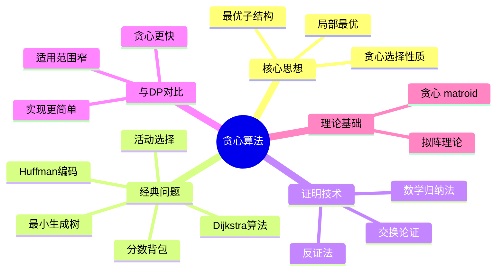

# 贪心算法 (Greedy Algorithms)

> **学科**: 算法设计与分析
> **难度**: ★★★☆☆
> **先修**: 基础算法、排序、证明技术
> **学时**: 5小时
> **来源**: CLRS第16章、MIT 6.006第7讲、Algorithm Design第4章
> **版本**: v1.0
> **更新**: 2026-04-09

---

## 一、核心概念

### 1.1 定义

**正式定义**:
贪心算法是一种在每一步选择中都采取**当前状态下最优选择**的算法策略，期望通过局部最优达到全局最优。

贪心算法设计的两个关键性质：
1. **贪心选择性质** (Greedy Choice Property): 全局最优解可以通过局部最优（贪心）选择达到
2. **最优子结构** (Optimal Substructure): 问题的最优解包含其子问题的最优解

**形式化描述**:
```
贪心算法框架:
1. 将问题转化为：做出一个选择后，只剩一个子问题需要求解
2. 证明存在最优解包含贪心选择（贪心选择安全）
3. 证明贪心选择后，子问题的最优解与贪心选择组合得到原问题最优解
4. 对子问题递归（或迭代）应用贪心策略
```

**直观解释**:
贪心算法就像下楼梯时只看眼前的一步：
- 每一步都选择看起来最好的下法
- 不回头重新考虑之前的决定
- 幸运的是，某些问题这种"短视"策略也能得到最优解

**关键要点**:
- 贪心算法**不是**总能得到最优解
- 贪心 vs 动态规划：贪心只做选择不回顾，DP比较所有子问题
- 贪心选择性质是贪心的核心，需要严格证明
- 当问题具有拟阵(matroid)结构时，贪心一定最优

### 1.2 属性

| 属性 | 描述 | 备注 |
|------|------|------|
| 最优性 | 是否总能得到最优解 | 取决于问题结构 |
| 时间复杂度 | 通常较低 | O(n log n)或更好 |
| 空间复杂度 | 通常O(1)或O(n) | 不需要存储大量子问题解 |
| 正确性证明 | 需要证明贪心选择性质 | 通常用交换论证 |

**性质总结**:
1. **高效性**: 贪心算法通常比DP更快
2. **简单性**: 实现通常比DP更简洁
3. **局限性**: 适用范围比DP窄

### 1.3 变体

**近似贪心**:
- 定义: 当问题不能用贪心得到最优解时，贪心可能给出近似解
- 与标准形式的区别: 不保证最优，但可能有近似比保证
- 适用场景: NP难问题的快速近似求解

**带修正的贪心**:
- 定义: 允许有限次数的撤销和重新选择
- 与标准形式的区别: 介于纯贪心和DP之间
- 适用场景: 某些在线算法

---

## 二、关系网络

### 2.1 前置知识

完成本主题学习前，应掌握：

| 前置知识 | 重要性 | 掌握程度检验 |
|----------|--------|--------------|
| 排序 | ⭐⭐⭐⭐⭐ | 能快速排序和选择 |
| 证明技术 | ⭐⭐⭐⭐⭐ | 能写形式化证明（反证、归纳） |
| 优先队列 | ⭐⭐⭐⭐⭐ | 掌握堆操作 |
| 动态规划 | ⭐⭐⭐⭐☆ | 理解最优子结构 |

### 2.2 相关概念

**紧密相关**:
- **动态规划** - 与贪心的核心对比
- **拟阵** - 贪心算法的数学基础
- **交换论证** - 证明贪心选择的常用技术
- **哈夫曼编码** - 经典贪心算法

**一般相关**:
- **近似算法** - 贪心常用作近似策略
- **在线算法** - 贪心是在线决策的自然选择

### 2.3 后续扩展

学习本主题后，可继续深入：

1. **拟阵理论** → 理解贪心最优的代数结构
2. **近似算法** → 贪心在NP难问题中的应用
3. **在线算法** → 竞争分析、缓存替换策略

### 2.4 思维导图



---

## 三、形式化证明

### 3.1 核心定理

**定理 1** (活动选择问题的贪心最优性): 设活动按结束时间排序，选择结束时间最早的活动总能得到最优解。

**证明**（交换论证）:
```
设活动按结束时间排序：f₁ ≤ f₂ ≤ ... ≤ fₙ

设A = {a_{i₁}, a_{i₂}, ..., a_{i_k}}是一个最优解，活动按开始时间排序。

**引理**: 存在最优解包含活动1（最早结束的活动）。

证明：
- 若a_{i₁} = 1，引理成立
- 若a_{i₁} ≠ 1，由于f₁ ≤ f_{i₁}，活动1与A中其他活动不冲突
- 用活动1替换a_{i₁}得到A' = (A - {a_{i₁}}) ∪ {1}
- |A'| = |A|，A'也是最优解

由引理，存在包含活动1的最优解。

对剩余活动（与活动1不冲突的），递归应用相同论证。
由数学归纳法，贪心算法正确。∎
```

**证明要点分析**:
1. **交换论证核心**: 证明任意最优解都可以通过替换变为包含贪心选择
2. **不改变最优性**: 替换后解的大小不变，仍是最优
3. **归纳结构**: 贪心选择后子问题与原问题同类型

**直觉理解**:
选择最早结束的活动为后续留下最多时间，这种"短视"选择不会损害全局最优性。

### 3.2 辅助引理

**引理 1** (分数背包的贪心最优性): 按单位重量价值降序选择能得到分数背包的最优解。

*证明*:
```
设物品按v_i/w_i降序排列，最优解为X = (x₁, ..., xₙ)。

若贪心解G ≠ X，设k是第一个G与X不同的位置。
由贪心定义，x_k < 1（否则G和X在此处相同）。

由于G和X总重量相同，存在j > k使得x_j > 0。
由排序，v_k/w_k ≥ v_j/w_j。

从X中减少δ重量的物品j，增加δ重量的物品k：
价值变化 = δ(v_k/w_k) - δ(v_j/w_j) ≥ 0

重复此替换，可将X转化为G而不减少价值。
因此G也是最优解。∎
```

---

## 四、算法/方法详解

### 4.1 算法描述

**活动选择算法**:
```
算法: GREEDY-ACTIVITY-SELECTOR(s, f)
输入: 开始时间数组s[1..n]，结束时间数组f[1..n]（已按f排序）
输出: 最大兼容活动集合

1. A = {1}  // 选择第一个活动
2. k = 1    // 最后选择的活动
3. for m = 2 to n do
4.     if s[m] ≥ f[k] then  // 活动m与已选活动兼容
5.         A = A ∪ {m}
6.         k = m
7.     end if
8. end for
9. return A
```

**Huffman编码算法**:
```
算法: HUFFMAN(C)
输入: 字符集C，频率f[c]
输出: 最优前缀码对应的树

1. n = |C|
2. Q = C  // 按频率构建最小优先队列
3. for i = 1 to n-1 do
4.     分配新节点z
5.     z.left = x = EXTRACT-MIN(Q)
6.     z.right = y = EXTRACT-MIN(Q)
7.     f[z] = f[x] + f[y]
8.     INSERT(Q, z)
9. end for
10. return EXTRACT-MIN(Q)  // 返回树根
```

**流程图**:
```
贪心算法设计流程
      │
      ▼
问题是否具有
最优子结构？
      │
      ├── 否 → 考虑其他算法
      │
      └── 是 → 是否具有
                贪心选择性质？
                │
                ├── 否 → 使用动态规划
                │
                └── 是 → 使用贪心算法
                          │
                          └── 证明正确性
                               （交换论证）
```

### 4.2 正确性分析

**Huffman编码正确性**:

**引理**（贪心选择）: 设x和y是频率最低的两个字符，则存在最优前缀码使x和y的码字长度相同且只有最后一位不同。

**证明概要**:
```
设最优树T中，a和b是深度最大的兄弟叶子。
设x和y是频率最低的。

交换a和x：
B(T) - B(T') = (f[a] - f[x])·(d_T(a) - d_T(x)) ≥ 0

同理交换b和y。

因此存在最优树使x和y是最深兄弟。∎
```

### 4.3 复杂度分析

| 问题 | 时间复杂度 | 空间复杂度 |
|------|------------|------------|
| 活动选择 | O(n log n) | O(1) |
| 分数背包 | O(n log n) | O(1) |
| Huffman编码 | O(n log n) | O(n) |
| 最小生成树(Prim) | O(E log V) | O(V) |
| Dijkstra | O((V+E) log V) | O(V) |

---

## 五、示例与实例

### 5.1 标准示例

**示例 1**: 活动选择

**问题描述**:
活动列表：(1,4), (3,5), (0,6), (5,7), (3,8), (5,9), (6,10), (8,11), (8,12), (2,13), (12,14)
格式：(开始, 结束)

**解决过程**:
```
按结束时间排序后：
(1,4), (3,5), (0,6), (5,7), (3,8), (5,9), (6,10), (8,11), (8,12), (2,13), (12,14)

贪心选择：
1. 选(1,4)，last_end = 4
2. (3,5): 3 < 4，跳过
3. (0,6): 0 < 4，跳过
4. (5,7): 5 ≥ 4，选！last_end = 7
5. (3,8): 3 < 7，跳过
6. (5,9): 5 < 7，跳过
7. (6,10): 6 < 7，跳过
8. (8,11): 8 ≥ 7，选！last_end = 11
9. (8,12): 8 < 11，跳过
10. (2,13): 2 < 11，跳过
11. (12,14): 12 ≥ 11，选！

结果: (1,4), (5,7), (8,11), (12,14) — 共4个活动
```

**结果**: 这是最优解

**示例 2**: 0/1背包 vs 分数背包

**问题描述**:
容量W=50，物品：
| 物品 | 重量 | 价值 | 单位价值 |
|------|------|------|----------|
| 1 | 10 | 60 | 6 |
| 2 | 20 | 100 | 5 |
| 3 | 30 | 120 | 4 |

**解决过程**:
```
分数背包（贪心）：
按单位价值排序：1, 2, 3
选物品1（重量10，价值60）
选物品2（重量20，价值100）
剩余容量20，选物品3的2/3（价值80）
总价值 = 240 ✓ 最优

0/1背包（贪心失败）：
按单位价值贪心：选1和2，价值160
但最优是选2和3，价值220！
```

**结果**: 贪心适用于分数背包，不适用于0/1背包

### 5.2 代码实现

**语言**: Python + Rust

```python
import heapq
from typing import List, Tuple

def activity_selection(activities: List[Tuple[int, int]]) -> List[Tuple[int, int]]:
    """
    活动选择问题
    activities: [(start, end), ...]
    返回最大兼容活动集合
    """
    # 按结束时间排序
    activities.sort(key=lambda x: x[1])
    
    if not activities:
        return []
    
    selected = [activities[0]]
    last_end = activities[0][1]
    
    for start, end in activities[1:]:
        if start >= last_end:
            selected.append((start, end))
            last_end = end
    
    return selected


def fractional_knapsack(weights: List[int], values: List[int], capacity: int) -> Tuple[float, List[Tuple[int, float]]]:
    """
    分数背包问题
    返回最大价值和选择的物品及比例
    """
    n = len(weights)
    # 按单位价值排序
    items = sorted(range(n), key=lambda i: values[i] / weights[i], reverse=True)
    
    total_value = 0.0
    selections = []
    remaining = capacity
    
    for i in items:
        if remaining <= 0:
            break
        
        weight, value = weights[i], values[i]
        if remaining >= weight:
            # 全拿
            selections.append((i, 1.0))
            total_value += value
            remaining -= weight
        else:
            # 拿一部分
            fraction = remaining / weight
            selections.append((i, fraction))
            total_value += value * fraction
            remaining = 0
    
    return total_value, selections


# Huffman编码
class HuffmanNode:
    def __init__(self, char=None, freq=0):
        self.char = char
        self.freq = freq
        self.left = None
        self.right = None
    
    def __lt__(self, other):
        return self.freq < other.freq


def huffman_coding(freq_map: dict) -> dict:
    """
    Huffman编码
    freq_map: {char: frequency}
    返回: {char: code}
    """
    if len(freq_map) == 0:
        return {}
    
    # 构建最小堆
    heap = [HuffmanNode(char, freq) for char, freq in freq_map.items()]
    heapq.heapify(heap)
    
    # 特殊情况：只有一个字符
    if len(heap) == 1:
        node = heap[0]
        return {node.char: '0'}
    
    # 构建Huffman树
    while len(heap) > 1:
        left = heapq.heappop(heap)
        right = heapq.heappop(heap)
        
        merged = HuffmanNode(freq=left.freq + right.freq)
        merged.left = left
        merged.right = right
        
        heapq.heappush(heap, merged)
    
    # 生成编码
    root = heap[0]
    codes = {}
    
    def build_codes(node, code):
        if node.char is not None:
            codes[node.char] = code if code else '0'
            return
        if node.left:
            build_codes(node.left, code + '0')
        if node.right:
            build_codes(node.right, code + '1')
    
    build_codes(root, '')
    return codes


# Rust实现（活动选择）
RUST_CODE = '''
fn activity_selection(mut activities: Vec<(i32, i32)>) -> Vec<(i32, i32)> {
    // 按结束时间排序
    activities.sort_by_key(|&(_, end)| end);
    
    let mut selected = Vec::new();
    let mut last_end = 0;
    
    for (start, end) in activities {
        if start >= last_end {
            selected.push((start, end));
            last_end = end;
        }
    }
    
    selected
}
'''


# 测试
if __name__ == "__main__":
    # 活动选择测试
    activities = [(1,4), (3,5), (0,6), (5,7), (3,8), (5,9), (6,10), (8,11), (8,12), (2,13), (12,14)]
    selected = activity_selection(activities)
    print(f"活动选择: {selected}")
    print(f"最多可安排 {len(selected)} 个活动")
    
    # 分数背包测试
    weights = [10, 20, 30]
    values = [60, 100, 120]
    capacity = 50
    max_val, selections = fractional_knapsack(weights, values, capacity)
    print(f"\n分数背包最大价值: {max_val}")
    print(f"选择: {selections}")
    
    # Huffman编码测试
    freq = {'a': 45, 'b': 13, 'c': 12, 'd': 16, 'e': 9, 'f': 5}
    codes = huffman_coding(freq)
    print(f"\nHuffman编码:")
    for char, code in sorted(codes.items()):
        print(f"  {char}: {code}")
```

**代码说明**:
- `activity_selection`: O(n log n)，排序后线性扫描
- `fractional_knapsack`: O(n log n)，按单位价值贪心
- `huffman_coding`: 使用堆实现O(n log n)的Huffman树构建

## 5.3 反例
### 5.3 反例

**常见错误1**: 在0/1背包使用贪心
```python
# 错误做法
# 按单位价值排序后依次选择完整物品
# 反例：容量50，物品(重量,价值)：(10,60), (20,100), (30,120)
# 贪心选1,2，价值160
# 最优选2,3，价值220！
```
**错误原因**: 0/1背包不满足贪心选择性质
**正确做法**: 使用动态规划

**常见错误2**: 未正确证明就使用贪心
```python
# 错误：认为活动选择按最早开始时间也能得到最优解
activities = [(1, 10), (2, 3), (3, 4)]
# 最早开始选(1,10)，只能选1个
# 最早结束选(2,3),(3,4)，可以选2个
```
**错误原因**: 不同贪心策略对同一问题效果不同
**正确做法**: 严格证明贪心选择性质

---

## 六、习题

### 6.1 理解题 (L1)

1. **贪心选择性质** [难度⭐]
   
   什么是贪心选择性质？它与最优子结构有什么关系？
   
   <details>
   <summary>解答</summary>
   
   **贪心选择性质**: 全局最优解可以通过局部最优（贪心）选择达到，即存在最优解包含贪心选择。
   
   **与最优子结构的关系**:
   - 最优子结构：问题的最优解包含子问题的最优解
   - 贪心选择性质 + 最优子结构 ⇒ 贪心算法正确
   - 仅有最优子结构（不满足贪心选择）⇒ 可能需要DP
   
   </details>

2. **贪心 vs DP** [难度⭐]
   
   何时能用贪心？何时必须用DP？
   
   <details>
   <summary>解答</summary>
   
   **能用贪心**：问题具有贪心选择性质，局部最优能导致全局最优。
   例：活动选择、分数背包、MST。
   
   **必须用DP**：需要比较多个子问题的组合才能确定最优解。
   例：0/1背包、最长公共子序列、编辑距离。
   
   </details>

### 6.2 应用题 (L2-L3)

1. **最小延迟调度** [难度⭐⭐]
   
   给定n个任务，每个任务有处理时间t_i和截止时间d_i。安排任务顺序使最大延迟最小化。
   
   <details>
   <summary>解答</summary>
   
   **贪心策略**: 按截止时间最早优先（Earliest Deadline First）。
   
   **证明概要**:
   交换论证：若存在逆序（d_i > d_j但i排在j前），交换它们不会增加最大延迟。
   
   ```python
   def minimize_lateness(tasks):
       # tasks: [(processing_time, deadline), ...]
       # 按截止时间排序
       tasks.sort(key=lambda x: x[1])
       
       time = 0
       max_lateness = 0
       schedule = []
       
       for t, d in tasks:
           schedule.append((t, d))
           time += t
           lateness = max(0, time - d)
           max_lateness = max(max_lateness, lateness)
       
       return schedule, max_lateness
   ```
   
   </details>

2. **区间覆盖** [难度⭐⭐]
   
   给定数轴上若干区间，选择最少数量的点，使得每个区间都包含至少一个选中的点。
   
   <details>
   <summary>解答</summary>
   
   **贪心策略**: 按区间右端点排序，每次选择当前区间的右端点。
   
   ```python
   def min_points(intervals):
       # intervals: [(start, end), ...]
       intervals.sort(key=lambda x: x[1])
       
       points = []
       last_point = -float('inf')
       
       for start, end in intervals:
           if start > last_point:  # 当前区间未被覆盖
               points.append(end)  # 选右端点
               last_point = end
       
       return points
   ```
   
   正确性证明：选右端点能为后续留下最多空间。
   
   </details>

### 6.3 证明题 (L4-L5)

1. **分数背包最优性** [难度⭐⭐⭐]
   
   严格证明按单位重量价值贪心选择能得到分数背包的最优解。
   
   <details>
   <summary>解答</summary>
   
   **证明**:
   
   设物品按v_i/w_i降序排列：v₁/w₁ ≥ v₂/w₂ ≥ ... ≥ vₙ/wₙ。
   
   设最优解为X = (x₁, ..., xₙ)，贪心解为G = (g₁, ..., gₙ)。
   
   若X ≠ G，设k是第一个x_k ≠ g_k的位置。
   
   由贪心定义，g_k > x_k（贪心尽可能多地选），且由于总重量相同，
   存在j > k使得x_j > g_j（X在k少选的部分在别处多选）。
   
   由于k < j，有v_k/w_k ≥ v_j/w_j。
   
   考虑调整：从X中将δ重量的物品j换为物品k：
   - 重量不变
   - 价值变化 = δ(v_k/w_k) - δ(v_j/w_j) ≥ 0
   
   重复此替换，可将X转化为G而不减少价值。
   因此G也是最优解。∎
   
   </details>

---

## 七、应用场景

### 7.1 经典应用

| 应用场景 | 具体问题 | 使用本主题的原因 |
|----------|----------|------------------|
| 任务调度 | 活动选择、作业调度 | 贪心保证最优且高效 |
| 数据压缩 | Huffman编码 | 最优前缀码构造 |
| 网络设计 | MST、最短路径 | Prim、Dijkstra是贪心算法 |
| 资源分配 | 分数背包、区间覆盖 | 贪心策略有效 |
| 缓存替换 | LRU近似策略 | 贪心启发式 |

### 7.2 实际案例

**案例**: 文件压缩（ZIP算法）

**背景**:
ZIP文件使用DEFLATE算法，结合LZ77和Huffman编码。

**应用方式**:
- 分析文件字符频率
- 构建Huffman树生成变长编码
- 高频字符短编码，低频字符长编码

**效果**:
- 文本文件通常压缩到原大小的30-50%
- Huffman编码保证最优前缀码

### 7.3 跨领域联系

**与运筹学的联系**:
许多调度问题可用贪心求解，如单机调度、并行机调度。

**与信息论的联系**:
Huffman编码与信息熵密切相关，编码长度下限由熵决定。

---

## 八、多维对比

### 8.1 方法对比

| 特性 | 贪心 | 动态规划 | 回溯 |
|------|------|----------|------|
| 选择方式 | 当前最优 | 全局比较 | 枚举所有 |
| 时间复杂度 | 通常低 | 多项式 | 指数 |
| 适用问题 | 贪心选择性质 | 最优子结构 | 小规模 |
| 最优性保证 | 特定问题 | 总是最优 | 总是最优 |
| 实现难度 | 简单 | 中等 | 复杂 |
| 典型问题 | MST、活动选择 | 背包、LCS | TSP、N皇后 |

### 8.2 决策建议

**何时使用贪心**:
- 问题具有贪心选择性质（可证明）
- 追求效率和简洁实现
- 问题允许近似解（非最优也可接受）

**何时不使用贪心**:
- 需要比较多个子问题（用DP）
- 必须得到精确最优解且贪心不保证
- 问题规模小，可用精确算法

**决策流程图**:
```
问题是否可分解为子问题？
├── 否 → 考虑其他算法
└── 是 → 是否具有最优子结构？
          ├── 否 → 可能无解或NP难
          └── 是 → 是否具有贪心选择性质？
                    ├── 是 → 贪心算法（高效）
                    └── 否 → 动态规划（通用）
```

---

## 九、扩展阅读

### 9.1 教材章节

| 教材 | 章节 | 页码 | 推荐度 |
|------|------|------|--------|
| CLRS | 第16章 贪心算法 | pp. 414-449 | ⭐⭐⭐⭐⭐ |
| Algorithm Design | 第4章 贪心算法 | pp. 115-180 | ⭐⭐⭐⭐⭐ |
| 算法导论（中文） | 第16章 | pp. 422-458 | ⭐⭐⭐⭐⭐ |

### 9.2 论文

1. **"Greedy Algorithms for the Minimum Spanning Tree Problem"** - 多种MST算法的比较
   - **要点**: 分析了Prim、Kruskal等贪心算法的等价性

### 9.3 在线资源

- **VisuAlgo**: 贪心算法可视化 - https://visualgo.net/zh/greedy
- **LeetCode**: 贪心算法专题

---

## 十、专家批注

> **Robert Tarjan**:
> 
> "贪心算法是算法设计中最需要直觉的部分。学会识别哪些问题可以用贪心解决，比学会具体的贪心算法更重要。"

> **Jon Bentley**:
> 
> "当我设计算法时，首先尝试贪心；如果失败，尝试动态规划；如果还是不行，考虑近似算法或启发式。"

---

## 十一、修订历史

| 版本 | 日期 | 修订者 | 修订内容 |
|------|------|--------|----------|
| v1.0 | 2026-04-09 | FormalAlgorithm Team | 完整重构，增加11个标准章节 |

---

**标签**: #贪心算法 #活动选择 #Huffman编码 #拟阵 #最优化

**相关笔记**: 
- [动态规划.md](./动态规划.md)
- [分治算法.md](./分治算法.md)
- [最小生成树.md](./最小生成树.md)
- [Dijkstra算法.md](./Dijkstra算法.md)
