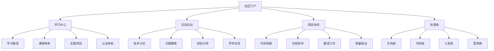

# 形式化算法项目社区建设指南

> 📊 **项目全面梳理**：详细的项目结构、模块详解和学习路径，请参阅 [`项目全面梳理-2025.md`](项目全面梳理-2025.md)

## 概述

本指南为形式化算法项目提供完整的社区建设方案，包括社区平台设计、贡献者体系、学习交流机制、质量保证体系等，旨在建立一个活跃、专业、可持续发展的学习社区。

## 社区建设目标

### 1. 核心目标

- **知识共享**: 促进形式化算法知识的传播和共享
- **学习交流**: 为学习者提供互动交流平台
- **专业发展**: 培养形式化算法领域的专业人才
- **创新推动**: 推动形式化算法理论和应用的发展

### 2. 社区价值

- **教育价值**: 提供高质量的学习资源
- **研究价值**: 促进学术研究和理论创新
- **实践价值**: 推动理论向实践的转化
- **社会价值**: 提升整体算法素养

## 社区平台设计

### 1. 平台架构



### 2. 功能模块

#### 2.1 学习中心

- **个性化学习路径**: 根据用户水平推荐学习内容
- **互动式课程**: 提供在线编程练习和实时反馈
- **学习进度跟踪**: 记录学习进度和成就
- **知识图谱导航**: 可视化知识关系和依赖

#### 2.2 交流论坛

- **技术讨论区**: 算法理论、实现技术、性能优化等
- **问题解答区**: 学习问题、技术难题、实现困惑等
- **经验分享区**: 学习心得、项目经验、职业发展等
- **学术交流区**: 最新研究、论文讨论、学术合作等

#### 2.3 项目协作

- **代码贡献**: 算法实现、工具开发、测试用例等
- **文档协作**: 内容编写、翻译、校对、审核等
- **质量保证**: 代码审查、文档检查、测试验证等
- **项目管理**: 任务分配、进度跟踪、里程碑管理

#### 2.4 资源库

- **文档资源**: 理论文档、实践指南、API文档等
- **代码资源**: 算法实现、工具库、示例代码等
- **工具资源**: 开发工具、测试工具、部署工具等
- **案例资源**: 实际应用案例、项目模板、最佳实践等

## 贡献者体系

### 1. 贡献者等级

#### 1.1 新手贡献者 (Novice Contributor)

**要求:**

- 完成基础学习路径
- 提交第一个有效贡献
- 通过社区规范测试

**权限:**

- 参与讨论和提问
- 提交代码和文档
- 获得基础徽章

**激励:**

- 新手贡献者徽章
- 学习资源优先访问
- 导师配对支持

#### 1.2 活跃贡献者 (Active Contributor)

**要求:**

- 持续贡献3个月以上
- 提交10个以上有效贡献
- 获得社区认可

**权限:**

- 参与代码审查
- 协助新人指导
- 参与功能设计

**激励:**

- 活跃贡献者徽章
- 优先获得新功能访问
- 参与社区决策

#### 1.3 核心贡献者 (Core Contributor)

**要求:**

- 持续贡献6个月以上
- 提交50个以上有效贡献
- 在特定领域有专长

**权限:**

- 代码合并权限
- 项目管理权限
- 社区治理参与

**激励:**

- 核心贡献者徽章
- 技术会议邀请
- 项目收益分享

#### 1.4 专家贡献者 (Expert Contributor)

**要求:**

- 持续贡献1年以上
- 在多个领域有专长
- 对社区有重大贡献

**权限:**

- 技术决策参与
- 社区治理主导
- 新功能设计主导

**激励:**

- 专家贡献者徽章
- 技术顾问身份
- 学术合作机会

### 2. 贡献类型

#### 2.1 代码贡献

- **算法实现**: 实现新的算法或优化现有算法
- **工具开发**: 开发辅助工具和实用程序
- **测试用例**: 编写和优化测试用例
- **性能优化**: 优化算法性能和资源使用

#### 2.2 文档贡献

- **内容编写**: 编写理论文档和实践指南
- **翻译工作**: 中英文文档翻译
- **校对审核**: 文档质量检查和校对
- **示例编写**: 编写代码示例和教程

#### 2.3 社区贡献

- **问题解答**: 回答社区问题和提供帮助
- **新人指导**: 指导新贡献者入门
- **活动组织**: 组织技术分享和讨论活动
- **质量保证**: 参与代码审查和文档检查

## 学习交流机制

### 1. 学习路径设计

#### 1.1 基础路径

**目标**: 掌握形式化算法基础理论
**内容**: 数学基础、计算理论、形式化方法
**时长**: 4-6周
**评估**: 理论测试 + 实践项目

#### 1.2 进阶路径

**目标**: 掌握高级算法理论和应用
**内容**: 高级算法、并行计算、机器学习算法
**时长**: 8-10周
**评估**: 项目实践 + 技术分享

#### 1.3 专业路径

**目标**: 成为领域专家
**内容**: 前沿研究、创新应用、学术合作
**时长**: 12-16周
**评估**: 学术论文 + 开源贡献

### 2. 交流活动

#### 2.1 定期活动

- **技术分享会**: 每月一次，分享最新技术和发展
- **代码审查会**: 每周一次，集体审查代码质量
- **学习讨论会**: 每周一次，讨论学习问题和心得
- **项目展示会**: 每月一次，展示项目成果

#### 2.2 专题活动

- **算法竞赛**: 定期举办算法设计和实现竞赛
- **论文讨论**: 讨论最新学术论文和研究进展
- **技术讲座**: 邀请专家进行技术讲座
- **工作坊**: 组织实践工作坊和培训

### 3. 激励机制

#### 3.1 积分系统

- **贡献积分**: 根据贡献质量和数量获得积分
- **学习积分**: 完成学习任务获得积分
- **交流积分**: 参与讨论和活动获得积分
- **创新积分**: 创新贡献获得额外积分

#### 3.2 徽章系统

- **学习徽章**: 完成学习路径获得徽章
- **贡献徽章**: 不同类型贡献获得不同徽章
- **成就徽章**: 特殊成就获得专属徽章
- **社区徽章**: 社区认可获得荣誉徽章

#### 3.3 奖励机制

- **月度奖励**: 每月评选优秀贡献者
- **年度奖励**: 每年评选杰出贡献者
- **特殊奖励**: 重大贡献获得特殊奖励
- **合作机会**: 优秀贡献者获得合作机会

## 质量保证体系

### 1. 内容质量控制

#### 1.1 文档质量

- **内容审查**: 专业内容审查和校对
- **格式规范**: 统一的文档格式和风格
- **更新维护**: 定期更新和维护文档
- **用户反馈**: 收集和处理用户反馈

#### 1.2 代码质量

- **代码审查**: 严格的代码审查流程
- **测试覆盖**: 全面的测试覆盖要求
- **性能测试**: 算法性能测试和优化
- **安全审查**: 代码安全性审查

#### 1.3 社区质量

- **行为规范**: 明确的社区行为规范
- **内容审核**: 社区内容审核和管理
- **冲突解决**: 有效的冲突解决机制
- **持续改进**: 基于反馈的持续改进

### 2. 质量评估

#### 2.1 自动化检查

- **代码质量**: 自动化代码质量检查
- **文档质量**: 自动化文档质量检查
- **链接检查**: 自动化链接有效性检查
- **格式检查**: 自动化格式规范检查

#### 2.2 人工审查

- **专家审查**: 领域专家内容审查
- **同行评议**: 同行评议和反馈
- **用户测试**: 用户测试和反馈
- **持续监控**: 持续质量监控

### 3. 改进机制

#### 3.1 反馈收集

- **用户反馈**: 收集用户使用反馈
- **贡献者反馈**: 收集贡献者反馈
- **专家建议**: 收集专家建议
- **数据分析**: 基于数据分析改进

#### 3.2 持续改进

- **问题跟踪**: 跟踪和解决质量问题
- **流程优化**: 优化工作流程
- **工具改进**: 改进工具和平台
- **培训提升**: 提升团队能力

## 技术实现

### 1. 平台技术栈

#### 1.1 前端技术

```typescript
// 前端技术栈
interface FrontendStack {
  framework: 'React' | 'Vue' | 'Angular';
  stateManagement: 'Redux' | 'Vuex' | 'NgRx';
  uiLibrary: 'Ant Design' | 'Material-UI' | 'Element UI';
  buildTool: 'Webpack' | 'Vite' | 'Rollup';
  testing: 'Jest' | 'Cypress' | 'Playwright';
}
```

#### 1.2 后端技术

```rust
// 后端技术栈
pub struct BackendStack {
    pub language: String,        // Rust
    pub framework: String,       // Actix-web
    pub database: String,       // PostgreSQL
    pub cache: String,          // Redis
    pub search: String,         // Elasticsearch
    pub message_queue: String,  // RabbitMQ
}
```

#### 1.3 基础设施

```yaml
# 基础设施配置
infrastructure:
  containerization: docker
  orchestration: kubernetes
  monitoring: prometheus
  logging: elk_stack
  cdn: cloudflare
  storage: minio
```

### 2. 核心功能实现

#### 2.1 用户系统

```rust
// 用户系统实现
pub struct User {
    pub id: Uuid,
    pub username: String,
    pub email: String,
    pub level: ContributorLevel,
    pub points: u32,
    pub badges: Vec<Badge>,
    pub created_at: DateTime<Utc>,
    pub updated_at: DateTime<Utc>,
}

pub enum ContributorLevel {
    Novice,
    Active,
    Core,
    Expert,
}

pub struct Badge {
    pub id: Uuid,
    pub name: String,
    pub description: String,
    pub icon: String,
    pub earned_at: DateTime<Utc>,
}
```

#### 2.2 内容系统

```rust
// 内容系统实现
pub struct Content {
    pub id: Uuid,
    pub title: String,
    pub content: String,
    pub author_id: Uuid,
    pub category: ContentCategory,
    pub tags: Vec<String>,
    pub status: ContentStatus,
    pub created_at: DateTime<Utc>,
    pub updated_at: DateTime<Utc>,
}

pub enum ContentCategory {
    Theory,
    Implementation,
    Tutorial,
    CaseStudy,
    Research,
}

pub enum ContentStatus {
    Draft,
    Review,
    Published,
    Archived,
}
```

#### 2.3 学习系统

```rust
// 学习系统实现
pub struct LearningPath {
    pub id: Uuid,
    pub name: String,
    pub description: String,
    pub modules: Vec<LearningModule>,
    pub prerequisites: Vec<Uuid>,
    pub estimated_duration: Duration,
}

pub struct LearningModule {
    pub id: Uuid,
    pub title: String,
    pub content: String,
    pub exercises: Vec<Exercise>,
    pub assessment: Assessment,
}

pub struct Exercise {
    pub id: Uuid,
    pub title: String,
    pub description: String,
    pub code_template: String,
    pub test_cases: Vec<TestCase>,
    pub solution: String,
}
```

### 3. 部署和运维

#### 3.1 部署配置

```yaml
# Docker Compose配置
version: '3.8'
services:
  web:
    build: .
    ports:
      - "8080:8080"
    environment:
      - DATABASE_URL=postgresql://user:pass@db:5432/community
      - REDIS_URL=redis://redis:6379
    depends_on:
      - db
      - redis

  db:
    image: postgres:13
    environment:
      - POSTGRES_DB=community
      - POSTGRES_USER=user
      - POSTGRES_PASSWORD=pass
    volumes:
      - postgres_data:/var/lib/postgresql/data

  redis:
    image: redis:6
    volumes:
      - redis_data:/data

volumes:
  postgres_data:
  redis_data:
```

#### 3.2 监控配置

```yaml
# Prometheus配置
global:
  scrape_interval: 15s

scrape_configs:
  - job_name: 'community-platform'
    static_configs:
      - targets: ['web:8080']
    metrics_path: '/metrics'
    scrape_interval: 5s
```

## 社区治理

### 1. 治理结构

#### 1.1 治理委员会

- **技术委员会**: 负责技术决策和标准制定
- **内容委员会**: 负责内容质量和审核
- **社区委员会**: 负责社区管理和活动组织
- **质量委员会**: 负责质量保证和改进

#### 1.2 决策机制

- **提案机制**: 社区成员可以提出改进提案
- **讨论机制**: 公开讨论和征求意见
- **投票机制**: 重要决策通过投票决定
- **执行机制**: 决策执行和效果评估

### 2. 社区规范

#### 2.1 行为规范

- **尊重原则**: 尊重所有社区成员
- **专业原则**: 保持专业和学术态度
- **合作原则**: 积极合作和互助
- **创新原则**: 鼓励创新和探索

#### 2.2 内容规范

- **质量标准**: 内容必须达到质量标准
- **原创原则**: 鼓励原创内容
- **引用规范**: 正确引用和标注来源
- **更新维护**: 及时更新和维护内容

### 3. 冲突解决

#### 3.1 解决机制

- **沟通协商**: 优先通过沟通协商解决
- **调解机制**: 社区调解员参与调解
- **仲裁机制**: 重要冲突通过仲裁解决
- **申诉机制**: 提供申诉和复议机制

#### 3.2 惩罚机制

- **警告**: 轻微违规给予警告
- **限制**: 严重违规限制权限
- **暂停**: 严重违规暂停参与
- **永久**: 极端违规永久禁止

## 可持续发展

### 1. 资金支持

#### 1.1 资金来源

- **企业赞助**: 寻求企业技术赞助
- **学术合作**: 与高校和研究机构合作
- **政府支持**: 申请政府科技项目支持
- **社区捐赠**: 社区成员自愿捐赠

#### 1.2 资金使用

- **技术开发**: 平台开发和维护
- **内容创作**: 高质量内容创作
- **活动组织**: 技术活动和培训
- **社区运营**: 社区管理和服务

### 2. 人才培养

#### 2.1 导师制度

- **新手导师**: 为新贡献者提供指导
- **技术导师**: 提供技术指导和帮助
- **职业导师**: 提供职业发展指导
- **学术导师**: 提供学术研究指导

#### 2.2 培训体系

- **技术培训**: 定期技术培训和工作坊
- **管理培训**: 社区管理和项目管理培训
- **沟通培训**: 沟通技巧和团队协作培训
- **领导力培训**: 领导力发展和培养

### 3. 生态建设

#### 3.1 合作伙伴

- **高校合作**: 与知名高校建立合作关系
- **企业合作**: 与相关企业建立合作关系
- **机构合作**: 与科研机构建立合作关系
- **社区合作**: 与其他技术社区建立合作关系

#### 3.2 生态扩展

- **技术扩展**: 扩展到相关技术领域
- **地域扩展**: 扩展到不同地区和国家
- **应用扩展**: 扩展到不同应用领域
- **用户扩展**: 扩展到不同用户群体

## 总结

本社区建设指南为形式化算法项目提供了完整的社区建设方案，包括平台设计、贡献者体系、学习交流机制、质量保证体系、技术实现、社区治理和可持续发展等方面。

通过系统性的社区建设，项目将能够：

1. **建立活跃的学习社区**: 为学习者提供互动交流平台
2. **培养专业人才**: 通过系统化培养提升整体水平
3. **推动技术创新**: 通过社区协作推动理论和技术创新
4. **实现可持续发展**: 建立可持续的社区发展机制

社区建设是一个长期过程，需要持续投入和不断完善。通过遵循本指南的原则和方法，项目将能够建立一个高质量、高活跃度、可持续发展的专业社区。
