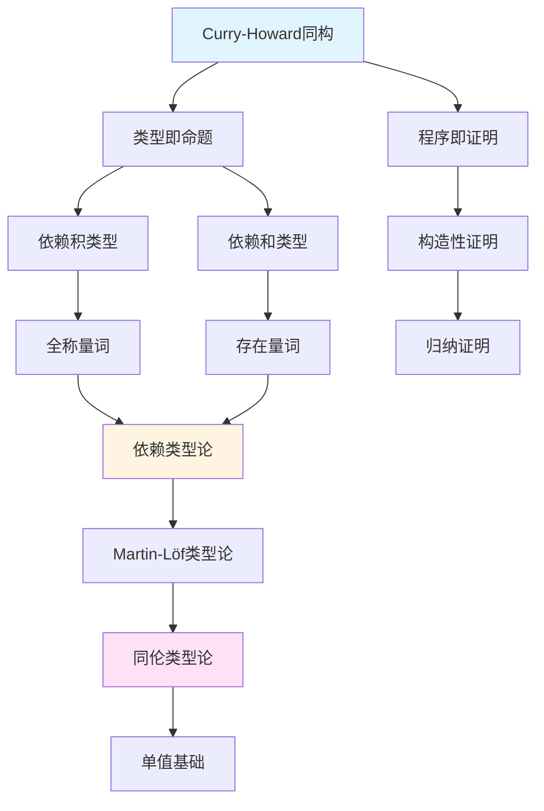

# 认知学习规律分析与优化方案

> **报告日期**: 2025-02-02
> **基于研究**: 2025年认知学习科学最新研究成果
> **应用范围**: 项目知识体系的学习路径优化
> **目标**: 基于科学学习原则优化项目内容组织和学习体验

---

## 📋 执行摘要

本报告基于2025年认知学习科学的最新研究成果，分析了项目当前的学习支持机制，并提出了基于科学学习原则的优化方案。核心发现是项目缺少间隔重复、主动回忆和知识组织等关键学习机制，需要系统性地增强学习支持。

**核心原则**：

1. **间隔重复 (Spaced Repetition)** - 将学习分散在时间中
2. **主动回忆 (Active Recall)** - 通过测试和练习主动检索知识
3. **知识组织 (Elaboration)** - 通过关联和结构化组织知识

**当前状态**: 学习支持机制不足（评分5.0/10）
**目标状态**: 完善的认知学习支持系统（评分8.0/10）

---

## 一、认知学习科学理论基础

### 1.1 有效学习的三个核心要素

根据2025年认知学习研究，有效学习包含三个核心要素：

#### 1.1.1 线索可用性 (Cue Availability)

**科学原理**：

- 检索线索必须可用，以便学习者表达知识
- 线索的质量和数量影响记忆检索效果
- 多样化的线索提高检索成功率

**项目现状分析**：

- ✅ **已有机制**：
  - 术语表 (`docs/术语与符号总表.md`)
  - 跨文档索引 (`docs/跨文档索引.md`)
  - 快速导航锚点

- ⚠️ **不足**：
  - 缺少系统化的概念检索机制
  - 线索不够多样化
  - 缺少概念间的语义关联

**改进方向**：

- 建立概念知识图谱，提供多种检索路径
- 增强概念间的语义链接
- 提供概念搜索和过滤功能

#### 1.1.2 线索诊断性 (Cue Diagnosticity)

**科学原理**：

- 检索线索必须对目标知识具有诊断性
- 线索应该能够唯一或高度相关地指向目标知识
- 诊断性线索提高检索准确性和效率

**项目现状分析**：

- ✅ **已有机制**：
  - 跨文档索引提供主题到文档的映射
  - 交叉引用提供概念关联

- ⚠️ **不足**：
  - 线索诊断性不够强
  - 缺少细粒度的概念关联
  - 概念等价关系不明确

**改进方向**：

- 建立细粒度的概念依赖图
- 明确概念间的等价、特化、应用关系
- 提供概念相似度评分

#### 1.1.3 精细化 (Elaboration)

**科学原理**：

- 精细化学习方法对有效学习至关重要
- 帮助学习者组织信息并使其具有区分性
- 支持更好的记忆保持和知识迁移
- 与间隔重复和检索练习协同工作

**项目现状分析**：

- ✅ **已有机制**：
  - 模块化分层结构
  - 概念定义和说明
  - 形式化表述

- ⚠️ **不足**：
  - 缺少知识图谱可视化
  - 概念间的语义链接不够丰富
  - 缺少概念层次化组织

**改进方向**：

- 构建知识图谱，可视化概念关系
- 增强概念间的语义链接
- 建立概念层次结构

### 1.2 间隔重复 (Spaced Repetition)

#### 1.2.1 科学原理

**核心发现**：

- 将学习会话分散在时间中，而非集中在一起，显著改善长期记忆
- 间隔效应适用于多种学习形式、材料和学习者类型
- 基于遗忘曲线的间隔时间表最有效

**遗忘曲线理论**：

- 新学习的知识会随时间衰减
- 在遗忘临界点复习最有效
- 每次复习后遗忘速度减慢
- 最终形成长期记忆

**最优间隔时间表**（基于研究）：

- 第1次复习：1天后
- 第2次复习：3-4天后
- 第3次复习：1周后
- 第4次复习：2-3周后
- 第5次复习：1-2个月后
- 后续复习：根据掌握度调整

#### 1.2.2 项目现状分析

**当前状态**：

- ❌ **完全缺失** - 项目没有任何间隔重复机制
- ❌ **没有复习计划** - 缺少基于遗忘曲线的复习时间表
- ❌ **没有复习内容** - 缺少"复习要点"模块

**影响**：

- 学习者难以形成长期记忆
- 知识遗忘速度快
- 学习效果不持久

#### 1.2.3 改进方案

**方案1：复习要点模块**

为每个文档添加"复习要点"章节：

```markdown
## 复习要点 (Review Points)

### 核心概念 (Core Concepts)
1. **Curry-Howard同构**: 类型即命题，程序即证明
   - 定义位置: §5.2.1
   - 关键理解: 类型系统和逻辑系统的对应关系
   - 复习时间: [ ] 1天后 [ ] 3天后 [ ] 1周后

2. **依赖积类型**: Π(x:A).B(x) 对应全称量词
   - 定义位置: §5.3.1
   - 关键理解: 类型依赖于值的函数类型
   - 复习时间: [ ] 1天后 [ ] 3天后 [ ] 1周后

### 关键定理 (Key Theorems)
1. **Curry-Howard对应定理**
   - 定理位置: §5.2.1
   - 证明思路: 通过类型推导规则对应逻辑推理规则
   - 复习时间: [ ] 1天后 [ ] 1周后 [ ] 1个月后

### 重要证明思路 (Important Proof Ideas)
1. **构造性证明要求**
   - 位置: §5.2.3
   - 思路: 必须提供具体构造，不能仅证明存在
   - 复习时间: [ ] 3天后 [ ] 1周后

### 复习检查清单 (Review Checklist)
- [ ] 能够独立解释Curry-Howard同构
- [ ] 能够区分依赖积类型和依赖和类型
- [ ] 能够应用构造性证明方法
- [ ] 能够实现基本的依赖类型系统
```

**方案2：间隔重复时间表**

为每个概念建立复习时间表：

```yaml
concept: Curry-Howard同构
first_learned: 2025-02-02
review_schedule:
  - date: 2025-02-03  # 1天后
    status: pending
  - date: 2025-02-06  # 3-4天后
    status: pending
  - date: 2025-02-09  # 1周后
    status: pending
  - date: 2025-02-23  # 2-3周后
    status: pending
mastery_level: 0  # 0-5, 5表示完全掌握
```

**方案3：自动复习提醒**

实现基于遗忘曲线的自动复习提醒系统：

- 跟踪学习历史
- 计算复习时间点
- 发送复习提醒
- 记录复习效果

### 1.3 主动回忆 (Active Recall)

#### 1.3.1 科学原理

**核心发现**：

- 主动检索信息比被动重读更有效
- 测试效应：测试本身是强大的学习工具
- 即使检索失败也能促进学习
- 检索练习提高长期记忆保持

**测试效应 (Testing Effect)**：

- 测试不仅评估学习，还促进学习
- 主动回忆比重复阅读更有效
- 测试后的反馈增强学习效果
- 间隔测试比集中测试更有效

**检索练习的类型**：

1. **自由回忆**：不提供线索，完全回忆
2. **线索回忆**：提供部分线索，回忆完整内容
3. **识别测试**：从多个选项中选择正确答案
4. **应用测试**：应用知识解决问题

#### 1.3.2 项目现状分析

**当前状态**：

- ❌ **完全缺失** - 项目没有任何主动回忆机制
- ❌ **没有练习系统** - 缺少练习和自测问题
- ❌ **没有掌握度评估** - 缺少学习效果评估

**影响**：

- 学习者难以检验学习效果
- 知识掌握度不明确
- 学习动力不足

#### 1.3.3 改进方案

**方案1：自测问题库**

为每个模块设计自测问题：

```markdown
## 自测问题 (Self-Assessment Questions)

### 基础理解 (Basic Understanding)

**问题1**: 解释Curry-Howard同构的核心思想。
- **提示**: 考虑类型系统和逻辑系统的对应关系
- **答案**: Curry-Howard同构建立了类型论与直觉逻辑之间的对应关系，将类型视为命题，将程序视为证明。具体来说，类型对应逻辑命题，类型推导对应逻辑推理，程序对应证明构造。
- **评分标准**:
  - 优秀(5分): 完整解释，包含具体例子
  - 良好(4分): 基本解释，缺少例子
  - 及格(3分): 部分理解，表述不准确
  - 需改进(1-2分): 理解不足

**问题2**: 依赖积类型和全称量词如何对应？
- **提示**: 考虑类型依赖和逻辑量化的关系
- **答案**: 依赖积类型 Π(x:A).B(x) 对应全称量词 ∀x:A. B(x)。两者都表示"对于所有x属于A，B(x)成立"。在类型系统中，依赖积类型是函数类型，其返回值类型依赖于输入值；在逻辑中，全称量词表示对所有对象的性质。
- **评分标准**: 同上

### 应用分析 (Application Analysis)

**问题3**: 如何在Coq中实现Curry-Howard同构？
- **提示**: 考虑Coq的类型系统和证明构造
- **答案**: 在Coq中，Curry-Howard同构自然体现：
  1. 命题对应类型：`Prop`类型表示命题
  2. 证明对应程序：证明是构造类型的项
  3. 逻辑连接词对应类型构造：`/\`对应积类型，`\/`对应和类型，`->`对应函数类型
  4. 量词对应依赖类型：`forall`对应依赖积类型，`exists`对应依赖和类型
- **实践**: 参见 `08-实现示例/04-形式化验证.md` §Coq实践

**问题4**: 依赖类型系统如何支持形式化验证？
- **提示**: 考虑类型即命题的含义
- **答案**: 依赖类型系统通过Curry-Howard同构支持形式化验证：
  1. 规范即类型：将程序规范编码为类型
  2. 证明即程序：构造类型为规范的程序即证明规范满足
  3. 类型检查即验证：类型检查器自动验证程序满足规范
  4. 构造性证明：必须提供具体构造，不能仅证明存在
- **实践**: 参见 `08-实现示例/04-形式化验证.md`

### 高级综合 (Advanced Synthesis)

**问题5**: 比较Coq、Agda、Lean中依赖类型的实现差异。
- **提示**: 考虑类型系统设计、证明策略、工具支持
- **答案要点**:
  - **Coq**: 基于构造演算，区分`Prop`和`Type`，强大的策略系统
  - **Agda**: 基于Martin-Löf类型论，统一类型层次，依赖模式匹配
  - **Lean**: 基于依赖类型理论，统一类型系统，强大的元编程
- **详细对比**: 参见 `10-高级主题/03-证明助手的实现.md`

**问题6**: 分析语义类型可靠性方法相对于语法方法的优势。
- **提示**: 考虑抽象层次、证明强度、适用性
- **答案要点**:
  - **抽象层次**: 语义方法在更高抽象层次，语法方法在语法层面
  - **证明强度**: 语义方法建立表示独立性，语法方法建立类型安全
  - **适用性**: 语义方法适用于复杂类型系统，语法方法适用于简单类型系统
- **详细内容**: 参见 `05-类型理论/05-依赖类型系统与数理逻辑.md` §5.9.3

### 掌握度评估 (Mastery Assessment)

完成所有问题后，评估你的掌握度：

- **掌握 (Mastery, 5分)**: 能独立解决所有问题，包括高级综合问题
- **熟练 (Proficient, 4分)**: 能解决大部分问题，需要少量提示
- **基础 (Basic, 3分)**: 能解决基础问题，需要较多指导
- **需要复习 (Needs Review, 1-2分)**: 需要重新学习前置知识

**下一步行动**:
- 如果达到"掌握"或"熟练": 可以继续学习下一模块
- 如果达到"基础": 建议复习相关内容后再继续
- 如果"需要复习": 建议重新学习前置知识
```

**方案2：练习系统**

创建系统化的练习系统：

```markdown
## 实践练习 (Practice Exercises)

### 练习1：实现简单的依赖类型系统

**目标**: 理解依赖类型的基本概念和实现

**要求**:
1. 实现依赖积类型 Π(x:A).B(x)
2. 实现依赖和类型 Σ(x:A).B(x)
3. 实现基本的类型检查

**提示**: 参见 `05-类型理论/05-依赖类型系统与数理逻辑.md` §5.6.2

**参考实现**: 参见 `08-实现示例/01-Rust实现.md`

**评估标准**:
- 正确实现依赖类型: 40%
- 类型检查正确性: 40%
- 代码质量: 20%

### 练习2：在Coq中证明Curry-Howard同构

**目标**: 理解Curry-Howard同构在证明助手中的应用

**要求**:
1. 定义命题逻辑的类型对应
2. 实现逻辑连接词的类型构造
3. 证明简单的逻辑定理

**提示**: 参见 `08-实现示例/04-形式化验证.md` §Coq实践

**评估标准**:
- 类型定义正确: 30%
- 证明构造正确: 50%
- 代码风格: 20%
```

**方案3：掌握度跟踪系统**

实现掌握度跟踪和反馈系统：

- 记录每次测试结果
- 跟踪掌握度变化
- 提供个性化反馈
- 推荐复习内容

### 1.4 知识组织 (Knowledge Organization)

#### 1.4.1 科学原理

**核心发现**：

- 精细化学习方法对有效学习至关重要
- 帮助学习者组织信息并使其具有区分性
- 支持更好的记忆保持和知识迁移
- 与间隔重复和检索练习协同工作

**组织策略**：

1. **层次化组织**：从一般到特殊
2. **关联化组织**：建立概念间的联系
3. **模式识别**：识别知识模式
4. **结构化组织**：使用框架和模板

#### 1.4.2 项目现状分析

**当前状态**：

- ✅ **已有机制**：
  - 模块化分层结构（12个主要模块）
  - 概念定义和说明
  - 形式化表述

- ⚠️ **不足**：
  - 缺少知识图谱可视化
  - 概念间的语义链接不够丰富
  - 缺少概念层次化组织
  - 概念依赖关系不明确

**影响**：

- 学习者难以理解概念间的关系
- 知识孤立，难以形成知识网络
- 学习效率低

#### 1.4.3 改进方案

**方案1：知识图谱构建**

构建概念知识图谱：



**方案2：概念依赖图**

建立概念依赖关系：

```yaml
concept: Curry-Howard同构
prerequisites:
  - concept: 简单类型论
    strength: required
    location: docs/05-类型理论/01-简单类型论.md
  - concept: 直觉逻辑
    strength: required
    location: docs/06-逻辑系统/03-直觉逻辑.md
  - concept: 形式化证明基础
    strength: recommended
    location: docs/03-形式化证明/01-证明系统.md
related_concepts:
  - concept: 依赖积类型
    relation: specializes
    location: docs/05-类型理论/02-依赖类型论.md#2.2.1
  - concept: 依赖和类型
    relation: specializes
    location: docs/05-类型理论/02-依赖类型论.md#2.2.3
  - concept: 构造性证明
    relation: applies_to
    location: docs/03-形式化证明/03-构造性证明.md
next_steps:
  - concept: 同伦类型论
    location: docs/05-类型理论/03-同伦类型论.md
  - concept: 单值基础
    location: docs/05-类型理论/03-同伦类型论.md#单值基础
```

**方案3：概念层次结构**

建立概念层次结构：

```markdown
## 概念层次结构 (Concept Hierarchy)

### 类型理论 (Type Theory)
├── 简单类型论 (Simple Type Theory)
│   ├── 类型 (Types)
│   ├── 项 (Terms)
│   └── 类型推导 (Type Inference)
├── 依赖类型论 (Dependent Type Theory)
│   ├── 依赖积类型 (Dependent Product Types)
│   ├── 依赖和类型 (Dependent Sum Types)
│   └── 归纳类型 (Inductive Types)
└── 同伦类型论 (Homotopy Type Theory)
    ├── 路径类型 (Path Types)
    ├── 高阶归纳类型 (Higher Inductive Types)
    └── 单值基础 (Univalent Foundations)

### 逻辑系统 (Logic Systems)
├── 命题逻辑 (Propositional Logic)
├── 一阶逻辑 (First-Order Logic)
├── 直觉逻辑 (Intuitionistic Logic)
└── 模态逻辑 (Modal Logic)

### Curry-Howard对应 (Curry-Howard Correspondence)
├── 类型即命题 (Types as Propositions)
├── 程序即证明 (Programs as Proofs)
└── 类型推导即逻辑推理 (Type Inference as Logical Reasoning)
```

---

## 二、学习路径优化

### 2.1 前置知识依赖分析

#### 2.1.1 当前问题

**问题1：依赖关系不明确**

- 虽有前置要求说明，但不够细粒度
- 缺少概念级别的依赖关系
- 依赖强度不明确（必需vs推荐）

**问题2：掌握度检查缺失**

- 没有前置知识掌握度检查
- 学习者不知道是否准备好学习新内容
- 可能导致学习困难

**问题3：自适应路径缺失**

- 缺少基于学习目标的自适应路径
- 所有学习者使用相同路径
- 效率低

#### 2.1.2 改进方案

**方案1：前置知识标注**

为每个文档添加详细的前置知识标注：

```markdown
## 前置知识要求 (Prerequisites)

### 必需知识 (Required Knowledge)

完成以下内容的学习，并能够回答相关问题：

1. **简单类型论基础**
   - 文档: `docs/05-类型理论/01-简单类型论.md`
   - 掌握要求: 理解类型、项、类型推导的基本概念
   - 检查问题:
     - [ ] 什么是简单类型λ演算？
     - [ ] 类型推导规则有哪些？
     - [ ] 如何判断类型是否匹配？

2. **直觉逻辑基础**
   - 文档: `docs/06-逻辑系统/03-直觉逻辑.md`
   - 掌握要求: 理解直觉逻辑与经典逻辑的区别
   - 检查问题:
     - [ ] 直觉逻辑的核心思想是什么？
     - [ ] 为什么直觉逻辑拒绝排中律？
     - [ ] 构造性证明的要求是什么？

3. **形式化证明基础**
   - 文档: `docs/03-形式化证明/01-证明系统.md`
   - 掌握要求: 理解形式化证明的基本方法
   - 检查问题:
     - [ ] 什么是形式化证明？
     - [ ] 自然演绎系统的基本规则有哪些？
     - [ ] 如何构造形式化证明？

### 推荐知识 (Recommended Knowledge)

以下知识有助于更好地理解本内容：

1. **依赖类型论**
   - 文档: `docs/05-类型理论/02-依赖类型论.md`
   - 有助于理解依赖类型系统的基础

2. **构造性证明**
   - 文档: `docs/03-形式化证明/03-构造性证明.md`
   - 有助于理解构造性证明的要求

### 知识检查 (Knowledge Check)

完成以下自测以确认掌握前置知识：

**自测1**: 简单类型论基础
- 问题: 解释简单类型λ演算的类型推导规则
- 答案: 参见 `docs/05-类型理论/01-简单类型论.md` §3.2
- 评分: [ ] 掌握 [ ] 熟练 [ ] 基础 [ ] 需复习

**自测2**: 直觉逻辑基础
- 问题: 为什么直觉逻辑拒绝排中律？
- 答案: 直觉逻辑要求构造性证明，排中律的证明需要非构造性方法
- 评分: [ ] 掌握 [ ] 熟练 [ ] 基础 [ ] 需复习

**自测3**: 形式化证明基础
- 问题: 如何构造形式化证明？
- 答案: 使用自然演绎系统的规则，从前提推导结论
- 评分: [ ] 掌握 [ ] 熟练 [ ] 基础 [ ] 需复习

**准备状态评估**:
- 如果所有自测达到"掌握"或"熟练": ✅ 可以开始学习
- 如果有"基础"或"需复习": ⚠️ 建议先复习前置知识
```

**方案2：自适应学习路径**

基于学习目标推荐不同路径：

```markdown
## 学习路径推荐 (Learning Path Recommendations)

### 研究导向路径 (Research-Oriented Path)

**目标**: 深入研究类型理论和形式化方法

**适合人群**:
- 研究生、研究人员
- 希望深入理解理论的人

**推荐顺序**:
1. ✅ 基础理论模块（100%完成）
   - 预计时间: 4-6周
   - 重点: 深入理解每个概念
2. ✅ 类型理论模块（深入）
   - 预计时间: 6-8周
   - 重点: 掌握依赖类型和同伦类型论
3. ✅ 同伦类型论（深入）
   - 预计时间: 4-6周
   - 重点: 理解单值基础
4. ✅ 证明助手实践（Coq/Agda/Lean）
   - 预计时间: 8-10周
   - 重点: 实际编程和证明
5. ✅ 元理论形式化
   - 预计时间: 4-6周
   - 重点: 理解元理论在Coq中的形式化
6. ✅ 最新研究进展
   - 预计时间: 持续
   - 重点: 跟踪最新研究

**总预计时间**: 6-9个月

### 应用导向路径 (Application-Oriented Path)

**目标**: 掌握形式化验证和算法规范设计

**适合人群**:
- 软件工程师、算法设计师
- 希望应用形式化方法的人

**推荐顺序**:
1. ✅ 基础理论模块（核心概念）
   - 预计时间: 2-3周
   - 重点: 掌握核心概念，跳过深入理论
2. ✅ 形式化证明模块
   - 预计时间: 3-4周
   - 重点: 掌握证明方法
3. ✅ 类型理论模块（实用部分）
   - 预计时间: 4-5周
   - 重点: 依赖类型和类型检查
4. ✅ 形式化验证实践
   - 预计时间: 6-8周
   - 重点: 实际验证项目
5. ✅ 算法规范设计框架
   - 预计时间: 2-3周
   - 重点: 规范设计方法
6. ✅ 应用领域案例
   - 预计时间: 持续
   - 重点: 实际应用案例

**总预计时间**: 3-6个月

### 教学导向路径 (Teaching-Oriented Path)

**目标**: 准备教学材料和学习资源

**适合人群**:
- 教师、教育工作者
- 希望准备教学材料的人

**推荐顺序**:
1. ✅ 项目全面梳理文档
   - 预计时间: 1周
   - 重点: 理解项目结构
2. ✅ 学习路径设计文档
   - 预计时间: 1周
   - 重点: 理解学习路径
3. ✅ 各模块核心内容
   - 预计时间: 4-6周
   - 重点: 掌握核心内容
4. ✅ 实践指导手册
   - 预计时间: 2-3周
   - 重点: 理解实践方法
5. ✅ 学习资源推荐清单
   - 预计时间: 1周
   - 重点: 了解学习资源

**总预计时间**: 2-4个月
```

### 2.2 认知负荷优化

#### 2.2.1 认知负荷理论

**三种认知负荷**：

1. **内在认知负荷 (Intrinsic Cognitive Load)**
   - 由学习材料本身的复杂性决定
   - 无法通过教学设计改变
   - 但可以通过分解和序列化降低

2. **外在认知负荷 (Extraneous Cognitive Load)**
   - 由不当的教学设计引起
   - 可以通过优化教学设计降低
   - 例如：统一格式、清晰结构、视觉辅助

3. **相关认知负荷 (Germane Cognitive Load)**
   - 用于知识整合和模式识别
   - 应该最大化
   - 例如：练习、自测、概念关联

#### 2.2.2 项目认知负荷分析

**内在认知负荷**：

- ✅ 项目内容组织合理，模块化结构清晰
- ⚠️ 部分高级主题内容密度过高，需要分解

**外在认知负荷**：

- ⚠️ 文档格式不统一，增加认知负担
- ⚠️ 缺少视觉辅助（图表、知识图谱）
- ⚠️ 概念重复定义，增加混淆

**相关认知负荷**：

- ⚠️ 缺少练习和自测，限制知识整合
- ⚠️ 缺少概念关联可视化，限制模式识别

#### 2.2.3 优化方案

**降低外在认知负荷**：

1. 统一文档格式
2. 添加视觉辅助（图表、知识图谱）
3. 消除概念重复定义

**增加相关认知负荷**：

1. 添加练习和自测
2. 建立概念关联可视化
3. 提供知识整合机会

---

## 三、实施计划

### 3.1 短期实施（1-3个月）

#### 任务1：添加复习要点模块

**目标**: 为所有文档添加复习要点

**步骤**:

1. 为每个文档设计复习要点模板
2. 提取核心概念、关键定理、重要证明思路
3. 添加复习时间表
4. 实现复习检查清单

**完成标准**:

- 所有文档都有复习要点章节
- 复习要点覆盖核心内容
- 复习时间表基于遗忘曲线

**预计时间**: 4-6周

#### 任务2：创建自测问题库

**目标**: 为所有模块创建自测问题

**步骤**:

1. 为每个模块设计5-10个自测问题
2. 涵盖不同难度层次（基础、应用、综合）
3. 提供答案和评分标准
4. 实现掌握度评估机制

**完成标准**:

- 所有模块都有自测问题
- 问题覆盖核心内容
- 掌握度评估机制运行

**预计时间**: 6-8周

#### 任务3：构建知识图谱试点

**目标**: 为"类型理论"模块构建知识图谱

**步骤**:

1. 提取类型理论模块的核心概念
2. 建立概念关系（依赖、等价、特化、应用）
3. 创建可视化知识图谱
4. 嵌入到相关文档

**完成标准**:

- 类型理论模块知识图谱完成
- 概念关系清晰可视化
- 支持交互式导航

**预计时间**: 4-6周

### 3.2 中期实施（3-6个月）

#### 任务4：实现间隔重复机制

**目标**: 建立基于遗忘曲线的间隔重复系统

**步骤**:

1. 为每个概念建立复习时间表
2. 实现自动复习提醒
3. 跟踪复习效果
4. 调整复习时间表

**完成标准**:

- 间隔重复系统运行
- 复习提醒自动发送
- 复习效果跟踪实现

**预计时间**: 8-10周

#### 任务5：优化学习路径

**目标**: 建立完善的学习路径系统

**步骤**:

1. 建立前置知识依赖数据库
2. 开发学习路径推荐系统
3. 实现掌握度评估机制
4. 提供个性化路径推荐

**完成标准**:

- 前置知识依赖数据库完成
- 学习路径推荐系统可用
- 掌握度评估机制运行

**预计时间**: 10-12周

### 3.3 长期实施（6-12个月）

#### 任务6：扩展知识图谱

**目标**: 扩展到所有模块的知识图谱

**步骤**:

1. 提取所有模块的核心概念
2. 建立完整的概念关系网络
3. 实现交互式知识图谱导航
4. 集成到文档系统

**完成标准**:

- 所有模块知识图谱完成
- 交互式导航系统可用
- 集成到文档系统

**预计时间**: 16-20周

#### 任务7：实现自适应学习系统

**目标**: 实现个性化学习支持

**步骤**:

1. 基于学习历史推荐内容
2. 个性化学习路径生成
3. 学习效果跟踪
4. 提供学习报告

**完成标准**:

- 学习历史跟踪系统运行
- 个性化路径生成可用
- 学习效果跟踪实现

**预计时间**: 20-24周

---

## 四、成功指标

### 4.1 学习支持指标

| 指标 | 当前状态 | 目标状态 | 测量方法 |
|-----|---------|---------|---------|
| 复习机制完整性 | 0% | 100% | 文档中复习要点覆盖率 |
| 自测问题覆盖率 | 0% | 100% | 模块中自测问题覆盖率 |
| 知识图谱覆盖率 | 0% | 80% | 概念知识图谱覆盖率 |
| 学习路径清晰度 | 6.2/10 | 8.5/10 | 用户满意度调查 |

### 4.2 学习效果指标

| 指标 | 当前状态 | 目标状态 | 测量方法 |
|-----|---------|---------|---------|
| 知识保持率 | 未知 | 80%+ | 间隔测试结果 |
| 掌握度提升 | 未知 | 30%+ | 前后测试对比 |
| 学习效率 | 基准 | 提升20% | 学习时间对比 |
| 学习满意度 | 6.0/10 | 8.0/10 | 用户满意度调查 |

### 4.3 认知负荷指标

| 指标 | 当前状态 | 目标状态 | 测量方法 |
|-----|---------|---------|---------|
| 外在认知负荷 | 高 | 低 | 用户反馈、任务完成时间 |
| 相关认知负荷 | 低 | 高 | 练习完成率、知识整合度 |
| 总体认知负荷 | 高 | 中等 | 综合评估 |

---

## 五、总结与建议

### 5.1 核心发现

1. **学习支持机制严重不足**：
   - 缺少间隔重复机制
   - 缺少主动回忆机制
   - 缺少知识组织可视化

2. **认知学习理论应用不足**：
   - 没有基于科学学习原则的设计
   - 缺少学习效果评估
   - 缺少个性化学习支持

3. **知识组织需要增强**：
   - 缺少知识图谱
   - 概念关联不够丰富
   - 学习路径不够灵活

### 5.2 优先改进建议

**立即执行（P0）**：

1. 为所有文档添加复习要点模块
2. 创建自测问题库
3. 构建知识图谱试点

**短期执行（P1）**：

1. 实现间隔重复机制
2. 优化学习路径设计
3. 增强概念关联

**中期执行（P2）**：

1. 扩展知识图谱到所有模块
2. 实现自适应学习系统
3. 建立学习效果跟踪

### 5.3 预期成果

通过实施本优化方案，预期达到：

1. **学习支持显著增强**：
   - 复习机制完整性从0%到100%
   - 自测问题覆盖率从0%到100%
   - 知识图谱覆盖率从0%到80%

2. **学习效果明显改善**：
   - 知识保持率达到80%+
   - 掌握度提升30%+
   - 学习效率提升20%

3. **用户体验大幅提升**：
   - 学习路径清晰度从6.2/10到8.5/10
   - 学习满意度从6.0/10到8.0/10
   - 认知负荷优化到中等水平

---

**报告完成日期**: 2025-02-02
**下次审查日期**: 2025-05-02（3个月后）
**报告版本**: 1.0
