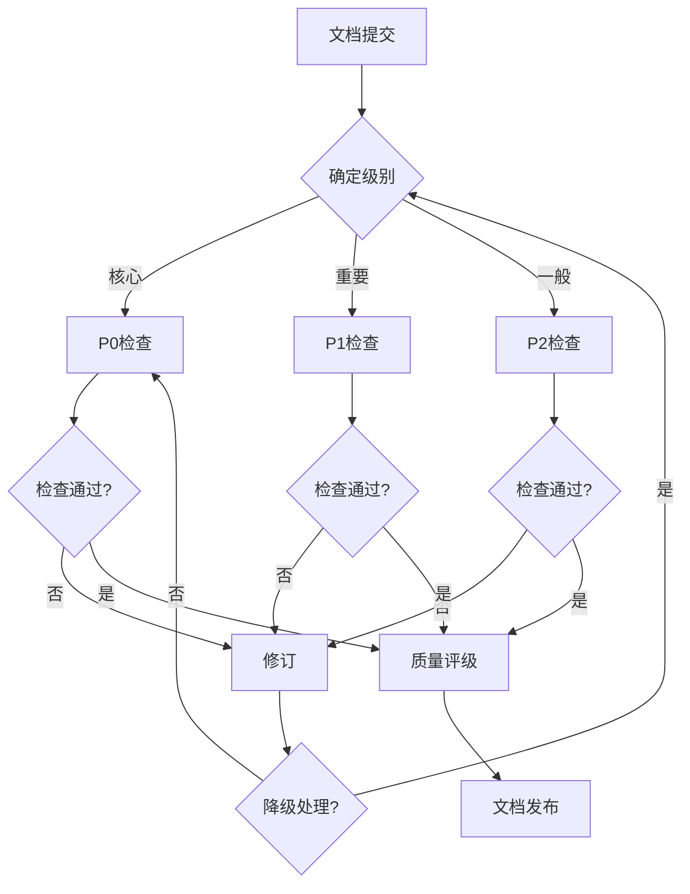

# 内容质量检查清单

## 1. 质量维度定义

### 1.1 理论深度

**定义**：内容在数学形式化、理论推导和学术深度方面的质量水平。

**评估要素：**

| 要素 | 权重 | 评估标准 |
|------|------|---------|
| 形式化定义 | 25% | 核心概念是否有严格的数学定义 |
| 定理完整性 | 25% | 重要结论是否有完整证明或可靠引用 |
| 推导严谨性 | 20% | 数学推导步骤是否清晰、无跳跃 |
| 复杂度分析 | 15% | 算法复杂度分析是否准确完整 |
| 理论拓展 | 15% | 是否涵盖相关理论变体和扩展 |

### 1.2 学术严谨性

**定义**：内容在学术规范、引用质量和论证逻辑方面的可靠性。

**评估要素：**

| 要素 | 权重 | 评估标准 |
|------|------|---------|
| 引用完整性 | 30% | 定义/定理是否标注出处 |
| 来源权威性 | 25% | 引用来源是否来自权威期刊/会议/著作 |
| 论证逻辑 | 20% | 推理过程是否逻辑严密 |
| 争议呈现 | 15% | 学术争议是否客观中立呈现 |
| 原创声明 | 10% | 综述/原创内容的界限是否清晰 |

### 1.3 内容准确性

**定义**：技术概念、算法描述和数学表达的正确性。

**评估要素：**

| 要素 | 权重 | 评估标准 |
|------|------|---------|
| 概念定义 | 30% | 术语定义是否准确 |
| 算法正确性 | 25% | 算法描述是否逻辑正确 |
| 数学符号 | 20% | 符号使用是否规范一致 |
| 边界条件 | 15% | 特殊情况是否考虑充分 |
| 示例验证 | 10% | 示例是否准确、可验证 |

### 1.4 结构清晰性

**定义**：文档组织、逻辑连贯和信息架构的质量。

**评估要素：**

| 要素 | 权重 | 评估标准 |
|------|------|---------|
| 章节组织 | 25% | 章节划分是否合理 |
| 逻辑连贯 | 25% | 段落间逻辑是否顺畅 |
| 概念递进 | 20% | 概念引入顺序是否符合认知规律 |
| 导航友好 | 15% | 目录、索引是否完善 |
| 视觉呈现 | 15% | 图表、排版是否清晰 |

### 1.5 时效性

**定义**：内容与领域最新进展的同步程度。

**评估要素：**

| 要素 | 权重 | 评估标准 |
|------|------|---------|
| 经典覆盖 | 30% | 是否涵盖领域奠基性工作 |
| 近期进展 | 30% | 近5年重要工作是否覆盖 |
| 前沿方向 | 20% | 新兴研究方向是否有提及 |
| 过时标注 | 20% | 过时内容是否有明确标注 |

## 2. 分级检查清单

### 2.1 P0 - 核心文档检查清单

**适用范围：**

- 基础理论模块文档
- 核心算法规范
- 形式化定义文档
- 重要定理证明

#### 前置条件检查

```markdown
□ 文档已通过技术审查
□ 无P1级别未解决问题
□ 引用完整性≥95%
□ 数学符号规范检查通过
```

#### 理论深度检查（P0标准）

```markdown
□ 所有核心概念有形式化定义
  □ 定义使用标准数学符号
  □ 定义域和约束条件明确
  □ 与相关概念的关系清晰

□ 所有定理有完整证明或权威引用
  □ 证明步骤编号清晰
  □ 关键引理单独列出
  □ 证明中使用的前提明确声明

□ 算法复杂度分析完整
  □ 时间复杂度上下界
  □ 空间复杂度分析
  □ 最优性证明或近似比分析

□ 形式化推导可验证
  □ 每步推导有依据
  □ 复杂推导有中间步骤
  □ 可对应到标准教材或论文
```

#### 学术严谨性检查（P0标准）

```markdown
□ 引用覆盖率100%
  □ 每个定义标注首次提出者
  □ 每个定理标注出处
  □ 关键算法标注原始论文

□ 引用来源权威
  □ 优先使用顶级会议/期刊
  □ 经典著作引用原始版本
  □ 避免引用低质量来源

□ 学术争议客观呈现
  □ 不同观点均有代表
  □ 不偏向特定学派
  □ 历史发展脉络清晰

□ 无学术不端风险
  □ 适当改写避免直接复制
  □ 翻译内容标注原文
  □ 集体智慧成果适当归属
```

#### 内容准确性检查（P0标准）

```markdown
□ 概念定义三重验证
  □ 与标准教材对照
  □ 与权威论文对照
  □ 与多个来源交叉验证

□ 算法描述验证
  □ 伪代码逻辑正确
  □ 边界条件处理正确
  □ 与原始论文算法一致

□ 数学符号规范
  □ 符合ISO 80000标准
  □ 全文符号使用一致
  □ 特殊符号有说明

□ 示例验证
  □ 手工推演验证
  □ 代码实现验证（如适用）
  □ 边界情况测试
```

#### 结构清晰性检查（P0标准）

```markdown
□ 章节结构
  □ 符合项目模板规范
  □ 标题层级不超过4级
  □ 每章有内容概述

□ 逻辑连贯
  □ 概念依赖关系图完整
  □ 前后引用准确
  □ 无逻辑跳跃

□ 可读性
  □ 段落长度适中（<200字）
  □ 复杂公式有文字解释
  □ 技术术语首次出现有解释

□ 导航支持
  □ 目录结构完整
  □ 交叉引用链接有效
  □ 术语索引完整
```

#### 时效性检查（P0标准）

```markdown
□ 经典理论覆盖
  □ 领域开创性工作提及
  □ 里程碑式进展标注
  □ 历史发展脉络完整

□ 近期进展（近5年）
  □ 重要理论突破涵盖
  □ 方法改进追踪
  □ 应用场景更新

□ 前沿方向
  □ 活跃研究方向概述
  □ 开放问题列举
  □ 未来趋势展望
```

### 2.2 P1 - 重要文档检查清单

**适用范围：**

- 算法实现示例
- 应用案例文档
- 进阶理论文档
- 综述性文档

#### 前置条件检查

```markdown
□ 文档基本完整
□ 无P0级别未解决问题
□ 引用完整性≥85%
```

#### 理论深度检查（P1标准）

```markdown
□ 核心概念定义
  □ 主要概念有形式化定义
  □ 次要概念至少有直观解释

□ 关键定理
  □ 重要定理有证明或引用
  □ 非核心定理可简述

□ 算法说明
  □ 正确性有论证
  □ 复杂度有分析

□ 实现细节
  □ 关键实现决策有解释
  □ 性能考量有说明
```

#### 学术严谨性检查（P1标准）

```markdown
□ 主要引用完整
  □ 核心算法/方法有出处
  □ 重要数据有来源

□ 引用质量
  □ 来源可靠
  □ 优先使用原始文献

□ 客观性
  □ 不同方法有比较
  □ 优缺点客观呈现
```

#### 内容准确性检查（P1标准）

```markdown
□ 技术概念
  □ 定义准确
  □ 与相关概念区分清晰

□ 代码/示例
  □ 语法正确
  □ 逻辑正确
  □ 可运行（关键示例）

□ 数据准确
  □ 性能数据有依据
  □ 对比实验条件说明
```

#### 结构清晰性检查（P1标准）

```markdown
□ 结构合理
  □ 章节组织逻辑清晰
  □ 重点突出

□ 可读性
  □ 语言流畅
  □ 技术术语有解释

□ 示例充分
  □ 主要概念有示例
  □ 示例有说明
```

### 2.3 P2 - 一般文档检查清单

**适用范围：**

- 学习资源推荐
- 快速参考卡片
- 附录材料
- 辅助说明文档

#### 基础检查

```markdown
□ 内容完整性
  □ 主题覆盖基本完整
  □ 无重大遗漏

□ 基本准确性
  □ 无明显错误
  □ 数据/日期正确

□ 格式规范
  □ 符合项目模板
  □ 排版整洁

□ 链接有效
  □ 内部链接可用
  □ 外部链接有效（抽查）
```

## 3. 检查执行流程



## 4. 质量评级标准

### 4.1 评分体系

| 维度 | P0权重 | P1权重 | P2权重 |
|------|--------|--------|--------|
| 理论深度 | 25% | 20% | 15% |
| 学术严谨性 | 25% | 20% | 15% |
| 内容准确性 | 25% | 25% | 25% |
| 结构清晰性 | 15% | 20% | 25% |
| 时效性 | 10% | 15% | 20% |

### 4.2 等级划分

| 等级 | 分数范围 | 说明 | 处理建议 |
|------|---------|------|---------|
| 优秀 | 8.5-10 | 达到发表质量 | 可直接发布，作为标杆 |
| 良好 | 7.0-8.5 | 质量可靠 | 可发布，建议持续优化 |
| 合格 | 6.0-7.0 | 基本可用 | 可发布，需标记改进项 |
| 待改进 | <6.0 | 需重大修改 | 返回修订，重新评审 |

### 4.3 评分卡模板

```markdown
# 文档质量评分卡

文档名称：_________________
文档级别：□P0 □P1 □P2
评审日期：_________________
评审人：___________________

## 各维度评分（1-10分）

| 维度 | 权重 | 得分 | 加权得分 | 备注 |
|------|------|------|---------|------|
| 理论深度 | __% | __ | __ | |
| 学术严谨性 | __% | __ | __ | |
| 内容准确性 | __% | __ | __ | |
| 结构清晰性 | __% | __ | __ | |
| 时效性 | __% | __ | __ | |
| **总分** | | | **__** | |

## 质量等级：□优秀 □良好 □合格 □待改进

## 主要优点
1.
2.

## 改进建议
1.
2.

## 必须修复的问题
- [ ]
- [ ]

评审人签名：___________
```

## 5. 自动化检查支持

### 5.1 可自动化检查项

```markdown
□ 数学符号一致性检查
  - 检测未定义的符号使用
  - 检测符号冲突
  - 检查符号规范符合性

□ 引用格式检查
  - 引用标记完整性
  - 引用格式一致性
  - 引用编号连续性

□ 链接有效性检查
  - 内部链接可达性
  - 外部链接状态
  - 锚点有效性

□ 文档结构检查
  - 标题层级连续性
  - 必需章节存在性
  - 目录同步性

□ 术语一致性检查
  - 术语使用一致性
  - 缩写首次展开
  - 中英文对照完整性
```

### 5.2 需人工检查项

```markdown
□ 理论正确性验证
□ 证明完整性评估
□ 学术观点客观性
□ 前沿进展覆盖度
□ 可读性主观评估
```

## 6. 检查工具和资源

### 6.1 推荐工具

| 工具类型 | 工具名称 | 用途 |
|---------|---------|------|
| 链接检查 | lychee, htmltest | 检查死链接 |
| 格式检查 | markdownlint | Markdown格式规范 |
| 拼写检查 | cspell, typos | 拼写和术语检查 |
| 数学检查 | 自定义脚本 | 符号一致性 |
| 引用检查 | 自定义脚本 | 引用完整性 |

### 6.2 参考资源

- [自动化质量检查工具规范](./自动化质量检查工具规范.md)
- [数学符号规范](../数学符号规范-ISO80000对齐版.md)
- [学术引用规范](../学术引用规范-ACM对齐版.md)

---

**文档版本**: v1.0
**最后更新**: 2026-04-08
**下次审查**: 2026-10-08
