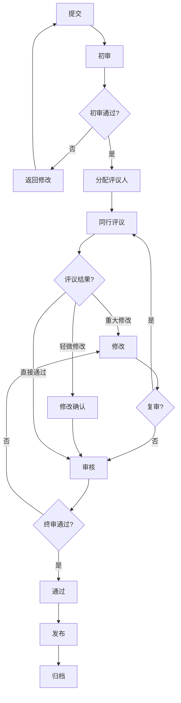
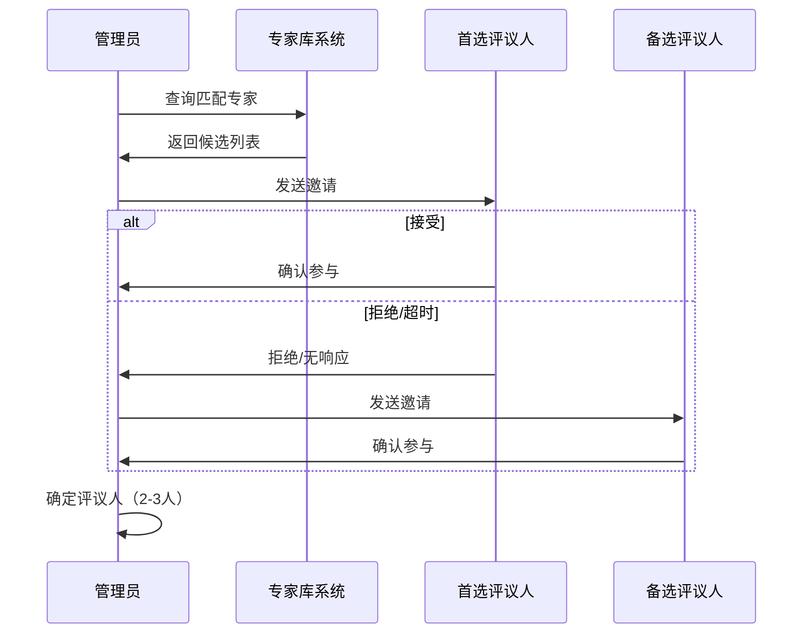

# 同行评议流程

## 1. 概述

### 1.1 目的

建立系统化的同行评议机制，确保项目内容经过同行专家审查，提升学术质量和可信度。

### 1.2 适用范围

- 所有P0级别（核心）文档的发布前审查
- 重大内容修订的验证
- 新模块的首次发布
- 外部投稿或合作内容

### 1.3 基本原则

| 原则 | 说明 |
|------|------|
| **独立性** | 评议者与内容创建者无直接利益关联 |
| **匿名性** | 采用双盲评议，保护评议者和作者 |
| **建设性** | 评议意见应具体、可操作 |
| **时效性** | 明确时间节点，保证效率 |
| **透明性** | 流程公开，标准明确 |

## 2. 评议流程



### 2.1 阶段详解

#### 阶段1：提交（Submit）

**提交材料清单：**

```markdown
□ 待评议文档（最终版本）
□ 文档元数据
  - 文档类型（P0/P1/P2）
  - 内容摘要（300字内）
  - 关键词（5-10个）
  - 目标读者
□ 自检报告
  - 自检检查清单完成情况
  - 已知问题说明
  - 待确认问题清单
□ 相关背景
  - 依赖文档列表
  - 参考文献列表
  - 修订历史（如适用）
```

**提交表格：**

```markdown
# 同行评议提交表

## 基本信息
- 文档标题：
- 文档路径：
- 提交人：
- 提交日期：
- 期望完成日期：

## 内容分类
- [ ] 基础理论
- [ ] 算法描述
- [ ] 形式化证明
- [ ] 实现示例
- [ ] 综述分析
- [ ] 其他：_____

## 自检确认
- [ ] 已通过P0/P1/P2自检清单
- [ ] 引用完整性检查通过
- [ ] 数学符号规范检查通过
- [ ] 无已知的P0级别问题

## 特殊说明
（需要评议者特别关注的问题）
```

#### 阶段2：初审（Initial Review）

**执行人**：质量管理员
**时限**：2个工作日

**初审内容：**

```markdown
□ 提交材料完整性
  □ 所有必需材料齐全
  □ 文档格式符合规范
  □ 元数据填写完整

□ 形式审查
  □ 符合项目定位
  □ 无敏感或不当内容
  □ 版权声明清晰

□ 技术初步评估
  □ 领域匹配度确认
  □ 难度级别评估
  □ 潜在评议者范围

□ 前置条件检查
  □ 依赖文档已发布
  □ 无冲突的并行修改
```

**初审结果：**

- **通过**：进入评议人分配
- **有条件通过**：要求补充材料后通过
- **退回**：不符合基本要求，退回修改

#### 阶段3：评议人分配（Reviewer Assignment）

**分配原则：**

| 因素 | 权重 | 说明 |
|------|------|------|
| 专业匹配 | 40% | 评议者专业领域与内容匹配 |
| 经验水平 | 30% | 相关研究/工作经验 |
| 回避原则 | 20% | 与作者无直接合作关系 |
| 工作负荷 | 10% | 当前评议任务数量 |

**分配流程：**



**邀请邮件：**

```markdown
主题：FormalAlgorithm项目 - 同行评议邀请

尊敬的 [姓名]：

您好！您已被选定为以下文档的同行评议人：

文档标题：[标题]
内容摘要：[摘要]
评议周期：[开始日期] - [结束日期]

如接受邀请，请在 [日期] 前回复确认。

评议指南：[链接]
评议表格：[链接]

感谢您对项目质量的支持！
```

#### 阶段4：同行评议（Peer Review）

**时限**：10-14个工作日
**评议人数**：至少2人，重要文档3人

**评议内容框架：**

##### A. 总体评价

```markdown
□ 接受 - 无需修改即可发布
□ 轻微修改 - 小问题，修改后无需复审
□ 重大修改 - 需修改并可能复审
□ 拒绝 - 不适合发布
```

##### B. 详细评议

**学术质量（40%）**

```markdown
□ 理论深度（1-5分）
  - 形式化定义完整性
  - 证明严谨性
  - 复杂度分析准确性

□ 学术严谨性（1-5分）
  - 引用完整性
  - 来源权威性
  - 论证逻辑性

□ 创新性/价值（1-5分）
  - 内容独特性
  - 对读者的价值
  - 与现有内容互补性
```

**技术准确性（30%）**

```markdown
□ 概念准确性（1-5分）
  - 定义准确
  - 术语使用规范
  - 无技术错误

□ 算法正确性（1-5分）
  - 算法逻辑正确
  - 边界条件处理
  - 复杂度分析正确

□ 一致性（1-5分）
  - 内部逻辑一致
  - 与项目其他内容一致
  - 符号使用一致
```

**呈现质量（30%）**

```markdown
□ 结构清晰性（1-5分）
  - 章节组织合理
  - 逻辑连贯
  - 导航友好

□ 可读性（1-5分）
  - 语言流畅
  - 解释清晰
  - 示例恰当

□ 完整性（1-5分）
  - 内容完整
  - 引用充分
  - 格式规范
```

##### C. 具体问题清单

```markdown
## 必须修改的问题（阻塞性）
1. [位置] [问题描述] [建议修改]
2.

## 建议修改的问题（非阻塞性）
1. [位置] [问题描述] [建议修改]
2.

## 疑问/澄清
1. [位置] [疑问]
2.

## 补充建议
（可选的改进建议）
```

**评议表格模板：**

```markdown
# 同行评议表

文档标题：_________________
评议人编号：R#（匿名）
评议日期：_________________

## 总体推荐
□ 接受
□ 轻微修改后接受
□ 重大修改后复审
□ 拒绝

## 评分（1-5分，5为最高）

### 学术质量
- 理论深度：____
- 学术严谨性：____
- 创新性/价值：____
- 小计：____/15

### 技术准确性
- 概念准确性：____
- 算法正确性：____
- 一致性：____
- 小计：____/15

### 呈现质量
- 结构清晰性：____
- 可读性：____
- 完整性：____
- 小计：____/15

总分：____/45

## 评议意见

### 主要优点
1.
2.

### 主要问题
1.
2.

### 具体建议
1.
2.

### 给作者的话
（可选，鼓励性/建设性反馈）
```

#### 阶段5：修改（Revision）

**修改原则：**

- 必须回应所有阻塞性问题
- 建议选择性采纳非阻塞性问题
- 对不采纳的建议说明理由

**修改响应表：**

```markdown
# 修改响应表

文档标题：_________________
修改日期：_________________

## 评议意见响应

### R1评议人意见

| # | 问题类型 | 问题摘要 | 修改状态 | 修改说明 |
|---|---------|---------|---------|---------|
| 1 | 阻塞性 | | □已修改 □部分修改 □不修改 | |
| 2 | 建议性 | | □已采纳 □部分采纳 □不采纳 | |

### R2评议人意见
[同上格式]

## 修改汇总
- 总问题数：__
- 已完全解决：__
- 部分解决：__
- 未采纳（有说明）：__
```

#### 阶段6：复审（Re-review）

**触发条件：**

- 总体评议结果为"重大修改"
- 修改涉及核心内容调整
- 评议人特别要求复审

**复审方式：**

- 全文复审：评议人重新审阅全文
- 差异复审：仅审阅修改部分

#### 阶段7：终审（Final Decision）

**执行人**：技术委员会主席或指定决策者
**决策依据：**

- 评议人意见和评分
- 作者修改响应
- 整体质量评估

**决策选项：**

```markdown
□ 接受 - 文档可以发布
□ 有条件接受 - 小问题需修正，无需再评
□ 继续修改 - 需进一步修改和可能的复审
□ 拒绝 - 当前版本不适合发布
```

### 2.2 时限管理

| 阶段 | 标准时限 | 最大时限 | 提醒点 |
|------|---------|---------|-------|
| 提交 | - | - | - |
| 初审 | 2工作日 | 3工作日 | D+1 |
| 分配 | 3工作日 | 5工作日 | D+2 |
| 评议 | 10工作日 | 14工作日 | D+5, D+10 |
| 修改 | 7工作日 | 14工作日 | D+5 |
| 复审 | 5工作日 | 7工作日 | D+3 |
| 终审 | 2工作日 | 3工作日 | D+1 |

**总周期预期：**

- 一次通过：15-20工作日
- 轻微修改：20-25工作日
- 重大修改：30-45工作日

## 3. 评议者指南

### 3.1 评议者职责

```markdown
□ 按时完成评议任务
□ 提供具体、可操作的反馈
□ 保持专业和尊重的态度
□ 保密评议内容
□ 声明利益冲突
```

### 3.2 有效评议的原则

**具体性**

- ❌ "这个证明不清晰"
- ✅ "定理3.2的证明缺少对边界情况n=1的讨论，建议补充"

**可操作性**

- ❌ "引用不够"
- ✅ "第2节中的'形式化验证'概念首次出现于[Smith 2010]，建议添加引用"

**建设性**

- ❌ "这个算法描述太差了"
- ✅ "算法1的步骤2和步骤3可以合并为一个更清晰的形式化定义，建议参考[文献]的表达方式"

### 3.3 利益冲突声明

评议人需在以下情况回避：

- 与作者在同一机构工作
- 与作者有近期合作关系（2年内）
- 与作者有直接竞争关系
- 与作者有亲属关系

## 4. 特殊情况处理

### 4.1 评议人失约

**情况：** 评议人未在时限内提交评议

**处理：**

1. D+7：发送提醒邮件
2. D+10：再次提醒，询问进度
3. D+14：启动备选评议人
4. 记录评议人信用，影响后续分配

### 4.2 评议意见冲突

**情况：** 不同评议人给出相冲突的意见

**处理：**

1. 由管理员初审判断
2. 必要时引入第三位评议人
3. 技术委员会仲裁
4. 与作者沟通解释

### 4.3 作者异议

**情况：** 作者不同意评议意见

**处理：**

1. 作者提交书面异议说明
2. 管理员评估合理性
3. 必要时征求评议人进一步说明
4. 技术委员会做出最终决定

## 5. 评议后流程

### 5.1 发布准备

```markdown
□ 最终版本确认
□ 版本号分配
□ 发布说明编写
□ 致谢评议人
□ 元数据归档
```

### 5.2 评议记录归档

```markdown
评议记录保存内容：
- 原始提交材料
- 评议表格（匿名）
- 修改响应表
- 决策记录
- 通信记录（摘要）
```

保存期限：文档生命周期 + 5年

## 6. 持续改进

### 6.1 评议质量评估

**定期分析指标：**

- 评议周期平均时长
- 评议意见采纳率
- 作者满意度调查
- 发布后问题追踪

### 6.2 机制优化

基于数据分析，定期优化：

- 检查清单
- 时限设置
- 分配算法
- 评议者培训

## 7. 相关文档

- [外部专家评审机制](./外部专家评审机制.md)
- [内容质量检查清单](./内容质量检查清单.md)
- [质量评估指标体系](./质量评估指标体系.md)
- [持续改进机制](./持续改进机制.md)

---

**文档版本**: v1.0
**最后更新**: 2026-04-08
**下次审查**: 2026-10-08
