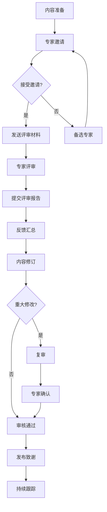
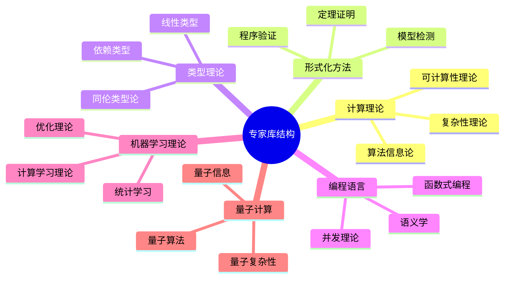
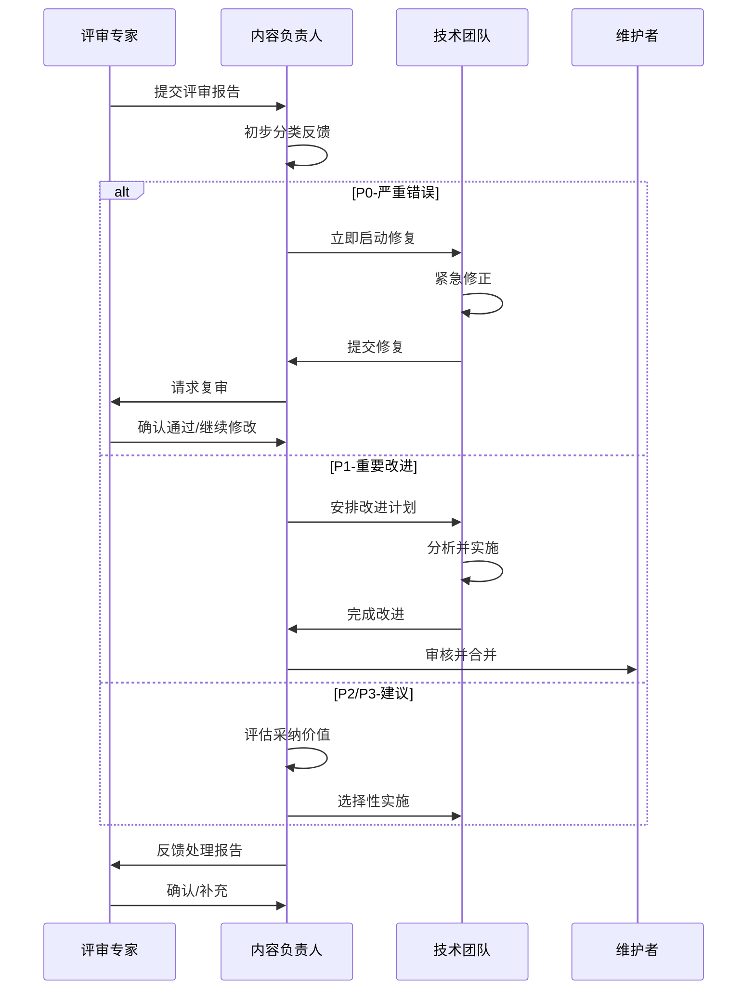

# 外部专家评审机制

## 1. 机制概述

### 1.1 目的与范围

外部专家评审机制旨在通过引入领域专家对项目内容进行独立评估，确保：

- **学术准确性**：技术内容的正确性和严谨性
- **前沿性**：及时反映领域最新进展
- **权威性**：提升项目的学术公信力
- **覆盖面**：弥补团队知识盲区

### 1.2 适用范围

| 评审类型 | 适用范围 | 频率 |
|---------|---------|------|
| 全面评审 | 整个模块或重大更新 | 年度 |
| 专题评审 | 特定技术主题或算法 | 季度 |
| 快速评审 | 新增核心概念或定理 | 按需 |

## 2. 专家评审流程



### 2.1 流程详解

#### 阶段1：内容准备（1-2周）

**准备内容清单：**

- [ ] 待评审文档（完整版本）
- [ ] 文档背景说明（目标读者、深度定位）
- [ ] 评审重点提示（特别关注的技术点）
- [ ] 相关参考文献列表
- [ ] 术语对照表

**质量预检查：**

```markdown
□ 文档格式符合项目规范
□ 数学符号统一且规范
□ 引用完整且格式正确
□ 无明显的逻辑错误或矛盾
□ 已通过内部技术审查
```

#### 阶段2：专家邀请（1-2周）

**专家筛选标准：**

| 维度 | 权重 | 评估标准 |
|------|------|---------|
| 学术背景 | 30% | 相关领域PhD学位或同等研究经历 |
| 研究成果 | 25% | 高影响力论文、专著或开源项目 |
| 实践经验 | 20% | 工业界相关项目经验 |
| 评审经验 | 15% | 学术期刊审稿、会议PC成员经历 |
| 沟通能力 | 10% | 能够清晰表达技术观点 |

**邀请邮件模板：**

```markdown
主题：FormalAlgorithm项目 - 外部专家评审邀请

尊敬的 [专家姓名] 教授/博士：

您好！

我们是FormalAlgorithm项目团队，正在构建系统化的算法规范与模型设计知识体系。该项目采用严格的数学形式化表示，涵盖计算理论、类型理论、形式化证明等多个领域。

鉴于您在 [具体领域] 的卓越贡献，我们诚挚邀请您担任本项目的外部评审专家，对我们的[模块名称]进行专业评审。

**评审内容：**
- 技术准确性：定理证明、算法描述的正确性
- 学术严谨性：引用完整性、论证严密性
- 前沿性：是否反映领域最新进展
- 可理解性：对目标读者的友好程度

**时间投入：** 预计 [X] 小时
**评审周期：** [开始日期] 至 [结束日期]
**酬谢方式：** [学术致谢/小额酬金/项目贡献者署名]

如您有意参与，请回复此邮件，我们将发送详细的评审材料。

期待您的回复！

此致
敬礼

FormalAlgorithm项目团队
[日期]
```

#### 阶段3：专家评审（2-4周）

**评审工具包提供：**

- 在线评审平台访问（可选：Google Docs评论/Notion/GitHub Issues）
- 评审检查清单（详见第3节）
- 评审反馈表模板
- 保密协议（如涉及未公开内容）

#### 阶段4：反馈处理（1-2周）

**反馈分类：**

- **P0-严重错误**：概念错误、定理错误、引用伪造
- **P1-重要改进**：论证不完整、关键引用缺失
- **P2-建议优化**：表述优化、补充示例
- **P3-风格建议**：措辞、格式建议

**处理原则：**

- P0：必须修改并复审
- P1：原则上修改，特殊情况说明理由
- P2：酌情采纳，记录决策
- P3：参考处理，非必须

## 3. 评审标准和检查清单

### 3.1 通用评审检查清单

#### 理论深度检查

```markdown
□ 核心概念有形式化定义
□ 定理有完整证明或引用可靠来源
□ 算法复杂度分析准确
□ 与相关工作的对比充分
□ 数学推导步骤清晰
```

#### 学术严谨性检查

```markdown
□ 所有定义/定理有明确出处
□ 引用的文献是权威来源
□ 不存在抄袭或不当引用
□ 学术争议有客观呈现
□ 结论有充分证据支持
```

#### 内容准确性检查

```markdown
□ 技术概念定义准确
□ 算法描述无逻辑错误
□ 复杂度分析正确
□ 代码示例可运行（如适用）
□ 边界情况考虑充分
```

#### 结构清晰性检查

```markdown
□ 章节组织逻辑清晰
□ 概念引入顺序合理
□ 前后引用一致
□ 术语使用统一
□ 图表清晰且标注正确
```

#### 时效性检查

```markdown
□ 涵盖领域经典理论
□ 包含最新研究进展（近3-5年）
□ 过时内容有标注
□ 新兴方向有提及
```

### 3.2 分领域专项清单

#### 形式化方法评审要点

```markdown
□ 逻辑系统选择适当
□ 公理系统一致
□ 推理规则正确
□ 形式化规格与实现对应关系清晰
□ 验证方法说明充分
```

#### 算法理论评审要点

```markdown
□ 算法正确性证明完整
□ 复杂度上下界分析准确
□ 最优性证明（如声称最优）
□ 算法变体比较客观
□ 实际应用场景讨论
```

#### 类型理论评审要点

```markdown
□ 类型规则定义完整
□ 类型安全性证明（如适用）
□ 与逻辑对应关系说明
□ 可计算性讨论
□ 实际编程语言映射
```

## 4. 专家联系网络策略

### 4.1 专家库建设



### 4.2 专家分级体系

| 级别 | 条件 | 评审范围 | 邀请频率 |
|------|------|---------|---------|
| 首席顾问 | 院士/图灵奖/菲尔兹奖级别 | 战略方向、重大决策 | 年度咨询 |
| 资深专家 | 正教授+顶级会议论文 | 模块终审、争议仲裁 | 季度评审 |
| 领域专家 | 副教授/资深研究员 | 专题评审、技术审核 | 按需邀请 |
| 青年专家 | 优秀博士/博士后 | 细节审查、辅助评审 | 常规任务 |

### 4.3 关系维护策略

**定期沟通：**

- 季度进展简报（邮件）
- 年度项目报告
- 项目里程碑庆祝

**价值回馈：**

- 评审专家署名致谢
- 项目成果共享
- 学术交流机会
- 推荐信/合作机会

**社区建设：**

- 专家研讨会（年度）
- 线上交流群组
- 联合研究项目
- 互访交流

## 5. 评审反馈处理流程



### 5.1 反馈跟踪表

| 反馈ID | 原文位置 | 问题描述 | 严重程度 | 处理状态 | 负责人 | 完成日期 | 专家确认 |
|--------|---------|---------|---------|---------|-------|---------|---------|
| REV-001 | §3.2 | 定理3.1证明不完整 | P1 | 已完成 | 张三 | 2025-02-15 | ✅ |
| REV-002 | §4.1 | 建议补充最新引用 | P2 | 进行中 | 李四 | - | - |

### 5.2 争议处理机制

当出现以下情况时启动争议处理：

1. 专家意见与团队理解不一致
2. 多位专家对同一问题意见相左
3. 修改建议与项目定位冲突

**处理流程：**

1. **证据收集**：整理相关文献和案例
2. **内部讨论**：团队技术会议讨论
3. **二次咨询**：向第三位专家征求意见
4. **决策记录**：记录决策理由并存档
5. **持续跟踪**：关注该问题的后续发展

## 6. 实施时间表

### 6.1 机制建设阶段（第1-2月）

| 周次 | 任务 | 交付物 | 负责人 |
|------|------|-------|-------|
| W1 | 专家库初建 | 专家候选名单（50人） | 项目经理 |
| W2 | 评审标准制定 | 检查清单V1.0 | 技术负责人 |
| W3 | 流程文档编写 | 本机制文档 | 质量负责人 |
| W4 | 试点邀请 | 首批3-5位专家确认 | 项目经理 |
| W5-6 | 试点评审 | 试点评审报告 | 外部专家 |
| W7 | 机制优化 | 改进建议文档 | 质量负责人 |
| W8 | 正式发布 | 机制文档V1.0 | 项目经理 |

### 6.2 常规运行阶段（第3月起）

| 活动 | 频率 | 持续时间 | 参与人员 |
|------|------|---------|---------|
| 专家邀请 | 持续 | - | 项目经理 |
| 专题评审 | 每季度 | 2-4周 | 领域专家 |
| 全面评审 | 每年 | 4-6周 | 资深专家组 |
| 专家库维护 | 每半年 | 1周 | 项目经理 |
| 机制评估 | 每年 | 1周 | 质量负责人 |

## 7. 资源与预算

### 7.1 人力资源

| 角色 | 职责 | 时间投入 |
|------|------|---------|
| 项目协调员 | 专家联络、进度跟踪 | 20% |
| 技术对接人 | 技术沟通、反馈解释 | 15% |
| 质量管理员 | 流程监督、记录整理 | 10% |

### 7.2 预算估算（年度）

| 项目 | 金额 | 说明 |
|------|------|------|
| 专家酬金 | ¥30,000-50,000 | 按评审工作量支付 |
| 会议/差旅 | ¥10,000 | 必要时线下交流 |
| 平台工具 | ¥5,000 | 评审平台订阅 |
| 礼品/纪念品 | ¥5,000 | 致谢礼品 |
| **合计** | **¥50,000-70,000** | - |

## 8. 风险管理

| 风险 | 概率 | 影响 | 应对策略 |
|------|------|------|---------|
| 专家时间冲突 | 高 | 中 | 建立备选专家库 |
| 评审意见过于分歧 | 中 | 高 | 建立仲裁机制 |
| 反馈处理滞后 | 中 | 中 | 设定处理时限 |
| 专家流失 | 低 | 高 | 持续维护关系 |
| 评审质量不均 | 中 | 中 | 提供详细指南 |

## 9. 相关文档

- [内容质量检查清单](./内容质量检查清单.md)
- [同行评议流程](./同行评议流程.md)
- [质量评估指标体系](./质量评估指标体系.md)
- [持续改进机制](./持续改进机制.md)

---

**文档版本**: v1.0
**最后更新**: 2026-04-08
**下次审查**: 2026-10-08
