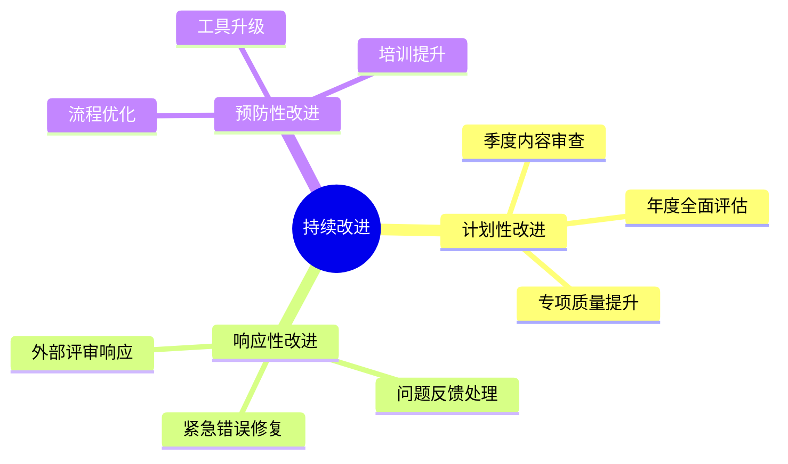
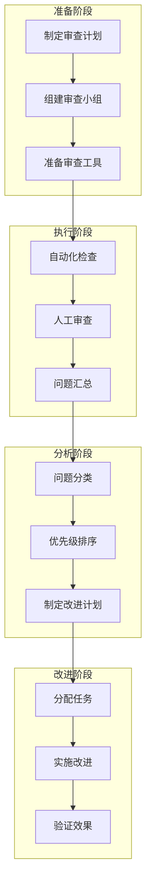
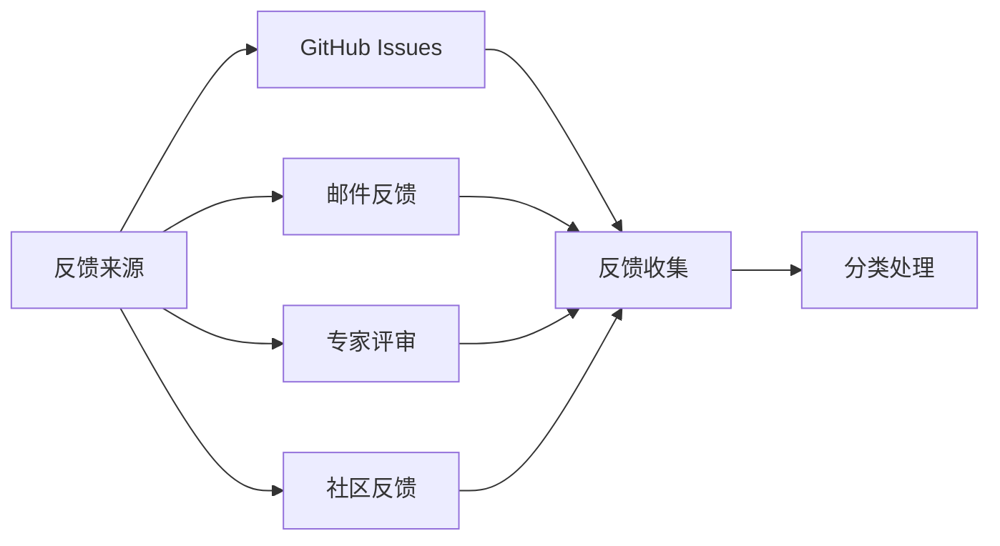
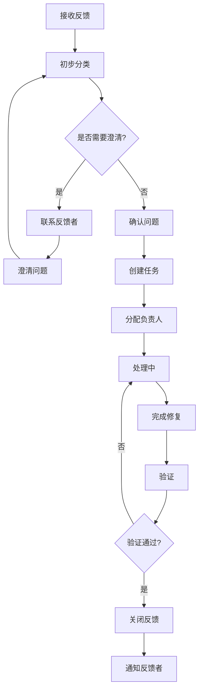
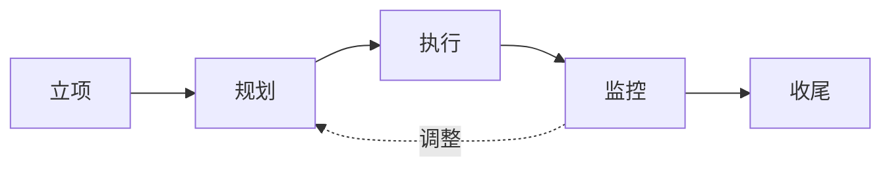

# 持续改进机制

## 1. 概述

### 1.1 目的

建立系统化的持续改进机制，确保项目质量不断提升，内容保持时效性和准确性，形成"计划-执行-检查-改进"（PDCA）的质量管理闭环。

### 1.2 改进类型



## 2. 季度内容审查流程

### 2.1 审查计划

**时间安排**：
| 季度 | 审查启动 | 审查完成 | 报告发布 |
|------|---------|---------|---------|
| Q1 | 3月1日 | 3月15日 | 3月20日 |
| Q2 | 6月1日 | 6月15日 | 6月20日 |
| Q3 | 9月1日 | 9月15日 | 9月20日 |
| Q4 | 12月1日 | 12月15日 | 12月20日 |

### 2.2 审查范围

```markdown
## Q1审查重点（理论深度）
□ 核心概念定义准确性
□ 定理证明完整性
□ 形式化表达规范性
□ 数学推导严谨性

## Q2审查重点（实践应用）
□ 示例代码正确性
□ 应用场景覆盖度
□ 实现指南可操作性
□ 边界条件处理

## Q3审查重点（前沿同步）
□ 最新研究进展覆盖
□ 过时内容识别
□ 新兴方向补充
□ 引用时效性

## Q4审查重点（结构优化）
□ 文档组织结构
□ 导航体系完善
□ 交叉引用有效性
□ 模板符合性
```

### 2.3 审查流程



### 2.4 审查检查清单

#### 通用检查项
```markdown
## 内容质量
□ 是否发现新的概念错误
□ 是否有证明需要补充或修正
□ 是否有算法描述需要更新
□ 是否有示例需要优化

## 引用时效
□ 是否有新文献需要补充
□ 是否有引用被撤回或修正
□ 是否有重要工作遗漏

## 链接有效性
□ 内部链接是否全部有效
□ 外部链接失效情况统计
□ 是否需要更新链接

## 格式规范
□ 是否符合最新模板要求
□ 数学符号是否规范
□ 图表是否清晰
```

### 专项深度检查
#### 专项深度检查
```markdown
## 计算理论模块
□ 复杂度分析是否准确
□ 可计算性结论是否最新
□ 开放问题状态是否更新

## 形式化证明模块
□ 证明助手版本是否更新
□ 代码片段是否可运行
□ 证明脚本是否最新

## 算法理论模块
□ 算法复杂度界是否最优
□ 是否有新算法需要补充
□ 实现示例是否需要更新
```

### 2.5 审查报告模板

```markdown
# 季度内容审查报告

## 审查概况
- 审查季度：2026年Q1
- 审查期间：2026-03-01 至 2026-03-15
- 审查范围：XX个文档
- 参与人员：XXX

## 问题统计

### 按严重程度
| 级别 | 数量 | 占比 |
|------|------|------|
| P0-严重 | X | X% |
| P1-重要 | X | X% |
| P2-一般 | X | X% |
| P3-建议 | X | X% |

### 按类型分布
| 类型 | 数量 | 占比 |
|------|------|------|
| 内容错误 | X | X% |
| 引用问题 | X | X% |
| 格式问题 | X | X% |
| 链接问题 | X | X% |
| 其他 | X | X% |

## 重点问题

### P0问题（需立即修复）
1. [文档路径] - [问题描述] - [负责人] - [截止日期]
2. 

### P1问题（本季度修复）
1. 

## 改进计划

### 立即执行（本周内）
- [ ] 修复P0问题

### 短期执行（本月内）
- [ ] 

### 中期执行（本季度内）
- [ ] 

## 质量趋势
[与上季度对比图表]

## 下季度重点
- 
```

## 3. 年度全面评估流程

### 3.1 评估时间安排

| 阶段 | 时间 | 活动 |
|------|------|------|
| 准备 | 11月 | 制定评估方案，组建评估团队 |
| 自评 | 12月1-15日 | 各模块自评，收集问题 |
| 外评 | 12月16-31日 | 外部专家评审 |
| 汇总 | 1月1-10日 | 结果汇总，差距分析 |
| 规划 | 1月11-20日 | 制定年度改进计划 |
| 发布 | 1月31日 | 发布年度报告 |

### 3.2 评估维度

```mermaid
radarChart
    title 年度评估维度
    
    area "当前得分" 7.5, 8, 7, 8.5, 7, 8
    area "目标得分" 9, 9, 9, 9, 9, 9
    
    axis "理论深度"
    axis "学术严谨"
    axis "实践价值"
    axis "结构清晰"
    axis "时效覆盖"
    axis "可维护性"
```

### 3.3 评估流程详解

#### 阶段1：自评（2周）

```markdown
## 模块自评任务清单

### 内容审查
□ 逐文档质量评分
□ 问题清单整理
□ 改进建议汇总

### 数据统计
□ 文档数量统计
□ 引用覆盖率统计
□ 链接有效性统计
□ 更新频率统计

### 差距分析
□ 与目标的差距
□ 主要瓶颈识别
□ 资源需求评估
```

**自评报告模板**：

```markdown
# 模块年度自评报告

## 模块信息
- 模块名称：
- 负责人：
- 评估期间：

## 内容统计
- 文档总数：
- 新增文档：
- 修订文档：
- 平均评分：

## 质量自评

### 各维度评分（1-10分）
| 维度 | 自评分 | 目标分 | 差距 |
|------|--------|--------|------|
| 理论深度 | | 9 | |
| 学术严谨性 | | 9 | |
| 实践价值 | | 9 | |
| 结构清晰性 | | 9 | |
| 时效覆盖 | | 9 | |

### 主要问题
1. 

### 改进计划
1. 

## 资源需求
- 人力：
- 时间：
- 其他：
```

### 阶段2：外部评审（2周）
#### 阶段2：外部评审（2周）

```markdown
## 外部评审安排

### 评审专家邀请
- 领域覆盖：计算理论、形式化方法、算法理论、类型理论
- 专家数量：8-12人
- 评审形式：文档评审 + 在线访谈

### 评审内容
□ 整体架构评估
□ 内容深度评估
□ 前沿覆盖评估
□ 与对标项目比较

### 评审产出
- 专家评审报告（每人）
- 综合评价报告
- 改进建议汇总
```

#### 阶段3：汇总分析（1周）

```markdown
## 差距分析矩阵

| 维度 | 自评 | 外评 | 综合 | 目标 | 差距 | 优先级 |
|------|------|------|------|------|------|--------|
| 理论深度 | 7.5 | 7.0 | 7.25 | 9 | 1.75 | 高 |
| 学术严谨 | 8.0 | 7.5 | 7.75 | 9 | 1.25 | 高 |
| 实践价值 | 7.0 | 7.5 | 7.25 | 9 | 1.75 | 中 |
| 结构清晰 | 8.5 | 8.0 | 8.25 | 9 | 0.75 | 低 |
| 时效覆盖 | 7.0 | 7.0 | 7.0 | 9 | 2.0 | 高 |
```

### 阶段4：规划制定（1周）
#### 阶段4：规划制定（1周）

```markdown
# 年度改进规划

## 目标设定
### 总体目标
- 综合评分从 X 提升到 Y
- P0文档优秀率达到 Z%
- 引用覆盖率达到 W%

### 分维度目标
- 理论深度：X → Y
- 学术严谨：X → Y
- ...

## 关键举措

### 举措1：[名称]
- 目标：
- 负责人：
- 时间表：
- 资源：
- 验收标准：

### 举措2：[名称]
...

## 里程碑
| 时间 | 里程碑 | 交付物 |
|------|--------|--------|
| Q1末 | | |
| Q2末 | | |
| Q3末 | | |
| Q4末 | | |

## 资源预算
- 人力投入：
- 专家费用：
- 工具/平台：
- 其他：
```

### 3.4 年度报告模板

```markdown
# 年度质量评估报告 2026

## 执行摘要
- 总体评分：X.X/10（去年：X.X）
- 质量等级：优秀/良好/合格
- 主要成就：
- 主要挑战：

## 质量状况

### 各维度评分趋势
[趋势图表]

### 模块质量分布
[热力图]

## 外部评价
[专家评审主要观点摘要]

## 对标分析
[与类似项目/标准的比较]

## 改进规划
[年度改进计划摘要]

## 附录
- 详细评分数据
- 专家评审报告
- 问题清单
```

## 4. 问题反馈处理流程

### 4.1 反馈渠道



### 4.2 反馈分类与路由

```markdown
## 反馈分类标准

### 按类型
- BUG：内容错误、链接失效、格式问题
- 建议：改进建议、内容补充
- 咨询：使用问题、概念疑问
- 其他

### 按严重程度
- P0：严重错误，立即处理
- P1：重要问题，本周处理
- P2：一般问题，本月处理
- P3：建议，纳入待办

### 按模块
- 自动路由到对应模块负责人
```

### 4.3 处理流程



### 4.4 反馈响应时限

| 严重程度 | 确认时限 | 处理时限 | 响应方式 |
|---------|---------|---------|---------|
| P0 | 24小时 | 72小时 | 紧急通道 |
| P1 | 48小时 | 1周 | 标准流程 |
| P2 | 1周 | 1月 | 标准流程 |
| P3 | 2周 | 排队处理 | 批量处理 |

### 4.5 反馈跟踪表

| ID | 来源 | 类型 | 严重程度 | 模块 | 状态 | 负责人 | 创建日期 | 目标日期 | 完成日期 |
|----|------|------|---------|------|------|-------|---------|---------|---------|
| F001 | GitHub | BUG | P1 | 基础理论 | 处理中 | 张三 | 2026-04-01 | 2026-04-08 | - |

## 5. 质量改进项目管理

### 5.1 改进项目类型

| 类型 | 描述 | 周期 | 示例 |
|------|------|------|------|
| 专项提升 | 针对特定质量维度的提升 | 1-3月 | 引用覆盖率提升专项 |
| 模块深化 | 特定模块的内容深化 | 2-4月 | 类型理论模块深化 |
| 工具开发 | 自动化工具的开发 | 1-6月 | 引用检查器开发 |
| 流程优化 | 质量管理流程优化 | 1-2月 | 评审流程优化 |

### 5.2 项目管理流程



### 5.3 改进项目看板

```markdown
## 进行中项目

### 引用覆盖率提升专项
- 目标：从85%提升到95%
- 负责人：
- 进度：60%
- 截止日期：2026-06-30

## 待启动项目
1. 数学符号规范化专项

## 已完成项目
1. 形式化证明补充（2026-Q1）
```

## 6. 知识管理与经验沉淀

### 6.1 最佳实践库

```markdown
## 内容创作最佳实践
- 如何编写高质量的形式化定义
- 定理证明的标准结构
- 示例设计的原则

## 质量检查最佳实践
- 自动化检查配置指南
- 常见错误模式及预防
- 快速定位问题的方法

## 评审工作最佳实践
- 高效评审的技巧
- 建设性反馈的艺术
- 争议处理的方法
```

### 6.2 经验教训登记册

```markdown
| 日期 | 项目/事件 | 经验 | 改进措施 | 负责人 |
|------|----------|------|---------|-------|
| 2026-03 | 引用检查器开发 | 提前进行需求评审可减少返工 | 增加设计评审环节 | 张三 |
```

## 7. 持续改进指标

### 7.1 过程指标

| 指标 | 目标 | 测量频率 |
|------|------|---------|
| 反馈响应时间 | <48小时 | 实时 |
| 问题修复周期 | P0<3天, P1<1周 | 周 |
| 改进项目按时完成率 | >80% | 季度 |
| 季度审查完成率 | 100% | 季度 |

### 7.2 结果指标

| 指标 | 当前 | 目标 | 趋势 |
|------|------|------|------|
| 平均质量评分 | 7.5 | 8.5 | ↑ |
| 优秀文档比例 | 25% | 40% | ↑ |
| 引用覆盖率 | 85% | 95% | ↑ |
| 外部评审通过率 | 80% | 90% | ↑ |

### 7.3 改进仪表盘

```markdown
# 质量改进仪表盘

## 当前状态
[可视化仪表盘]

## 趋势分析
[6个月趋势图]

## 预警项
- 指标低于目标：
- 即将到期任务：
- 阻塞问题：
```

## 8. 实施时间表

### 8.1 机制建设（第1-2月）

| 周 | 任务 | 交付物 |
|----|------|--------|
| W1 | 机制文档编写 | 本机制文档 |
| W2 | 流程工具准备 | 反馈跟踪表、项目看板 |
| W3 | 团队培训 | 培训记录 |
| W4 | 试运行 | 试运行报告 |
| W5-6 | 优化调整 | 优化建议 |
| W7-8 | 正式发布 | 正式版机制文档 |

### 8.2 常规运行（第3月起）

| 活动 | 频率 | 时间 |
|------|------|------|
| 季度审查 | 每季度 | Q1-Q4固定时间 |
| 年度评估 | 每年 | 12月-1月 |
| 反馈处理 | 持续 | - |
| 改进项目 | 按需 | - |
| 机制审查 | 每年 | 与年度评估同步 |

## 9. 相关文档

- [外部专家评审机制](./外部专家评审机制.md)
- [内容质量检查清单](./内容质量检查清单.md)
- [同行评议流程](./同行评议流程.md)
- [自动化质量检查工具规范](./自动化质量检查工具规范.md)
- [质量评估指标体系](./质量评估指标体系.md)

---

**文档版本**: v1.0  
**最后更新**: 2026-04-08  
**下次审查**: 2026-10-08
