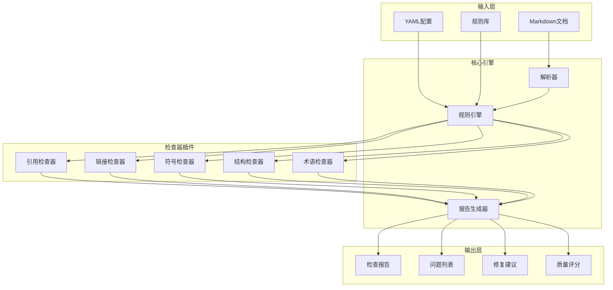

# 自动化质量检查工具规范

## 1. 概述

### 1.1 目的

定义自动化质量检查工具的功能规范、接口标准和使用流程，通过技术手段提升内容质量检查的效率和一致性。

### 1.2 范围

| 工具类型 | 优先级 | 实现阶段 |
|---------|-------|---------|
| 引用检查器 | P0 | Phase 1 |
| 链接有效性检查器 | P0 | Phase 1 |
| 数学符号一致性检查器 | P1 | Phase 2 |
| 文档结构检查器 | P1 | Phase 2 |
| 术语一致性检查器 | P2 | Phase 3 |
| 可读性分析器 | P2 | Phase 3 |

### 1.3 架构设计



## 2. 引用检查器规范

### 2.1 功能需求

#### 2.1.1 核心功能

```markdown
F1. 未标注出处检测
    - 检测定义/定理后缺少引用标记的情况
    - 识别模式：[定义/定理/引理/推论] [名称/编号]
    - 输出：位置 + 建议引用

F2. 引用格式验证
    - 验证引用标记格式是否符合规范
    - 支持的格式：[Author Year] / [Author, Year] / [Number]
    - 输出：格式错误列表

F3. 引用完整性检查
    - 验证引用标记在参考文献列表中存在
    - 检测 dangling references
    - 输出：缺失引用列表

F4. 引用数据库匹配
    - 与项目引用数据库比对
    - 检测引用是否已在数据库中
    - 输出：未入库引用列表

F5. 引用质量评估
    - 检测自我引用比例
    - 评估引用时效性
    - 检测引用权威性
```

#### 2.1.2 检查规则

```yaml
rules:
  - id: CIT-001
    name: 定义必须标注出处
    severity: error
    pattern:
      type: definition
      regex: '(?:定义|Definition)\s+[\d\.]+\s+\*?([^*]+?)\*?\s*(?!\[)'
    message: "定义 '{name}' 缺少引用标注"

  - id: CIT-002
    name: 定理必须标注出处
    severity: error
    pattern:
      type: theorem
      regex: '(?:定理|Theorem)\s+[\d\.]+\s*(?!\[)'
    message: "定理缺少引用标注"

  - id: CIT-003
    name: 引用格式规范
    severity: warning
    pattern:
      regex: '\[([^\]]+)\]'
      validate: '^(?:[A-Z][a-z]+(?:\s+[A-Z][a-z]+)?(?:,\s+)?\d{4}[a-z]?|\d+)$'
    message: "引用格式 '{cite}' 不符合规范"

  - id: CIT-004
    name: 引用必须存在
    severity: error
    pattern:
      type: reference_check
      lookup: bibliography
    message: "引用 '{cite}' 在参考文献列表中不存在"
```

### 2.2 接口规范

#### 2.2.1 命令行接口

```bash
# 基本用法
citation-checker <input-file> [options]

# 选项
--config <path>          # 配置文件路径
--output <path>          # 输出文件路径
--format <format>        # 输出格式: json|markdown|html
--severity <level>       # 最小严重级别: error|warning|info
--db <path>              # 引用数据库路径
--fix                    # 尝试自动修复

# 示例
citation-checker docs/01-基础理论/01-形式化定义.md \
    --config .qa/citation-config.yaml \
    --output reports/citation-report.md \
    --format markdown
```

## 2.2.2 输出格式
### 2.2.2 输出格式
#### 2.2.2 输出格式

```json
{
  "tool": "citation-checker",
  "version": "1.0.0",
  "timestamp": "2026-04-08T13:00:00Z",
  "summary": {
    "total_files": 1,
    "total_issues": 5,
    "errors": 2,
    "warnings": 3,
    "info": 0
  },
  "files": [
    {
      "path": "docs/01-基础理论/01-形式化定义.md",
      "issues": [
        {
          "rule_id": "CIT-001",
          "severity": "error",
          "line": 45,
          "column": 1,
          "message": "定义 '算法' 缺少引用标注",
          "context": "**定义 1.1（算法）** 算法是\cdots",
          "suggestion": "**定义 1.1（算法）** [Knuth 1997] 算法是\cdots",
          "fixable": true
        }
      ]
    }
  ]
}
```

## 2.3 实现要求
### 2.3 实现要求

```markdown
## 技术栈建议
- 语言：Python 3.9+ / Rust / Node.js
- 解析：自定义Markdown解析器或remark/unified
- 配置：YAML/JSON
- 输出：JSON/Markdown/HTML

## 性能要求
- 单文件检查：< 1秒
- 批量检查（100文件）：< 30秒
- 内存占用：< 512MB

## 集成要求
- CI/CD集成：GitHub Actions/GitLab CI
- 编辑器插件：VS Code扩展
- 预提交钩子：支持husky/pre-commit
```

## 3. 链接有效性检查器规范

### 3.1 功能需求

#### 3.1.1 核心功能

```markdown
F1. 内部链接检查
    - 检测指向项目内其他文档的链接
    - 验证相对路径正确性
    - 验证锚点存在性
    - 输出：无效内部链接列表

F2. 外部链接检查
    - 检测HTTP/HTTPS链接
    - 验证URL可访问性（HEAD请求）
    - 检测重定向链
    - 输出：无效外部链接列表

F3. 图片/资源链接检查
    - 验证图片路径正确
    - 验证资源文件存在
    - 输出：无效资源列表

F4. 链接规范化
    - 检测不一致的URL格式
    - 建议规范链接格式
    - 输出：规范化建议

F5. 历史链接管理
    - 检测指向已移动/删除文档的链接
    - 维护重定向映射
    - 输出：需要更新的链接
```

#### 3.1.2 检查规则

```yaml
rules:
  - id: LNK-001
    name: 内部链接必须有效
    severity: error
    pattern:
      type: internal_link
      validate_existence: true
      validate_anchor: true
    message: "内部链接 '{link}' 无效"

  - id: LNK-002
    name: 外部链接必须可访问
    severity: warning
    pattern:
      type: external_link
      validate_status: true
      allowed_status: [200, 301, 302]
      timeout: 10
      retries: 3
    message: "外部链接 '{url}' 返回状态 {status}"

  - id: LNK-003
    name: 资源文件必须存在
    severity: error
    pattern:
      type: resource_link
      extensions: [png, jpg, svg, pdf, yaml]
    message: "资源文件 '{path}' 不存在"

  - id: LNK-004
    name: 链接文本必须有意义
    severity: info
    pattern:
      type: link_text
      forbidden: ['点击这里', '这里', 'link', 'click here']
    message: "链接文本 '{text}' 不够描述性"
```

### 3.2 缓存策略

```yaml
cache:
  enabled: true
  duration: 86400  # 24小时
  storage: .qa/cache/link-checker/

  # 缓存策略
  strategies:
    - type: external_url
      ttl: 86400
      max_entries: 10000

    - type: internal_file
      ttl: 3600
      watch_changes: true

    - type: permanent_redirect
      ttl: 604800  # 7天
      store_target: true
```

### 3.3 性能优化

```markdown
## 外部链接检查优化
1. 并发控制
   - 最大并发数：10
   - 域名级限速：5 req/s per domain
   - 全局速率限制：20 req/s

2. 智能重试
   - 5xx错误：重试3次，指数退避
   - 超时：重试2次
   - 429错误：根据Retry-After等待

3. 批量处理
   - 相同域名的URL批量检查
   - DNS解析缓存
   - TCP连接复用
```

## 4. 数学符号一致性检查器规范

### 4.1 功能需求

#### 4.1.1 核心功能

```markdown
F1. 符号定义检测
    - 识别文档中定义的数学符号
    - 提取符号名称和含义
    - 输出：符号定义列表

F2. 符号使用检查
    - 检测未定义的符号使用
    - 验证符号使用范围
    - 输出：未定义符号列表

F3. 符号一致性检查
    - 检测同一符号不同用法
    - 跨文档符号一致性
    - 输出：符号冲突列表

F4. 符号规范检查
    - 验证符号符合ISO 80000标准
    - 检测非标准符号使用
    - 输出：规范建议

F5. 公式完整性检查
    - 检测未闭合的数学环境
    - 验证公式编号连续性
    - 输出：格式问题列表
```

#### 4.1.2 检查规则

```yaml
rules:
  - id: MATH-001
    name: 符号使用必须先定义
    severity: error
    pattern:
      type: symbol_usage
      require_definition: true
      scope: document
    message: "符号 '{symbol}' 使用前未定义"

  - id: MATH-002
    name: 符号一致性
    severity: error
    pattern:
      type: symbol_consistency
      check_cross_document: true
      allowed_variants:
        ℕ: ['N', '\\mathbb{N}']
        ℝ: ['R', '\\mathbb{R}']
    message: "符号 '{symbol}' 在不同位置用法不一致"

  - id: MATH-003
    name: 符合ISO 80000标准
    severity: warning
    pattern:
      type: iso_compliance
      standard: ISO-80000-2
      check:
        - italic_variables: true
        - upright_constants: true
        - upright_functions: true
    message: "符号 '{symbol}' 不符合ISO 80000标准"

  - id: MATH-004
    name: 公式环境完整性
    severity: error
    pattern:
      type: formula_integrity
      check_delimiters: ['$', '$$', '\\[', '\\]', '\\(', '\\)']
    message: "数学环境未正确闭合"
```

### 4.2 符号库

```yaml
symbol_library:
  # 标准符号
  standard:
    - symbol: ℕ
      name: 自然数集
      latex: "\\mathbb{N}"
      alternatives: ["N", "\\mathbf{N}"]
      category: number_set

    - symbol: ℝ
      name: 实数集
      latex: "\\mathbb{R}"
      alternatives: ["R", "\\mathbf{R}"]
      category: number_set

  # 项目自定义符号
  custom:
    - symbol: "𝒪"
      name: 大O记号
      latex: "\\mathcal{O}"
      definition: "算法复杂度上界"
      category: complexity

  # 符号分类
  categories:
    number_set: { description: "数集符号" }
    complexity: { description: "复杂度符号" }
    logic: { description: "逻辑符号" }
    set_theory: { description: "集合论符号" }
```

## 5. 文档结构检查器规范

### 5.1 功能需求

#### 5.1.1 核心功能

```markdown
F1. 标题层级检查
    - 验证标题层级连续性（无跳级）
    - 检测标题深度（建议≤4）
    - 输出：标题层级问题

F2. 必需章节检查
    - 验证文档包含必需章节
    - 根据文档类型应用不同规则
    - 输出：缺失章节列表

F3. 模板符合性检查
    - 验证文档符合对应模板
    - 检测模板字段完整性
    - 输出：模板偏差列表

F4. 目录同步检查
    - 验证目录与实际内容一致
    - 检测锚点链接有效性
    - 输出：目录更新建议

F5. 元数据检查
    - 验证YAML frontmatter完整
    - 检测必需元数据字段
    - 输出：元数据问题
```

#### 5.1.2 文档类型规则

```yaml
document_types:
  基础理论:
    required_sections:
      - 定义
      - 定理与证明
      - 示例
      - 参考文献
    optional_sections:
      - 历史背景
      - 扩展阅读
    max_depth: 4

  算法描述:
    required_sections:
      - 问题定义
      - 算法描述
      - 正确性分析
      - 复杂度分析
      - 实现示例
    optional_sections:
      - 优化变体
      - 应用场景
    max_depth: 3

  实现示例:
    required_sections:
      - 算法概述
      - 实现代码
      - 复杂度分析
      - 测试用例
    optional_sections:
      - 性能优化
      - 边界情况
    max_depth: 3
```

### 5.2 检查规则

```yaml
rules:
  - id: STRUCT-001
    name: 标题层级必须连续
    severity: error
    pattern:
      type: heading_level
      allow_skip: false
      max_level: 4
    message: "标题层级不连续: {from} 后直接出现 {to}"

  - id: STRUCT-002
    name: 必需章节必须存在
    severity: error
    pattern:
      type: required_sections
      by_document_type: true
    message: "缺少必需章节: {section}"

  - id: STRUCT-003
    name: 元数据必须完整
    severity: error
    pattern:
      type: metadata
      required_fields:
        - title
        - description
        - version
        - last_updated
    message: "缺少必需元数据字段: {field}"

  - id: STRUCT-004
    name: 文档长度建议
    severity: info
    pattern:
      type: document_length
      max_lines: 500
      warning_lines: 400
    message: "文档长度 {lines} 行，建议拆分为多个文档"
```

## 6. 术语一致性检查器规范

### 6.1 功能需求

```markdown
F1. 术语使用一致性
    - 检测术语的不同表达
    - 验证术语使用统一
    - 输出：术语不一致列表

F2. 缩写管理
    - 检测缩写首次使用
    - 验证缩写已展开
    - 输出：缩写问题列表

F3. 中英文术语对照
    - 验证中英文术语一致
    - 检测未翻译术语
    - 输出：对照问题列表

F4. 术语库同步
    - 与项目术语总表比对
    - 检测新术语
    - 输出：术语更新建议
```

### 6.2 术语库结构

```yaml
terminology:
  - term: 图灵机
    english: Turing Machine
    abbreviation: TM
    definition: "一种抽象的计算模型..."
    category: 计算模型
    status: approved

  - term: 时间复杂度
    english: Time Complexity
    abbreviation:
    definition: "算法执行所需时间与输入规模的关系"
    category: 复杂度分析
    status: approved

  # 同义词映射
  synonyms:
    递归函数: ["递归函数", "递归函数", "recursive function"]
    图灵机: ["图灵机", "Turing Machine", "TM"]
```

## 7. 集成与部署

### 7.1 CI/CD集成

```yaml
# .github/workflows/quality-check.yml
name: Quality Check

on:
  push:
    paths:
      - 'docs/**/*.md'
  pull_request:
    paths:
      - 'docs/**/*.md'

jobs:
  quality-check:
    runs-on: ubuntu-latest
    steps:
      - uses: actions/checkout@v4

      - name: Setup QA Tools
        uses: ./.github/actions/setup-qa

      - name: Citation Check
        run: |
          citation-checker docs/ --config .qa/citation-config.yaml \
            --output reports/citation-report.json

      - name: Link Check
        run: |
          link-checker docs/ --config .qa/link-config.yaml \
            --output reports/link-report.json

      - name: Math Symbol Check
        run: |
          math-checker docs/ --config .qa/math-config.yaml \
            --output reports/math-report.json

      - name: Structure Check
        run: |
          struct-checker docs/ --config .qa/struct-config.yaml \
            --output reports/struct-report.json

      - name: Generate Summary Report
        run: |
          qa-report-aggregator reports/*.json \
            --output reports/quality-summary.md

      - name: Comment PR
        if: github.event_name == 'pull_request'
        uses: actions/github-script@v7
        with:
          script: |
            const report = require('./reports/quality-summary.md');
            github.rest.issues.createComment({
              issue_number: context.issue.number,
              owner: context.repo.owner,
              repo: context.repo.repo,
              body: report
            })
```

## 7.2 本地开发集成
### 7.2 本地开发集成

```json
// .vscode/settings.json
{
  "qaTools.citationChecker.enabled": true,
  "qaTools.citationChecker.configPath": ".qa/citation-config.yaml",
  "qaTools.linkChecker.enabled": true,
  "qaTools.linkChecker.configPath": ".qa/link-config.yaml",
  "qaTools.onSave": ["citation", "link"],
  "qaTools.onOpen": ["structure"]
}
```

### 7.3 预提交钩子

```yaml
# .pre-commit-config.yaml
repos:
  - repo: local
    hooks:
      - id: citation-check
        name: Citation Check
        entry: citation-checker
        language: system
        files: ^docs/.*\.md$
        args: ['--config', '.qa/citation-config.yaml']

      - id: link-check
        name: Link Check
        entry: link-checker
        language: system
        files: ^docs/.*\.md$
        args: ['--config', '.qa/link-config.yaml']

      - id: structure-check
        name: Structure Check
        entry: struct-checker
        language: system
        files: ^docs/.*\.md$
```

## 8. 报告格式规范

### 8.1 报告结构

```markdown
# 质量检查报告

## 执行摘要
- 检查时间：2026-04-08 13:00:00
- 检查工具版本：v1.0.0
- 检查文件数：50
- 问题总数：23
  - 错误：5
  - 警告：12
  - 信息：6

## 各工具结果

### 引用检查器
- 状态：✅ 通过 / ⚠️ 警告 / ❌ 失败
- 统计：检查150个引用，发现3个问题
- 详情：见下文

[各工具详细结果...]

## 问题详情

### 错误（5）

#### CIT-001 @ docs/01-基础理论/01-形式化定义.md:45
**问题**：定义 '算法' 缺少引用标注
**上下文**：**定义 1.1（算法）** 算法是...
**建议**：添加引用，如 [Knuth 1997]
**自动修复**：可用

[更多问题...]

## 修复建议

### 可自动修复（3）
1. CIT-003 @ docs/... - 运行 `citation-checker --fix`

### 需手动修复（2）
1. CIT-001 @ docs/... - 需要人工查找引用来源

## 趋势分析
[与历史报告对比，显示质量趋势]
```

## 9. 实施路线图

### 9.1 Phase 1（1-2月）

| 任务 | 优先级 | 工作量 |
|------|-------|-------|
| 引用检查器MVP | P0 | 2周 |
| 链接检查器MVP | P0 | 1周 |
| CI/CD集成 | P0 | 1周 |
| 文档编写 | P0 | 1周 |

### 9.2 Phase 2（3-4月）

| 任务 | 优先级 | 工作量 |
|------|-------|-------|
| 数学符号检查器 | P1 | 3周 |
| 文档结构检查器 | P1 | 2周 |
| VS Code插件 | P1 | 2周 |
| 性能优化 | P1 | 1周 |

### 9.3 Phase 3（5-6月）

| 任务 | 优先级 | 工作量 |
|------|-------|-------|
| 术语一致性检查器 | P2 | 2周 |
| 可读性分析器 | P2 | 2周 |
| 机器学习增强 | P2 | 3周 |
| 高级报告功能 | P2 | 1周 |

## 10. 相关文档

- [内容质量检查清单](./内容质量检查清单.md)
- [同行评议流程](./同行评议流程.md)
- [质量评估指标体系](./质量评估指标体系.md)

---

**文档版本**: v1.0
**最后更新**: 2026-04-08
**下次审查**: 2026-10-08
