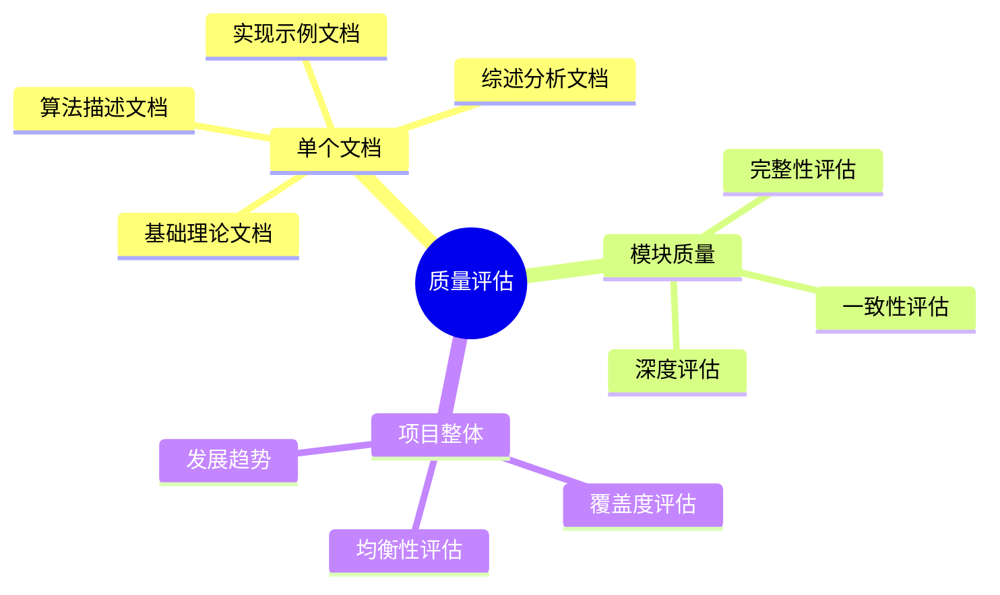
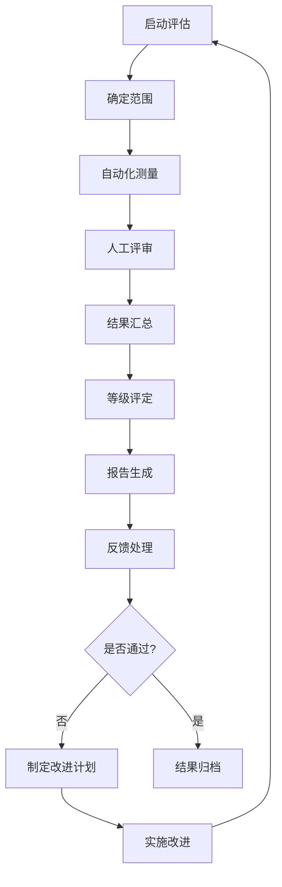

# 质量评估指标体系

## 1. 概述

### 1.1 设计原则

| 原则 | 说明 |
|------|------|
| **量化可测** | 指标应可客观测量，减少主观判断 |
| **分层设计** | 区分文档级别（P0/P1/P2），应用不同权重 |
| **全面覆盖** | 涵盖学术、技术、呈现等多个维度 |
| **可操作性** | 指标应能指导具体改进行动 |
| **动态演进** | 支持指标体系的持续优化 |

### 1.2 评估对象



## 2. 核心指标体系

### 2.1 量化指标定义

#### 2.1.1 引用覆盖率（Citation Coverage）

**定义**：文档中已标注引用的关键内容占应标注内容的百分比。

**计算公式**：

```
引用覆盖率 = (已标注引用的关键内容数 / 应标注引用的关键内容总数) × 100%
```

**关键内容包括**：

- 概念定义
- 定理/引理/推论
- 算法描述
- 重要数据/结论

**分级标准**：

| 等级 | 范围 | 说明 |
|------|------|------|
| 优秀 | ≥95% | 核心内容均有引用 |
| 良好 | 85%-95% | 大部分内容有引用 |
| 合格 | 75%-85% | 基本覆盖，有提升空间 |
| 待改进 | <75% | 引用严重不足 |

**P0/P1/P2要求**：

- P0：≥95%
- P1：≥85%
- P2：≥70%

---

#### 2.1.2 形式化程度评分（Formalization Score）

**定义**：内容采用数学形式化表达的程度。

**评估维度**：

| 维度 | 权重 | 评估标准 |
|------|------|---------|
| 定义形式化 | 30% | 核心概念是否有形式化定义 |
| 证明完整性 | 30% | 定理是否有完整证明 |
| 符号规范度 | 20% | 符号使用是否符合ISO 80000 |
| 推导严谨性 | 20% | 推导步骤是否严密无跳跃 |

**评分标准（1-5分）**：

| 分数 | 描述 |
|------|------|
| 5 | 完全形式化，所有内容有严格数学定义和完整证明 |
| 4 | 高度形式化，核心内容完整，次要内容可接受非形式化 |
| 3 | 中度形式化，主要定理有证明，部分推导可更详细 |
| 2 | 低度形式化，仅有部分形式化定义，证明不完整 |
| 1 | 非形式化，以自然语言描述为主 |

**P0/P1/P2要求**：

- P0：≥4分
- P1：≥3分
- P2：≥2分

---

#### 2.1.3 学术严谨性评分（Academic Rigor Score）

**定义**：内容在学术规范、论证逻辑和来源可靠性方面的质量。

**评估维度**：

| 维度 | 权重 | 评估标准 |
|------|------|---------|
| 引用权威性 | 30% | 引用来源是否为顶级会议/期刊/经典著作 |
| 论证逻辑 | 25% | 推理过程是否逻辑严密 |
| 学术中立 | 20% | 不同观点是否客观呈现 |
| 时效平衡 | 15% | 经典与前沿内容是否平衡 |
| 原创声明 | 10% | 综述/原创界限是否清晰 |

**评分标准（1-5分）**：

| 分数 | 描述 |
|------|------|
| 5 | 引用均为顶级来源，论证严密，观点客观平衡 |
| 4 | 引用权威，逻辑清晰，偶有小的论证跳跃 |
| 3 | 引用基本可靠，逻辑基本通顺，有小瑕疵 |
| 2 | 部分引用一般，存在逻辑问题，观点有偏 |
| 1 | 引用来源不明或不可靠，逻辑混乱 |

---

#### 2.1.4 实践价值评分（Practical Value Score）

**定义**：内容对实际学习和应用的指导价值。

**评估维度**：

| 维度 | 权重 | 评估标准 |
|------|------|---------|
| 示例质量 | 30% | 示例是否典型、清晰、可验证 |
| 可理解性 | 25% | 内容是否易于目标读者理解 |
| 可操作性 | 25% | 是否提供可执行的操作指导 |
| 应用场景 | 20% | 是否覆盖典型应用场景 |

**评分标准（1-5分）**：

| 分数 | 描述 |
|------|------|
| 5 | 示例丰富典型，易于理解，可直接应用 |
| 4 | 示例充分，理解难度适中，有应用指导 |
| 3 | 有基本示例，理解需一定背景 |
| 2 | 示例不足或不够典型，较难理解 |
| 1 | 纯理论描述，缺乏示例和应用指导 |

---

#### 2.1.5 结构完整性评分（Structural Integrity Score）

**定义**：文档组织结构、章节安排和导航支持的完善程度。

**评估维度**：

| 维度 | 权重 | 评估标准 |
|------|------|---------|
| 章节组织 | 25% | 章节划分是否合理 |
| 逻辑连贯 | 25% | 内容逻辑是否连贯 |
| 导航友好 | 25% | 目录、索引、链接是否完善 |
| 格式规范 | 25% | 是否符合项目模板规范 |

**评分标准（1-5分）**：

| 分数 | 描述 |
|------|------|
| 5 | 结构完美，逻辑清晰，导航完善，格式规范 |
| 4 | 结构良好，偶有小的组织问题 |
| 3 | 结构基本合理，有改进空间 |
| 2 | 结构混乱，逻辑不清 |
| 1 | 无明显结构，难以理解 |

---

### 2.2 计算指标的方法

#### 2.2.1 自动化测量

```python
# 伪代码示例
class QualityMetricsCalculator:
    def calculate_citation_coverage(self, document):
        """计算引用覆盖率"""
        key_elements = self.extract_key_elements(document)
        cited_elements = [e for e in key_elements if e.has_citation()]
        return len(cited_elements) / len(key_elements) * 100

    def calculate_formalization_score(self, document):
        """计算形式化程度评分"""
        dimensions = {
            'definition': self.score_formal_definitions(document),
            'proof': self.score_proof_completeness(document),
            'notation': self.score_notation_standard(document),
            'derivation': self.score_derivation_rigor(document)
        }
        weights = {'definition': 0.3, 'proof': 0.3,
                   'notation': 0.2, 'derivation': 0.2}
        return sum(dimensions[k] * weights[k] for k in dimensions)

    def calculate_structure_score(self, document):
        """计算结构完整性评分"""
        checks = {
            'organization': self.check_chapter_organization(document),
            'coherence': self.check_logical_coherence(document),
            'navigation': self.check_navigation_support(document),
            'formatting': self.check_format_compliance(document)
        }
        return sum(checks.values()) / len(checks)
```

#### 2.2.2 人工评估

```markdown
## 人工评估检查表

### 学术严谨性人工评估

**引用权威性检查**
□ 统计引用来源分布
  - 顶级会议/期刊（A*）：__%
  - 重要会议/期刊（A）：__%
  - 普通来源（B及以下）：__%
  - 其他（书籍、技术报告）：__%

**论证逻辑检查**
□ 随机抽查3个论证段落
  - 段落1评分（1-5）：__ 理由：______
  - 段落2评分（1-5）：__ 理由：______
  - 段落3评分（1-5）：__ 理由：______

**学术中立检查**
□ 检查争议性话题处理
  - 是否呈现多方观点：是/否
  - 是否公正评价：是/否
```

### 2.3 综合评分计算

#### 2.3.1 维度权重配置

**P0文档权重**：

| 维度 | 权重 | 说明 |
|------|------|------|
| 引用覆盖率 | 20% | 计入公式，权重0.2 |
| 形式化程度 | 25% | 分数×5，权重0.25 |
| 学术严谨性 | 25% | 分数×5，权重0.25 |
| 实践价值 | 15% | 分数×5，权重0.15 |
| 结构完整性 | 15% | 分数×5，权重0.15 |

**P1文档权重**：

| 维度 | 权重 | 说明 |
|------|------|------|
| 引用覆盖率 | 15% | 计入公式，权重0.15 |
| 形式化程度 | 20% | 分数×5，权重0.20 |
| 学术严谨性 | 20% | 分数×5，权重0.20 |
| 实践价值 | 25% | 分数×5，权重0.25 |
| 结构完整性 | 20% | 分数×5，权重0.20 |

**P2文档权重**：

| 维度 | 权重 | 说明 |
|------|------|------|
| 引用覆盖率 | 10% | 计入公式，权重0.10 |
| 形式化程度 | 15% | 分数×5，权重0.15 |
| 学术严谨性 | 15% | 分数×5，权重0.15 |
| 实践价值 | 30% | 分数×5，权重0.30 |
| 结构完整性 | 30% | 分数×5，权重0.30 |

#### 2.3.2 总分计算公式

```
总分 = (引用覆盖率 × 权重₁)
     + (形式化程度 × 5 × 权重₂)
     + (学术严谨性 × 5 × 权重₃)
     + (实践价值 × 5 × 权重₄)
     + (结构完整性 × 5 × 权重₅)
```

示例计算（P0文档）：

- 引用覆盖率：90% → 90 × 0.20 = 18
- 形式化程度：4分 → 4 × 5 × 0.25 = 5
- 学术严谨性：4.5分 → 4.5 × 5 × 0.25 = 5.625
- 实践价值：3.5分 → 3.5 × 5 × 0.15 = 2.625
- 结构完整性：4分 → 4 × 5 × 0.15 = 3

**总分 = 18 + 5 + 5.625 + 2.625 + 3 = 34.25**

归一化到10分制：**34.25 / 10 = 7.425 ≈ 7.4分**

## 3. 质量等级体系

### 3.1 等级定义

| 等级 | 分数范围 | 等级描述 | 处理建议 |
|------|---------|---------|---------|
| **优秀** | 8.5 - 10.0 | 达到或接近发表质量 | 可直接发布，作为质量标杆 |
| **良好** | 7.0 - 8.5 | 质量可靠，符合标准 | 可发布，建议持续优化 |
| **合格** | 6.0 - 7.0 | 基本可用，有改进空间 | 可发布，需标记改进项 |
| **待改进** | < 6.0 | 需重大修改 | 返回修订，重新评审 |

### 3.2 等级徽章

```markdown
# 质量等级徽章

## 优秀 (8.5-10.0)


标准：
- 引用覆盖率 ≥95%
- 各维度评分 ≥4分
- 无明显问题

## 良好 (7.0-8.5)


标准：
- 引用覆盖率 ≥85%
- 各维度评分 ≥3分
- 小问题不影响整体

## 合格 (6.0-7.0)


标准：
- 引用覆盖率 ≥75%
- 核心维度评分 ≥3分
- 需改进项已标记

## 待改进 (<6.0)


标准：
- 不满足合格标准
- 需重大修改
```

### 3.3 等级晋升路径


**降级条件**：

- 发现严重错误（概念/定理错误）
- 引用被撤回或证明有误
- 内容严重过时

## 4. 评估执行流程

### 4.1 评估周期

| 评估类型 | 周期 | 范围 | 执行者 |
|---------|------|------|-------|
| 发布前评估 | 按需 | 新/修订文档 | 质量团队 |
| 定期抽查 | 月度 | 5%文档 | 质量团队 |
| 模块评估 | 季度 | 完整模块 | 外部专家 |
| 全面评估 | 年度 | 全项目 | 评审委员会 |

### 4.2 评估流程



### 4.3 评估报告模板

```markdown
# 质量评估报告

## 基本信息
- 文档名称：
- 文档路径：
- 文档级别：P0/P1/P2
- 评估日期：
- 评估人：
- 评估版本：

## 执行摘要
- 质量等级：优秀/良好/合格/待改进
- 总分：X.X/10
- 主要优点：
- 主要问题：

## 详细评分

### 引用覆盖率
- 测量值：XX%
- 目标值：XX%
- 状态：✅ 达标 / ⚠️ 接近 / ❌ 未达标
- 问题列表：
  1.

### 形式化程度
- 评分：X.X/5
- 各维度：
  - 定义形式化：X/5
  - 证明完整性：X/5
  - 符号规范度：X/5
  - 推导严谨性：X/5

[其他维度...]

## 改进建议

### 高优先级
1.

### 中优先级
1.

### 低优先级
1.

## 历史趋势
[如果是复评，显示与上次评估的对比]
```

## 5. 模块级评估

### 5.1 模块质量指标

| 指标 | 说明 | 目标值 |
|------|------|-------|
| 文档完整率 | 计划文档中已完成的比例 | ≥90% |
| 平均质量分 | 模块内文档平均评分 | ≥7.0 |
| 优秀率 | 优秀文档占比 | ≥30% |
| 引用一致性 | 跨文档引用一致性 | ≥95% |
| 术语一致性 | 术语使用一致性 | ≥95% |

### 5.2 模块评估报告

```markdown
# 模块质量评估报告

## 模块信息
- 模块名称：
- 评估日期：

## 统计概览
- 文档总数：
- 平均评分：
- 等级分布：
  - 优秀：X个
  - 良好：X个
  - 合格：X个
  - 待改进：X个

## 质量热力图
[可视化展示各文档质量分布]

## 趋势分析
[与上季度对比]

## 行动计划
1.
```

## 6. 持续改进机制

### 6.1 指标优化

```markdown
每季度评估指标体系的适用性：
□ 指标是否准确反映质量
□ 权重设置是否合理
□ 目标值是否需要调整
□ 是否有新指标需要加入
```

### 6.2 基准建立

```markdown
建立项目质量基准：
- 历史最高分文档：____
- 各模块平均分基准：____
- 行业对标分析：____
```

## 7. 相关文档

- [内容质量检查清单](./内容质量检查清单.md)
- [同行评议流程](./同行评议流程.md)
- [外部专家评审机制](./外部专家评审机制.md)
- [持续改进机制](./持续改进机制.md)

---

**文档版本**: v1.0
**最后更新**: 2026-04-08
**下次审查**: 2026-10-08
