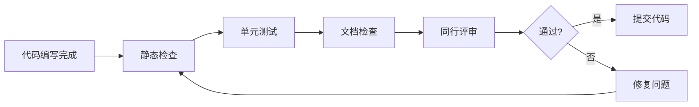

# 代码质量检查清单

> 代码提交前的检查项、测试要求、文档要求

## 提交前检查流程



## 一、代码规范检查

### 1.1 代码风格

- [ ] **命名规范**
  - [ ] 变量名使用`snake_case`（Rust/Python）或`camelCase`（Java/C++）
  - [ ] 常量使用`SCREAMING_SNAKE_CASE`
  - [ ] 类型/结构体使用`PascalCase`
  - [ ] 函数名具有描述性，避免缩写

- [ ] **代码格式**
  - [ ] 缩进使用空格（4个空格或项目标准）
  - [ ] 行长度不超过100/120字符
  - [ ] 大括号风格统一（K&R或Allman）
  - [ ] 运算符前后有空格

- [ ] **导入/引用**
  - [ ] 按标准库、第三方库、本地模块顺序导入
  - [ ] 删除未使用的导入
  - [ ] 避免循环依赖

### 1.2 代码结构

- [ ] **函数设计**
  - [ ] 单一职责原则（SRP）
  - [ ] 函数长度不超过50行
  - [ ] 参数数量不超过5个
  - [ ] 避免深层嵌套（不超过3层）

- [ ] **模块组织**
  - [ ] 相关功能分组清晰
  - [ ] 公开接口最小化
  - [ ] 模块间耦合度低

## 二、静态分析检查

### 2.1 语言特定检查

**Rust项目**

- [ ] 运行 `cargo fmt` 格式化代码
- [ ] 运行 `cargo clippy` 修复警告
- [ ] 运行 `cargo check` 确保无编译错误
- [ ] 使用 `#![deny(unsafe_code)]` 标记（如适用）

**Python项目**

- [ ] 运行 `black` 或 `autopep8` 格式化
- [ ] 运行 `pylint` 或 `flake8` 检查
- [ ] 运行 `mypy` 类型检查
- [ ] 检查文档字符串覆盖率

**通用**

- [ ] 无编译器警告
- [ ] 无已弃用API使用
- [ ] 无硬编码敏感信息
- [ ] 无调试代码遗留

### 2.2 安全与性能

- [ ] **安全检查**
  - [ ] 无SQL注入风险
  - [ ] 无缓冲区溢出风险
  - [ ] 输入数据已验证/消毒
  - [ ] 错误信息不泄露敏感信息

- [ ] **性能检查**
  - [ ] 无明显的算法复杂度问题
  - [ ] 无内存泄漏风险
  - [ ] 资源使用已优化（文件句柄、连接等）

## 三、测试要求

### 3.1 单元测试

- [ ] **覆盖率要求**
  - [ ] 核心逻辑覆盖率 ≥ 80%
  - [ ] 边界条件已测试
  - [ ] 错误路径已测试

- [ ] **测试质量**
  - [ ] 测试用例命名描述性强
  - [ ] 使用Arrange-Act-Assert结构
  - [ ] 避免测试间依赖
  - [ ] 模拟外部依赖

```rust
// 良好示例
#[test]
fn binary_search_should_return_index_when_element_exists() {
    // Arrange
    let arr = vec![1, 3, 5, 7, 9];
    let target = 5;

    // Act
    let result = binary_search(&arr, target);

    // Assert
    assert_eq!(result, Some(2));
}
```

### 3.2 集成测试

- [ ] 模块间接口测试通过
- [ ] 数据流验证正确
- [ ] 端到端场景测试（如适用）

### 3.3 测试运行

- [ ] 本地测试全部通过：`cargo test` / `pytest`
- [ ] 无 flaky tests（不稳定测试）
- [ ] 测试执行时间合理

## 四、文档要求

### 4.1 代码内文档

- [ ] **文档注释**
  - [ ] 公开API有文档注释
  - [ ] 复杂逻辑有行内注释
  - [ ] 文档包含示例代码（如适用）

```rust
/// 二分搜索算法
///
/// # 参数
/// - `arr`: 已排序的数组
/// - `target`: 搜索目标
///
/// # 返回值
/// 返回目标值的索引，如果不存在则返回`None`
///
/// # 示例
/// ```
/// let arr = vec![1, 3, 5, 7];
/// assert_eq!(binary_search(&arr, 5), Some(2));
/// ```
pub fn binary_search(arr: &[i32], target: i32) -> Option<usize> {
    // ...
}
```

- [ ] **README更新**
  - [ ] 新增功能已记录
  - [ ] API变更已更新
  - [ ] 使用示例已同步

### 4.2 变更记录

- [ ] 提交信息符合规范：

  ```
  <类型>: <简短描述>

  <详细描述（可选）>

  <关联Issue（可选）>
  ```

- [ ] 类型使用规范：
  - `feat`: 新功能
  - `fix`: 修复
  - `docs`: 文档
  - `style`: 格式
  - `refactor`: 重构
  - `test`: 测试
  - `chore`: 构建/工具

- [ ] 变更日志(CHANGELOG)已更新（如适用）

## 五、算法特定检查

### 5.1 形式化规范

- [ ] **数学正确性**
  - [ ] 前置条件已明确
  - [ ] 后置条件已定义
  - [ ] 不变式已描述
  - [ ] 终止性已证明

- [ ] **复杂度声明**
  - [ ] 时间复杂度已标注
  - [ ] 空间复杂度已标注
  - [ ] 最好/最坏/平均情况已说明

### 5.2 参考实现

- [ ] 与伪代码一致
- [ ] 边界情况处理正确
- [ ] 数值稳定性考虑（浮点运算）

## 六、提交前最终确认

### 6.1 清单确认

```markdown
## 提交检查清单

- [ ] 代码可编译/运行
- [ ] 所有测试通过
- [ ] 静态分析无警告
- [ ] 文档已更新
- [ ] 提交信息规范
- [ ] 变更范围合理（单次提交不过大）
```

### 6.2 自评问题

提交前自问：

1. **正确性**: 代码是否正确实现了预期功能？
2. **可读性**: 其他开发者能否轻松理解？
3. **可维护性**: 未来修改是否容易？
4. **效率**: 性能是否满足需求？
5. **安全性**: 是否存在安全风险？

---

## 检查工具推荐

| 工具类型 | Rust | Python |
|---------|------|--------|
| 格式化 | `rustfmt` | `black` |
| 静态分析 | `clippy` | `pylint`, `flake8` |
| 类型检查 | 内置 | `mypy` |
| 测试框架 | 内置 | `pytest` |
| 覆盖率 | `tarpaulin` | `pytest-cov` |

---

**维护**: 质量保障组
**最后更新**: 2026-04-10
