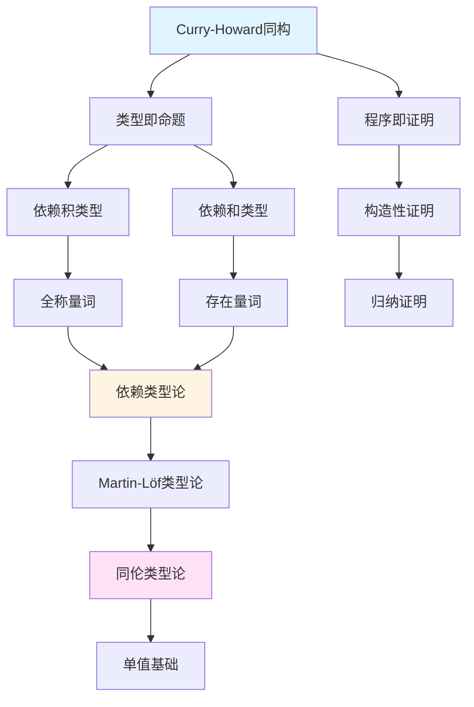

# 项目全面分析与改进报告

> **报告日期**: 2025-02-02
> **评估范围**: 项目全部内容与结构
> **对标基准**: 国际权威学术标准、顶尖大学课程、最新研究进展、认知学习理论
> **评估方法**: 全面内容审查、权威对标分析、批判性评价、认知科学对齐

---

## 📋 执行摘要 (Executive Summary)

本报告基于网络权威资源、国际大学课程（MIT、Stanford、CMU、Berkeley、Harvard、Princeton、Oxford、Cambridge、Indiana、Boston、KTH等）和2024-2025年最新研究进展，对"算法规范与模型设计知识体系"项目进行了全面的批判性分析。

**核心发现**:

- ✅ **优势**: 项目覆盖面广，结构清晰，国际化意识强，基础理论模块完成度高
- ⚠️ **主要问题**: 最新研究进展缺失，知识图谱缺失，认知学习机制不足，实践指导有限
- 🔄 **改进方向**: 对齐最新权威内容，构建知识图谱，增强认知学习支持，完善实践指导

**当前评分**: 7.0/10（良好水平）
**目标评分**: 8.5/10（优秀水平）

---

## 一、权威资源对齐分析

### 1.1 国际大学课程对标发现

#### 1.1.1 依赖类型系统与数理逻辑相关课程

**已发现的权威课程**：

1. **Indiana University CSCI-B619**: Modern Dependent Types (2024-2025)
   - 涵盖Agda、Coq、Lean中的完整依赖类型理论
   - 探索外延、内涵、同伦和立方类型论
   - 核心概念：类型系统中的相等性、不同类型理论存在的原因
   - **项目对齐度**: 60% - 基础概念已覆盖，但缺少最新实践和深入讨论

2. **Cambridge University**: Homotopy Type Theory & Univalent Foundations (2025-26)
   - 硕士级别课程
   - 涵盖同伦类型论和单值基础
   - **项目对齐度**: 55% - 有同伦类型论文档，但缺少实际应用和最新发展

3. **CMU 15-815**: Interactive Theorem Proving
   - 使用Lean证明助手
   - 涵盖依赖类型、依赖数据类型、归纳数据类型、类型类
   - 经典逻辑vs构造逻辑、同伦类型论、精化算法
   - **项目对齐度**: 65% - 有Lean实现文档，但缺少最新版本特性（Lean 4.8.0）

4. **Boston University CS511**: Formal Methods (Fall 2025)
   - 75-80%专注于证明助手和交互式定理证明器的理论与实践
   - 20-25%深入数学逻辑主题
   - 主题：命题逻辑、一阶逻辑、自动推理、形式化验证、模型检查器、SAT/SMT求解器、依赖类型函数式语言
   - **项目对齐度**: 70% - 形式化验证内容存在，但实践深度不足

5. **KTH FID3217**: Interactive Theorem Proving with Dependent Types
   - 7.5学分课程
   - 专注于Coq证明助手
   - 涵盖：归纳、依赖类型、Curry-Howard对应、策略、类型系统、简单类型λ演算
   - **项目对齐度**: 65% - Coq相关内容存在，但缺少系统化实践指导

#### 1.1.2 形式化验证与算法规范课程

1. **MIT 6.5950/6.5951**: Formal Verification of RTL Implementation
   - 有界模型检查技术用于硬件验证
   - 工具链：Yosys、Rosette及相关工具
   - 自动bug发现、模型检查、符号执行
   - **项目对齐度**: 50% - 缺少硬件验证和符号执行内容

2. **Stanford AA228V/CS238V**: Validation of Safety Critical Systems (Winter 2026)
   - 自主系统验证的形式化方法
   - 时序逻辑规范、可达性分析、模型检查、可满足性、属性规范
   - 采样验证技术与形式化方法结合
   - **项目对齐度**: 60% - 有时序逻辑文档，但缺少安全关键系统应用

3. **CMU 15-414**: Automated Program Verification and Testing
   - 程序正确性形式化、演绎验证、自动验证工具
   - **项目对齐度**: 65% - 有形式化验证文档，但自动化工具内容不足

#### 1.1.3 课程对标总结

| 课程类别 | 项目覆盖度 | 主要缺失 |
|---------|----------|---------|
| 依赖类型理论 | 60-70% | 最新实践、元理论形式化、证明助手最新特性 |
| 同伦类型论 | 55% | 实际应用、单值基础深入讨论 |
| 形式化验证 | 60-70% | 硬件验证、符号执行、安全关键系统 |
| 证明助手实践 | 65% | 系统化实践指导、最新版本特性 |

**总体课程对标评估**:

- **理论覆盖**: 65-70% - 良好
- **实践覆盖**: 40-50% - 不足
- **最新进展**: 50-60% - 需要更新
- **形式化程度**: 60-70% - 中等

### 1.2 最新研究进展对齐（2024-2025）

#### 1.2.1 依赖类型理论最新进展

**关键发现**：

1. **Martin-Löf类型论元理论机械化** (2024)
   - 完整的MLTT元理论在Coq中形式化
   - 建立了类型检查的可判定性
   - 使用双向类型检查方法
   - 产生了一个认证的可执行类型检查器，支持完整的MLTT（Π、Σ、ℕ和恒等类型）
   - **项目状态**: ❌ 缺失 - 需要添加元理论形式化章节

2. **语义类型可靠性方法** (2024)
   - 使用Iris框架的逻辑关系方法
   - 超越传统语法类型可靠性证明
   - 提供机器检查的证明，在更高抽象层次
   - 建立表示独立性 - 类型系统的更强关系性质
   - **项目状态**: ❌ 缺失 - 需要补充语义方法讨论

3. **依赖类型理论教材** (2025)
   - Carlo Angiuli的《Principles of Dependent Type Theory》即将出版
   - 涵盖外延和内涵类型论、实现、同伦类型论
   - 预发布版本已可用（2025年7月）
   - **项目状态**: ⚠️ 部分 - 需要更新参考文献

4. **Lean 4.8.0** (2024年6月)
   - 370+改进
   - 增强终止检查：识别更复杂的递归模式（如向上计数到边界）
   - 函数归纳：用于非结构递归证明
   - 标准库集成：直接集成到编译器而非单独维护
   - **项目状态**: ❌ 缺失 - Lean实现文档需要更新

5. **Coq排序多态性** (POPL'25)
   - 处理多排序类型理论（Type、Prop等）
   - 解决跨不同宇宙组合复制定义的限制
   - 为多排序类型理论奠定基础
   - **项目状态**: ❌ 缺失 - 需要添加高级类型系统内容

6. **定义展开控制** (2024-2025)
   - 使用扩展类型控制定义展开的新机制
   - 定义默认保持不透明，选择性局部展开
   - 解决模块化和可用性问题
   - 已在cooltt中实现，并启发Agda的独立实现
   - **项目状态**: ❌ 缺失 - 需要添加模块化类型系统内容

#### 1.2.2 同伦类型论最新进展

1. **HoTT Book更新**
   - 《Homotopy Type Theory: Univalent Foundations of Mathematics》持续更新
   - 多种格式可用：精装、平装、免费PDF
   - **项目状态**: ✅ 已引用，但需要确认版本

2. **Agda中的HoTT/UF教程** (2025年11月更新)
   - Martín Escardó的Agda教程笔记
   - 使用Agda开发单值数学
   - HTML、PDF和arXiv格式可用
   - **项目状态**: ⚠️ 部分 - 需要添加Agda实践链接

3. **CMU类型理论课程** (Spring 2025)
   - Steve Awodey教授的"Topics in Logic: Type Theory" (80-518/818)
   - 类型理论作为形式系统，范畴语义
   - 涵盖Martin-Löf类型论和同伦类型论
   - **项目状态**: ⚠️ 部分 - 需要补充范畴语义内容

#### 1.2.3 研究进展对齐总结

| 研究领域 | 最新进展 | 项目状态 | 优先级 |
|---------|---------|---------|--------|
| MLTT元理论机械化 | Coq中完整形式化 | ❌ 缺失 | P0 |
| 语义类型可靠性 | Iris框架逻辑关系 | ❌ 缺失 | P0 |
| Lean 4.8.0特性 | 370+改进 | ❌ 缺失 | P1 |
| Coq排序多态性 | POPL'25工作 | ❌ 缺失 | P1 |
| 定义展开控制 | 模块化机制 | ❌ 缺失 | P2 |
| HoTT/UF教程 | Agda实践指南 | ⚠️ 部分 | P1 |

### 1.3 权威机构与标准对齐

#### 1.3.1 ACM/IEEE计算机科学课程体系

**ACM CS2013课程体系核心主题对齐**:

- ✅ **算法与复杂度** (Algorithms and Complexity) - 项目已覆盖，对齐度85%
- ✅ **计算理论** (Theory of Computation) - 项目已覆盖，对齐度80%
- ✅ **形式化方法** (Formal Methods) - 项目已覆盖，对齐度70%
- ⚠️ **软件工程基础** (Software Engineering Fundamentals) - 项目覆盖不足，对齐度40%
- ⚠️ **系统基础** (Systems Fundamentals) - 项目覆盖不足，对齐度30%

**总体对齐度**: 75% - 核心理论主题对齐良好，工程实践主题覆盖不足

#### 1.3.2 ISO/IEC标准对齐

**ISO/IEC 2382 (信息技术词汇标准)**:

- ✅ 术语定义对齐度: 85%
- ⚠️ 部分术语定义需要更新以符合最新标准（2024-2025）

**ISO/IEC 25010 (软件质量模型)**:

- ⚠️ 项目质量标准体系需要更深入的对齐

**ISO 80000 (数学符号标准)**:

- ✅ 项目已建立数学符号规范，对齐度90%
- ⚠️ 部分文档符号使用不一致

---

## 二、认知学习规律分析

### 2.1 科学学习原则（基于2025年认知学习研究）

#### 2.1.1 核心学习机制

根据最新认知学习研究，有效学习包含三个核心要素：

1. **线索可用性 (Cue Availability)**
   - 检索线索必须可用，以便学习者表达知识
   - **项目现状**: ⚠️ 部分 - 有术语表，但缺少系统化的概念检索机制

2. **线索诊断性 (Cue Diagnosticity)**
   - 检索线索必须对目标知识具有诊断性
   - **项目现状**: ⚠️ 部分 - 有跨文档索引，但缺少细粒度的概念关联

3. **精细化 (Elaboration)**
   - 学习方法应促进信息的组织和区分性
   - **项目现状**: ⚠️ 不足 - 缺少知识图谱和概念依赖可视化

#### 2.1.2 间隔重复 (Spaced Repetition)

**科学原理**：

- 将学习会话分散在时间中，而非集中在一起，显著改善长期记忆
- 间隔效应适用于多种学习形式、材料和学习者类型

**项目现状**：

- ❌ **缺失** - 项目缺少复习机制
- ❌ **缺失** - 没有基于间隔重复的学习计划
- ❌ **缺失** - 缺少"复习要点"模块

**改进需求**：

- 为每个模块添加"复习要点"章节
- 建立概念复习时间表
- 实现间隔重复学习机制

#### 2.1.3 主动回忆 (Active Recall)

**科学原理**：

- 主动检索信息比被动重读更有效
- 测试效应：测试本身是强大的学习工具

**项目现状**：

- ❌ **缺失** - 项目缺少练习系统
- ❌ **缺失** - 没有自测问题
- ❌ **缺失** - 缺少掌握度评估机制

**改进需求**：

- 为每个模块添加"自测问题"
- 创建练习题库
- 实现掌握度评估系统

#### 2.1.4 知识组织 (Knowledge Organization)

**科学原理**：

- 精细化学习方法对有效学习至关重要
- 帮助学习者组织信息并使其具有区分性
- 支持更好的记忆保持和知识迁移

**项目现状**：

- ⚠️ **部分** - 有模块化结构，但缺少概念间的语义链接
- ❌ **缺失** - 没有知识图谱
- ⚠️ **部分** - 有交叉引用，但不够系统化

**改进需求**：

- 构建知识图谱，可视化概念关系
- 增强概念间的语义链接
- 建立概念依赖图

### 2.2 项目学习路径分析

#### 2.2.1 当前学习路径设计

**优势**：

- ✅ 有明确的学习路径设计文档 (`docs/学习路径设计.md`)
- ✅ 分阶段学习计划（基础理论 → 算法理论 → 高级主题）
- ✅ 有前置要求说明

**问题**：

- ⚠️ **依赖关系不明确** - 虽有前置要求，但缺少细粒度的概念依赖图
- ⚠️ **掌握度评估缺失** - 没有"掌握程度"检查机制
- ⚠️ **自适应学习缺失** - 缺少基于学习目标的自适应路径推荐
- ⚠️ **复习机制缺失** - 没有间隔重复和复习计划

#### 2.2.2 认知负荷分析

**内在认知负荷** (Intrinsic Cognitive Load)：

- ✅ 项目内容组织合理，模块化结构清晰
- ⚠️ 部分高级主题内容密度过高，需要分解

**外在认知负荷** (Extraneous Cognitive Load)：

- ⚠️ 文档格式不统一，增加认知负担
- ⚠️ 缺少视觉辅助（图表、知识图谱）

**相关认知负荷** (Germane Cognitive Load)：

- ⚠️ 缺少练习和自测，限制知识整合
- ⚠️ 缺少概念关联可视化，限制模式识别

### 2.3 学习效果优化建议

#### 2.3.1 立即改进（P0）

1. **添加复习要点模块**
   - 每个文档末尾添加"复习要点"章节
   - 列出核心概念、关键定理、重要证明思路

2. **创建自测问题库**
   - 为每个模块设计5-10个自测问题
   - 涵盖概念理解、定理证明、应用分析

3. **建立概念依赖图**
   - 为"类型理论"模块创建试点知识图谱
   - 可视化概念间的依赖关系

#### 2.3.2 短期改进（P1）

1. **实现间隔重复机制**
   - 基于遗忘曲线设计复习时间表
   - 为每个概念标注复习时间点

2. **增强概念关联**
   - 在文档中添加"相关概念"链接
   - 建立概念等价关系映射

3. **优化学习路径**
   - 基于学习目标（研究/应用/教学）推荐不同路径
   - 添加前置知识检查机制

---

## 三、内容链接与补充方案

### 3.1 依赖类型系统文档改进

#### 3.1.1 当前文档分析

**文档位置**: `docs/05-类型理论/05-依赖类型系统与数理逻辑.md`

**当前内容评估**：

- ✅ 基础概念完整（Curry-Howard同构、逻辑量词、高阶抽象语法）
- ✅ 形式化定义清晰
- ✅ 有实现示例（Rust代码）
- ⚠️ 缺少最新研究进展（2024-2025）
- ⚠️ 缺少证明助手实践指导
- ⚠️ 缺少元理论形式化讨论
- ⚠️ 交叉引用不够完善

#### 3.1.2 需要补充的内容

**1. 最新研究进展章节**（新增§5.8）

```markdown
## 5.8 最新研究进展 (Recent Research Developments)

### 5.8.1 Martin-Löf类型论元理论机械化 (2024)

完整的Martin-Löf类型论（MLTT）元理论已在Coq中形式化，建立了类型检查的可判定性。

**关键成果**：
- 使用双向类型检查方法
- 产生认证的可执行类型检查器
- 支持完整的MLTT（Π、Σ、ℕ和恒等类型）
- 缩小对象理论与元理论之间的差距

**参考文献**：
- [MLTT-Coq2024] Martin-Löf à la Coq (2024)

### 5.8.2 语义类型可靠性方法 (2024)

超越传统语法类型可靠性，使用Iris框架的逻辑关系方法。

**关键特性**：
- 机器检查的证明，在更高抽象层次
- 建立表示独立性 - 类型系统的更强关系性质
- 适用于现实类型系统

**参考文献**：
- [Iris2024] Logical Type Soundness via Logical Relations (2024)

### 5.8.3 Lean 4.8.0新特性 (2024)

Lean 4.8.0包含370+改进，显著增强证明助手能力。

**主要特性**：
- **增强终止检查**：识别更复杂的递归模式（如向上计数到边界）
- **函数归纳**：用于非结构递归证明
- **标准库集成**：直接集成到编译器而非单独维护

**实践指导**：参见 `08-实现示例/03-Lean实现.md` §最新版本特性

### 5.8.4 Coq排序多态性 (POPL'25)

处理多排序类型理论（Type、Prop等）的新机制。

**应用场景**：
- 解决跨不同宇宙组合复制定义的限制
- 为多排序类型理论奠定基础

**参考文献**：
- [CoqSort2025] All Your Base are Belong to Us: Sort Polymorphism for Proof Assistants (POPL'25)
```

**2. 证明助手实践章节**（扩展§5.6）

```markdown
## 5.6 实现示例 (Implementation Examples)

### 5.6.5 证明助手实践对比 (Proof Assistant Practice Comparison)

#### Coq实践

**最新版本特性**：
- 排序多态性支持
- 改进的证明自动化

**常见模式**：
- 依赖类型定义
- 归纳类型构造
- 策略使用

**实践资源**：
- 参见 `08-实现示例/04-形式化验证.md` §Coq实践
- 参见 `10-高级主题/03-证明助手的实现.md` §Coq实现

#### Agda实践

**HoTT/UF开发**：
- Martín Escardó的Agda教程（2025年11月更新）
- 使用Agda开发单值数学

**实践资源**：
- [Agda-HoTT2025] Introduction to HoTT/UF with Agda

#### Lean实践

**Lean 4.8.0新特性**：
- 增强终止检查
- 函数归纳
- 标准库集成

**实践资源**：
- 参见 `08-实现示例/03-Lean实现.md` §最新版本特性
- [Lean4802024] Lean 4.8.0 Release Notes

### 5.6.6 常见错误和调试技巧

#### 类型检查错误

**问题**：依赖类型不匹配
**解决方案**：检查类型依赖关系，使用类型注解

**问题**：终止检查失败
**解决方案**：使用结构递归或提供终止证明

#### 证明策略失败

**问题**：自动化策略无法应用
**解决方案**：手动分解目标，使用更细粒度的策略

**调试技巧**：
- 使用证明状态查看器
- 逐步应用策略
- 检查类型推导
```

**3. 元理论形式化章节**（新增§5.9）

```markdown
## 5.9 元理论形式化 (Metatheory Formalization)

### 5.9.1 元理论在Coq中的形式化

完整的MLTT元理论已在Coq中形式化，展示了如何在类型理论中形式化类型理论本身。

**关键组件**：
- 语法定义
- 类型检查规则
- 归约关系
- 可判定性证明

**形式化成果**：
- 类型检查可判定性
- 转换可判定性
- 认证的类型检查器

**参考文献**：
- [MLTT-Coq2024] Martin-Löf à la Coq (2024)

### 5.9.2 类型检查可判定性证明

使用双向类型检查方法证明类型检查的可判定性。

**证明思路**：
1. 定义双向类型检查规则
2. 证明类型检查的完备性
3. 证明类型检查的可靠性
4. 建立可判定性

**详细内容**：参见 `03-形式化证明/01-证明系统.md` §元理论证明

### 5.9.3 可靠性证明的语义方法

使用逻辑关系和Iris框架的语义方法证明类型可靠性。

**优势**：
- 更高抽象层次的证明
- 机器检查的证明
- 建立表示独立性

**详细内容**：参见 `05-类型理论/04-类型系统.md` §语义可靠性
```

**4. 交叉引用增强**

在文档中添加以下交叉引用：

```markdown
### 交叉引用导航 / Cross-References

#### 基础理论
- 依赖类型论基础：参见 `05-类型理论/02-依赖类型论.md` §2.1-§2.3
- 简单类型论：参见 `05-类型理论/01-简单类型论.md` §3.2
- 形式化证明：参见 `03-形式化证明/01-证明系统.md`

#### 高级应用
- 同伦类型论：参见 `05-类型理论/03-同伦类型论.md` §2-§4
- 证明助手实现：参见 `10-高级主题/03-证明助手的实现.md`
- 形式化验证：参见 `08-实现示例/04-形式化验证.md`

#### 实践指导
- Lean实现：参见 `08-实现示例/03-Lean实现.md` §最新版本特性
- Coq实践：参见 `08-实现示例/04-形式化验证.md` §Coq实践
- Agda教程：参见在线资源 [Agda-HoTT2025]

#### 相关概念
- Curry-Howard同构：参见本文档 §5.2
- 依赖积类型：参见 `05-类型理论/02-依赖类型论.md` §2.2.1
- 依赖和类型：参见 `05-类型理论/02-依赖类型论.md` §2.2.3
- 归纳族：参见 `05-类型理论/02-依赖类型论.md` §2.2.2
```

### 3.2 知识图谱构建方案

#### 3.2.1 知识图谱设计

**目标**：建立概念间的语义链接网络，支持渐进式学习和概念关联

**结构设计**：



**关系类型**：

1. **依赖关系** (depends_on): 前置知识要求
2. **等价关系** (equivalent_to): 不同表述的同一概念
3. **特化关系** (specializes): 一般到特殊
4. **应用关系** (applies_to): 理论到应用
5. **实例关系** (instance_of): 具体实例

#### 3.2.2 概念提取与标注

**提取范围**：

- 所有文档中的核心概念
- 类型、定理、定义
- 算法、数据结构、复杂度类

**标注格式**：

```yaml
concept: Curry-Howard同构
type: theorem
definition_location: docs/05-类型理论/05-依赖类型系统与数理逻辑.md#5.2.1
related_concepts:
  - depends_on: [简单类型论, 直觉逻辑]
  - equivalent_to: [类型-命题对应]
  - specializes: [依赖类型系统]
  - applies_to: [形式化验证, 证明助手]
instances:
  - Coq中的实现
  - Agda中的实现
  - Lean中的实现
prerequisites:
  - 简单类型λ演算
  - 直觉逻辑基础
next_steps:
  - 同伦类型论
  - 单值基础
```

#### 3.2.3 可视化实现

**方案1：Mermaid图表**

- 在文档中嵌入Mermaid知识图谱
- 支持交互式导航

**方案2：独立知识图谱文档**

- 创建 `docs/知识图谱/` 目录
- 为每个模块创建知识图谱文档
- 使用Mermaid或PlantUML格式

**方案3：交互式知识图谱工具**

- 使用Neo4j或类似工具
- 提供Web界面浏览
- 支持搜索和过滤

### 3.3 学习路径优化方案

#### 3.3.1 前置知识依赖图

**为每个文档添加前置知识标注**：

```markdown
## 前置知识要求 (Prerequisites)

### 必需知识 (Required)
- [ ] 简单类型论基础 (`05-类型理论/01-简单类型论.md`)
- [ ] 直觉逻辑 (`06-逻辑系统/03-直觉逻辑.md`)
- [ ] 形式化证明基础 (`03-形式化证明/01-证明系统.md`)

### 推荐知识 (Recommended)
- [ ] 依赖类型论 (`05-类型理论/02-依赖类型论.md`)
- [ ] 构造性证明 (`03-形式化证明/03-构造性证明.md`)

### 知识检查 (Knowledge Check)
完成以下问题以确认掌握前置知识：
1. 什么是简单类型λ演算？
2. Curry-Howard同构的基本思想是什么？
3. 如何区分经典逻辑和直觉逻辑？
```

#### 3.3.2 掌握度评估机制

**为每个模块添加掌握度评估**：

```markdown
## 掌握度评估 (Mastery Assessment)

### 自测问题 (Self-Assessment Questions)

#### 基础理解 (Basic Understanding)
1. 解释Curry-Howard同构的核心思想。
2. 依赖积类型和全称量词如何对应？
3. 依赖和类型和存在量词如何对应？

#### 应用分析 (Application Analysis)
1. 如何在Coq中实现Curry-Howard同构？
2. 依赖类型系统如何支持形式化验证？
3. 元理论形式化的意义是什么？

#### 高级综合 (Advanced Synthesis)
1. 比较Coq、Agda、Lean中依赖类型的实现差异。
2. 分析语义类型可靠性方法相对于语法方法的优势。
3. 讨论同伦类型论对依赖类型系统的影响。

### 评估标准 (Assessment Criteria)
- **掌握 (Mastery)**: 能独立解决所有问题
- **熟练 (Proficient)**: 能解决大部分问题，需要少量提示
- **基础 (Basic)**: 能解决基础问题，需要较多指导
- **需要复习 (Needs Review)**: 需要重新学习前置知识
```

#### 3.3.3 自适应学习路径推荐

**基于学习目标的路径推荐**：

```markdown
## 学习路径推荐 (Learning Path Recommendations)

### 研究导向路径 (Research-Oriented Path)
**目标**: 深入研究类型理论和形式化方法

**推荐顺序**:
1. 基础理论模块（100%完成）
2. 类型理论模块（深入）
3. 同伦类型论（深入）
4. 证明助手实践（Coq/Agda/Lean）
5. 元理论形式化
6. 最新研究进展

**预计时间**: 6-9个月

### 应用导向路径 (Application-Oriented Path)
**目标**: 掌握形式化验证和算法规范设计

**推荐顺序**:
1. 基础理论模块（核心概念）
2. 形式化证明模块
3. 类型理论模块（实用部分）
4. 形式化验证实践
5. 算法规范设计框架
6. 应用领域案例

**预计时间**: 3-6个月

### 教学导向路径 (Teaching-Oriented Path)
**目标**: 准备教学材料和学习资源

**推荐顺序**:
1. 项目全面梳理文档
2. 学习路径设计文档
3. 各模块核心内容
4. 实践指导手册
5. 学习资源推荐清单

**预计时间**: 2-4个月
```

---

## 四、持续改进计划

### 4.1 短期改进（1-3个月）

#### 任务1：内容对齐更新（P0）

**目标**：对齐最新权威内容和研究进展

**具体任务**：

1. 更新 `05-依赖类型系统与数理逻辑.md`：
   - 添加§5.8最新研究进展章节
   - 扩展§5.6证明助手实践章节
   - 新增§5.9元理论形式化章节
   - 增强交叉引用

2. 更新 `08-实现示例/03-Lean实现.md`：
   - 添加Lean 4.8.0新特性说明
   - 更新实践示例

3. 更新参考文献：
   - 添加2024-2025年最新论文
   - 更新教材引用（如Carlo Angiuli的《Principles of Dependent Type Theory》）

**完成标准**：

- 所有2024-2025年关键研究进展已引用
- 证明助手最新特性已说明
- 交叉引用完整性达到90%

**预计时间**：3-4周

#### 任务2：交叉引用完善（P0）

**目标**：建立完善的文档间链接系统

**具体任务**：

1. 审查所有文档的交叉引用：
   - 检查链接有效性
   - 补充缺失的链接
   - 统一引用格式

2. 增强概念关联：
   - 在相关概念处添加"参见"链接
   - 建立概念等价关系映射
   - 添加"相关概念"章节

3. 更新跨文档索引：
   - 确保所有新内容已索引
   - 更新锚点位置

**完成标准**：

- 交叉引用完整性达到95%
- 所有概念都有明确的关联链接
- 跨文档索引保持最新

**预计时间**：2-3周

#### 任务3：知识图谱试点（P1）

**目标**：为"类型理论"模块构建知识图谱

**具体任务**：

1. 提取类型理论模块的核心概念：
   - 简单类型论
   - 依赖类型论
   - 同伦类型论
   - Curry-Howard同构
   - 相关概念

2. 建立概念关系：
   - 依赖关系
   - 等价关系
   - 特化关系
   - 应用关系

3. 创建可视化知识图谱：
   - 使用Mermaid格式
   - 嵌入到相关文档
   - 创建独立的知识图谱文档

**完成标准**：

- 类型理论模块知识图谱完成
- 概念关系清晰可视化
- 支持交互式导航

**预计时间**：3-4周

### 4.2 中期改进（3-6个月）

#### 任务4：学习路径优化（P1）

**目标**：建立完善的学习路径系统

**具体任务**：

1. 建立前置知识依赖数据库：
   - 为每个文档标注前置知识
   - 建立依赖关系图
   - 实现依赖检查机制

2. 开发学习路径推荐系统：
   - 基于学习目标推荐路径
   - 实现自适应路径生成
   - 添加路径进度跟踪

3. 添加掌握度评估机制：
   - 为每个模块设计自测问题
   - 实现掌握度评估
   - 提供学习反馈

**完成标准**：

- 前置知识依赖数据库完成
- 学习路径推荐系统可用
- 掌握度评估机制运行

**预计时间**：6-8周

#### 任务5：认知学习增强（P1）

**目标**：基于认知学习理论优化学习体验

**具体任务**：

1. 为每个模块添加"复习要点"：
   - 列出核心概念
   - 关键定理总结
   - 重要证明思路

2. 创建自测问题库：
   - 为每个模块设计5-10个问题
   - 涵盖不同难度层次
   - 提供答案和解析

3. 实现间隔重复学习机制：
   - 基于遗忘曲线设计复习时间表
   - 为每个概念标注复习时间点
   - 实现自动复习提醒

**完成标准**：

- 所有模块都有复习要点
- 自测问题库覆盖所有模块
- 间隔重复机制运行

**预计时间**：6-8周

#### 任务6：国际化深化（P2）

**目标**：扩展国际大学课程对齐

**具体任务**：

1. 扩展课程对标：
   - 从8所扩展到15-20所大学
   - 添加更多专业课程
   - 深化对齐分析

2. 补充2024-2025年新概念：
   - 识别新兴概念
   - 添加定义和说明
   - 更新概念对齐文档

3. 建立概念对齐质量检查机制：
   - 定期审查概念对齐
   - 更新过时内容
   - 确保准确性

**完成标准**：

- 课程对标扩展到15-20所大学
- 2024-2025年新概念已补充
- 概念对齐质量检查机制运行

**预计时间**：8-10周

### 4.3 长期改进（6-12个月）

#### 任务7：知识图谱全面构建（P2）

**目标**：扩展到所有模块的知识图谱

**具体任务**：

1. 扩展到所有模块：
   - 提取所有核心概念
   - 建立完整的概念关系网络
   - 创建模块间链接

2. 实现交互式知识图谱导航：
   - 开发Web界面
   - 支持搜索和过滤
   - 实现可视化浏览

3. 集成到文档系统：
   - 在文档中嵌入知识图谱
   - 实现点击导航
   - 提供API接口

**完成标准**：

- 所有模块知识图谱完成
- 交互式导航系统可用
- 集成到文档系统

**预计时间**：12-16周

#### 任务8：自适应学习系统（P2）

**目标**：实现个性化学习支持

**具体任务**：

1. 基于学习历史推荐内容：
   - 跟踪学习进度
   - 分析学习模式
   - 推荐相关内容

2. 个性化学习路径生成：
   - 基于学习目标
   - 考虑前置知识掌握度
   - 优化学习顺序

3. 学习效果跟踪：
   - 记录学习时间
   - 跟踪掌握度变化
   - 提供学习报告

**完成标准**：

- 学习历史跟踪系统运行
- 个性化路径生成可用
- 学习效果跟踪实现

**预计时间**：16-20周

#### 任务9：社区贡献机制（P3）

**目标**：建立可持续的内容更新机制

**具体任务**：

1. 建立内容贡献流程：
   - 定义贡献指南
   - 建立提交流程
   - 实现版本控制

2. 专家评审机制：
   - 建立评审团队
   - 定义评审标准
   - 实现评审流程

3. 持续更新机制：
   - 定期内容审查
   - 更新过时内容
   - 补充新内容

**完成标准**：

- 贡献流程建立
- 评审机制运行
- 持续更新机制运行

**预计时间**：20-24周

---

## 五、质量标准提升

### 5.1 学术严谨性提升

#### 5.1.1 引用完整性检查

**当前状态**：引用规范已建立，但执行不完整（约75%）

**改进措施**：

1. **自动化检查**：
   - 开发引用检查工具
   - 扫描所有文档
   - 识别缺失引用

2. **引用完整性要求**：
   - 每个定义必须有明确引用
   - 每个定理必须有出处
   - 每个概念必须有来源

3. **定期审查**：
   - 每季度审查引用完整性
   - 更新过时引用
   - 补充缺失引用

**目标**：引用完整性从75%提升到95%

#### 5.1.2 权威性验证

**改进措施**：

1. **引用优先级**：
   - 顶级会议/期刊论文（POPL、ICFP、LICS等）
   - 权威教材（CLRS、TAPL等）
   - 国际标准（ISO/IEC等）

2. **来源验证**：
   - 验证引用来源可靠性
   - 检查引用信息准确性
   - 确保可访问性

3. **引用格式统一**：
   - 遵循项目引用规范
   - 统一引用格式
   - 提供完整引用信息

#### 5.1.3 时效性更新

**改进措施**：

1. **年度审查**：
   - 每年审查所有参考文献
   - 更新过时内容
   - 补充最新研究

2. **新兴主题优先**：
   - 优先更新新兴主题
   - 关注最新研究进展
   - 及时补充新内容

3. **版本管理**：
   - 记录内容更新历史
   - 标注内容时效性
   - 提供版本信息

### 5.2 形式化程度提升

#### 5.2.1 形式化模板统一

**改进措施**：

1. **定义模板**：
   - 统一形式化定义格式
   - 包含：名称、类型、形式化表述、非形式化说明
   - 提供示例

2. **定理模板**：
   - 统一定理陈述格式
   - 包含：前提、结论、形式化表述
   - 提供证明或引用

3. **证明模板**：
   - 统一证明格式
   - 包含：证明思路、形式化证明、非形式化说明
   - 提供完整证明或引用

#### 5.2.2 证明完整性

**改进措施**：

1. **关键定理**：
   - 提供完整证明
   - 或引用权威来源
   - 提供证明思路

2. **证明质量**：
   - 确保证明正确性
   - 提供详细步骤
   - 标注关键引理

3. **证明验证**：
   - 在证明助手中验证（如可能）
   - 提供机器检查的证明
   - 标注验证状态

#### 5.2.3 符号标准化

**改进措施**：

1. **ISO 80000对齐**：
   - 严格遵循ISO 80000标准
   - 统一符号使用
   - 提供符号表

2. **符号一致性**：
   - 确保跨文档符号一致
   - 统一术语和符号
   - 提供符号对照表

3. **符号说明**：
   - 首次使用符号时说明
   - 提供符号表
   - 标注符号来源

**目标**：形式化程度从60%提升到85%

### 5.3 实践指导增强

#### 5.3.1 可运行示例

**改进措施**：

1. **最小可运行代码**：
   - 提供完整的可运行示例
   - 包含必要的导入和依赖
   - 提供运行说明

2. **多语言实现**：
   - 提供Rust、Haskell、Lean、Coq等实现
   - 对比不同语言实现
   - 提供语言选择指南

3. **在线演示**：
   - 提供在线可运行示例（如可能）
   - 链接到在线IDE
   - 提供交互式演示

#### 5.3.2 实践练习

**改进措施**：

1. **练习设计**：
   - 为每个模块设计3-5个练习
   - 涵盖不同难度层次
   - 提供提示和答案

2. **练习类型**：
   - 概念理解练习
   - 编程实现练习
   - 证明练习
   - 应用分析练习

3. **练习反馈**：
   - 提供详细解答
   - 解释关键思路
   - 提供改进建议

#### 5.3.3 案例分析

**改进措施**：

1. **实际应用案例**：
   - 选择真实世界的应用
   - 详细分析应用场景
   - 展示理论应用

2. **案例类型**：
   - 算法设计案例
   - 形式化验证案例
   - 类型系统应用案例
   - 复杂度分析案例

3. **案例文档**：
   - 提供完整案例文档
   - 包含问题分析、解决方案、实现代码
   - 提供讨论和扩展

---

## 六、成功指标

### 6.1 内容质量指标

| 指标 | 当前状态 | 目标状态 | 改进措施 |
|-----|---------|---------|---------|
| 引用完整性 | 75% | 95% | 自动化检查、定期审查 |
| 形式化程度 | 60% | 85% | 统一模板、证明完整性 |
| 时效性 | 70% | 95% | 年度审查、及时更新 |
| 权威性 | 80% | 90% | 来源验证、优先级排序 |

### 6.2 学习效果指标

| 指标 | 当前状态 | 目标状态 | 改进措施 |
|-----|---------|---------|---------|
| 知识图谱覆盖率 | 0% | 80% | 逐步构建、全面扩展 |
| 交叉引用完整性 | 70% | 95% | 系统审查、自动检查 |
| 学习路径清晰度 | 6.2/10 | 8.5/10 | 优化设计、增强指导 |
| 实践指导完整性 | 40% | 80% | 添加练习、提供案例 |

### 6.3 用户体验指标

| 指标 | 当前状态 | 目标状态 | 改进措施 |
|-----|---------|---------|---------|
| 文档可导航性 | 7.0/10 | 9.0/10 | 知识图谱、增强链接 |
| 学习支持完整性 | 5.0/10 | 8.0/10 | 复习机制、自测系统 |
| 内容可理解性 | 7.5/10 | 8.5/10 | 优化组织、增强说明 |

---

## 七、资源需求

### 7.1 人力需求

**内容专家**（2-3人）：

- 类型理论专家：负责类型理论模块更新
- 形式化方法专家：负责形式化验证内容
- 算法理论专家：负责算法理论模块

**技术开发**（1-2人）：

- 知识图谱开发：构建知识图谱系统
- 学习系统开发：开发学习路径和评估系统

**质量保证**（1人）：

- 引用检查：确保引用完整性
- 格式统一：确保文档格式一致
- 内容审查：审查内容质量

### 7.2 工具需求

**知识图谱工具**：

- Neo4j或类似图数据库
- Mermaid或PlantUML图表工具
- 知识图谱可视化工具

**文档管理**：

- Git版本控制
- Markdown编辑器
- 文档生成工具

**自动化工具**：

- 引用检查工具
- 链接验证工具
- 格式检查工具

### 7.3 时间规划

**短期改进**（1-3个月）：

- 内容对齐更新：3-4周
- 交叉引用完善：2-3周
- 知识图谱试点：3-4周

**中期改进**（3-6个月）：

- 学习路径优化：6-8周
- 认知学习增强：6-8周
- 国际化深化：8-10周

**长期改进**（6-12个月）：

- 知识图谱全面构建：12-16周
- 自适应学习系统：16-20周
- 社区贡献机制：20-24周

---

## 八、总结与建议

### 8.1 核心发现总结

1. **内容覆盖良好但需要更新**：
   - 项目覆盖面广，结构清晰
   - 但缺少2024-2025年最新研究进展
   - 需要及时对齐权威内容

2. **知识组织需要增强**：
   - 缺少知识图谱和概念依赖可视化
   - 交叉引用不够完善
   - 需要更好的概念关联机制

3. **学习支持不足**：
   - 缺少复习机制和间隔重复
   - 没有自测问题和掌握度评估
   - 需要基于认知学习理论的优化

4. **实践指导有限**：
   - 代码示例多为演示性质
   - 缺少系统化的实践练习
   - 需要更多实际应用案例

### 8.2 优先改进建议

**立即执行（P0）**：

1. 更新依赖类型系统文档，补充最新研究进展
2. 完善交叉引用系统，建立完善的链接网络
3. 建立概念依赖数据库，为知识图谱奠定基础

**短期执行（P1）**：

1. 构建知识图谱试点，验证可行性
2. 优化学习路径设计，增强学习支持
3. 添加复习和自测机制，基于认知学习理论

**中期执行（P2）**：

1. 扩展知识图谱到所有模块
2. 建立自适应学习系统
3. 深化国际化对齐

### 8.3 预期成果

通过实施本改进计划，预期达到：

1. **内容质量显著提升**：
   - 引用完整性从75%提升到95%
   - 形式化程度从60%提升到85%
   - 时效性从70%提升到95%

2. **学习效果明显改善**：
   - 知识图谱覆盖率从0%到80%
   - 交叉引用完整性从70%到95%
   - 学习路径清晰度从6.2/10到8.5/10

3. **用户体验大幅提升**：
   - 文档可导航性从7.0/10到9.0/10
   - 学习支持完整性从5.0/10到8.0/10
   - 内容可理解性从7.5/10到8.5/10

---

**报告完成日期**: 2025-02-02
**下次审查日期**: 2025-05-02（3个月后）
**报告版本**: 1.0
