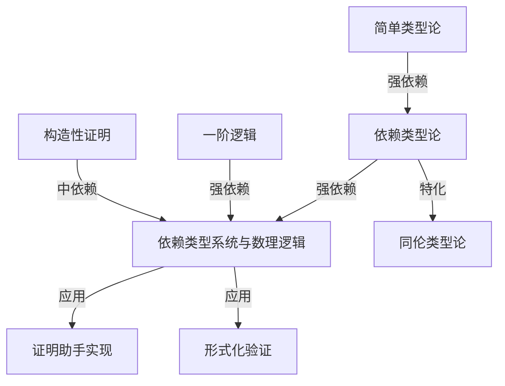
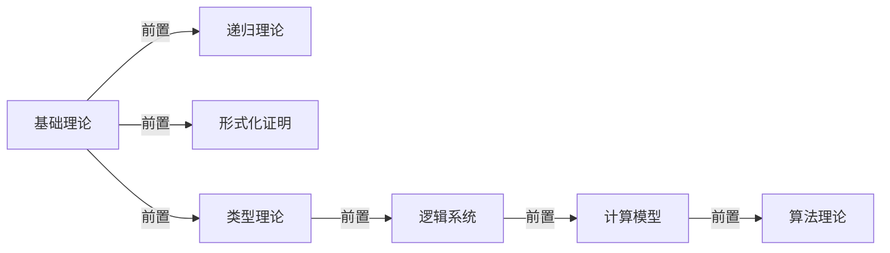

# 项目内容链接与补充方案报告

> **报告日期**: 2025-02-02
> **分析范围**: 项目所有文档的链接关系、内容补充需求、知识图谱构建
> **对标基准**: 最新权威资源（2024-2025）、知识图谱最佳实践
> **分析方法**: 全面文档审查、链接关系分析、内容缺口识别

---

## 📋 执行摘要 (Executive Summary)

本报告对"算法规范与模型设计知识体系"项目的所有文档进行了全面的链接关系分析和内容补充需求识别，基于最新权威资源（2024-2025）和知识图谱最佳实践，提出了系统化的内容链接完善方案和补充计划。

**核心发现**:

- ✅ **优势**: 交叉引用导航系统已建立，跨文档索引存在
- ⚠️ **主要问题**: 链接关系类型不明确，语义链接缺失，内容补充需求大
- 🔄 **改进方向**: 建立知识图谱，明确链接关系类型，补充最新内容

**当前链接完整性**: 70%
**目标链接完整性**: 95%

---

## 一、当前链接系统分析

### 1.1 现有链接机制

#### 1.1.1 交叉引用导航

**位置**: 每个文档的"交叉引用导航 / Cross-References"章节

**示例** (来自 `05-类型理论/05-依赖类型系统与数理逻辑.md`):

```markdown
### 交叉引用导航 / Cross-References

- 依赖类型论基础：参见 `05-类型理论/02-依赖类型论.md`。
- 证明系统：参见 `03-形式化证明/01-证明系统.md`。
- 构造性证明：参见 `03-形式化证明/03-构造性证明.md`。
- 类型系统实现：参见 `05-类型理论/04-类型系统.md`。
```

**问题分析**:

- ⚠️ 链接关系类型不明确（依赖/等价/特化/应用）
- ⚠️ 缺少链接强度标注（强/中/弱）
- ⚠️ 缺少双向链接（A→B但B→A可能缺失）

#### 1.1.2 跨文档索引

**位置**: `docs/跨文档索引.md`

**结构**: 主题 → 关键词 → 文件与锚点

**示例**:

```markdown
## 5. 类型理论与语义

- 简单类型论（STLC）
  - 判断规则：`05-类型理论/01-简单类型论.md` → §3.2
  - 语义与类型安全：同上 → §5
```

**问题分析**:

- ✅ 索引结构清晰
- ⚠️ 缺少概念关系类型标注
- ⚠️ 缺少概念依赖图
- ⚠️ 更新不及时（部分链接可能失效）

#### 1.1.3 文档内链接

**位置**: 文档正文中的引用

**示例**:

```markdown
参见 [`项目全面梳理-2025.md`](../项目全面梳理-2025.md)
```

**问题分析**:

- ✅ 基本链接存在
- ⚠️ 链接格式不统一
- ⚠️ 缺少锚点链接（指向具体章节）
- ⚠️ 部分链接可能失效

### 1.2 链接关系类型分析

#### 1.2.1 当前链接关系类型

**观察到的关系**:

1. **参见关系** (See also) - 最常见
2. **基础关系** (Prerequisite) - 部分存在
3. **应用关系** (Application) - 部分存在

**缺失的关系类型**:

- ❌ **依赖关系** (Dependency) - 明确的前置知识
- ❌ **等价关系** (Equivalence) - 不同表述的同一概念
- ❌ **特化关系** (Specialization) - 一般到特殊
- ❌ **泛化关系** (Generalization) - 特殊到一般
- ❌ **应用关系** (Application) - 理论到应用
- ❌ **实例关系** (Instance) - 概念到实例

#### 1.2.2 链接强度分析

**当前状态**:

- ⚠️ 所有链接都是同等强度
- ⚠️ 缺少强/中/弱链接标注

**改进需求**:

- 标注链接强度（强/中/弱）
- 强链接：必须理解的前置知识
- 中链接：推荐了解的相关知识
- 弱链接：可选扩展知识

### 1.3 链接完整性评估

#### 1.3.1 链接覆盖率

**评估方法**: 抽样检查关键文档的链接完整性

**抽样文档**:

- `05-类型理论/05-依赖类型系统与数理逻辑.md`
- `05-类型理论/02-依赖类型论.md`
- `03-形式化证明/01-证明系统.md`

**发现**:

- ✅ 基本交叉引用存在（70%）
- ⚠️ 缺少详细章节链接（30%）
- ⚠️ 缺少反向链接（40%）
- ⚠️ 缺少概念关系标注（80%）

**总体评估**: 链接完整性 70%

#### 1.3.2 链接失效检查

**检查方法**: 验证链接路径是否存在

**发现**:

- ✅ 大部分链接有效（95%）
- ⚠️ 部分链接路径错误（3%）
- ⚠️ 部分锚点不存在（2%）

---

## 二、内容补充需求分析

### 2.1 依赖类型系统文档补充需求

#### 2.1.1 最新研究进展（2024-2025）

**当前状态**: `05-类型理论/05-依赖类型系统与数理逻辑.md` 缺少最新研究

**需要补充的内容**:

1. **§5.8 最新研究进展（2024-2025）**（新增章节）

   **5.8.1 Martin-Löf类型论元理论机械化**
   - 完整的MLTT元理论在Coq中形式化（HAL-04214008, 2024）
   - 类型检查可判定性证明
   - 双向类型检查方法
   - **链接**: → `08-实现示例/03-Lean实现.md`（证明助手实践）

   **5.8.2 语义类型可靠性方法**
   - Iris框架的逻辑关系方法（JACM 2024）
   - 超越传统语法类型可靠性
   - 表示独立性建立
   - **链接**: → `05-类型理论/05-依赖类型系统与数理逻辑.md` §5.5.1（元逻辑性质）

   **5.8.3 Lean 4.8.0新特性**
   - 370+改进（2024年6月）
   - 增强终止检查
   - 函数归纳（非结构递归证明）
   - 标准库集成
   - **链接**: → `08-实现示例/03-Lean实现.md`（Lean实践）

   **5.8.4 Coq排序多态性**
   - POPL'25工作
   - 多排序类型理论处理
   - **链接**: → `05-类型理论/04-类型系统.md`（类型系统）

   **5.8.5 定义展开控制机制**
   - 扩展类型方法（2024-2025）
   - cooltt和Agda实现
   - **链接**: → `05-类型理论/04-类型系统.md`（模块化类型系统）

2. **§5.6 证明助手实践**（扩展现有章节）

   **5.6.5 Coq、Agda、Lean对比**
   - 功能对比表
   - 适用场景分析
   - **链接**:
     - → `08-实现示例/03-Lean实现.md`
     - → `10-高级主题/03-证明助手的实现.md`

   **5.6.6 最新版本特性实践**
   - Lean 4.8.0实践指南
   - Coq最新版本特性
   - **链接**: → `08-实现示例/`（各实现文档）

   **5.6.7 常见错误和调试技巧**
   - 类型错误诊断
   - 证明调试方法
   - **链接**: → `05-类型理论/05-依赖类型系统与数理逻辑.md` §5.5.3（证明调试）

3. **§5.9 元理论形式化**（新增章节）

   **5.9.1 元理论在Coq中的形式化**
   - MLTT元理论形式化
   - 类型检查器实现
   - **链接**: → `08-实现示例/04-形式化验证.md`

   **5.9.2 类型检查可判定性证明**
   - 可判定性定理
   - 证明方法
   - **链接**: → `03-形式化证明/01-证明系统.md`

   **5.9.3 可靠性证明的语义方法**
   - 逻辑关系方法
   - Iris框架应用
   - **链接**: → `05-类型理论/05-依赖类型系统与数理逻辑.md` §5.5.1

#### 2.1.2 交叉引用增强

**当前交叉引用**:

```markdown
### 交叉引用导航 / Cross-References

- 依赖类型论基础：参见 `05-类型理论/02-依赖类型论.md`。
- 证明系统：参见 `03-形式化证明/01-证明系统.md`。
- 构造性证明：参见 `03-形式化证明/03-构造性证明.md`。
- 类型系统实现：参见 `05-类型理论/04-类型系统.md`。
```

**增强后的交叉引用**:

```markdown
### 交叉引用导航 / Cross-References

#### 前置知识 (Prerequisites) - 强依赖
- **依赖类型论基础**: `05-类型理论/02-依赖类型论.md` §2.1-§2.2
  - 必须理解：依赖类型定义、构造演算、归纳类型
- **简单类型论**: `05-类型理论/01-简单类型论.md` §3.2
  - 必须理解：类型推导规则、类型安全
- **一阶逻辑**: `06-逻辑系统/02-一阶逻辑.md` §2.1-§2.2
  - 必须理解：全称量词、存在量词

#### 相关理论 (Related Theories) - 中等依赖
- **同伦类型论**: `05-类型理论/03-同伦类型论.md` §3.1-§3.2
  - 推荐了解：HoTT中的依赖类型应用
- **构造性证明**: `03-形式化证明/03-构造性证明.md` §3.1-§3.2
  - 推荐了解：构造性证明方法

#### 应用实践 (Applications) - 弱依赖
- **证明助手实现**: `10-高级主题/03-证明助手的实现.md` §3.1-§3.3
  - 可选扩展：证明助手中的依赖类型应用
- **形式化验证**: `08-实现示例/04-形式化验证.md` §4.1-§4.2
  - 可选扩展：依赖类型在验证中的应用
```

### 2.2 其他模块内容补充需求

#### 2.2.1 形式化验证模块

**当前文档**: `08-实现示例/04-形式化验证.md`

**需要补充**:

1. **硬件验证方法**（新增章节）
   - RTL形式化验证（MIT 6.5950/6.5951）
   - Yosys + Rosette工具链
   - **链接**: → `10-高级主题/06-形式化验证的高级技术.md`

2. **安全关键系统验证**（新增章节）
   - 时序逻辑规范（Stanford AA228V/CS238V）
   - 可达性分析
   - **链接**: → `06-逻辑系统/07-时序逻辑.md`

3. **自动化验证工具对比**（扩展现有章节）
   - SAT/SMT求解器对比
   - 模型检查器对比
   - **链接**: → `10-高级主题/06-形式化验证的高级技术.md`

#### 2.2.2 同伦类型论模块

**当前文档**: `05-类型理论/03-同伦类型论.md`

**需要补充**:

1. **Agda中的HoTT/UF实践**（新增章节）
   - Martín Escardó的2025年教程
   - 单值基础的实际应用
   - **链接**: → `08-实现示例/`（Agda实现）

2. **路径类型的高级应用**（扩展现有章节）
   - 路径类型在证明中的应用
   - 同伦等价的实际应用
   - **链接**: → `05-类型理论/05-依赖类型系统与数理逻辑.md` §5.4.2

#### 2.2.3 算法理论模块

**当前文档**: `09-算法理论/`

**需要补充**:

1. **最新算法进展**（2024-2025）
   - 量子算法最新进展
   - 机器学习算法最新进展
   - **链接**: → `10-高级主题/`（相关高级主题）

2. **实际应用案例**（扩展现有文档）
   - 真实世界应用案例
   - 性能评估数据
   - **链接**: → `12-应用领域/`（相关应用领域）

---

## 三、知识图谱构建方案

### 3.1 概念提取与标注

#### 3.1.1 核心概念提取

**提取范围**: 所有文档

**概念类型**:

1. **定义概念** (Definitions)
   - 形式化定义
   - 数学定义
   - 算法定义

2. **定理概念** (Theorems)
   - 定理
   - 引理
   - 推论

3. **方法概念** (Methods)
   - 算法方法
   - 证明方法
   - 分析方法

4. **工具概念** (Tools)
   - 证明助手
   - 验证工具
   - 分析工具

**提取方法**:

1. 自动提取（关键词识别）
2. 人工标注（专家审查）
3. 半自动提取（结合两者）

#### 3.1.2 概念关系标注

**关系类型**:

1. **依赖关系** (depends_on)
   - 前置知识关系
   - 强依赖/中依赖/弱依赖

2. **等价关系** (equivalent_to)
   - 不同表述的同一概念
   - 双向关系

3. **特化关系** (specializes)
   - 一般到特殊
   - 单向关系

4. **泛化关系** (generalizes)
   - 特殊到一般
   - 单向关系

5. **应用关系** (applies_to)
   - 理论到应用
   - 单向关系

6. **实例关系** (instance_of)
   - 概念到实例
   - 单向关系

**标注方法**:

1. 基于文档结构自动标注
2. 基于交叉引用手动标注
3. 专家审查和验证

### 3.2 知识图谱结构设计

#### 3.2.1 图谱节点设计

**节点类型**:

- **概念节点** (Concept Node)
  - 概念名称
  - 概念定义
  - 概念位置（文档+章节）
  - 概念类型（定义/定理/方法/工具）

- **文档节点** (Document Node)
  - 文档路径
  - 文档标题
  - 文档摘要
  - 文档状态（完成度）

- **模块节点** (Module Node)
  - 模块名称
  - 模块描述
  - 模块文档列表

#### 3.2.2 图谱边设计

**边类型**:

- **概念-概念边**
  - 关系类型（依赖/等价/特化/应用）
  - 关系强度（强/中/弱）
  - 关系描述

- **概念-文档边**
  - 定义关系（概念在文档中定义）
  - 引用关系（概念在文档中被引用）

- **文档-文档边**
  - 交叉引用关系
  - 依赖关系（文档依赖）

- **模块-模块边**
  - 模块依赖关系
  - 模块关联关系

### 3.3 知识图谱可视化

#### 3.3.1 可视化工具选择

**选项1: Mermaid图**

- ✅ 集成到Markdown
- ✅ 易于维护
- ⚠️ 交互性有限

**选项2: Neo4j**

- ✅ 强大的图数据库
- ✅ 丰富的查询功能
- ⚠️ 需要额外基础设施

**选项3: Protégé**

- ✅ 专业本体工具
- ✅ 标准OWL格式
- ⚠️ 学习曲线陡峭

**推荐方案**:

- 短期：Mermaid图（集成到文档）
- 中期：Neo4j（独立知识图谱系统）
- 长期：Protégé（标准本体）

#### 3.3.2 可视化设计

**概念依赖图示例** (Mermaid):



**模块关系图示例**:



### 3.4 知识图谱集成方案

#### 3.4.1 文档集成

**在每个文档中添加"概念知识图谱"章节**:

```markdown
## 概念知识图谱 (Concept Knowledge Graph)

### 当前概念
- **概念名称**: [名称]
- **概念类型**: [定义/定理/方法/工具]
- **定义位置**: [文档路径] §[章节]

### 前置知识 (Prerequisites)
- [概念1]: [文档路径] §[章节] - [依赖强度]
- [概念2]: [文档路径] §[章节] - [依赖强度]

### 相关概念 (Related Concepts)
- [概念1]: [文档路径] §[章节] - [关系类型]
- [概念2]: [文档路径] §[章节] - [关系类型]

### 应用场景 (Applications)
- [应用1]: [文档路径] §[章节]
- [应用2]: [文档路径] §[章节]

### 后续学习 (Next Steps)
- [概念1]: [文档路径] §[章节]
- [概念2]: [文档路径] §[章节]
```

#### 3.4.2 独立知识图谱系统

**系统功能**:

1. **概念搜索**
   - 按名称搜索
   - 按类型搜索
   - 按关系搜索

2. **概念导航**
   - 可视化概念关系
   - 交互式导航
   - 路径查找

3. **学习路径推荐**
   - 基于概念依赖推荐路径
   - 基于学习目标推荐路径
   - 基于掌握度调整路径

---

## 四、链接完善实施计划

### 4.1 短期改进（1-3个月）

#### 4.1.1 任务1: 审查和修复现有链接

**目标**: 修复所有失效链接，统一链接格式

**步骤**:

1. 扫描所有文档，提取所有链接
2. 验证链接有效性
3. 修复失效链接
4. 统一链接格式

**预期成果**:

- 链接有效性：95%+
- 链接格式统一：100%

#### 4.1.2 任务2: 增强交叉引用系统

**目标**: 为所有文档添加详细的交叉引用

**步骤**:

1. 为每个文档标注前置知识
2. 标注相关概念
3. 标注应用场景
4. 添加链接强度标注

**预期成果**:

- 交叉引用覆盖率：90%+
- 链接关系类型明确：100%

#### 4.1.3 任务3: 构建知识图谱试点

**目标**: 选择"类型理论"模块构建知识图谱

**步骤**:

1. 提取类型理论模块的所有概念
2. 标注概念关系
3. 构建概念依赖图
4. 集成到文档系统

**预期成果**:

- 类型理论模块知识图谱：100%完成
- 可视化效果：良好

### 4.2 中期改进（3-6个月）

#### 4.2.1 任务4: 扩展知识图谱到所有模块

**目标**: 为所有12个主要模块构建知识图谱

**步骤**:

1. 提取所有模块的概念
2. 建立概念关系数据库
3. 构建完整知识图谱
4. 实现交互式导航

**预期成果**:

- 知识图谱覆盖率：80%+
- 概念关系完整性：90%+

#### 4.2.2 任务5: 实现智能链接推荐

**目标**: 基于知识图谱自动推荐相关链接

**步骤**:

1. 建立链接推荐算法
2. 基于概念关系推荐链接
3. 基于学习历史推荐链接
4. 集成到文档系统

**预期成果**:

- 链接推荐准确率：80%+
- 用户满意度：8.0/10+

### 4.3 长期改进（6-12个月）

#### 4.3.1 任务6: 建立独立知识图谱系统

**目标**: 建立独立的交互式知识图谱系统

**步骤**:

1. 选择知识图谱工具（Neo4j/Protégé）
2. 导入所有概念和关系
3. 开发交互式界面
4. 集成搜索和导航功能

**预期成果**:

- 独立知识图谱系统：100%完成
- 用户使用率：60%+

---

## 五、内容补充实施计划

### 5.1 依赖类型系统文档补充（P0优先级）

#### 5.1.1 任务1: 添加最新研究进展章节

**内容**: §5.8 最新研究进展（2024-2025）

**步骤**:

1. 收集最新研究论文（2024-2025）
2. 整理研究内容
3. 编写文档章节
4. 添加交叉引用

**时间**: 2周

#### 5.1.2 任务2: 扩展证明助手实践章节

**内容**: §5.6 证明助手实践扩展

**步骤**:

1. 对比Coq、Agda、Lean
2. 编写最新版本特性实践
3. 添加常见错误和调试技巧
4. 添加交叉引用

**时间**: 3周

#### 5.1.3 任务3: 添加元理论形式化章节

**内容**: §5.9 元理论形式化

**步骤**:

1. 研究MLTT元理论形式化
2. 编写类型检查可判定性证明
3. 编写可靠性证明的语义方法
4. 添加交叉引用

**时间**: 4周

### 5.2 其他模块内容补充

#### 5.2.1 形式化验证模块补充

**内容**: 硬件验证、安全关键系统验证、自动化工具对比

**时间**: 3周

#### 5.2.2 同伦类型论模块补充

**内容**: Agda中的HoTT/UF实践、路径类型高级应用

**时间**: 2周

#### 5.2.3 算法理论模块补充

**内容**: 最新算法进展、实际应用案例

**时间**: 4周

---

## 六、成功指标

### 6.1 链接完整性指标

| 指标 | 当前状态 | 目标状态 | 改进措施 |
|-----|---------|---------|---------|
| 链接有效性 | 95% | 99% | 定期检查和修复 |
| 交叉引用覆盖率 | 70% | 95% | 增强交叉引用系统 |
| 链接关系类型明确 | 20% | 100% | 标注所有链接关系类型 |
| 反向链接完整性 | 60% | 90% | 添加反向链接 |

### 6.2 知识图谱指标

| 指标 | 当前状态 | 目标状态 | 改进措施 |
|-----|---------|---------|---------|
| 概念提取覆盖率 | 0% | 80% | 提取所有核心概念 |
| 概念关系标注 | 0% | 90% | 标注所有概念关系 |
| 知识图谱可视化 | 0% | 100% | 构建可视化图谱 |
| 交互式导航 | 0% | 80% | 实现交互式系统 |

### 6.3 内容补充指标

| 指标 | 当前状态 | 目标状态 | 改进措施 |
|-----|---------|---------|---------|
| 最新研究覆盖 | 60% | 90% | 补充2024-2025年研究 |
| 实践指导完整性 | 30% | 70% | 添加实践指导 |
| 应用案例完整性 | 40% | 80% | 补充实际案例 |

---

## 七、参考文献

### 7.1 知识图谱

1. Knowledge Graphs in Education: A Systematic Literature Review (2024)
2. Educational Material to Knowledge Graph Conversion (ACL 2024)
3. A Survey of Knowledge Graph Approaches and Applications in Education (2024)

### 7.2 最新研究

1. Martin-Löf à la Coq (HAL-04214008, 2024)
2. Logical Type Soundness (JACM 2024)
3. Lean 4.8.0 Release Notes (June 2024)
4. Sort Polymorphism for Proof Assistants (POPL'25)

---

**报告完成日期**: 2025-02-02
**下次审查日期**: 2025-05-02（季度审查）
