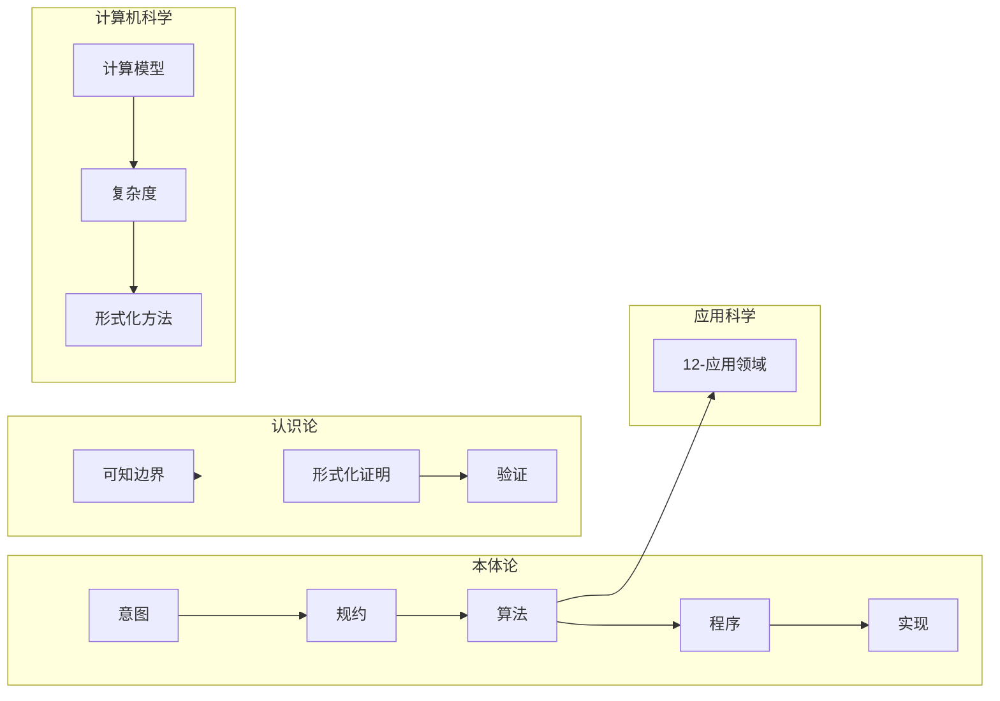
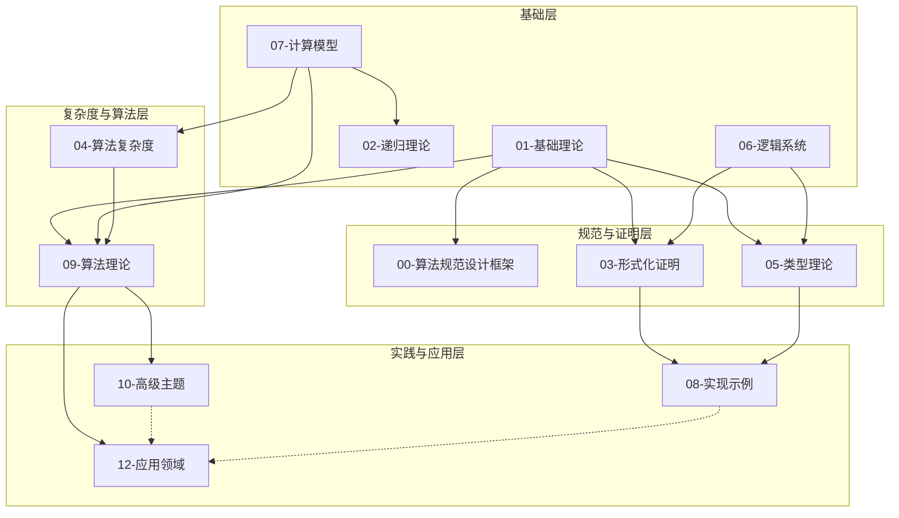

# 项目哲科结构说明

> **版本**: 1.0
> **创建日期**: 2025-02-02
> **关联文档**: [项目全面梳理-2025](项目全面梳理-2025.md)、[项目扩展与持续推进任务编排](项目扩展与持续推进任务编排)（第四节）
> **参考**: Stanford Encyclopedia of Philosophy — [The Philosophy of Computer Science](https://plato.stanford.edu/entries/computer-science/)；Formal Epistemology 等对本体系梳理的支撑。

---

## 一、说明与用途

本文档从**哲科认知结构**出发，将项目各主模块在本体论、认识论、应用科学、计算机科学四个维度上的侧重显式化，并给出模块间简化依赖关系，便于：

- 教师与学习者按「哲科」路径选读；
- 理解「算法」作为抽象实体与规约、程序、实现的关系；
- 将形式化证明与验证、复杂度下界等置于「知识与可知边界」的框架下。

---

## 二、四维框架简述

| 维度 | 含义 | 在本项目中的体现 |
|------|------|------------------|
| **本体论** | 存在与层次：何物存在、如何分层 | 计算系统各层次（规约、算法、程序、实现、硬件）；「算法」作为抽象实体与程序/实现的关系；局部最优与全局最优、可行解与最优解的存在性（09-03-01 算法优化、09-01-06/07 动态规划/贪心）。 |
| **认识论** | 知识与方法：如何获得与确证知识 | 形式化证明与验证作为「正确性知识」的来源；定理证明 vs 模型检测 vs 抽象解释的适用范围与局限；可判定性、复杂度下界与「可知」边界（03-形式化证明、09-04-03/15/19 验证理论）。 |
| **应用科学** | 在具体领域中的实例化与约束 | 算法在安全、医疗、金融、教育等领域的应用与约束；规范与模型在不同应用中的实例化（12-应用领域）。 |
| **计算机科学** | 计算模型、复杂度、形式化与工程 | 计算模型、复杂度类、形式化方法、工程实践（07-计算模型、04-算法复杂度、08-实现示例）。 |

**LoA（Level of Abstraction）术语**：SEP 采用「意图 (Intention) → 规约 (Specification) → 算法 (Algorithm) → 程序 (Program) → 实现 (Implementation)」的层次区分计算系统各层；算法作为抽象实体与程序/实现相区别，讨论规约与模型时可采用 LoA 方法。参见 [SEP: Philosophy of Computer Science](https://plato.stanford.edu/entries/computer-science/)。

### 2.1 SEP 与 LoA 原文要点（权威引用）

- **本体论**：SEP 分析计算系统的**分层本体**——计算制品 (computational artifacts)、软件与硬件、算法、程序与实现；意图与规约的关系、规约与函数的关系是核心论题。
- **认识论**：计算机科学作为知识的来源——方法论与认识论（如验证、测试、正确性概念）；与数学、工程、科学哲学的对照。
- **LoA**：Level of Abstraction 用于区分讨论层次（意图→规约→算法→程序→实现），避免混淆「算法」与「程序/实现」。

### 2.2 哲科四维流程图

以下为四维（本体论 / 认识论 / 应用科学 / 计算机科学）的简化示意；与 [项目扩展与持续推进任务编排](项目扩展与持续推进任务编排.md) §3.1 一致。

---

## 三、各主模块在四维中的侧重

| 项目模块 | 本体论 | 认识论 | 应用科学 | 计算机科学 |
|----------|--------|--------|----------|------------|
| **00-算法规范设计框架** | ★★★ 规约与模型的存在与层次 | ★★ 规范的可验证性 | ★ 规范在应用中的实例化 | ★★ 规范与实现衔接 |
| **01-基础理论** | ★★ 数学对象与结构 | ★★★ 形式化定义与证明作为知识基础 | ★ 数学在应用中的使用 | ★★ 数学服务于计算 |
| **02-递归理论** | ★★ 可计算函数与问题的存在性 | ★★★ 可判定性、不可判定性（可知边界） | ★ 可计算性在应用中的界限 | ★★★ 可计算性理论核心 |
| **03-形式化证明** | ★ 证明对象与层次 | ★★★ 正确性知识的来源与局限 | ★ 证明在应用中的适用性 | ★★★ 定理证明、模型检测、抽象解释 |
| **04-算法复杂度** | ★★ 问题与资源的存在性（时间/空间） | ★★★ 下界与「可知」边界 | ★ 复杂度在应用中的约束 | ★★★ 复杂度类、渐进分析 |
| **05-类型理论** | ★★★ 类型与项的存在与层次 | ★★★ 类型即命题、证明即程序 | ★ 类型在领域建模中的应用 | ★★★ 类型系统与证明助手 |
| **06-逻辑系统** | ★★ 公式、模型、可满足性的存在性 | ★★★ 推理与可证性 | ★ 逻辑在规范与验证中的应用 | ★★★ 逻辑与计算 |
| **07-计算模型** | ★★★ 图灵机、λ演算、自动机等抽象机器 | ★★ 可计算性、等价性 | ★ 模型在应用中的实例化 | ★★★ 计算理论核心 |
| **08-实现示例** | ★ 程序与实现作为规约的实例 | ★★ 验证与正确性 | ★★ 实现与工程实践 | ★★★ 语言与工具 |
| **09-算法理论** | ★★★ 算法类、最优解与可行解 | ★★★ 正确性证明、下界、近似性 | ★★ 算法在优化与 ML 中的应用 | ★★★ 算法设计与分析 |
| **10-高级主题** | ★★★ 范畴、同伦、量子等抽象结构 | ★★★ 高级证明与验证 | ★★★ 量子、ML、边缘等应用 | ★★★ 高级计算与形式化 |
| **11-国际化** | ★ 术语与概念的本体对齐 | ★★ 多语言知识表达 | ★ 国际化应用 | ★ 对标与资源链接 |
| **12-应用领域** | ★ 领域中的问题与解 | ★★ 领域约束下的正确性与可行性 | ★★★ 安全、医疗、金融、教育等 | ★★ 领域算法与系统 |

**图例**：★ 次要侧重；★★ 明显侧重；★★★ 核心侧重。

---

## 四、模块间简化依赖图

以下为**概念层面**的简化依赖，表示「学习或引用顺序」上的建议，非严格逻辑依赖。实线表示强建议先学，虚线表示可选或交叉参考。

**说明**：M02 为 02-递归理论，与 07-计算模型 紧密相关（可计算性）；11-国际化可与各模块平行使用，未在图中标出。

---

## 五、按哲科路径的选读建议

- **本体论导向**：00-算法规范设计框架 → 07-计算模型 → 05-类型理论 → 09-算法理论（最优解与可行解）→ 10-高级主题（范畴、同伦、量子）。
- **认识论导向**：01-基础理论（形式化定义）→ 03-形式化证明 → 04-算法复杂度（下界）→ 09-04-验证理论 → 08-Lean/形式化验证。
- **应用科学导向**：00 规范 → 09-01 算法基础 → 12-应用领域（按领域选读）；10-高级主题 中量子/ML/边缘等。
- **计算机科学导向**：07-计算模型 → 04-算法复杂度 → 09-算法理论 → 08-实现示例；03-形式化证明、05-类型理论 按需深入。

---

## 六、SEP 与 Formal Epistemology 参考

- **Stanford Encyclopedia of Philosophy — The Philosophy of Computer Science**
  [https://plato.stanford.edu/entries/computer-science/](https://plato.stanford.edu/entries/computer-science/)
  涵盖计算系统**本体论**（意图–规约–算法–程序–实现、计算制品、软件/硬件）、**规约与函数**、**程序与实现**、计算机科学的**认识论**地位（验证、测试、正确性）；与 00-算法规范设计框架、01-形式化定义、03-形式化证明 直接对应。LoA（Level of Abstraction）用于区分上述层次。
- **Formal Epistemology**（形式认识论）
  SEP 另有 Formal Epistemology 等条目，与「可知边界」、证明与验证作为知识来源的讨论相关；可选在 01-基础理论/00-计算哲学基础 中增加简短引用。

---

## 七、维护与扩展

- 本说明可并入 [项目全面梳理-2025](项目全面梳理-2025.md) 的「哲科维度」小节，或保持独立便于单独引用。
- 若模块结构调整，请同步更新「三、各主模块在四维中的侧重」与「四、模块间简化依赖图」。
- 与 [国际课程对标表](国际课程对标表.md)、[年度文献清单-2024-2025](年度文献清单-2024-2025.md) 等配合，支撑项目扩展与可持续维护。

---

**最后更新**: 2025-02-03
