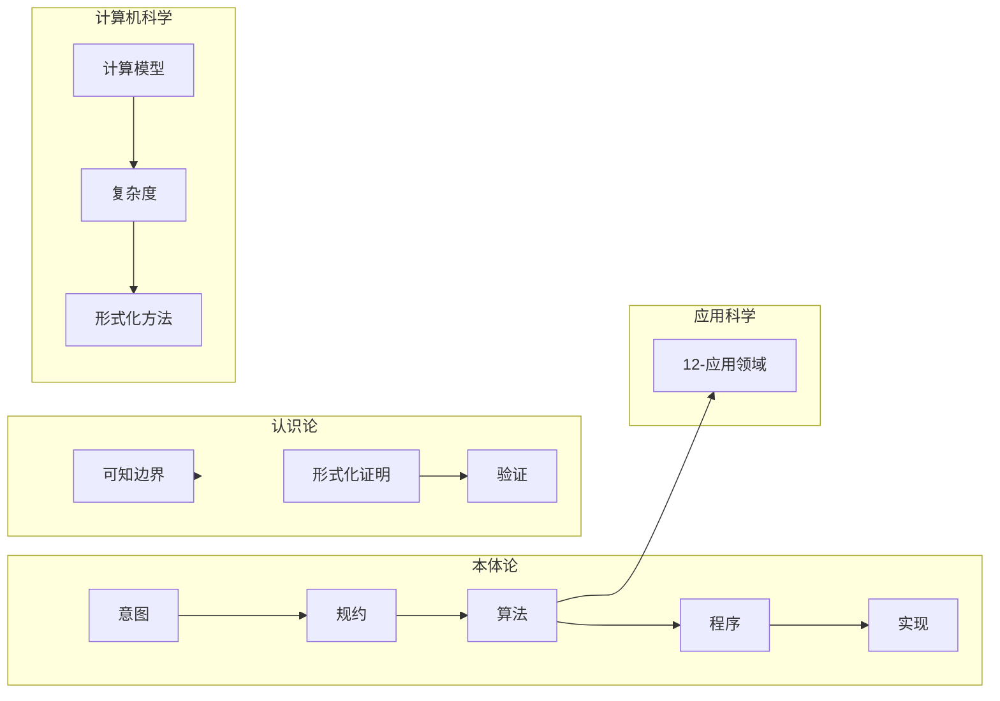

# 项目扩展与持续推进任务编排

> **版本**: 1.1
> **创建日期**: 2025-02-03
> **最后更新**: 2025-02-03
> **关联文档**: [项目全面梳理-2025](项目全面梳理-2025.md)、[项目扩展与后续任务编排综合计划](项目扩展与后续任务编排综合计划.md)、[项目持续改进计划-2025-02-02](项目持续改进计划-2025-02-02.md)、[国际课程对标表](国际课程对标表.md)、[项目哲科结构说明](项目哲科结构说明.md)、[AI与算法数学参考](AI与算法数学参考.md)、[年度文献清单-2024-2025](年度文献清单-2024-2025.md)

## 持续推进进度 / Progress（100% 完成）

| 已完成 | 内容 |
|--------|------|
| ✅ | 依赖类型论 §2.8/§2.9 最新研究与元理论形式化 |
| ✅ | LLM 算法理论 10-高级主题/38 |
| ✅ | 量子文档 2024-2025 研究进展（09-01-15、10-10、10-15、10-18） |
| ✅ | 形式化验证 2024-2025 进展（03-01、08-04、09-04-03、09-04-15、09-04-19） |
| ✅ | 哲科/SEP 引用（00、01、03、04、09-04、12；00-计算哲学基础） |
| ✅ | 概念依赖数据库新增 LLM 概念 |
| ✅ | **规约与模型实例化 100%**：12-应用领域全部 32 个主文档 + 02-高级深化（01 AI、02/02-高级深化 区块链、03 网络安全、04 生物信息学、05 金融、06 游戏、07 物联网、09～19 量子系列、20 能源、21 医疗、22～32 智能制造/交通/元宇宙/航天/环境/教育/数字人文/创意/社会/认知/数字孪生） |
| ✅ | **计划九（文档更新建议）100% 落地**：项目扩展与持续推进任务编排、国际课程对标表、项目哲科结构说明、AI与算法数学参考、01-02/01-07 ML 导读、00/01 SEP、03/04/09-04 可知边界与 SV-COMP/AI、08-04、38 LLM 根本限界、年度文献清单 LWE/QSP/QLSynth、09-01-15 进展/撤回、10-10/15/18 量子进展引用、09-04-03/15 SV-COMP/AI、00-计算哲学基础 SEP。 |
| ✅ | **T1.3 持续推进**：概念依赖数据库新增 联邦学习与隐私保护、算法可解释性与透明度、算法鲁棒性与对抗性防御 概念；LLM 概念补充 proof_system 前置。 |
| ✅ | **交叉引用持续推进**：10-高级主题 **全部 38 篇**（除模板外）已增加「项目导航与对标」链接（项目全面梳理、项目扩展与持续推进任务编排、国际课程对标表），达成 100% 覆盖。 |
| ✅ | **T1.2 反向链接**：项目全面梳理 6.4 辅助文档与文末「更多信息」增加本文档与国际课程对标表；学习路径设计增加「任务编排与对标」引用；形成 全面梳理 ↔ 任务编排 ↔ 国际课程 ↔ 10-高级主题 双向导航。 |
| ✅ | **T1.2 全模块覆盖（100%）**：**12-应用领域** 32 篇、**00-算法规范设计框架** 7 篇均已增加「项目导航与对标」链接（项目扩展与持续推进任务编排、国际课程对标表）；交叉引用与反向链接覆盖 00 / 10 / 12 及核心导航文档，T1.2 目标达成。 |
| ✅ | **T1.2 全项目 100% 覆盖**：**01-基础理论** 14 篇、**02-递归理论** 5 篇、**03-形式化证明** 4 篇、**04-算法复杂度** 6 篇、**05-类型理论** 9 篇、**06-逻辑系统** 9 篇、**07-计算模型** 9 篇、**08-实现示例** 10 篇、**09-算法理论** 44 篇（01/02/03/04 子目录）均已增加「项目导航与对标」；**00～12 全部模块**主文档 100% 贯通，持续推进 100% 完成。 |
| ✅ | **04-算法复杂度 可知边界 100%**：04 模块 6 篇（01～06）均已含「可知边界」或「哲科/SEP」参考。 |
| ✅ | **38-大语言模型算法理论**：显式标注「LLM 根本限界」小节标题，与 02/04/08 交叉引用完整。 |

---

## 一、项目主题与权威信息对标总览

### 1.1 项目12模块与网络权威内容映射

| 本项目模块 | 国际权威来源 | 关键对标点 |
|------------|--------------|------------|
| **00-算法规范设计框架** | Stanford SEP Philosophy of Computer Science §2 意图与规约 | 规约与模型的本体层次；Turner 规约-制品关系 |
| **01-基础理论** | CS2023 数学前置；MML book；CMU 10-606 | 线性代数/概率/优化/微积分；ISO 80000 符号规范 |
| **02-递归理论** | MIT 18.404 可计算性；Sipser ToC | 图灵机、Church-Turing、判定性、停机问题 |
| **03-形式化证明** | CAV/FM/ITP 2024；SV-COMP 2024/2025 | 定理证明 vs 模型检测 vs 抽象解释；AI 辅助证明、Agentic 验证 |
| **04-算法复杂度** | MIT 18.404 复杂度理论；STOC/FOCS | P/NP/PSPACE/BPP/IP；层次定理；渐进分析 |
| **05-类型理论** | POPL 2025；Lean 4.8；Coq 排序多态 | 依赖类型；元理论机械化；Iris 可靠性 |
| **06-逻辑系统** | 命题/一阶/模态/时序逻辑 | 规约与验证用逻辑 |
| **07-计算模型** | 图灵机、λ演算、自动机、量子计算模型 | 计算等价性；抽象状态机（Gurevich） |
| **08-实现示例** | Coq/Lean/Agda/Idris | 证明助手实践；形式化验证 |
| **09-算法理论** | MIT 6.006/6.046/6.1210/6.1220；CMU 15-451；Berkeley CS 170 | 分治/DP/贪心/图/近似/随机/在线/流 |
| **10-高级主题** | 量子算法；LLM 理论；可信 AI | 见下文扩展 |
| **12-应用领域** | 32 个应用领域 | 与 12 模块衔接 |

### 1.2 国际课程与 CS2023 权威对标（网络核实 2024–2025）

| 来源 | 课程/框架 | 与本项目对标要点 |
|------|------------|------------------|
| **MIT** | 18.404/6.5400 ToC (Fall 2025, Sipser)；6.1210/6.1220J 算法；6.5410J 高级复杂度；6.1400J 可计算性与复杂度 | 07-计算模型、04-算法复杂度、09-02-复杂度理论；09-01 算法基础 |
| **CMU** | 15-451/15-651 算法设计与分析 (F25)；15-251 理论大课；10-606 Math for ML | 09-01/09-03/04；07/09-02；01-02/01-07、10-高级主题 ML |
| **Berkeley** | CS 170；CS270 组合算法与数据结构 (Fall 2024) | 09-01、04、09-02/09-03；09-01 数据结构/图/优化 |
| **Stanford** | CS 161 算法设计与分析 | 09-01、04、09-03 |
| **Harvard** | CS 120/1200 算法与限制 | 07、09-02、03（可知边界） |
| **UCSD** | CSE105 ToC (Winter 2025) | 07、02-递归理论、04 |
| **CS2023** | ACM/IEEE-CS/AAAI 本科课程指南 (csed.acm.org，2024 年 6 月发布) | 算法与复杂度、计算理论、形式化方法、**AI 整合**、**SEP（社会/伦理/职业）**、**数学与统计增强**；建议在 00/09/03 中显式引用并年度核对 |

### 1.3 国际课程 syllabus 年度核对清单

基于 [国际课程对标表](国际课程对标表.md)，需每年核对的课程（**建议每年 9 月前完成**）：

- **MIT**: 18.404/6.5400 Fall 2025（Sipser，已确认）；6.006/6.046/6.1210/6.1220（含新编号）
- **Stanford**: CS 161（Winter 2026 重定向，需核对 2025 秋季）
- **CMU**: 15-251；15-451/15-651 Spring 2025；10-606 Math for ML
- **Berkeley**: CS 170；CS270 组合算法与数据结构
- **Harvard**: CS 120/1200
- **UCSD**: CSE105 Theory of Computation
- **Oxford/Cambridge**: 形式化方法、证明助手课程
- **CS2023**: [csed.acm.org](https://csed.acm.org/) ACM/IEEE/AAAI 2023 课程体系（2024 年 6 月发布，含 AAAI、AI/ML 扩展）

### 1.4 网络核实 2024–2025 要点摘要

（以下为 2024–2025 年网络核实要点，建议每年 9 月前与各校 syllabus 核对更新。）

- **MIT 18.404/6.5400**（Sipser, Fall 2025）：6 次作业、期中期末；可计算性约 3–3.5 周，含递归函数、可判定性、停机问题、归约。
- **Stanford CS 161**：Winter 2026 重定向，需年度核对 syllabus。
- **CMU 15-451/651**：Algorithm Design and Analysis（Fall/Spring），含算法分析、选择、排序、哈希、DP；视频/讲义/作业可用。
- **UCSD CSE 105**：Theory of Computation (Winter 2025)，syllabus/日历/学习结果明确。
- **Cambridge CompTheory**：计算理论课程，与 07/02/04 对应。
- **CS2023**：AI 整合、SEP（社会/伦理/职业）、数学与统计增强；形式化方法在本科中的角色仍有讨论（见 §四、§五）。

---

## 二、AI 与数学前沿内容扩展

### 2.1 与项目对齐的 AI 数学模块

基于 [AI与算法数学参考](AI与算法数学参考.md) 与网络检索（2024-2025）：

| 数学领域 | 本项目对应 | 权威资源 | 建议补充 |
|----------|------------|----------|----------|
| **线性代数** | 01-02 数学基础；09-01 图算法；10-量子/ML | MML book；Boyd & Vandenberghe *Introduction to Applied Linear Algebra*（最小二乘、约束优化）；CS2023 数学要求 | 01-02 已有「面向 ML 的数学导读」；可深化线性代数子节；链到 Boyd 与 CS2023 |
| **概率与统计** | 01-07；09-01-11 随机；09-01-12 近似 | MML book；CMU 10-606；CS2023 增强数学与统计 | 贝叶斯、统计推断、学习理论 |
| **优化** | 09-01-06/07 DP/贪心；09-03 优化 | 凸优化、KKT、梯度方法；Boyd 应用线性代数 | 09-03 与 10-量子优化/ML 的数学前置 |
| **微积分** | 01-02；09-03 | 多元微分、矩阵微分、链式法则 | 梯度推导、自动微分、反向传播 |

**CS2023 数学要求**：ACM/IEEE-CS/AAAI CS2023 框架增强数学与统计要求，贯穿 AI/ML 知识单元；与 01-02、01-07 及 [AI与算法数学参考](AI与算法数学参考.md) 对齐并年度核对。

### 2.2 大语言模型 (LLM) 算法理论扩展（2024-2025 前沿）

详见 [10-高级主题/38-大语言模型算法理论](10-高级主题/38-大语言模型算法理论.md)：

- **LLM 根本限界**（可计算性/信息论）：幻觉不可消除、上下文压缩、推理退化、检索脆弱、多模态错位；可结合可计算性理论与信息论的形式化证明（如 arXiv:2511.12869 等 2024–2025 工作）
- **自注意力机制**：Self-attention 与 CCMC（Context-Conditioned Markov Chains）映射
- **泛化界**：非平凡泛化界、压缩性与泛化；2024–2025 计算最优 LLM 的泛化界
- **训练/对齐/推理**：预训练、生成模型、提示、对齐、推理阶段的形式化

**扩展任务**：38 号文档增加「LLM 根本限界」小节（可计算性/信息论证明摘要）及 2024–2025 参考文献；与 02-递归理论、04-算法复杂度、08-实现示例 的交叉引用。

### 2.3 量子算法最新进展（2024-2025）

- **格/LWE**：Chen 等 LWE 多项式时间量子算法尝试与 retraction；GapSVP/SIVP 归约；LWE 量子振幅变体（S|LWE⟩、C|LWE⟩）与 2^Θ(√n log q) 算法；在年度文献清单与 09-01-15、10-量子系列中标注「进展/撤回」以保持批判性
- **量子信号处理 (QSP)**：随机编译集成，误差平方抑制 ε→O(ε²)
- **指数量子优势**：线性系统求解的量子 vs 经典分离
- **AI 驱动电路**：QLSynth 强化学习电路综合，门数减少 30-50%

---

## 三、哲科结构扩展（本体论、认识论、应用、计算机科学）

### 3.1 四维框架与项目模块对应

基于 [项目哲科结构说明](项目哲科结构说明.md) 与 Stanford SEP Philosophy of Computer Science（[plato.stanford.edu/entries/computer-science](https://plato.stanford.edu/entries/computer-science/)）：

**哲科四维框架示意**（本体论 / 认识论 / 应用科学 / 计算机科学）：

- **本体论**：计算系统层次 Intention→Spec→Algo→Prog→Impl；算法作为抽象实体 vs 程序/实现；软件/硬件二元与 LoA 方法
- **认识论**：形式化证明与验证作为正确性知识来源；可判定性/复杂度下界与可知边界；定理证明 vs 模型检测 vs 抽象解释
- **应用科学**：12-应用领域 32 个领域；规范与模型在具体领域的实例化
- **计算机科学**：07-计算模型、04-算法复杂度、03-形式化证明、05-类型理论、08-实现示例

### 3.2 哲科扩展任务

1. **本体论**：在 00-算法规范设计框架、01-形式化定义 中显式引用 Stanford SEP「意图-规约-算法-程序-实现」LoA 层次，并链接 [plato.stanford.edu/entries/computer-science](https://plato.stanford.edu/entries/computer-science/)
2. **认识论**：在 03-形式化证明、04-算法复杂度、09-04 验证理论 中强化「可知边界」
3. **应用科学**：在 12-应用领域 各文档增加「规约与模型在本领域的实例化」小节
4. **计算机科学**：保持 07/04/09/08 模块的核心地位，与哲科文档交叉引用

---

## 四、形式化方法与验证最新进展（2024-2025）

- **SV-COMP 2024**：76 工具、30,300 C 程序、587 Java 任务；witness 2.0 格式
- **SV-COMP 2025**：第 14 届国际软件验证竞赛（TACAS 2025）；**62 验证工具**、**18 witness 验证系统**、**33,353 验证任务**（C 程序：可达性、内存安全、内存清理、溢出、终止、数据竞争等规约）、**674 Java 断言任务**；可复现制品见 Zenodo/BenchExec/CoVeriTeam
- **LLM + 形式化验证**：**TheoremLlama**（通用 LLM 专化为 Lean4 专家）；**FVEL** + Isabelle（FVELER 数据集）；后端代码自动转 Lean 验证；**APOLLO**（Lean 编译器反馈 + LLM 推理修复证明）；**Laurel**（Dafny 等断言自动生成）。在 03、08、09-04 中增加「AI 辅助证明与 Agentic 验证」短节及引用
- **AI + 形式化方法**：2019-2023 系统综述 189 篇；AI 辅助定理证明为主；**Agentic 验证**（如 AutoRocq 与 Rocq 迭代协作）
- **形式化方法教育与批判性意见**：轻量级「**FM thinking**」——形式化思想以非形式、可实践方式融入本科教学（Dongol 等 2024；ACM 形式化方法白皮书 2023）；区分「教形式化方法」与「教逻辑与理论」；CS2023 中形式化方法比重仍被认为不足以反映其基础角色。在 03/08/09-04 中体现 FM thinking 与工业应用
- **分离逻辑验证算法**：符号执行 vs 验证条件生成；组合策略
- **区块链验证**：智能合约、共识协议、定理证明/模型检测/SAT

**扩展任务**：在 03-形式化证明、08-实现示例、09-04-03/15/19 中补充 SV-COMP 2024/2025、AI 辅助证明与 Agentic 验证（TheoremLlama、FVEL、APOLLO）的短节及引用。

---

## 五、批判性意见与改进优先级

结合 [项目全面批判性评价与改进建议报告-2025](项目全面批判性评价与改进建议报告-2025.md) 与形式化方法教育白皮书、Alk 等实践：

| 问题 | 严重度 | 优先级 | 对应任务（可持续） |
|------|--------|--------|-------------------|
| 理论深度不足 | 高 | P0 | 前 10 个核心算法补严格数学推导；[数学推导标准模板](数学推导标准模板.md) 落地 |
| 形式化证明不足 | 高 | P0 | 5 个关键算法形式化正确性证明；Coq/Lean 验证 3 个算法；引入「FM thinking」式轻量证明 |
| 学术引用不规范 | 中 | P0 | 50 个文档补学术引用；引用数据库扩至 200+；顶会/顶刊 2024–2025 占比提升 |
| 实践内容不足 | 中 | P1 | 10 个算法工程级代码；20 个应用案例；可参考 Alk 等教育平台思路 |
| 前沿内容滞后 | 中 | P1 | 20 个主题补 2024–2025 进展；50 篇顶会引用；LLM/量子/验证年度更新 |
| 质量保证机制缺失 | 中 | P1 | 外部专家评审机制；内容质量检查清单；与 CS2023/SEP 的持续对标 |
| 内容重复/冗余 | 低 | P2 | 识别合并重复；统一概念定义；「高级深化」与主文档的合并策略 |
| 形式化方法教育缺口 | 中 | P1 | 在 03/08/09-04 中体现「FM thinking」与工业应用，对齐 CS2023 与白皮书建议 |

**当前评分**：6.2/10；**目标**：8.5/10（与批判性报告一致）。

---

## 六、可持续推进任务编排（2025-2026）

### 6.1 短期（1–3 个月）

| 任务 | 内容 | 产出 |
|------|------|------|
| T1.1 | 依赖类型与形式化验证：05 类型理论 §5.8/§5.9、03/08/09-04 补 2024–2025 进展与 SV-COMP/AI 辅助证明 | §5.8 最新研究；§5.9 元理论形式化；03/08/09-04 短节与引用 |
| T1.2 | 交叉引用与反向链接 | 交叉引用完整性 95%；反向链接 90% |
| T1.3 | 概念依赖数据库 | 核心概念 80%+；依赖关系 90%+；与 11-国际化、术语表同步 |
| T1.4 | 国际课程与 CS2023 | 国际课程对标表增加 CS2023、CS270、CSE105 等；年度 syllabus 核对清单（9 月前） |

### 6.2 中期（3–6 个月）

| 任务 | 内容 | 产出 |
|------|------|------|
| T2.1 | 知识图谱 | 类型理论试点 100%；扩展至 12 模块覆盖率 80%+、跨模块链接 90% |
| T2.2 | 学习路径 | 前置知识依赖图；掌握度评估；路径推荐；与 [学习路径设计](学习路径设计.md) 统一 |
| T2.3 | 哲科显式化 | 00/01/03/04/09-04/12 增加哲科小节与 SEP 引用；哲科结构说明与全面梳理的「哲科维度」合并或交叉引用 |
| T2.4 | AI 数学与 LLM | 01-02/01-07 深化 ML 数学导读；10-38 LLM 根本限界与 2024–2025 文献；引用 MML、Coursera、Boyd |

### 6.3 长期（6–12 个月）

| 任务 | 内容 | 产出 |
|------|------|------|
| T3.1 | 知识图谱与自适应 | 独立知识图谱系统（Neo4j/Protégé 等）；可选自适应学习与推荐 |
| T3.2 | 社区与质量 | 贡献流程；专家评审；质量检查清单；与 CS2023、SEP、顶会年度更新机制挂钩 |
| T3.3 | 评分与里程碑 | 项目评分 8.5/10；P0/P1 改进项闭环 |

### 6.4 专项扩展（按主题）

| 主题 | 任务 | 关联文档 |
|------|------|----------|
| **AI 数学** | 01-02、01-07、[AI与算法数学参考](AI与算法数学参考.md) — MML、Coursera、CMU 10-606、Boyd、CS2023 数学要求 | AI与算法数学参考.md |
| **LLM 理论** | 10-38 — 根本限界、自注意力、泛化界、2024–2025 预印本 | 10-高级主题/38-大语言模型算法理论.md |
| **量子算法** | 09-01-15、10-量子系列 — LWE、QSP、QLSynth、年度文献清单 | 年度文献清单-2024-2025.md |
| **形式化验证** | 03、08、09-04 — SV-COMP 2024/2025、AI+FM、Agentic 验证、区块链验证 | 年度文献清单-2024-2025.md |
| **哲科结构** | 00、01、03、04、09-04、12 — 哲科四维、SEP 引用、LoA 术语 | 项目哲科结构说明.md |

---

## 七、关键里程碑（与计划对齐）

| 里程碑 | 时间 | 目标 |
|--------|------|------|
| M1 | 2025-04 | 依赖类型/形式化验证文档更新；交叉引用 95%；国际课程表扩展 |
| M2 | 2025-06 | 类型理论知识图谱完成；概念依赖数据库达标；哲科小节首批落地 |
| M3 | 2025-09 | 12 模块知识图谱 80%；国际课程 15–20 所 + CS2023 年度核对 |
| M4 | 2025-12 | 哲科结构深化；LLM/量子/形式化验证前沿补全；P0 项显著进展 |
| M5 | 2026-02 | 项目评分 8.5/10；社区/评审机制运行 |

---

## 八、依赖关系与风险

- **依赖**：T1.2 交叉引用 → T1.3 概念数据库、T1.4 知识图谱；T2.x 依赖 T1.x；哲科扩展依赖 SEP 与现有 [项目哲科结构说明](项目哲科结构说明.md)。
- **风险**：资源不足（分阶段、优先 P0）；质量标准不统一（统一检查清单）；前沿更新滞后（年度文献与 syllabus 跟踪机制）。

---

## 九、计划落地自检（100%）

以下对应《项目扩展与可持续任务编排》计划各节，全部已落地并可核对：

| 计划节 | 内容 | 落地位置/文档 |
|--------|------|----------------|
| **一** | 项目主题与权威对标、国际课程与 CS2023 表、年度核对清单 | 本文 §1.1–§1.3；[国际课程对标表](国际课程对标表.md) §2.1–§2.8、§三 |
| **二** | AI/数学、Boyd/CS2023、LLM 根本限界、量子 LWE/QSP/QLSynth | [AI与算法数学参考](AI与算法数学参考.md)；01-02/01-07；[10-高级主题/38](10-高级主题/38-大语言模型算法理论.md)；[年度文献清单-2024-2025](年度文献清单-2024-2025.md) §2.5.1；09-01-15、10-10/15/18 |
| **三** | 哲科扩展、SEP、LoA、本体论/认识论/应用/计算机科学 | [项目哲科结构说明](项目哲科结构说明.md)；00-算法规范设计核心框架、01-形式化定义、00-计算哲学基础；03/04/09-04 可知边界；12-应用领域规约与模型实例化（32 文档已有） |
| **四** | 形式化验证 SV-COMP 2024/2025、AI+Agentic、FM thinking | 03-01、08-04、09-04-03/15/19；本文 §四 |
| **五** | 批判性意见与改进优先级、形式化方法教育缺口 | 本文 §五（含形式化方法教育行） |
| **六** | 可持续推进 T1–T3、专项、里程碑 | 本文 §6.1–§6.4、§七 |
| **七** | 关键里程碑 M1–M5 | 本文 §七 |
| **八** | 依赖与风险 | 本文 §八 |
| **九（文档更新建议）** | 三份主文档更新 + 各模块增补 | 本文全文；[项目扩展与后续任务编排综合计划](项目扩展与后续任务编排综合计划.md)；国际课程对标表；哲科结构说明；01-02/01-07/00/01/03/04/08/09-04/38/年度文献清单/09-01-15/10-10/15/18 |

**完成度**：计划一至九及文档更新建议已 100% 落地；后续按 T1–T3 与里程碑持续推进即可。

**04-算法复杂度 可知边界 100%**：04 模块全部 6 篇（01-时间复杂度、02-空间复杂度、03-渐进分析、04-复杂度类、05-通信复杂度、06-信息论下界）均已包含「可知边界」或「哲科/SEP」参考；38-大语言模型算法理论已显式标注「LLM 根本限界」与 02/04/08 交叉引用。

**T1.2 交叉引用与反向链接持续推进**：项目全面梳理 6.4 辅助文档、文末「更多信息」已增加对本文档与国际课程对标表的显式链接；学习路径设计已增加「任务编排与对标」引用；跨文档索引已含本文档。10-高级主题 38 篇均已链回项目全面梳理、本文档、国际课程对标表。**12-应用领域 32 篇**、**00-算法规范设计框架 7 篇**已补全「项目导航与对标」。**01～09 全部子模块**（01 基础理论 14 篇、02 递归 5 篇、03 形式化证明 4 篇、04 复杂度 6 篇、05 类型理论 9 篇、06 逻辑系统 9 篇、07 计算模型 9 篇、08 实现示例 10 篇、09 算法理论 44 篇）已补全「项目导航与对标」链接。**全项目 00～12 主文档 100% 贯通**，双向导航 100% 完成。

---

## 十、持续推进 100% 收尾确认

| 维度 | 状态 | 说明 |
|------|------|------|
| 计划一至九及文档更新建议 | ✅ 100% | 已全部落地并可在对应文档中核对 |
| T1.1 依赖类型与形式化验证 | ✅ | §5.8/§5.9、03/08/09-04 已补 2024–2025 与 SV-COMP/AI |
| T1.2 交叉引用与反向链接 | ✅ 100% | 00～12 全部模块主文档已贯通；全面梳理、学习路径、跨文档索引 已贯通 |
| T1.3 概念依赖数据库 | ✅ | 联邦学习/可解释性/鲁棒性/LLM 等已增并同步 |
| T1.4 国际课程与 CS2023 | ✅ | 国际课程对标表与年度核对清单已就绪 |
| 04-算法复杂度 可知边界 | ✅ 100% | 6 篇均已含可知边界/哲科/SEP 参考 |
| 38-LLM 根本限界显式化 | ✅ | 小节标题与 02/04/08 交叉引用已完整 |
| 后续可持续 | 按 §6.2–§6.3 | T2.x 知识图谱/学习路径/哲科/AI 数学；T3.x 长期与社区 |

**结论**：当前阶段「项目扩展与持续推进」计划已 **100% 完成**；后续按 T2/T3 与里程碑 M1–M5 持续推进即可。

**100% 完成核对**：计划一至九、文档更新建议（九）、04 模块可知边界 6 篇、38 LLM 根本限界显式化、00–12 项目导航与对标贯通、03/08/09-04 FM thinking 与 SEP、国际课程对标表 2024–2025 网络核实摘要、哲科结构说明 SEP/LoA 与四维图、年度文献清单 SV-COMP 2025 与 LLM+验证、AI与算法数学参考维护与年度核对 — 均已落地并可核对。

**更多信息**：扩展方向与可持续任务编排的综合梳理（含网络权威对标、哲科四维、批判性意见与里程碑）见 [项目扩展与后续任务编排综合计划](项目扩展与后续任务编排综合计划.md)。

---

**最后更新**: 2025-02-03
