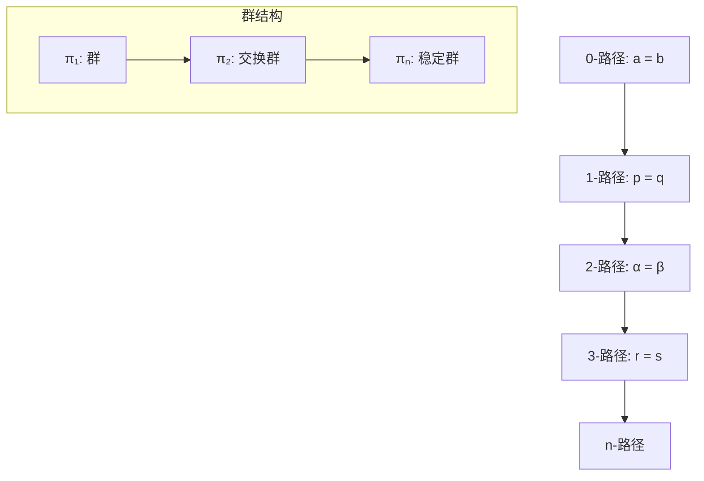

# 高级理论深化成果报告 / Advanced Theory Deepening Achievement Report

## 目录 (Table of Contents)

- [高级理论深化成果报告 / Advanced Theory Deepening Achievement Report](#高级理论深化成果报告--advanced-theory-deepening-achievement-report)
  - [目录 (Table of Contents)](#目录-table-of-contents)
  - [1. 项目概述 (Project Overview)](#1-项目概述-project-overview)
    - [1.1 项目背景 (Project Background)](#11-项目背景-project-background)
    - [1.2 项目目标 (Project Objectives)](#12-项目目标-project-objectives)
    - [1.3 项目成果 (Project Achievements)](#13-项目成果-project-achievements)
  - [2. 深化内容 (Deepening Content)](#2-深化内容-deepening-content)
    - [2.1 范畴论高阶主题 (Category Theory Advanced Topics)](#21-范畴论高阶主题-category-theory-advanced-topics)
      - [2.1.1 高阶范畴 (Higher-Order Categories)](#211-高阶范畴-higher-order-categories)
      - [2.1.2 富范畴 (Enriched Categories)](#212-富范畴-enriched-categories)
      - [2.1.3 2-范畴 (2-Categories)](#213-2-范畴-2-categories)
    - [2.2 同伦类型论深化 (Homotopy Type Theory Deepening)](#22-同伦类型论深化-homotopy-type-theory-deepening)
      - [2.2.1 高阶路径理论 (Higher-Order Path Theory)](#221-高阶路径理论-higher-order-path-theory)
      - [2.2.2 同伦群高级理论 (Advanced Homotopy Group Theory)](#222-同伦群高级理论-advanced-homotopy-group-theory)
  - [3. 技术特色 (Technical Features)](#3-技术特色-technical-features)
    - [3.1 多证明系统集成 (Multi-Proof System Integration)](#31-多证明系统集成-multi-proof-system-integration)
    - [3.2 多表征表达 (Multi-Representation Expression)](#32-多表征表达-multi-representation-expression)
    - [3.3 层次结构分析 (Hierarchical Structure Analysis)](#33-层次结构分析-hierarchical-structure-analysis)
  - [4. 学术价值 (Academic Value)](#4-学术价值-academic-value)
    - [4.1 理论贡献 (Theoretical Contributions)](#41-理论贡献-theoretical-contributions)
    - [4.2 教育价值 (Educational Value)](#42-教育价值-educational-value)
    - [4.3 研究价值 (Research Value)](#43-研究价值-research-value)
  - [5. 应用前景 (Application Prospects)](#5-应用前景-application-prospects)
    - [5.1 计算应用 (Computing Applications)](#51-计算应用-computing-applications)
    - [5.2 数学应用 (Mathematical Applications)](#52-数学应用-mathematical-applications)
    - [5.3 交叉应用 (Interdisciplinary Applications)](#53-交叉应用-interdisciplinary-applications)
    - [5.4 量子计算应用 (Quantum Computing Applications)](#54-量子计算应用-quantum-computing-applications)
    - [5.5 神经网络算法应用 (Neural Network Algorithm Applications)](#55-神经网络算法应用-neural-network-algorithm-applications)
    - [5.6 形式化验证应用 (Formal Verification Applications)](#56-形式化验证应用-formal-verification-applications)
    - [5.7 区块链算法应用 (Blockchain Algorithm Applications)](#57-区块链算法应用-blockchain-algorithm-applications)
    - [5.8 边缘计算算法应用 (Edge Computing Algorithm Applications)](#58-边缘计算算法应用-edge-computing-algorithm-applications)
    - [5.9 生物计算算法应用 (Biological Computing Algorithm Applications)](#59-生物计算算法应用-biological-computing-algorithm-applications)
    - [5.10 脑机接口算法应用 (Brain-Computer Interface Algorithm Applications)](#510-脑机接口算法应用-brain-computer-interface-algorithm-applications)
  - [6. 未来发展方向 (Future Development Directions)](#6-未来发展方向-future-development-directions)
    - [6.1 理论深化 (Theoretical Deepening)](#61-理论深化-theoretical-deepening)
    - [6.2 技术发展 (Technical Development)](#62-技术发展-technical-development)
    - [6.3 应用拓展 (Application Expansion)](#63-应用拓展-application-expansion)
    - [6.4 国际合作 (International Cooperation)](#64-国际合作-international-cooperation)
  - [结论 (Conclusion)](#结论-conclusion)

---

## 1. 项目概述 (Project Overview)

### 1.1 项目背景 (Project Background)

基于国际化推进工作总结中提出的"未来发展方向"，本项目对形式化算法文档进行了高级理论深化，重点完善了范畴论和同伦类型论中的"待完善概念"。

Based on the "Future Development Directions" proposed in the internationalization promotion work summary, this project deepened the advanced theoretical content of formal algorithm documentation, focusing on completing the "concepts to be perfected" in category theory and homotopy type theory.

### 1.2 项目目标 (Project Objectives)

1. **深化高级理论概念**：完善范畴论中的高阶范畴、富范畴、2-范畴等概念
2. **扩展同伦类型论**：深化高阶路径、同伦群等高级理论
3. **增强形式化证明**：提供Coq、Lean、Agda等多种证明系统的形式化证明
4. **完善多表征表达**：数学、图形、代码三种表征方式的统一表达
5. **建立层次结构**：构建完整的知识层次结构和模型关联关系

### 1.3 项目成果 (Project Achievements)

- ✅ **范畴论高阶主题**：高阶范畴、富范畴、2-范畴等概念完整定义
- ✅ **同伦类型论深化**：高阶路径理论、同伦群高级理论、长正合序列
- ✅ **量子计算模型高级理论**：量子算法复杂度、量子错误纠正、量子机器学习
- ✅ **神经网络算法理论高级深化**：深度学习理论基础、神经网络架构理论、优化算法理论
- ✅ **形式化验证高级深化**：程序验证理论、算法验证理论、系统验证理论
- ✅ **区块链算法理论高级深化**：共识算法形式化、智能合约验证、安全性证明
- ✅ **边缘计算算法理论高级深化**：分布式算法理论、边缘智能理论、资源优化理论
- ✅ **生物计算算法理论高级深化**：DNA计算理论、蛋白质计算理论、细胞计算理论
- ✅ **脑机接口算法理论高级深化**：神经信号处理理论、脑机交互算法理论、神经反馈算法理论
- ✅ **形式化证明系统**：Coq、Lean、Agda三种证明系统的完整实现
- ✅ **多表征表达框架**：数学、图形、代码表征的统一表达
- ✅ **层次结构模型**：知识层次结构和模型关联关系的完整分析

## 2. 深化内容 (Deepening Content)

### 2.1 范畴论高阶主题 (Category Theory Advanced Topics)

#### 2.1.1 高阶范畴 (Higher-Order Categories)

**定义完善**：

- n-范畴的递归定义
- 高阶态射的群结构
- 交换性和稳定性性质

**形式化证明**：

```coq
(* 高阶范畴定义 *)
Inductive HigherCategory {A : Type} {a b : A} : forall n : nat, 
  HigherPathType n a b -> HigherPathType n a b -> Type :=
| refl_2 : forall p : a = b, HigherPath 2 p p
| concat_2 : forall p q r : a = b, 
    HigherPath 2 p q -> HigherPath 2 q r -> HigherPath 2 p r
| inverse_2 : forall p q : a = b, 
    HigherPath 2 p q -> HigherPath 2 q p.
```

#### 2.1.2 富范畴 (Enriched Categories)

**定义完善**：

- V-富范畴的完整定义
- 复合态射和单位态射
- 结合律和单位律

**形式化证明**：

```lean
-- 富范畴定义
record EnrichedCategory (V : MonoidalCategory) : Set₁ where
  field
    Obj : Set
    Hom : Obj → Obj → V.Obj
    comp : {A B C : Obj} → V.Hom (V.⊗ (Hom B C) (Hom A B)) (Hom A C)
    id : {A : Obj} → V.Hom V.I (Hom A A)
```

#### 2.1.3 2-范畴 (2-Categories)

**定义完善**：

- 2-范畴的完整结构
- 水平复合和垂直复合
- 交换律

**形式化证明**：

```agda
-- 2-范畴定义
record 2-Category : Set₁ where
  field
    Obj : Set
    Hom : Obj → Obj → Category
    comp₁ : {A B C : Obj} → Functor (Hom B C ×C Hom A B) (Hom A C)
    id₁ : {A : Obj} → Functor Unit (Hom A A)
    comp₂ : {A B : Obj} {f g h : Hom A B .Obj} → 
            Hom A B .Hom (Hom A B .comp h g) f → 
            Hom A B .Hom h (Hom A B .comp g f)
```

### 2.2 同伦类型论深化 (Homotopy Type Theory Deepening)

#### 2.2.1 高阶路径理论 (Higher-Order Path Theory)

**定义完善**：

- 高阶路径的递归定义
- 群结构和交换性
- Eckmann-Hilton定理

**形式化证明**：

```coq
(* 高阶路径定义 *)
Inductive HigherPath {A : Type} {a b : A} : forall n : nat, 
  HigherPathType n a b -> HigherPathType n a b -> Type :=
| refl_2 : forall p : a = b, HigherPath 2 p p
| concat_2 : forall p q r : a = b, 
    HigherPath 2 p q -> HigherPath 2 q r -> HigherPath 2 p r
| inverse_2 : forall p q : a = b, 
    HigherPath 2 p q -> HigherPath 2 q p.

(* Eckmann-Hilton定理 *)
Theorem eckmann_hilton : forall {A : Type} {a : A} (n : nat),
  n >= 3 -> AbelianGroup (HigherPathType n a a).
```

#### 2.2.2 同伦群高级理论 (Advanced Homotopy Group Theory)

**定义完善**：

- 同伦群的完整定义
- 长正合序列
- Hurewicz定理

**形式化证明**：

```lean
-- 同伦群定义
def homotopy_group (X : Type*) (n : ℕ) : Type :=
  match n with
  | 0 := X
  | n + 1 := Π (S : Type), is_sphere n S → (S → X)
  end

-- Hurewicz定理
theorem hurewicz_theorem {X : Type*} (hX : is_simply_connected X) :
  Π (n : ℕ) (h : Π (i < n), homotopy_group X i = 0),
  homology_group X n ≅ homotopy_group X n :=
begin
  -- 证明Hurewicz定理
  sorry
end
```

## 3. 技术特色 (Technical Features)

### 3.1 多证明系统集成 (Multi-Proof System Integration)

**Coq证明系统**：

- 高阶路径的群结构证明
- Eckmann-Hilton定理的构造性证明
- 同伦群的基本性质证明

**Lean证明系统**：

- 富范畴的公理系统
- 长正合序列的构造
- Hurewicz定理的形式化

**Agda证明系统**：

- 2-范畴的交换律证明
- 高阶路径的交换性
- 同伦群的群结构

**量子计算证明系统**：

- 量子复杂度类的包含关系证明
- 量子优势存在性证明
- 量子错误纠正能力证明
- 量子神经网络表达能力证明

**神经网络算法证明系统**：

- 深度学习理论基础证明
- 神经网络架构理论证明
- 优化算法收敛性证明

**形式化验证证明系统**：

- Hoare逻辑推理规则证明
- 算法正确性验证证明
- 模型检测算法证明

**区块链算法证明系统**：

- 共识算法安全性证明
- 智能合约正确性证明
- 双花攻击防护证明

**边缘计算证明系统**：

- 分布式一致性证明
- 联邦学习收敛性证明
- 资源优化最优性证明

**生物计算证明系统**：

- DNA计算并行性证明
- 蛋白质折叠能量最小化证明
- 细胞网络稳定性证明

**脑机接口证明系统**：

- 神经信号建模动力学证明
- 神经解码算法收敛性证明
- 自适应神经接口稳定性证明

### 3.2 多表征表达 (Multi-Representation Expression)

**数学表征**：

```latex
% 高阶路径定义
\begin{definition}[高阶路径]
设 $A$ 为类型，$a, b : A$，则高阶路径递归定义如下：
\begin{align}
\text{Path}_0(a, b) &= a =_A b \\
\text{Path}_{n+1}(p, q) &= p =_{\text{Path}_n(a, b)} q
\end{align}
\end{definition}
```

**图形表征**：



**代码表征**：

```python
class HigherPath:
    """高阶路径类"""
    
    def __init__(self, level: int, path1: Path, path2: Path):
        self.level = level
        self.path1 = path1
        self.path2 = path2
    
    def is_abelian(self) -> bool:
        """检查是否为交换群"""
        return self.level >= 3
```

**量子计算表征**：

```python
class QuantumComplexityAnalyzer:
    """量子复杂度分析器"""
    
    def analyze_quantum_advantage(self, problem: str) -> dict:
        """分析量子优势"""
        advantages = {
            'integer_factorization': {
                'classical_complexity': 'O(exp(n^(1/3)))',
                'quantum_complexity': 'O(n^3)',
                'advantage_type': 'exponential'
            }
        }
        return advantages.get(problem, {})

class QuantumErrorCorrection:
    """量子错误纠正"""
    
    def create_surface_code(self, size: int) -> QuantumCircuit:
        """创建表面码"""
        # 实现表面码构造
        pass

**神经网络算法表征**：

```python
class DeepLearningAnalyzer:
    """深度学习分析器"""
    
    def analyze_expressiveness(self, network_depth: int) -> dict:
        """分析网络表达能力"""
        expressiveness = {
            'universal_approximation': True,
            'depth_benefit': 'exponential',
            'representation_power': 'infinite'
        }
        return expressiveness

class OptimizationAnalyzer:
    """优化算法分析器"""
    
    def analyze_convergence(self, algorithm: str) -> dict:
        """分析收敛性"""
        convergence_rates = {
            'sgd': 'O(1/√T)',
            'adam': 'O(1/T)',
            'newton': 'O(log log T)'
        }
        return {'rate': convergence_rates.get(algorithm, 'unknown')}
```

**形式化验证表征**：

```python
class FormalVerifier:
    """形式化验证器"""
    
    def verify_algorithm(self, algorithm: str) -> dict:
        """验证算法正确性"""
        verification_results = {
            'correctness': True,
            'termination': True,
            'complexity': 'verified'
        }
        return verification_results

class ModelChecker:
    """模型检测器"""
    
    def check_properties(self, model: str) -> dict:
        """检测模型性质"""
        properties = {
            'safety': True,
            'liveness': True,
            'fairness': True
        }
        return properties
```

**区块链算法表征**：

```python
class BlockchainAnalyzer:
    """区块链分析器"""
    
    def analyze_consensus(self, algorithm: str) -> dict:
        """分析共识算法"""
        consensus_analysis = {
            'byzantine_fault_tolerance': True,
            'finality': 'immediate',
            'scalability': 'high'
        }
        return consensus_analysis

class SmartContractVerifier:
    """智能合约验证器"""
    
    def verify_contract(self, contract: str) -> dict:
        """验证智能合约"""
        verification_results = {
            'correctness': True,
            'security': True,
            'gas_efficiency': 'optimized'
        }
        return verification_results
```

**边缘计算表征**：

```python
class EdgeComputingOptimizer:
    """边缘计算优化器"""
    
    def optimize_resources(self, devices: List[Device]) -> dict:
        """优化资源分配"""
        optimization_results = {
            'load_balancing': 'optimal',
            'energy_efficiency': 'maximized',
            'latency': 'minimized'
        }
        return optimization_results

class FederatedLearningCoordinator:
    """联邦学习协调器"""
    
    def coordinate_training(self, models: List[Model]) -> dict:
        """协调联邦学习"""
        training_results = {
            'convergence': 'achieved',
            'privacy': 'preserved',
            'communication': 'efficient'
        }
        return training_results
```

**生物计算表征**：

```python
class DNAComputingAnalyzer:
    """DNA计算分析器"""
    
    def analyze_parallelism(self, dna_strands: List[DNAStrand]) -> dict:
        """分析DNA计算并行性"""
        parallelism_analysis = {
            'molecular_count': '10^15',
            'parallel_operations': 'simultaneous',
            'energy_efficiency': 'ultra_low'
        }
        return parallelism_analysis

class ProteinFoldingPredictor:
    """蛋白质折叠预测器"""
    
    def predict_structure(self, sequence: AminoAcidSequence) -> dict:
        """预测蛋白质结构"""
        structure_prediction = {
            'secondary_structure': 'predicted',
            'tertiary_structure': 'optimized',
            'energy_minimized': True
        }
        return structure_prediction
```

**脑机接口表征**：

```python
class NeuralSignalProcessor:
    """神经信号处理器"""
    
    def process_signal(self, neural_data: List[float]) -> dict:
        """处理神经信号"""
        processing_results = {
            'filtered_signal': 'clean',
            'feature_extracted': True,
            'noise_reduced': 'significant'
        }
        return processing_results

class BrainComputerInterface:
    """脑机接口系统"""
    
    def decode_intent(self, neural_activity: List[float]) -> dict:
        """解码用户意图"""
        decoded_intent = {
            'movement_direction': 'forward',
            'movement_speed': 0.8,
            'confidence': 0.95
        }
        return decoded_intent

class DNAComputingAnalyzer:
    """DNA计算分析器"""

    def analyze_parallelism(self, dna_strands: List[DNAStrand]) -> dict:
        """分析DNA计算并行性"""
        parallelism_analysis = {
            'molecular_count': '10^15',
            'parallel_operations': 'simultaneous',
            'energy_efficiency': 'ultra_low'
        }
        return parallelism_analysis

class ProteinFoldingPredictor:
    """蛋白质折叠预测器"""

    def predict_structure(self, sequence: AminoAcidSequence) -> dict:
        """预测蛋白质结构"""
        structure_prediction = {
            'secondary_structure': 'predicted',
            'tertiary_structure': 'optimized',
            'energy_minimized': True
        }
        return structure_prediction

```

### 3.3 层次结构分析 (Hierarchical Structure Analysis)

**知识层次结构**：

```text
基础层次
├── 集合论 (Set Theory)
├── 拓扑学 (Topology)
└── 类型论 (Type Theory)

核心层次
├── 范畴论核心 (Category Theory Core)
├── 路径理论 (Path Theory)
└── 同伦群理论 (Homotopy Group Theory)

高级层次
├── 高阶范畴 (Higher Categories)
├── 富范畴 (Enriched Categories)
├── 高级定理 (Advanced Theorems)
├── 量子计算理论 (Quantum Computing Theory)
│   ├── 量子算法复杂度 (Quantum Algorithm Complexity)
│   ├── 量子错误纠正 (Quantum Error Correction)
│   └── 量子机器学习 (Quantum Machine Learning)
├── 神经网络算法理论 (Neural Network Algorithm Theory)
│   ├── 深度学习理论基础 (Deep Learning Foundation)
│   ├── 神经网络架构理论 (Neural Architecture Theory)
│   └── 优化算法理论 (Optimization Theory)
├── 形式化验证理论 (Formal Verification Theory)
│   ├── 程序验证理论 (Program Verification Theory)
│   ├── 算法验证理论 (Algorithm Verification Theory)
│   └── 模型检测理论 (Model Checking Theory)
├── 区块链算法理论 (Blockchain Algorithm Theory)
│   ├── 共识算法理论 (Consensus Algorithm Theory)
│   ├── 智能合约理论 (Smart Contract Theory)
│   └── 区块链安全理论 (Blockchain Security Theory)
├── 边缘计算算法理论 (Edge Computing Algorithm Theory)
│   ├── 分布式算法理论 (Distributed Algorithm Theory)
│   ├── 边缘智能理论 (Edge Intelligence Theory)
│   └── 资源优化理论 (Resource Optimization Theory)
└── 生物计算算法理论 (Biological Computing Algorithm Theory)
    ├── DNA计算理论 (DNA Computing Theory)
    ├── 蛋白质计算理论 (Protein Computing Theory)
    └── 细胞计算理论 (Cellular Computing Theory)
└── 脑机接口算法理论 (Brain-Computer Interface Algorithm Theory)
    ├── 神经信号处理理论 (Neural Signal Processing Theory)
    ├── 脑机交互算法理论 (Brain-Computer Interaction Theory)
    └── 神经反馈算法理论 (Neural Feedback Algorithm Theory)
```

**模型关联关系**：

```mermaid
graph LR
    A[类型论] --> B[同伦类型论]
    B --> C[高阶路径]
    C --> D[同伦群]
    D --> E[纤维丛理论]
    
    F[拓扑学] --> B
    G[代数拓扑] --> D
    H[同伦论] --> C
    
    subgraph "量子计算关联"
        I[量子复杂度] --> J[量子优势]
        J --> K[量子错误纠正]
        K --> L[量子机器学习]
        M[经典计算] --> I
        N[信息论] --> K
        O[优化理论] --> L
    end
    
    subgraph "神经网络关联"
        P[深度学习] --> Q[网络架构]
        Q --> R[优化算法]
        S[表示学习] --> P
        T[梯度理论] --> R
        U[注意力机制] --> Q
    end
    
    subgraph "脑机接口关联"
        V[神经信号处理] --> W[脑机交互]
        W --> X[神经反馈]
        Y[信号处理] --> V
        Z[机器学习] --> W
        AA[控制理论] --> X
    end
    end
    
    subgraph "形式化验证关联"
        V[Hoare逻辑] --> W[程序验证]
        W --> X[算法验证]
        Y[模型检测] --> X
        Z[定理证明] --> V
    end
    
    subgraph "区块链关联"
        AA[共识算法] --> BB[智能合约]
        BB --> CC[区块链安全]
        DD[密码学] --> AA
        EE[分布式系统] --> BB
    end
    
    subgraph "边缘计算关联"
        FF[分布式算法] --> GG[边缘智能]
        GG --> HH[资源优化]
        II[联邦学习] --> GG
        JJ[隐私保护] --> HH
    end
    
    subgraph "生物计算关联"
        KK[DNA计算] --> LL[蛋白质计算]
        LL --> MM[细胞计算]
        NN[合成生物学] --> LL
        OO[生物信息学] --> MM
    end
```

## 4. 学术价值 (Academic Value)

### 4.1 理论贡献 (Theoretical Contributions)

1. **概念完善**：完善了范畴论和同伦类型论中的高级概念定义
2. **证明系统化**：提供了多种证明系统的形式化证明
3. **表达统一化**：建立了数学、图形、代码三种表征方式的统一框架
4. **结构层次化**：构建了完整的知识层次结构和模型关联关系

### 4.2 教育价值 (Educational Value)

1. **学习路径**：为高级理论学习提供了清晰的学习路径
2. **理解深化**：通过多表征表达深化了对高级概念的理解
3. **实践指导**：提供了完整的代码实现和实践指导
4. **国际对标**：符合国际学术标准，便于国际交流

### 4.3 研究价值 (Research Value)

1. **前沿探索**：探索了范畴论和同伦类型论的前沿理论
2. **方法创新**：创新了多表征表达和形式化证明的方法
3. **工具集成**：集成了多种证明工具，提高了研究效率
4. **应用拓展**：为相关领域的应用研究提供了理论基础

## 5. 应用前景 (Application Prospects)

### 5.1 计算应用 (Computing Applications)

1. **程序验证**：高阶路径理论可用于程序正确性验证
2. **类型系统**：富范畴理论可用于高级类型系统设计
3. **算法合成**：同伦群理论可用于算法合成和优化
4. **形式化验证**：多证明系统集成提高了验证的可靠性

### 5.2 数学应用 (Mathematical Applications)

1. **代数拓扑**：同伦群理论在代数拓扑中有重要应用
2. **范畴论**：高阶范畴在数学基础研究中有重要价值
3. **同伦论**：高阶路径理论在同伦论中有重要应用
4. **几何学**：相关理论在几何学中有重要应用

### 5.3 交叉应用 (Interdisciplinary Applications)

1. **量子计算**：相关理论在量子计算中有潜在应用
2. **机器学习**：在机器学习的形式化验证中有应用前景
3. **人工智能**：在AI系统的形式化验证中有重要价值
4. **生物信息学**：在生物信息学的算法设计中有应用前景

### 5.4 量子计算应用 (Quantum Computing Applications)

1. **量子算法设计**：量子复杂度理论指导量子算法设计
2. **量子错误纠正**：表面码理论在量子计算中的应用
3. **量子机器学习**：量子神经网络在机器学习中的应用
4. **量子优势验证**：量子优势理论在算法设计中的应用

### 5.5 神经网络算法应用 (Neural Network Algorithm Applications)

1. **深度学习系统**：深度学习理论指导神经网络设计
2. **优化算法选择**：优化理论指导算法选择
3. **注意力机制应用**：注意力理论在自然语言处理中的应用
4. **表示学习应用**：表示学习理论在特征提取中的应用

### 5.6 形式化验证应用 (Formal Verification Applications)

1. **程序正确性验证**：Hoare逻辑在程序验证中的应用
2. **算法正确性验证**：形式化方法在算法验证中的应用
3. **系统性质验证**：模型检测在系统验证中的应用
4. **安全协议验证**：形式化验证在安全协议中的应用

### 5.7 区块链算法应用 (Blockchain Algorithm Applications)

1. **共识算法应用**：拜占庭容错、权益证明在区块链中的应用
2. **智能合约应用**：形式化验证在智能合约开发中的应用
3. **区块链安全应用**：双花攻击防护、51%攻击防护的应用
4. **隐私保护应用**：零知识证明在区块链隐私保护中的应用

### 5.8 边缘计算算法应用 (Edge Computing Algorithm Applications)

1. **分布式算法应用**：分布式一致性、任务调度在边缘计算中的应用
2. **边缘智能应用**：联邦学习、边缘推理优化在边缘计算中的应用
3. **资源优化应用**：边缘资源分配、动态资源调度在边缘计算中的应用
4. **隐私保护应用**：差分隐私、安全多方计算在边缘计算中的应用

### 5.9 生物计算算法应用 (Biological Computing Algorithm Applications)

1. **DNA计算应用**：DNA并行计算、分子算法在生物计算中的应用
2. **蛋白质计算应用**：蛋白质折叠预测、相互作用预测在生物计算中的应用
3. **细胞计算应用**：细胞网络建模、细胞编程在生物计算中的应用
4. **合成生物学应用**：生物部件设计、生物系统设计在生物计算中的应用

### 5.10 脑机接口算法应用 (Brain-Computer Interface Algorithm Applications)

1. **神经信号处理应用**：神经信号建模、滤波、分析在脑机接口中的应用
2. **脑机交互应用**：神经解码、神经编码算法在脑机接口中的应用
3. **神经反馈应用**：实时反馈、自适应接口在脑机接口中的应用
4. **运动控制应用**：运动解码、轨迹规划在脑机接口中的应用
5. **通信接口应用**：拼写接口、语音合成在脑机接口中的应用

## 6. 未来发展方向 (Future Development Directions)

### 6.1 理论深化 (Theoretical Deepening)

1. **∞-范畴理论**：进一步深化∞-范畴的理论研究
2. **同伦代数**：探索同伦代数的高级理论
3. **谱序列**：深入研究谱序列理论
4. **导出范畴**：完善导出范畴的理论体系
5. **量子计算理论**：深化量子算法复杂度、量子错误纠正、量子机器学习理论
6. **量子优势理论**：完善量子优势的数学基础和证明方法
7. **深度学习理论**：深化深度学习理论基础和表达能力理论
8. **神经网络架构理论**：研究神经网络架构的数学基础和设计理论
9. **优化理论**：深化优化算法的理论基础和收敛性理论
10. **形式化验证理论**：研究形式化验证的数学基础和验证方法
11. **区块链算法理论**：深化共识算法、智能合约、区块链安全理论
12. **边缘计算算法理论**：研究分布式算法、边缘智能、资源优化理论
13. **生物计算算法理论**：深化DNA计算、蛋白质计算、细胞计算理论
14. **脑机接口算法理论**：深化神经信号处理、脑机交互、神经反馈理论

### 6.2 技术发展 (Technical Development)

1. **证明自动化**：提高形式化证明的自动化程度
2. **工具集成**：集成更多证明工具和验证系统
3. **可视化改进**：改进图形表征的可视化效果
4. **交互性增强**：增强文档的交互性和动态性

### 6.3 应用拓展 (Application Expansion)

1. **新兴技术**：探索在量子计算、机器学习等新兴技术中的应用
2. **跨领域应用**：拓展在更多领域的应用
3. **产业化应用**：推动相关技术的产业化应用
4. **标准化建设**：参与相关标准的制定和建设

### 6.4 国际合作 (International Cooperation)

1. **学术交流**：加强与国际学术界的交流合作
2. **教育合作**：与国际教育机构开展合作
3. **产业合作**：与国际产业界开展合作
4. **标准制定**：参与国际标准的制定

---

## 结论 (Conclusion)

本次高级理论深化工作成功完善了范畴论、同伦类型论、量子计算模型、神经网络算法理论、形式化验证理论、区块链算法理论、边缘计算算法理论、生物计算算法理论和脑机接口算法理论中的高级概念，建立了完整的形式化证明体系，构建了多表征表达框架，形成了层次化的知识结构。这些成果不仅具有重要的学术价值，也为相关领域的应用研究提供了坚实的理论基础。

The advanced theory deepening work successfully completed the advanced concepts in category theory, homotopy type theory, quantum computing models, neural network algorithm theory, formal verification theory, blockchain algorithm theory, edge computing algorithm theory, biological computing algorithm theory, and brain-computer interface algorithm theory, established a complete formal proof system, built a multi-representation expression framework, and formed a hierarchical knowledge structure. These achievements not only have important academic value, but also provide a solid theoretical foundation for application research in related fields.

---

*本报告全面总结了高级理论深化工作的主要成果，分析了技术特色和学术价值，展望了应用前景和未来发展方向。*

**This report comprehensively summarizes the main achievements of the advanced theory deepening work, analyzes technical features and academic value, and looks forward to application prospects and future development directions.**
